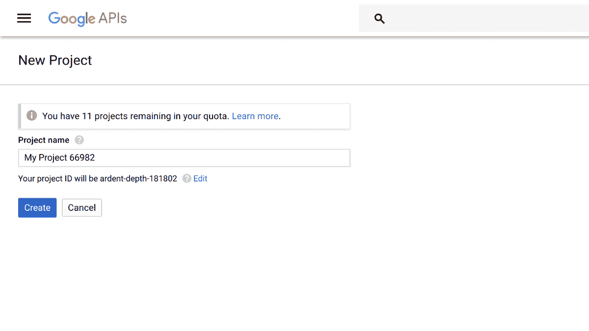
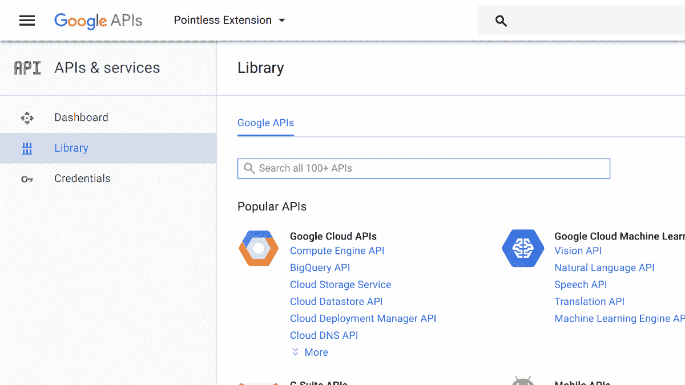
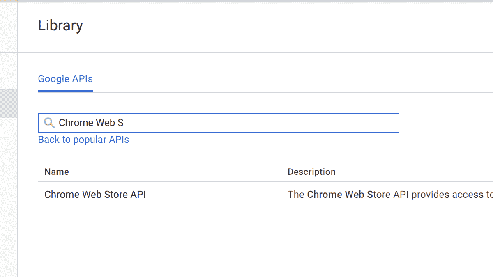
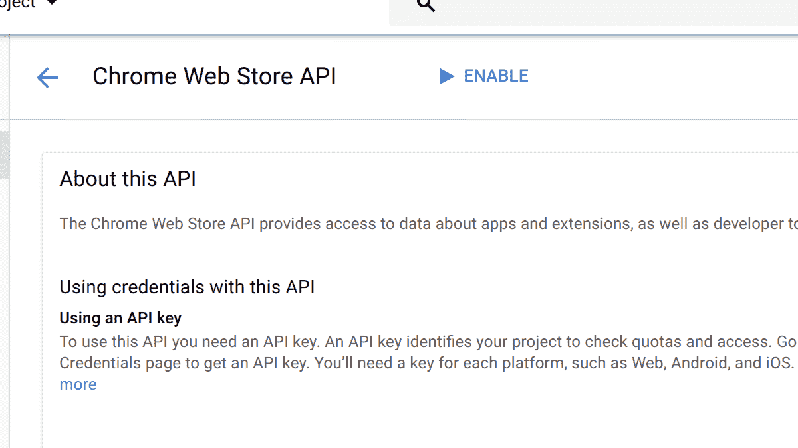
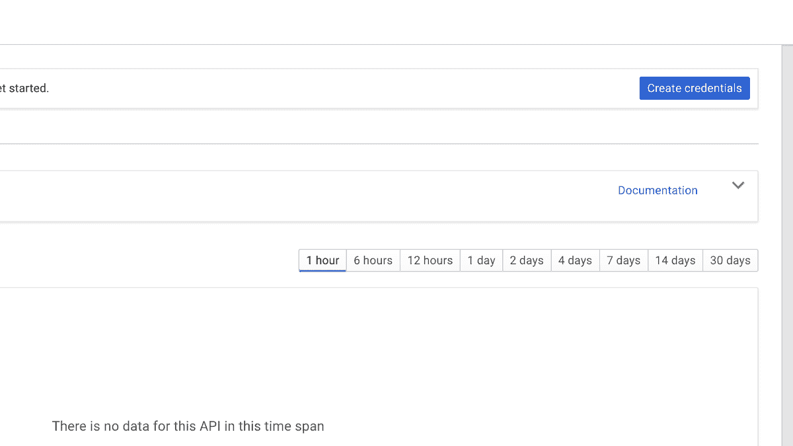
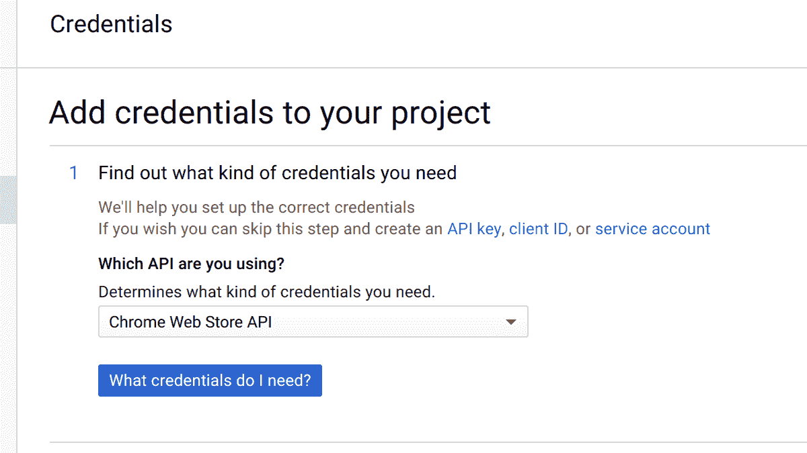
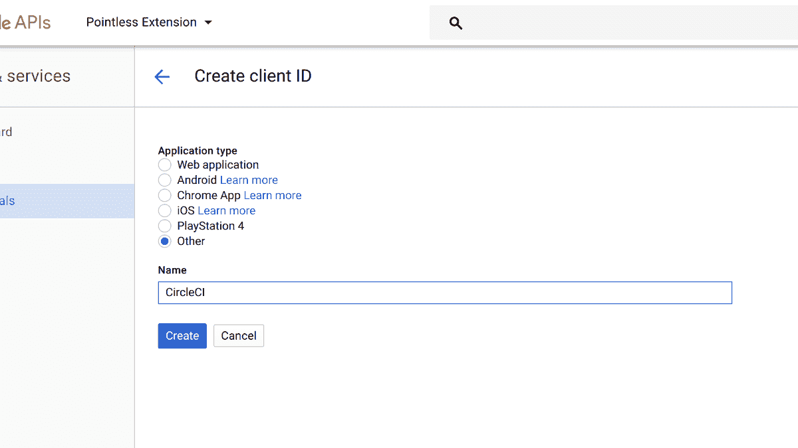
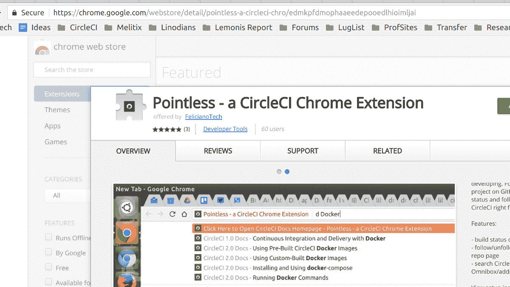

# 如何持续部署 Chrome 扩展- CircleCI

> 原文：<https://circleci.com/blog/continuously-deploy-a-chrome-extension/>

**来自出版商的说明:**您已经找到了我们的一些旧内容，这些内容可能已经过时和/或不正确。尝试在[我们的文档](https://circleci.com/docs/)或[博客](https://circleci.com/blog/)中搜索最新信息。

* * *


谷歌浏览器是互联网上最常用的浏览器。人们正在为各种用例创建 Chrome 扩展。在 Twitter 宣布他们的 280 个字符的推文测试后的 24 小时内，[新的 Chrome 扩展](https://www.producthunt.com/posts/block280)诞生了，将推文压缩回 140 个字符。在波多黎各遭受飓风袭击后的几天内，一个名为[捐赠给波多黎各](https://www.producthunt.com/posts/donate-to-puerto-rico)的 0.99 美元的推广活动被创建，展示了该岛的美丽图片，所有收入都将捐给慈善机构，帮助该岛重建。

在这种快速发展的环境中，我们可以通过持续部署来自动交付特性、错误修复和安全补丁。谷歌的 [Chrome 开发者文档](https://developer.chrome.com/extensions)有很多信息，但没有包括任何关于持续集成的内容，也没有提供自动化部署的例子。我们将在这篇文章中讨论一个例子，以及我们如何应对开发环境的挑战和版本控制。

## 入门指南

注意: *这篇博文中的例子和截图是基于我为 CircleCI 编写的 Chrome 扩展，名为“无意义”。你可以在[谷歌 Chrome 商店](https://chrome.google.com/webstore/detail/pointless-a-circleci-chro/edmkpfdmophaaeedepooedlhioimljai)和 [GitHub](https://github.com/felicianotech/pointless) 找到它。如果你在某些命令或截图中看到“无意义”这个名字，它指的是 Chrome 扩展的名字。在适当的时候应该用你自己的来代替。*

首先，我们需要创建并配置一个[谷歌 API 项目](https://console.developers.google.com/apis/library)，并收集一些关键信息。在您的系统上安装`curl`和`jq`将使完成这些步骤更加容易。

1.  创建一个新的 Google API 项目。这里有一个[直接链接](https://console.developers.google.com/projectcreate?organizationId=0)。
2.  确保刚刚创建的项目是屏幕顶部下拉列表中当前选择的项目。
3.  在 API 搜索栏中搜索“Chrome Web Store API”并选择该 API。
4.  启用 API。
5.  单击“创建凭据”蓝色按钮。
6.  不要创建 API 键(默认)。相反，请单击“客户端 ID”链接。
7.  对于“应用程序类型”,选择“其他”,并在出现的文本字段中，将此新客户端命名为。请随意使用“CircleCI”。
8.  将提供“客户 ID”和“客户密码”。**保存该信息**。他们很快就会被需要。
9.  在浏览器中访问以下 URL，用上一步中的“客户端 ID”替换`$CLIENT_ID`。

    ```
    https://accounts.google.com/o/oauth2/auth?response_type=code&scope=https://www.googleapis.com/auth/chromewebstore&client_id=$CLIENT_ID&redirect_uri=urn:ietf:wg:oauth:2.0:oob 
    ```

10.  接受权限弹出窗口后，你会看到谷歌简单称之为“代码”的东西。**保存该信息**。

在这一点上，我们应该有 3 个关键位的信息。一个`client_ID`、`client_secret`和一个`code`。接下来需要的是所谓的“刷新令牌”，我们可以通过在终端中使用`curl`和`jq`来获得它。在终端中输入以下命令，用实际值替换`$CLIENT_ID`、`$CLIENT_SECRET`和`$CODE`:

```
curl "https://accounts.google.com/o/oauth2/token" -d "client_id=$CLIENT_ID&client_secret=$CLIENT_SECRET&code=$CODE&grant_type=authorization_code&redirect_uri=urn:ietf:wg:oauth:2.0:oob" | jq '.refresh_token' 
```

将返回一个“刷新令牌”。**保存该信息**。

需要的最后一项实际上是最容易得到的，Chrome 扩展的应用 ID。访问 Chrome 商店中的 Chrome 扩展。看看浏览器中的 URL，路径的最后一部分(最后一个正斜杠后的文本)是应用程序 ID。**保存该信息**。



## 基本设置

让我们从一个基本的例子开始:通过主分支自动部署一个 Chrome 扩展。完整、基本的 CircleCI 配置文件示例可在[附录 A](#appendix-a) 中找到。

## 启动配置文件

我们将从 CircleCI 配置文件开始，如下所示:

```
version: 2
jobs:
  build:
    docker:
      - image: ubuntu:16.04
    environment:
      - APP_ID: <INSERT-APP-ID> 
```

我们使用 CircleCI 2.0 和 [Ubuntu 16.04 Docker 镜像](https://hub.docker.com/_/ubuntu/)作为我们的执行环境。我们在“入门”一节中获得的“应用程序 ID”将在这里设置，以便我们可以在构建过程中使用它。确保用您的实际应用 ID 替换`<INSERT-APP-ID>`。

### 拯救我们的秘密

我们的构建需要几个环境变量来工作。是这些变量之一，我们在配置中设置它，因为它不被认为是秘密的。Chrome 扩展的应用 ID 是众所周知的。我们还需要设置三个，但出于安全原因，我们将对这些内容保密。确保通过 CircleCI UI 创建并设置[私有环境变量](https://circleci.com/docs/env-vars/#adding-environment-variables-in-the-app)`CLIENT_ID``CLIENT_SECRET`和`REFRESH_TOKEN`。

### 我们配置的主体

```
 steps:
      - checkout
      - run:
          name: "Install Dependencies"
          command: |
            apt-get update
            apt-get -y install curl jq
            # You can also install Yarn, NPM, or anything else you need to use to build and test your extension. 
```

像 CircleCI 上的大多数作业一样，我们首先签出代码，然后安装依赖项。这里，我们将前面使用的相同工具`curl`和`jq`安装到我们的容器中，以便我们可以在发布过程中使用它们。测试所需的任何工具也应该安装在这里。

```
 - run:
          name: "Run Tests"
          command: echo "Run any tests here." 
```

这是您运行测试的地方。因为这篇博文是关于部署的，测试策略会受到你的具体项目的影响，并且是一个大话题，所以我们不打算在这篇博文中涉及它。如果有足够的兴趣，我们可能会在将来单独发布一篇文章来测试 Chrome 扩展和 Firefox 插件。

```
 - run:
          name: "Package Extension"
          command: git archive -o pointless.zip HEAD 
```

Google Chrome Store API 需要将扩展打包成. ZIP 文件才能上传。这里的`git`子命令`archive`用于从项目中创建 zip 文件。这里使用`git archive`而不是`zip`来创建 zip 文件是有益的，因为前者会忽略`.git`目录，我们不希望它出现在我们的包中，因为它只是膨胀。少安装一个命令。

### 出版

```
 - run:
          name: "Upload & Publish Extension to the Google Chrome Store"
          command: |
            if [ "${CIRCLE_BRANCH}" == "master" ]; then
              ACCESS_TOKEN=$(curl "https://accounts.google.com/o/oauth2/token" -d "client_id=${CLIENT_ID}&client_secret=${CLIENT_SECRET}&refresh_token=${REFRESH_TOKEN}&grant_type=refresh_token&redirect_uri=urn:ietf:wg:oauth:2.0:oob" | jq -r .access_token)
              curl -H "Authorization: Bearer ${ACCESS_TOKEN}" -H "x-goog-api-version: 2" -X PUT -T pointless.zip -v "https://www.googleapis.com/upload/chromewebstore/v1.1/items/${APP_ID}"
              curl -H "Authorization: Bearer ${ACCESS_TOKEN}" -H "x-goog-api-version: 2" -H "Content-Length: 0" -X POST -v "https://www.googleapis.com/chromewebstore/v1.1/items/${APP_ID}/publish"
            fi 
```

Chrome Store API 使用“访问令牌”进行认证操作。然而，访问令牌仅在 40 分钟内有效。幸运的是，我们有一个“刷新令牌”,用来从 Chrome 商店请求一个新的访问令牌。有了这个访问令牌，我们就可以上传 zip 文件，最后将上传的文件作为我们的新版本发布。

整个事情都包装在 Bash if 块中，这样我们只有在通过主分支构建时才发布扩展的新版本。

这是一个使用持续部署发布 Google Chrome 扩展的基本例子。同样，完整的示例配置文件可以在[附录 A](#appendix-a) 中找到。如果你想看一些更先进的技术，请继续阅读。

## 高级设置

### 保持环境隔离

在一个扩展的开发过程中，它很可能会在 Chrome“未打包”的情况下进行测试。这会导致一个恼人的问题。当扩展的开发版本与“生产”版本一起加载时，扩展会重复出现。相同的浏览器动作图标、版本号等将会出现。我们可以解决这个问题。

在扩展的`manifest.json`文件中，即 git 中提交的文件，可以设置图标的开发版本。这可以是一个不同颜色的图标，或者只是某种变化，以表明它不是扩展的产品发布。版本也可以这样做。开发版本可以是通用的，在发布之前可以加入生产版本号。这里有一个利用这种方法的`manifest.json`文件的片段和一个 CircleCI“步骤”,展示了如何在构建期间使扩展“生产就绪”。

#### manifest.json 代码片段

```
{
	"manifest_version": 2,
	"name": "Pointless - a CircleCI Chrome Extension",
	"short_name": "Pointless",
	"version": "9.9.9.9",
	"version_name": "dev-version",

	"browser_action":{
		"default_icon": "development-icon.png"
	}
} 
```

#### CircleCI 配置示例步骤

```
 - run:
          name: "Make Extension Production Ready"
          command: |
            jq '.version = "new-version"' manifest.json | sponge manifest.json
            jq '.browser_action.default_icon = "icon.png"' manifest.json | sponge manifest.json 
```

您可以通过[附录 B](#appendix-b) 中的高级设置技术查看完整的 CircleCI 配置示例。

### 使用 Git 标记部署

不必在每次成功构建 master 时都部署新版本的 Chrome 扩展，可以在推送新的 Git 标签时完成。为了实现这一点，CircleCI 配置需要针对[工作流](https://circleci.com/docs/workflows/)进行调整。单个“作业”可以分成“构建”和“发布”作业，以及用于指示我们想要使用的 Git 标签类型的工作流过滤器。以下是该工作流的具体线条:

```
workflows:
  version: 2
  main:
    jobs:
      - build:
          filters:
            tags:
              only: /.*/
      - publish:
          requires:
            - build
          filters:
            branches:
              ignore: /.*/
            tags:
              only: /.*/ 
```

在本例中，扩展 ZIP 将在`build`作业中构建，并在`publish`作业中发布。CircleCI 的[工作区](https://circleci.com/docs/workflows/#using-workspaces-to-share-data-among-jobs)用于在工作流程中移动 ZIP 文件。您可以在[附录 B](#appendix-b) 中查看完整的 CircleCI 配置示例和高级设置技术。

### 自定义 Docker 图像

基本设置示例`ubuntu:16.04`中使用的 Docker 图像是一个相当大的图像。使用更小、更有针对性的映像意味着更快的构建。一个预先做好的 Docker 镜像，基于 Docker Alpine，可以通过使用`cibuilds/chrome-extension`用于 Chrome 扩展。更多信息，请查看 [Docker Hub 页面](https://hub.docker.com/r/cibuilds/chrome-extension/)或 [GitHub repo](https://github.com/cibuilds/chrome-extension) 。

## 附录

### 附录 A

完整的 CircleCI 配置文件(`.circleci/config.yml`)演示了将 Chrome 扩展部署到 Google Chrome 商店所需的最小设置。

```
version: 2
jobs:
  build:
    docker:
      - image: ubuntu:16.04
    environment:
      - APP_ID: <INSERT-APP-ID>
    steps:
      - checkout
      - run:
          name: "Install Dependencies"
          command: |
            apt-get update
            apt-get -y install curl jq
            # You can also install Yarn, NPM, or anything else you need to use to build and test your extension.
      - run:
          name: "Run Tests"
          command: echo "Run any tests here."
      - run:
          name: "Package Extension"
          command: git archive -o pointless.zip HEAD
      - run:
          name: "Upload & Publish Extension to the Google Chrome Store"
          command: |
            if [ "${CIRCLE_BRANCH}" == "master" ]; then
              ACCESS_TOKEN=$(curl "https://accounts.google.com/o/oauth2/token" -d "client_id=${CLIENT_ID}&client_secret=${CLIENT_SECRET}&refresh_token=${REFRESH_TOKEN}&grant_type=refresh_token&redirect_uri=urn:ietf:wg:oauth:2.0:oob" | jq -r .access_token)
              curl -H "Authorization: Bearer ${ACCESS_TOKEN}" -H "x-goog-api-version: 2" -X PUT -T pointless.zip -v "https://www.googleapis.com/upload/chromewebstore/v1.1/items/${APP_ID}"
              curl -H "Authorization: Bearer ${ACCESS_TOKEN}" -H "x-goog-api-version: 2" -H "Content-Length: 0" -X POST -v "https://www.googleapis.com/chromewebstore/v1.1/items/${APP_ID}/publish"
            fi 
```

### 附录 B

```
workflows:
  version: 2
  main:
    jobs:
      - build:
          filters:
            tags:
              only: /.*/
      - publish:
          requires:
            - build
          filters:
            branches:
              ignore: /.*/
            tags:
              only: /.*/

version: 2
jobs:
  build:
    docker:
      - image: cibuilds/chrome-extension:latest
    steps:
      - checkout
      - run:
          name: "Install Dependencies"
          command: echo "You can also install Yarn, NPM, or anything else you need to use to build and test your extension."
      - run:
          name: "Make Extension Production Ready"
          command: |
            jq '.version = "new-version"' manifest.json | sponge manifest.json
            jq '.browser_action.default_icon = "icon.png"' manifest.json | sponge manifest.json
      - run:
          name: "Run Tests"
          command: echo "Run any tests here."
      - run:
          name: "Package Extension"
          command: git archive -o pointless.zip HEAD
      - persist_to_workspace:
          root: /root/project
          paths:
            - pointless.zip

  publish:
    docker:
      - image: cibuilds/chrome-extension:latest
    environment:
      - APP_ID: <INSERT-APP-ID>
    steps:
      - attach_workspace:
          at: /root/workspace
      - run:
          name: "Publish to the Google Chrome Store"
          command: publish /root/workspace/pointless.zip 
```