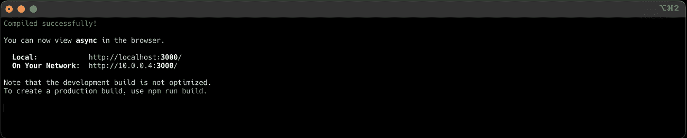
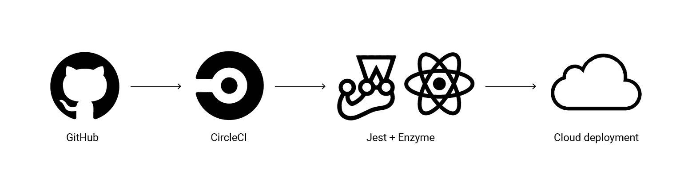
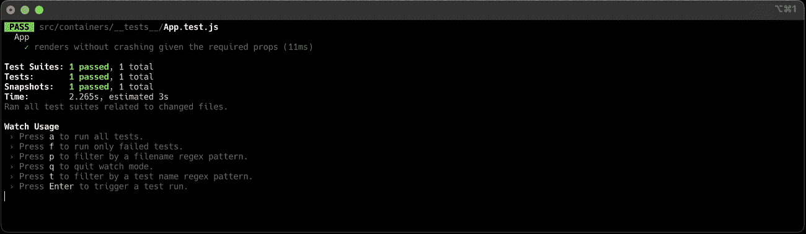
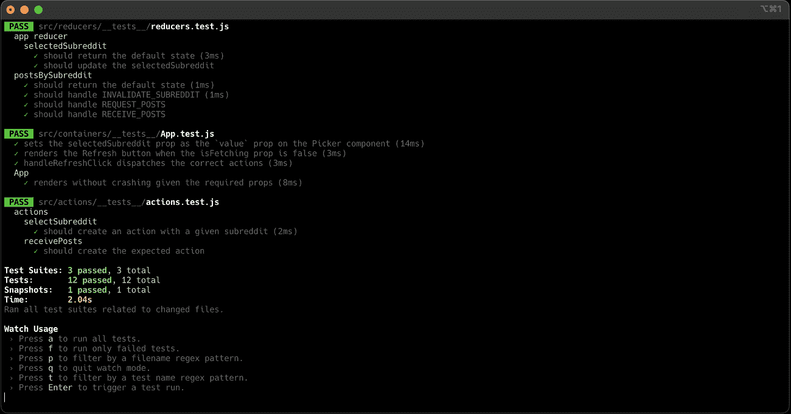
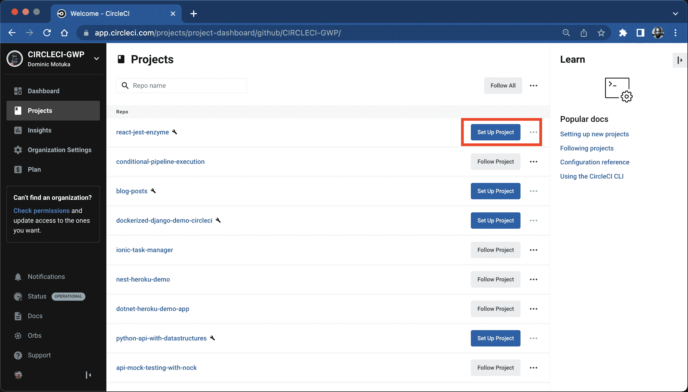
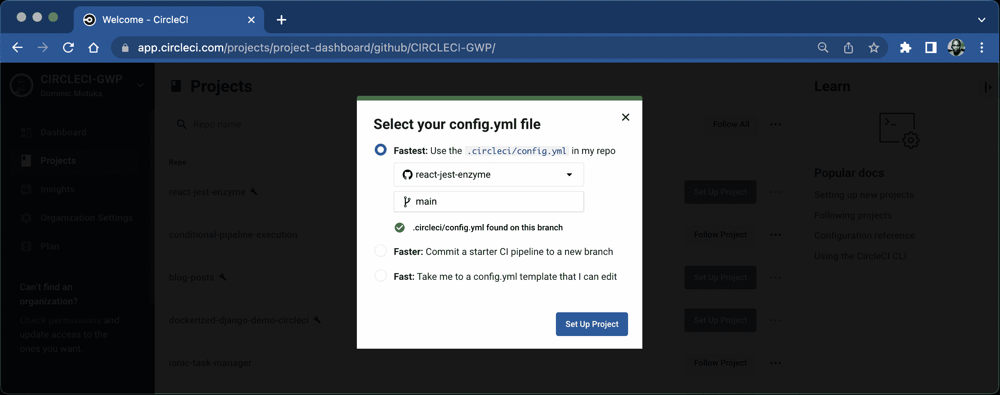
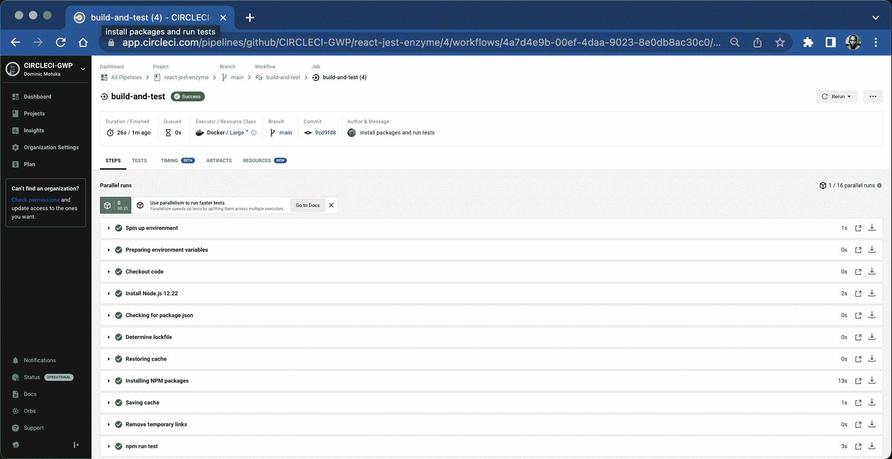
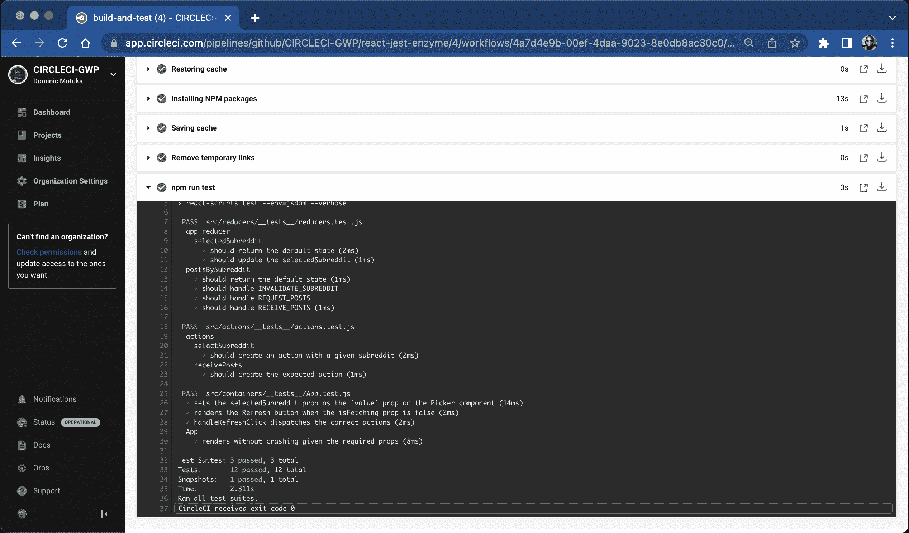

# 使用 Jest 和 Enzyme | CircleCI 实现 React 应用的持续集成

> 原文：<https://circleci.com/blog/continuously-testing-react-applications-with-jest-and-enzyme/>

> 本教程涵盖:
> 
> 1.  克隆并设置一个 React 和 Redux 示例应用程序
> 2.  为应用程序编写测试
> 3.  为自动化测试配置持续集成

React 仍然是许多 UI 开发人员的首选 web 框架，在[2021 Stack Overflow Developer Survey](https://insights.stackoverflow.com/survey/2021#most-popular-technologies-webframe)中超过 jQuery 成为最受欢迎的框架。它为构建数据驱动的用户界面提供了一个直观的模型，并在数据发生变化时有效地更新 DOM。React 与 Redux 很好地结合在一起，管理 React 呈现接口所需的数据。Redux 提供了一种可预测的方式来构建和更新这些前端应用程序中的数据。

在本教程中，我将引导您设置一个 React 和 Redux 应用程序示例，并为其编写测试。我将向您展示如何用 CircleCI 配置[持续集成](https://circleci.com/continuous-integration/)来自动化测试，并确保您添加的任何新代码都不会破坏现有的功能。

## 先决条件

要按照教程进行操作，需要做一些事情:

1.  安装在您机器上的节点**v 12 . 22 . 12**(lts/铒)
2.  基本熟悉[反应](https://reactjs.org/)和[还原](https://redux.js.org/#learn-redux)
3.  一个 [CircleCI 账户](https://circleci.com/)
4.  GitHub 账户

> 我们的教程是平台无关的，但是使用 CircleCI 作为例子。如果你没有 CircleCI 账号，请在 注册一个免费的 [**。**](https://circleci.com/signup/)

## 入门指南

该项目建立在 [Redux 异步示例应用](https://redux.js.org/introduction/examples#async)的基础上。使用这个应用程序将向您展示如何将测试添加到一个真实的应用程序中，这在您构建自己的应用程序时会有所帮助。

在添加测试之前，您需要了解应用程序的功能。最好的方法是克隆应用程序并在本地运行。要克隆应用程序并安装其依赖项，请运行:

```
git clone --depth 1 --branch template https://github.com/CIRCLECI-GWP/react-jest-enzyme.git
npm install
npm start 
```



## 跟踪 Git 和 GitHub 的进展

当你在你的应用上工作时，你需要用 Git 来跟踪变化。删除`.git`目录，然后运行`git init`。

从克隆的存储库的根目录，运行:

```
rm -rf .git
git init 
```

这将创建一个新的 git 存储库。参考[创建回购](https://docs.github.com/en/get-started/quickstart/create-a-repo)了解如何在 GitHub 上推送和跟踪您的变更。



## 示例应用程序功能的演练

该示例应用程序旨在通过从 Reddit API 获取数据来显示选定子编辑中的当前标题。用户可以选择他们想要查看标题的子编辑。标题被加载并显示在屏幕上。用户也可以通过点击**刷新**按钮来更新当前所选子编辑显示的数据。

这个简单的应用程序是一个很好的例子，因为它拥有大多数真实应用程序所需的所有组件，包括:

*   从 API 获取数据
*   用户交互
*   同步和异步操作
*   表示和容器组件

到目前为止，你应该已经了解了这个示例应用程序的功能，并且你应该在自己的 GitHub 帐户上有一个副本。下一步是添加测试。

## 测试反应组件

如果您检查`package.json`文件，您会注意到您已经配置了一个`test`命令。

```
 "test": "react-scripts test" 
```

`react-scripts`随`jest`一起安装和配置，因此您不需要再次安装它。不过，您确实需要安装`enzyme`，以及适用于您的 React 版本的适配器:

```
npm install --save-dev enzyme enzyme-adapter-react-16 
```

接下来，您需要配置`enzyme`来使用适配器。`react-scripts`支持在`src/setupTests.js`文件中配置测试工具。

创建该文件并输入:

```
import Enzyme from "enzyme";
import Adapter from "enzyme-adapter-react-16";

Enzyme.configure({ adapter: new Adapter() }); 
```

我推荐使用[快照测试](https://circleci.com/blog/snapshot-testing-with-jest/)来跟踪组件的变化。在这种方法中，您可以拍摄组件的快照，当组件的渲染输出发生变化时，您可以轻松地检测到所做的更改。快照也是可读的，因此这是验证组件是否呈现预期输出的一种更简单的方法。

要使用快照技术，您需要安装`enzyme-to-json`包，以便在测试期间将 React 组件转换成快照:

```
npm install --save-dev enzyme-to-json 
```

您还需要配置`jest`来使用这个包作为快照序列化程序。通过添加以下内容在`package.json`中进行配置:

```
"jest": {
    "snapshotSerializers": [
      "enzyme-to-json/serializer"
    ]
  } 
```

您现在可以开始测试了。

## 组件测试

首先为`App`组件编写测试。一个好的起点是添加一个快照测试，以确保组件在给定所需属性的情况下呈现预期的输出。

首先需要导入 App 组件，但是`App.js`中唯一的导出是组件的 Redux -connected 版本:`export default connect(mapStateToProps)(App)`。您想要测试组件的呈现，而不是它与`redux`的交互，所以您还需要导出底层的`App`组件。通过将这个片段添加到`App.js`中来实现:

```
export { App }; 
```

概括地说，`src/containers/App.js`文件应该包含以下内容:

```
import React, { Component } from "react";
import PropTypes from "prop-types";
import { connect } from "react-redux";
import {
  selectSubreddit,
  fetchPostsIfNeeded,
  invalidateSubreddit,
} from "../actions";
import Picker from "../components/Picker";
import Posts from "../components/Posts";

class App extends Component {
  static propTypes = {
    selectedSubreddit: PropTypes.string.isRequired,
    posts: PropTypes.array.isRequired,
    isFetching: PropTypes.bool.isRequired,
    lastUpdated: PropTypes.number,
    dispatch: PropTypes.func.isRequired,
  };
  componentDidMount() {
    const { dispatch, selectedSubreddit } = this.props;
    dispatch(fetchPostsIfNeeded(selectedSubreddit));
  }
  componentWillReceiveProps(nextProps) {
    if (nextProps.selectedSubreddit !== this.props.selectedSubreddit) {
      const { dispatch, selectedSubreddit } = nextProps;
      dispatch(fetchPostsIfNeeded(selectedSubreddit));
    }
  }
  handleChange = (nextSubreddit) => {
    this.props.dispatch(selectSubreddit(nextSubreddit));
  };
  handleRefreshClick = (e) => {
    e.preventDefault();
    const { dispatch, selectedSubreddit } = this.props;
    dispatch(invalidateSubreddit(selectedSubreddit));
    dispatch(fetchPostsIfNeeded(selectedSubreddit));
  };
  render() {
    const { selectedSubreddit, posts, isFetching, lastUpdated } = this.props;
    const isEmpty = posts.length === 0;
    return (
      <div>
        <Picker
          value={selectedSubreddit}
          onChange={this.handleChange}
          options={["reactjs", "frontend"]}
        />
        <p>
          {lastUpdated && (
            <span>
              Last updated at {new Date(lastUpdated).toLocaleTimeString()}.{" "}
            </span>
          )}
          {!isFetching && (
            <button onClick={this.handleRefreshClick}>Refresh</button>
          )}
        </p>
        {isEmpty ? (
          isFetching ? (
            <h2>Loading...</h2>
          ) : (
            <h2>Empty.</h2>
          )
        ) : (
          <div style={{ opacity: isFetching ? 0.5 : 1 }}>
            <Posts posts={posts} />
          </div>
        )}
      </div>
    );
  }
}

const mapStateToProps = (state) => {
  const { selectedSubreddit, postsBySubreddit } = state;
  const {
    isFetching,
    lastUpdated,
    items: posts,
  } = postsBySubreddit[selectedSubreddit] || {
    isFetching: true,
    items: [],
  };
  return {
    selectedSubreddit,
    posts,
    isFetching,
    lastUpdated,
  };
};

export default connect(mapStateToProps)(App);

export { App }; 
```

按照惯例，`jest`会在任何名为`tests`的文件夹下找到名称以`.test.js`结尾的测试文件。这意味着您需要创建容器文件夹，然后创建`tests`目录，并在其下创建一个 App `.test.js`文件。

`App`现在被导出，所以您现在可以通过添加到您的测试文件来导入它:

```
import { App } from '../App' 
```

因为您正在独立于`redux`测试`App`组件，所以由`redux`提供的任何东西(例如，组件的`props`)都需要被明确地提供。您可以添加一些渲染测试来看看这在实践中是如何工作的。在`App.test.js`里面，添加你的第一个测试:

```
import React from "react";
import { shallow } from "enzyme";
import toJson from "enzyme-to-json";
import { App } from "../App";

describe("App", () => {
  it("renders without crashing given the required props", () => {
    const props = {
      isFetching: false,
      dispatch: jest.fn(),
      selectedSubreddit: "reactjs",
      posts: [],
    };
    const wrapper = shallow(<App {...props} />);
    expect(toJson(wrapper)).toMatchSnapshot();
  });
}); 
```

在这个测试中，您想要验证在给定所有必需的`props`的情况下`App`是否呈现。通过提供道具，你可以模拟`redux`在实际应用中会做什么。`jest`提供了一个[模拟函数](https://jestjs.io/docs/en/mock-functions)，您可以在测试中使用它来代替真实函数。对于本教程，您可以用它来模拟`dispatch`函数。在您的测试中，这个函数将被调用来代替实际的`dispatch`函数。

您可以使用`npm test`命令运行测试。`jest`测试运行程序启动，运行测试，并打印出测试运行总结。



如果你打开`src/containers/__tests__/__snapshots__/App.test.js.snap`，你应该会找到组件的快照版本，显示组件的渲染输出。

继续添加几个测试来检查`App`的渲染行为。首先，添加一个测试来确保`selectedSubreddit`属性总是被传递给`Picker`组件。将此测试添加到现有测试的正下方:

```
// Add this import
import Picker from "../../components/Picker";

it("sets the selectedSubreddit prop as the `value` prop on the Picker component", () => {
  const props = {
    isFetching: false,
    dispatch: jest.fn(),
    selectedSubreddit: "reactjs",
    posts: [],
  };
  const wrapper = shallow(<App {...props} />);
  // Query for the Picker component in the rendered output
  const PickerComponent = wrapper.find(Picker);
  expect(PickerComponent.props().value).toBe(props.selectedSubreddit);
}); 
```

这个测试展示了如何轻松地使用`enzyme`来查询嵌套组件(在本例中是`Picker`)，并断言它是用正确的`props`呈现的。我强烈推荐深入研究 [enzyme 的文档](https://airbnb.io/enzyme/)，看看它提供的测试工具的范围。

接下来，添加另一个测试来检查基于某些条件呈现的元素。在这种情况下，您将验证当`isFetching`属性为`false`时，是否呈现了**刷新**按钮:

```
it("renders the Refresh button when the isFetching prop is false", () => {
  const props = {
    isFetching: false,
    dispatch: jest.fn(),
    selectedSubreddit: "reactjs",
    posts: [],
  };
  const wrapper = shallow(<App {...props} />);
  expect(wrapper.find("button").length).toBe(1);
}); 
```

最后，添加一个处理一些用户交互的测试。该测试可以验证当点击**刷新**按钮时，它会分派正确的动作:

```
// Add this import
import * as actions from "../../actions";

// .. other tests

it("handleRefreshClick dispatches the correct actions", () => {
  const props = {
    isFetching: false,
    dispatch: jest.fn(),
    selectedSubreddit: "reactjs",
    posts: [],
  };
  // Mock event to be passed to the handleRefreshClick function
  const mockEvent = {
    preventDefault: jest.fn(),
  };
  // Mock the actions we expect to be called
  actions.invalidateSubreddit = jest.fn();
  actions.fetchPostsIfNeeded = jest.fn();

  const wrapper = shallow(<App {...props} />);
  // Call the function on the component instance, passing the mock event
  wrapper.instance().handleRefreshClick(mockEvent);

  expect(mockEvent.preventDefault).toHaveBeenCalled();
  expect(props.dispatch.mock.calls.length).toBe(3);
  expect(actions.invalidateSubreddit.mock.calls.length).toBe(1);
  expect(actions.fetchPostsIfNeeded.mock.calls.length).toBe(2);
}); 
```

从导入`actions`开始，这样您就可以模仿它提供的一些功能。在测试中，您提供通常的`props`和一个`mockEvent`对象。使用`mockEvent`对象模拟按钮被点击时浏览器发送的点击事件。被嘲弄的事件需要包含一个`preventDefault`属性。这个属性应该是一个函数，因为它将在`handleRefreshClick`函数内部被调用。如果没有它，您将得到一个关于丢失属性的错误:`e.preventDefault is not a function.`

使用`shallow`呈现组件后，手动调用`handleRefreshClick`，传递模拟事件来模拟在应用程序中调用该函数时会发生什么。断言应用程序的以下属性:

*   `event.preventDefault`应该叫过一次
*   `props.dispatch`应该已经叫了 3 遍了
*   `actions.invalidateSubreddit`应该叫过一次
*   `actions.fetchPostsIfNeeded`应该叫了两次
    *   第一次通话发生在`componentDidMount`
    *   第二个呼叫发生在`handleRefreshClick`内部

为了确保您对`componentDidMount`函数调用的期望是正确的，您可以在`handleRefreshClick`函数调用之前包含这些断言。

```
const wrapper = shallow(<App {...props} />);
// The next assertions are for functions called in componentDidMount
expect(props.dispatch.mock.calls.length).toBe(1);
expect(actions.fetchPostsIfNeeded.mock.calls.length).toBe(1);

wrapper.instance().handleRefreshClick(mockEvent);

//... rest of test omitted for brevity 
```

至此，您已经测试了代码中最具挑战性的部分，这将为您轻松地为任何其他组件功能添加测试提供一个良好的起点。

## 测试 Redux 功能

在本节中，您将为您的应用程序的`redux`相关部分添加一些测试，特别是动作和减少器。

### 测试动作创建者

从动作创作者开始。这个应用程序有异步和同步动作创建器。异步动作创建器与`redux-thunk`一起使用，支持不会立即产生结果的异步操作，比如获取数据。同步动作创建者返回普通对象。本教程涵盖了如何测试这两者。

作为参考，这是您的`src/actions/index.js`文件应该包含的内容:

```
export const REQUEST_POSTS = "REQUEST_POSTS";
export const RECEIVE_POSTS = "RECEIVE_POSTS";
export const SELECT_SUBREDDIT = "SELECT_SUBREDDIT";
export const INVALIDATE_SUBREDDIT = "INVALIDATE_SUBREDDIT";

export const selectSubreddit = (subreddit) => ({
  type: SELECT_SUBREDDIT,
  subreddit,
});

export const invalidateSubreddit = (subreddit) => ({
  type: INVALIDATE_SUBREDDIT,
  subreddit,
});

export const requestPosts = (subreddit) => ({
  type: REQUEST_POSTS,
  subreddit,
});

export const transformResponseBody = (json) => {
  return json.data.children.map((child) => child.data);
};

export const receivePosts = (subreddit, json) => ({
  type: RECEIVE_POSTS,
  subreddit,
  posts: transformResponseBody(json),
  receivedAt: Date.now(),
});

// const fetchPosts = (subreddit) => (dispatch) => {
//   dispatch(requestPosts(subreddit));
//   return fetch(`https://www.reddit.com/r/${subreddit}.json`)
//     .then((response) => response.json())
//     .then((json) => dispatch(receivePosts(subreddit, json)));
// };

export const fetchPosts = (subreddit) => (dispatch) => {
  dispatch(requestPosts(subreddit));
  return fetch(`https://www.reddit.com/r/${subreddit}.json`)
    .then((response) => response.json())
    .then((json) => dispatch(receivePosts(subreddit, json)));
};

const shouldFetchPosts = (state, subreddit) => {
  const posts = state.postsBySubreddit[subreddit];
  if (!posts) {
    return true;
  }
  if (posts.isFetching) {
    return false;
  }
  return posts.didInvalidate;
};

export const fetchPostsIfNeeded = (subreddit) => (dispatch, getState) => {
  if (shouldFetchPosts(getState(), subreddit)) {
    return dispatch(fetchPosts(subreddit));
  }
}; 
```

您的下一个任务是创建支持测试的文件。在`src/actions/`中，创建一个名为`__tests__`的文件夹，并在其中创建一个名为`actions.test.js`的文件。

同步动作创建器是简单的纯函数，接受一些数据并返回一个动作对象。您的测试应该检查给定必要的参数，动作创建者返回正确的动作。您可以通过对`selectSubreddit`动作创建者的测试来演示这一点，它接受一个`subreddit`作为参数，然后返回一个动作。

```
import * as actions from "../index";

describe("actions", () => {
  const subreddit = "reactjs";

  describe("selectSubreddit", () => {
    it("should create an action with a given subreddit", () => {
      const expectedAction = {
        type: actions.SELECT_SUBREDDIT,
        subreddit,
      };
      expect(actions.selectSubreddit(subreddit)).toEqual(expectedAction);
    });
  });
}); 
```

对于大多数同步动作创建者来说，这就是你所需要做的。

为了在测试异步动作创建器时使您的工作更容易，您也可以为`receivePosts`动作创建器添加一个测试。该函数是这样工作的:

```
export const receivePosts = (subreddit, json) => ({
  type: RECEIVE_POSTS,
  subreddit,
  posts: json.data.children.map(child => child.data),
  receivedAt: Date.now()
}) 
```

在返回的动作中，`posts`属性发生了转换。将其提取到一个新的函数调用中，该函数调用带有`json`参数并执行您需要的转换。注意，您必须导出新的助手函数，以便您可以在稍后的测试中访问它。这里显示了新版本的`receivePosts`功能:

```
export const transformResponseBody = (json) => {
  return json.data.children.map(child => child.data);
}

export const receivePosts = (subreddit, json) => ({
  type: RECEIVE_POSTS,
  subreddit,
  posts: transformResponseBody(json),
  receivedAt: Date.now()
}) 
```

您可能会注意到，在返回的操作中，有一个返回`Date.now()`的`receivedAt`属性。在您的测试中，您将跳过对该属性的测试，因为每次调用该函数时它都会发生变化。您可以通过模仿`Date.now`函数来测试这一点，但是出于本教程的目的，您可以跳过这一步。

既然您已经选择了您需要做的范围，那么您需要为`receivePosts`动作创建者添加测试:

```
describe("actions", () => {
  const subreddit = "reactjs";
  // Add the mockJSON response
  const mockJSON = {
    data: {
      children: [{ data: { title: "Post 1" } }, { data: { title: "Post 2" } }],
    },
  };

  // ... other tests...

  describe("receivePosts", () => {
    it("should create the expected action", () => {
      const expectedAction = {
        type: actions.RECEIVE_POSTS,
        subreddit,
        posts: actions.transformResponseBody(mockJSON),
      };
      expect(actions.receivePosts(subreddit, mockJSON)).toMatchObject(
        expectedAction
      );
    });
  });
}); 
```

注意，您正在使用`toMatchObject`来匹配返回的动作对象的一个子集，这不包括匹配`receivedAt`键。

对其余同步动作创建器的测试遵循相同的过程，其中给定一些数据，测试是否返回正确的动作。

是时候测试异步动作创建者了，特别是`fetchPosts`动作创建者。您需要做的第一件事是导出该函数，您将通过向该函数添加`export`来做到这一点，因此它变成:

```
export const fetchPosts = (subreddit) => (dispatch) => {
  dispatch(requestPosts(subreddit));
  return fetch(`https://www.reddit.com/r/${subreddit}.json`)
    .then((response) => response.json())
    .then((json) => dispatch(receivePosts(subreddit, json)));
}; 
```

安装一些新的软件包:

```
npm install --save-dev fetch-mock redux-mock-store 
```

使用`fetch-mock`模仿使用`fetch`和`redux-mock-store`发出的 HTTP 请求。这有助于您创建一个模拟商店以在测试中使用。添加测试:

```
// Add the new imports

import thunk from "redux-thunk";
import fetchMock from "fetch-mock";
import configureMockStore from "redux-mock-store";

const middlewares = [thunk];
const mockStore = configureMockStore(middlewares);

describe("actions", () => {
  const subreddit = "reactjs";
  // Add the mockJSON response
  const mockJSON = {
    data: {
      children: [{ data: { title: "Post 1" } }, { data: { title: "Post 2" } }],
    },
  };

  // ... other tests...

  describe("fetchPosts", () => {
    afterEach(() => {
      // restore fetch() to its native implementation
      fetchMock.restore();
    });

    it("creates REQUEST_POSTS and RECEIVE_POSTS when fetching posts", () => {
      // Mock the returned data when we call the Reddit API
      fetchMock.getOnce(`https://www.reddit.com/r/${subreddit}.json`, {
        body: mockJSON,
      });

      // The sequence of actions we expect to be dispatched
      const expectedActions = [
        { type: actions.REQUEST_POSTS },
        {
          type: actions.RECEIVE_POSTS,
          subreddit,
          posts: actions.transformResponseBody(mockJSON),
        },
      ];

      // Create a store with the provided object as the initial state
      const store = mockStore({});

      return store.dispatch(actions.fetchPostsIfNeeded(subreddit)).then(() => {
        expect(store.getActions()).toMatchObject(expectedActions);
      });
    });
  });
}) 
```

从所有必要的导入开始，包括`redux-thunk`。对于这种情况，您需要配置一个实际的商店，这意味着您也将把中间件应用到模拟商店。

您有一个在每次测试后运行的`afterEach`函数，它确保您恢复原来的`fetch`实现。这就是为什么您的模拟实现不会在其他测试中使用。

接下来，模拟您期望发出的请求，并提供一个将作为响应体返回的模拟`body`。然后定义调用`fetchPosts`时您期望采取的动作顺序。这个序列意味着当`fetchPosts`被调度时，它应该生成一个`REQUEST_POSTS`动作，然后是`RECEIVE_POSTS`请求的子编辑的帖子。像前面的测试一样，在`RECEIVE_POSTS`动作中排除`receivedAt`属性，并像前面一样，在`posts`键中添加转换后的响应体。

接下来，创建商店，给它一些初始状态，然后分派`fetchPosts`。最后，断言应用于商店的动作列表应该与您的`expectedActions`数组中的序列相匹配。

此时重新运行您的测试应该可以确认一切都通过了。干得好！

您的动作创建者测试到此结束。接下来是如何测试减速器。

### 测试减速器

缩减器是 Redux 的核心，因为它们是更新整个应用程序状态的方式。reducer 测试应该有助于验证您调度的每个操作都按照预期更新了状态。

下面是您将要测试的`reducers/index.js`文件的内容:

```
import { combineReducers } from "redux";
import {
  SELECT_SUBREDDIT,
  INVALIDATE_SUBREDDIT,
  REQUEST_POSTS,
  RECEIVE_POSTS,
} from "../actions";

const selectedSubreddit = (state = "reactjs", action) => {
  switch (action.type) {
    case SELECT_SUBREDDIT:
      return action.subreddit;
    default:
      return state;
  }
};
const posts = (
  state = {
    isFetching: false,
    didInvalidate: false,
    items: [],
  },
  action
) => {
  switch (action.type) {
    case INVALIDATE_SUBREDDIT:
      return {
        ...state,
        didInvalidate: true,
      };
    case REQUEST_POSTS:
      return {
        ...state,
        isFetching: true,
        didInvalidate: false,
      };
    case RECEIVE_POSTS:
      return {
        ...state,
        isFetching: false,
        didInvalidate: false,
        items: action.posts,
        lastUpdated: action.receivedAt,
      };
    default:
      return state;
  }
};
const postsBySubreddit = (state = {}, action) => {
  switch (action.type) {
    case INVALIDATE_SUBREDDIT:
    case RECEIVE_POSTS:
    case REQUEST_POSTS:
      return {
        ...state,
        [action.subreddit]: posts(state[action.subreddit], action),
      };
    default:
      return state;
  }
};
const rootReducer = combineReducers({
  postsBySubreddit,
  selectedSubreddit,
});
export default rootReducer;
export { postsBySubreddit, selectedSubreddit }; 
```

您的 reducer 文件有两个 reducer，每个 reducer 管理自己的状态部分。最终，它们将使用`combineReducers`合并成一个根缩减器。通过将以下代码片段添加到`reducers/index.js`中，导出单个 reducer 函数以使测试更加方便:

```
export { postsBySubreddit, selectedSubreddit } 
```

在`reducers`下创建一个`__tests__`目录。然后在该目录下创建一个`reducers.test.js`文件。这是你测试的地方。因为是两者中比较简单的，所以先测试一下`selectedSubreddit`减速器。

```
import {
  SELECT_SUBREDDIT,
  INVALIDATE_SUBREDDIT,
  REQUEST_POSTS,
  RECEIVE_POSTS,
} from "../../actions";
import { postsBySubreddit, selectedSubreddit } from "../index";

describe("app reducer", () => {
  describe("selectedSubreddit", () => {
    it("should return the default state", () => {
      expect(selectedSubreddit(undefined, {})).toBe("reactjs");
    });

    it("should update the selectedSubreddit", () => {
      const subreddit = "frontend";
      const action = {
        type: SELECT_SUBREDDIT,
        subreddit,
      };
      expect(selectedSubreddit(undefined, action)).toBe(subreddit);
    });
  });
}); 
```

第一项测试检查`selectedSubreddit`减速器是否正确初始化状态。当给定一个`undefined`状态或一个空动作时，它应该返回默认值，该值被设置为`reactjs`。下一个检查验证当 reducer 接收到一个有效的 action 对象时，它是否正确地更新了状态。

现在你可以继续使用`postsBySubreddit`减速器了。

```
describe("postsBySubreddit", () => {
  const subreddit = "frontend";

  it("should return the default state", () => {
    expect(postsBySubreddit(undefined, {})).toEqual({});
  });

  it("should handle INVALIDATE_SUBREDDIT", () => {
    const action = {
      type: INVALIDATE_SUBREDDIT,
      subreddit,
    };
    expect(postsBySubreddit({}, action)).toEqual({
      [subreddit]: {
        isFetching: false,
        didInvalidate: true,
        items: [],
      },
    });
  });

  it("should handle REQUEST_POSTS", () => {
    const action = {
      type: REQUEST_POSTS,
      subreddit,
    };
    expect(postsBySubreddit({}, action)).toEqual({
      [subreddit]: {
        isFetching: true,
        didInvalidate: false,
        items: [],
      },
    });
  });

  it("should handle RECEIVE_POSTS", () => {
    const posts = ["post 1", "post 2"];
    const receivedAt = Date.now();
    const action = {
      type: RECEIVE_POSTS,
      subreddit,
      posts,
      receivedAt,
    };
    expect(postsBySubreddit({}, action)).toEqual({
      [subreddit]: {
        isFetching: false,
        didInvalidate: false,
        items: posts,
        lastUpdated: receivedAt,
      },
    });
  });
}); 
```

首先测试它是否正确初始化了状态。在这种情况下，默认状态是一个空对象，如第一个测试所示。

其余动作的测试是相似的；您验证给定一个动作，reducer 返回预期的状态更新。应该将`subreddit`设置为返回对象的键，并且应该根据 reducer 中的规则更新嵌套对象。

您可能会注意到 reducers 的共同主题是，给定一组特定的输入(初始状态和一个动作)，应该返回一个新的状态。您对返回的状态进行所有断言，以确保它是您所期望的。

完成本教程的这一部分后，您已经了解了 React 和 Redux 应用程序的许多相同组件，您需要在典型的应用程序中测试这些组件。



## 与 GitHub 和 CircleCI 的持续集成

这是本教程中添加与 CircleCI 持续集成的部分。持续集成有助于确保您对代码所做的任何更改都不会破坏任何现有的功能。测试将在您推送新代码的任何时候运行，无论是通过向现有分支添加新的提交，还是通过打开 pull 请求将新分支合并到主分支。这有助于在开发过程的早期发现错误。

## 圆形构型

您需要添加的第一件事是一个配置文件，它将告诉 CircleCI 如何测试您的应用程序。配置文件需要在根文件夹的`.circleci`目录中。命名为`config.yml`。

以下是用于示例应用程序的配置文件:

```
version: 2.1
orbs:
  node: circleci/node@5.0.2
jobs:
  build-and-test:
    docker:
      - image: "cimg/base:stable"
    steps:
      - checkout
      - node/install:
          node-version: "12.22"
      - node/install-packages
      - run:
          command: npm run test
workflows:
  build-and-test:
    jobs:
      - build-and-test 
```

## 集成 CircleCI 和 GitHub

花点时间确保您已经将所有的更改都推送到您之前创建的 GitHub 存储库中。现在，您可以设置 CircleCI 来测试您的代码，无论何时您做出任何新的更改。

以下是将项目添加到 CircleCI 的方法:

在 CircleCI 项目视图中，点击**设置项目**。



在下一个屏幕上，选择包含配置文件的分支。



检查`build-and-test`工作流程中的所有步骤。



单击某个步骤的名称可获得有关该步骤的更多详细信息。例如，打开`npm run test`步骤显示所有的测试。



恭喜你！您的 CI 流程已经设置好了，存储库中任何新的提交都将触发一个测试运行，以确保您的更改不会破坏构建。在您所做的更改导致测试失败的情况下，您会得到通知，并且您可以准确地跟踪哪个提交导致了失败。如果您觉得本教程有用，请务必与您的团队分享您所学到的内容。感谢您的宝贵时间！

* * *

Dominic Motuka 是 Andela 的 DevOps 工程师，在 AWS 和 GCP 支持、自动化和优化生产就绪部署方面拥有 4 年多的实践经验，利用配置管理、CI/CD 和 DevOps 流程。

[阅读多米尼克·莫图卡的更多帖子](/blog/author/dominic-motuka/)