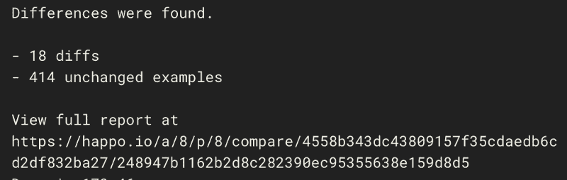

# 使用 CircleCI Happo orb 进行跨浏览器屏幕截图测试

> 原文：<https://circleci.com/blog/cross-browser-screenshot-testing-with-the-circleci-happo-orb/>

Happo 帮助您更快、更自信地构建用户界面(UI)。在[不同浏览器](https://github.com/happo/happo.io/blob/master/README.md#targets)和不同屏幕尺寸下拍摄的自动截图让你确切地知道当你按下一个新的提交时 UI 的哪些部分发生了变化。使用 CircleCI 的组织现在可以使用 [Happo CircleCI orb](https://github.com/happo/happo-circleci-orb) 直接整合 Happo。


## 快乐圆环球

通过抽象在持续集成(CI)环境中设置 Happo 运行所涉及的一些样板文件，orb 允许您将`.circleci/config.yml`文件中的配置简化为:

```
version: 2.1
orbs:
  happo: happo/happo@1.0.0
workflows:
  version: 2.1
  run_all:
    jobs:
      - happo/run 
```

API 令牌应该在`HAPPO_API_KEY`和`HAPPO_API_SECRET`环境变量中定义。你可以在 [happo.io](https://happo.io/login) 的账户设置中找到这些代币。

如果您需要在 Happo 运行之前或之后执行其他步骤，那么您可以使用`happo/run_happo`命令来代替`happo/run`作业，为您提供对执行环境的更多控制。以下是在运行一些自定义准备步骤后使用`happo/run_happo`命令的配置示例:

```
version: 2.1
orbs:
  happo: happo/happo@latest
jobs:
  happo:
    docker:
      - image: circleci/node:10
    steps:
      - checkout
      - npm install
      - npm run build-assets
      - happo/run_happo 
```

一旦你[在 happo.io](https://happo.io/signup) 上注册并且[建立了你的测试套件](https://github.com/happo/happo.io/blob/master/README.md#installation)，运行 Happo CircleCI orb 将确保为你推送的每个提交生成截图。对于拉请求构建和分支，您将获得一个链接，链接到基本提交和分支/PR 头的截图之间的比较。



当[您的 Happo 帐户与 Github 存储库](https://github.com/happo/happo.io/blob/master/README.md#posting-statuses-back-to-prscommits)配对时，构建状态会发布到您的 pull 请求和提交中，让您可以快速查看是否有差异。**详情**链接将带您进入 Happo 报告，您可以在这里接受或拒绝差异。


## 最后

Happo 为您的应用程序带来了强大且响应迅速的跨浏览器屏幕截图测试。Happo CircleCI orb 使与 CI 环境的集成变得前所未有的简单。我们非常自豪能够成为 CircleCI 的[技术合作伙伴计划](https://circleci.com/blog/announcing-orbs-technology-partner-program/)的一部分，我们对 orbs 如何帮助我们当前和未来的用户让生活变得更加轻松感到兴奋。

* * *

Henric Trotzig 是一名软件工程师，对优秀的用户界面充满热情。他是跨浏览器截图测试服务 [happo.io](https://happo.io/) 的创始人。