# 用 Cypress | CircleCI 测试 React 组件

> 原文：<https://circleci.com/blog/cypress-react-component-testing/>

> 本教程涵盖:
> 
> 1.  创建和设置 React 应用程序
> 2.  用 Cypress 测试 React 组件
> 3.  React 的自动化组件测试

组件是可重用的代码，在大多数情况下，它们独立工作和运行。如果您想确信组件工作正常，您需要测试它们。很方便，Cypress.io 设计了他们的测试框架，包括组件测试。本教程说明了端到端(E2E)和组件测试之间的区别，以及使用这些方法时需要考虑的事项。然后，您将学习如何使用 Cypress 进行组件测试。

## 先决条件

要轻松跟进，您需要:

1.  [Node.js](https://nodejs.org/) 已安装
2.  [CircleCI](https://circleci.com/signup) 账户
3.  [GitHub](https://github.com/) 账户和对 Git 的理解
4.  扎实的 JavaScript 和 React 知识
5.  了解管道的工作原理
6.  演示版 [React 应用](https://github.com/CIRCLECI-GWP/component-testing-with-cypress)的克隆版

> 我们的教程是平台无关的，但是使用 CircleCI 作为例子。如果你没有 CircleCI 账号，请在 注册一个免费的 [**。**](https://circleci.com/signup/)

**注意:***React 组件已经开发完成，可以在`src/components/App.js`下的克隆存储库中找到。为了简单起见，本教程的重点是测试已经开发的 React 组件。*

在下一节中，我们将看看组件测试以及它与端到端测试的比较。

## 什么是组件测试？

组件是软件程序中可区分的部分。表单、行动号召和网站搜索都是 web 应用程序组件的例子。Web 组件可以是任何东西，从简单的动作按钮到完整的注册表单提交。

组件测试也称为程序或模块测试。该过程包括从主应用程序中独立地验证和确认特定组件的功能、性能和符合性。这种测试仅限于特定的组件，并且由于易于测试的特性而变得简单。

## 组件测试与端到端测试

E2E 测试决定了应用程序的流程从开始到结束是否按预期进行。E2E 测试包括测试与第三方 API 和服务的集成。关键功能在整个应用程序中得到测试。Cypress 使用浏览器运行端到端测试，就像用户与应用程序交互一样。应用程序的基本端到端测试可能包括用户注册、确认电子邮件、登录、配置文件更新和注销。

端到端测试比组件测试更全面，更慢，也更容易`flakiness`。组件测试是专门的、快速的和可靠的。由于范围的原因，端到端测试通常需要一个复杂的设置阶段。组件测试不需要复杂的配置。

Cypress 中的端到端测试可以由开发人员、专业测试工程师或质量保证团队编写。通常，组件开发人员自己编写组件测试。开发人员可以在构建组件时轻松验证组件所需的功能。当您在本教程的后面编写实际的组件测试时，您会注意到 Cypress 端到端测试中的初始化命令是`cy.visit(url)`。组件测试使用`cy.mount(<MyComponent />)`。一个测试良好的应用程序包括端到端的*和*组件测试，每组测试都专注于它们执行得最好的任务。

**注意:** *如果代码或测试本身没有任何变化，测试通过或失败就被认为是“易变的”。这意味着要么是不稳定的系统，要么是糟糕的设计/编写的测试。在[中了解如何减少不稳定的测试失败](https://circleci.com/blog/reducing-flaky-test-failures/)。*

**组件测试的优势包括:**

*   检测模块缺陷
*   组件是独立测试的，而不是作为整个应用程序的一部分
*   有限的范围使它们快速可靠
*   减少开发时间
*   易于设置特定场景
*   不需要外部系统

要了解更多关于比较测试方法的信息，请访问 [Cypress 测试类型](https://docs.cypress.io/guides/core-concepts/testing-types)。

现在您已经理解了 Cypress 组件测试，接下来的部分将向您展示如何在应用程序中配置 Cypress，如何编写测试，以及如何运行它们。

## 使用 Cypress 进行组件测试

要使用 Cypress E2E 测试来测试 React 应用程序，您可以在本地开发服务器上运行应用程序，而 Cypress 在单独的终端上运行。Cypress 使用命令`cy.visit(url)`访问您的应用程序，并在加载的页面上运行断言。

Cypress 的最新版本包括一个内置的开发服务器，在执行组件测试时不需要本地开发服务器。Cypress 中的内置服务器负责在浏览器中安装和呈现组件。它只安装和呈现独立于主应用程序的组件。

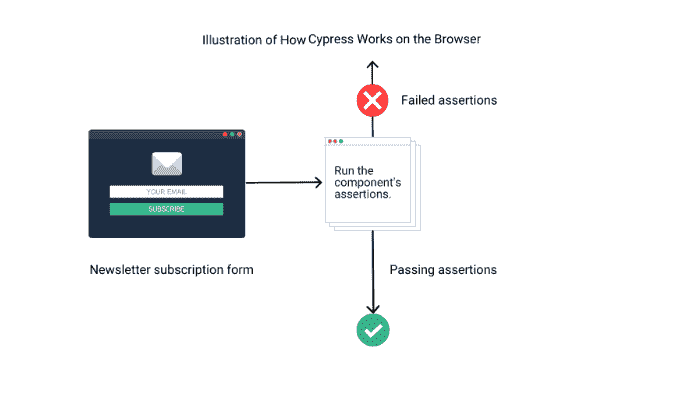

下图显示了 Cypress 按照以下顺序运行组件测试:

*   用`cy.mount()`命令安装组件
*   呈现组件
*   使用 Cypress 命令测试零部件属性

特定点的失败会导致测试失败。

## 编写组件测试

本节详细介绍了如何配置 Cypress 并为克隆的新闻简报订阅组件编写测试。在编写组件测试之前，您需要安装 Cypress 并将其与 React 集成。

要安装 Cypress，请输入:

```
npm install cypress --save-dev 
```

这将在本地安装 Cypress 作为项目的开发依赖项。

要打开应用程序，请输入:

```
npx cypress open 
```

此命令打开 Cypress launchpad。

选择**组件测试**

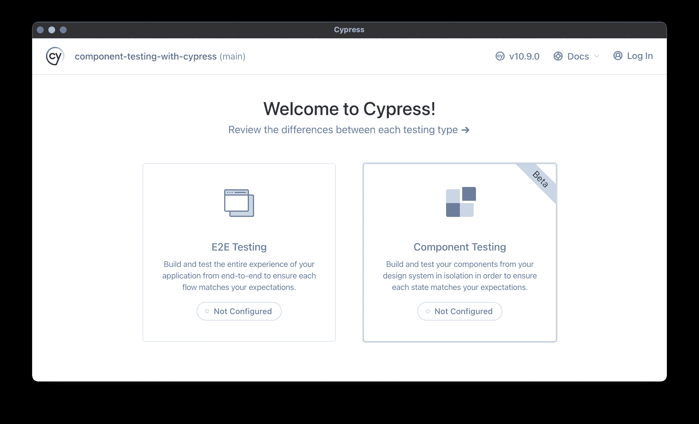

确认前端框架和捆绑器，点击**下一步。**

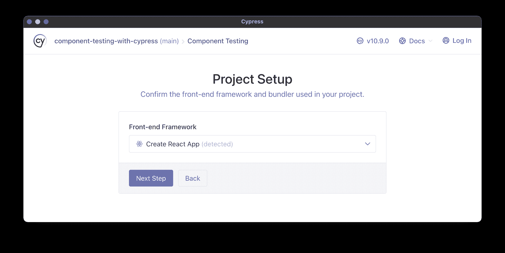

开发依赖项已经安装。点击**继续**进入下一步。

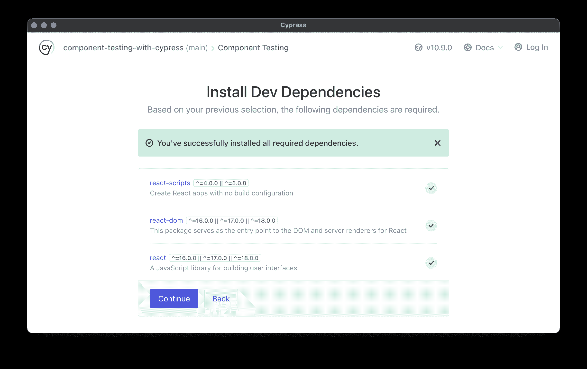

然后 Cypress 为您选择的测试类型生成配置文件。点击**继续**按钮。

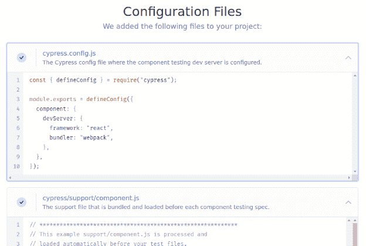

单击您喜欢的浏览器继续。

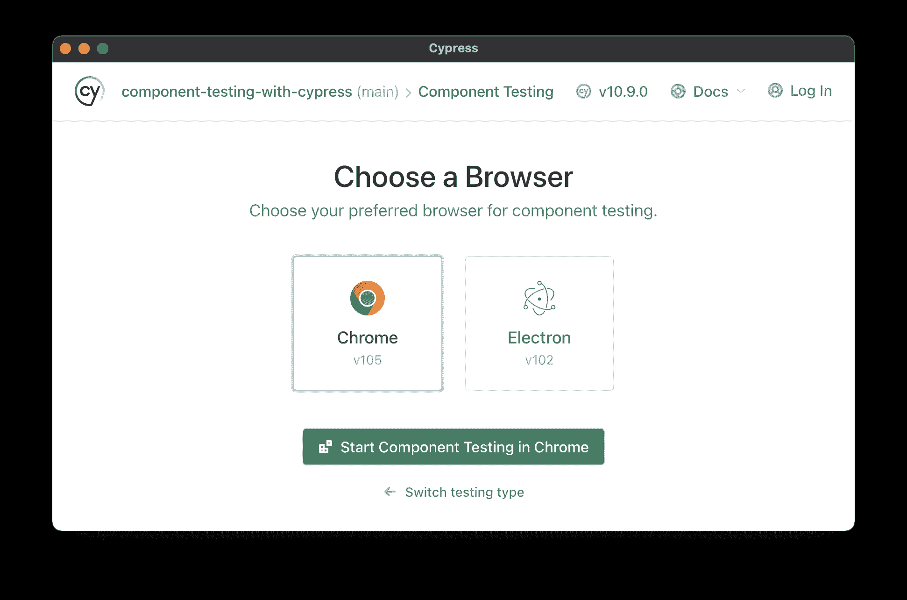

您想从头开始编写测试，所以选择 **Create new empty spec** 。

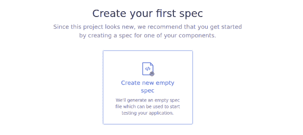

给规格命名，然后点击**创建规格**按钮。

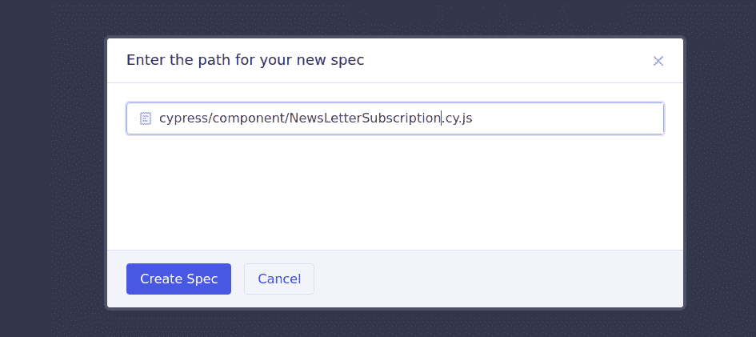

现在您有了一个包含示例代码的规范文件。运行文件。

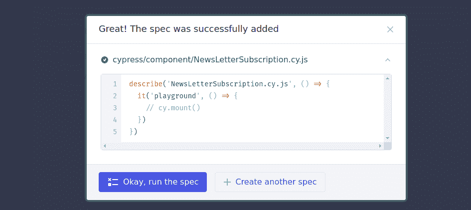

现在您可以开始为您的时事通讯订阅表单创建测试了。测试应验证这些操作是否发生:

*   组件安装正确
*   输入字段中有一个占位符
*   订阅后会返回一条成功消息

在刚刚创建的规范文件中，用以下代码替换生成的代码:

```
// cypress/component/NewsLetterSubscription.cy.js file

import App from "../.././src/components/App";

describe("NewsLetterSubscription.cy.js", () => {
  describe("NewsLetterSubscription.cy.js", () => {
    it("Check input field for placeholder", () => {
      cy.mount(<App />); // mount the component
      cy.get("input").should(
        "have.attr",
        "placeholder",
        "Subscribe to our newsletter"
      ); // check the placeholder in the input field
    });
    it("test newsletter subscription", () => {
      cy.mount(<App />); // mount the component
      cy.get('[data-test="email-input"]').type("test@gmail.com"); // Type email
      cy.get('[data-test="submit-button"]').click(); // Click on submit button
      cy.get('[data-test="success-message"]')
        .should("exist")
        .contains("Thank you for subscribing to our newsletter"); // Check if success message is displayed
    });
  });
}); 
```

这个测试套件首先用`cy.mount()`命令安装组件。然后使用`cy.get()` 函数检查输入字段是否有一个包含文本的占位符。

当您输入电子邮件地址并单击 subscribe 按钮时，应该会返回一条成功消息。

转到 Cypress 浏览器以确保测试通过。

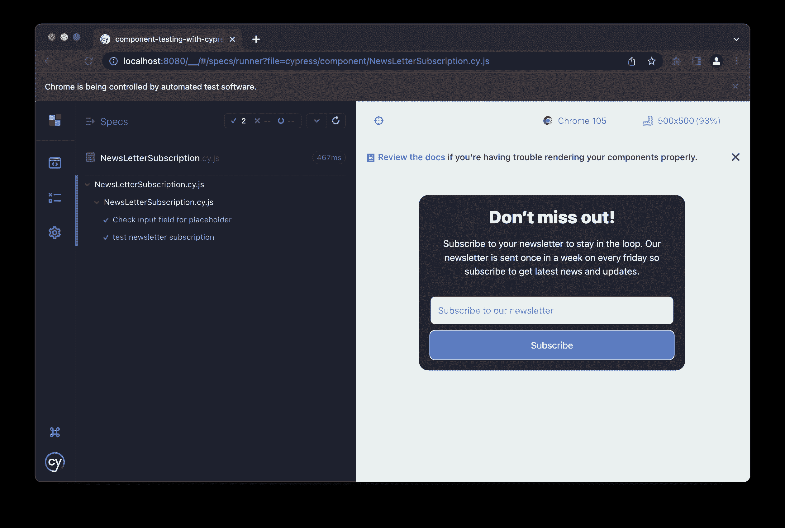

恭喜你，你有一个经过测试的 React 组件！下一步是将您的测试集成到一个 [CI/CD 管道](https://circleci.com/blog/what-is-a-ci-cd-pipeline/)中。为此，您可以使用 CircleCI。

## 配置 CircleCI

要开始 CircleCI 配置，在项目的根目录下创建一个`.circleci`文件夹。在其中，创建一个名为`config.yml`的文件。为了使配置简单一点，你可以使用 CircleCI [orbs](https://circleci.com/orbs/) 。

**注意:** *在你的项目中使用赛普拉斯圆环宝珠之前，从组织设置中，允许使用未经认证的宝珠。`Settings -> Security -> Allow uncertified orbs`。*

将以下内容输入到`config.yml`文件中:

```
version: 2.1 # Use 2.1 to make use of orbs and other features
orbs: # An orb is a reusable package of CircleCI configuration that you may share
  # across projects, enabling you to create encapsulated, parameterized commands, jobs, and
  # executors that can be used across multiple projects.
  cypress: cypress-io/cypress@1
workflows: # Workflows are a declarative way to orchestrate jobs and their run order.
  build:
    jobs:
      - cypress/run: # Run the cypress/run job from the cypress orb
          command: npx cypress run --headless --component # Run the cypress run command in headless mode 
```

将项目添加到 GitHub，然后登录到您的 CircleCI 帐户。

在“项目”选项卡的列表中查找项目。点击**设置项目**。

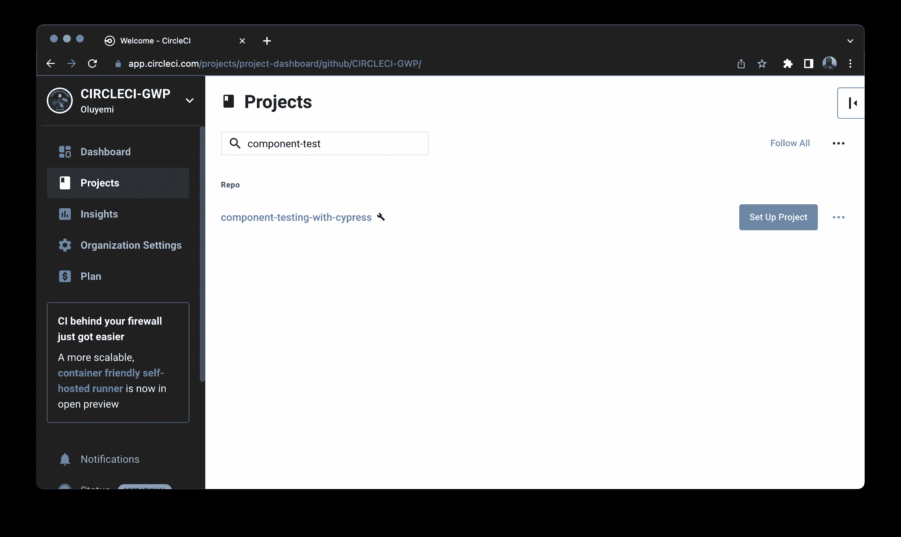

输入`main`作为包含 CircleCI 配置的 GitHub 分支的名称。点击**设置项目**。

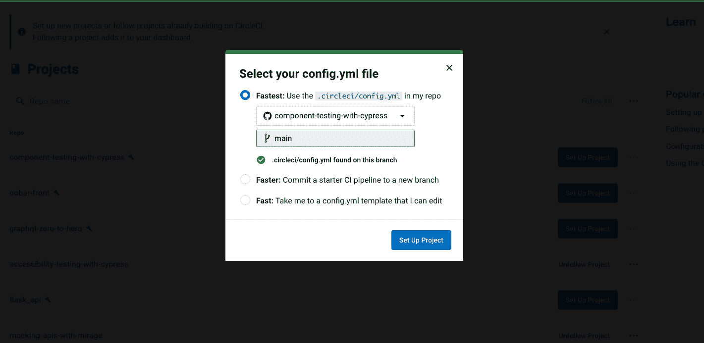

CircleCI 启动您的管道，它将运行测试。几分钟后，您的测试应该会通过。单击绿色成功徽章查看详细信息。

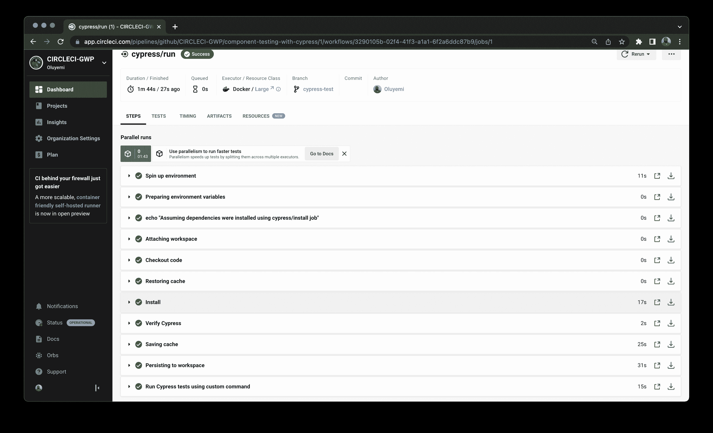

太好了！您已经成功地设置了每次更改代码时都要运行的测试。

## 结论

在这篇文章中，你学习了什么是组件测试，它与 E2E 测试有什么不同，它有什么好处。您学习了如何使用 Cypress 进行组件测试，在 React 项目中配置 Cypress，在 Cypress 测试中测试组件，以及如何运行测试。您通过设置 CircleCI 来自动执行组件测试，从而完成了项目。我希望你喜欢阅读这篇文章，就像我喜欢创作它一样。直到下次，继续学习！

* * *

Waweru Mwaura 是一名软件工程师，也是一名专门研究质量工程的终身学习者。他是 Packt 的作者，喜欢阅读工程、金融和技术方面的书籍。你可以在[他的网页简介](https://waweruh.github.io/)上了解更多关于他的信息。

[阅读更多 Waweru Mwaura 的帖子](/blog/author/waweru-mwaura/)