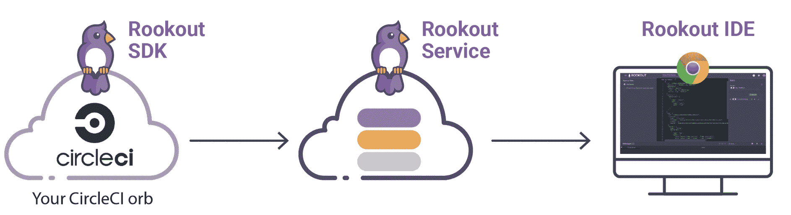

# 使用 Rookout orb | CircleCI 调试 CircleCI 环境

> 原文：<https://circleci.com/blog/debug-your-circleci-environments-using-the-rookout-orb/>

我们在 [Rookout](https://www.rookout.com/) 的目标，快速调试解决方案，是帮助开发人员快速有效地调试，即使在其他地方很难。动态创建的试运行或测试环境在每次创建时都可能有不同的配置，这会导致不可预测的结果和无法重现的错误。调试这样的环境有时就像在生产中调试一样困难和令人沮丧。CircleCI orbs 使得与 Rookout 的集成变得很容易 Rookout 是一种解决方案，它使得在生产、登台或测试环境中进行调试就像在本地机器上进行调试一样容易。

有了 Rookout，您可以保持您的 CI/CD 流的新鲜和稳定，允许您的团队无所畏惧地不断推出特性和修复。

## 了望基础知识

当您运行 CircleCI 工作流时，Rookout 会等待您的调试指令。可以把 Rookout 想象成一个基于 web 的 IDE，当它在调试模式下运行时，附加到您的代码上。



当您在代码中添加 Rookout 断点时，代码不会中断。反而会照常继续运行。当它到达断点时，调试数据将被异步发送到 Rookout IDE。这允许您在不中断 CI/CD 流的情况下调试代码。

## CircleCI 设置

一旦你创建了一个 [Rookout 项目](https://docs.rookout.com/docs/quick-start.html#3-create-a-project)并导入了你的源代码，从管理设置页面检索你的`ROOKOUT_TOKEN`。然后，将您的`ROOKOUT_TOKEN`设置为 CircleCI 项目中的环境变量。使用 [Rookout orb](https://circleci.com/developer/orbs/orb/rookout/rookout-node) 很简单，只需将它导入到你的`.circleci/config.yml`文件中:

```
orbs:
  rookout-node: circleci/rookout-node@0.0.2 
```

调用`rookout-node/run_script`命令:

```
jobs:
  my_job:
    docker:
      - image: circleci/node:10
    steps:
      - rookout-node/run_script:
          users_script: %YOUR_NODE_COMMAND% 
```

现在，您可以在希望调试的步骤设置一个 Rookout 断点，就像您在自己的 IDE 中本地调试它一样。一旦您再次触发您的构建，调试消息将被获取并发送到您的 Rookout IDE:

 </blog/media/2019-02-06-CircleCI-Rookout-min.mp4> 

在上面的例子中，您可以看到设置断点和调试代码就像在本地机器上调试本地代码一样简单。

## 包扎

我们很高兴成为 CircleCI 的[技术合作伙伴计划](https://circleci.com/blog/announcing-orbs-technology-partner-program/)的一部分，帮助开发人员调试他们自己的构建和测试步骤，并使开发周期更快、更有效。

* * *

Liran Haimovitch 是 [Rookout](https://www.rookout.com/) 的首席技术官和联合创始人。他是现代软件方法论的倡导者，他的秘密热情是理解软件实际上是如何工作的。可以跟着他 [@Liran_Last](https://twitter.com/Liran_Last?lang=en) 。