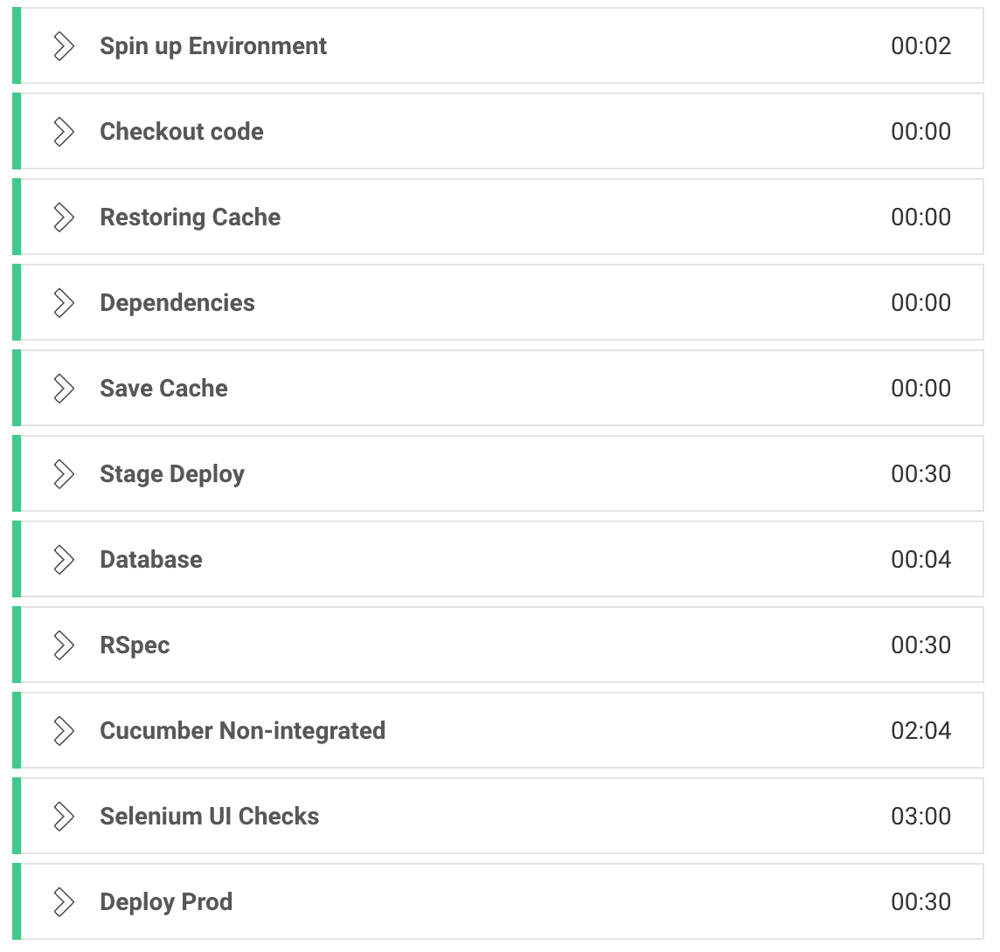
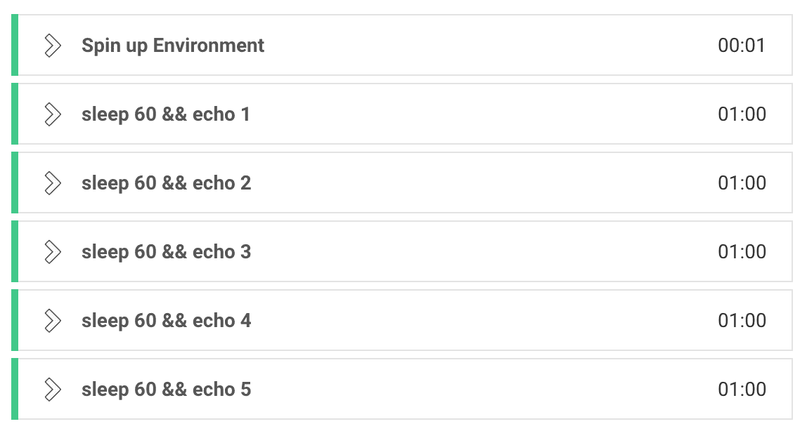
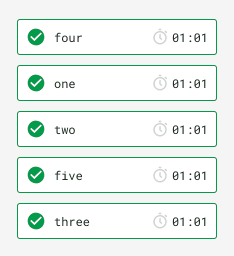
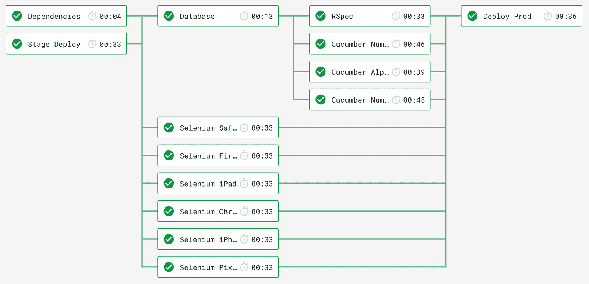
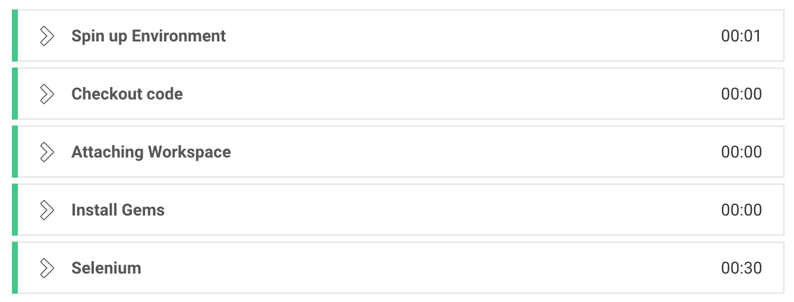

# 与工作流并行运行作业以减少构建时间| CircleCI

> 原文：<https://circleci.com/blog/decrease-your-build-times-by-running-jobs-in-parallel-with-workflows/>

在[持续集成/持续部署(CI/CD)](https://circleci.com/continuous-integration/) 管道中运行构建是自动化重复部署和测试任务的一个很好的方式。然而，如果您有大量的测试、构建步骤或其他缓慢的设置任务，它会严重阻碍您的构建，并使反馈持续时间达到顶点！长的反馈周期对任何人都没有好处，而且会减慢开发生命周期，所以下一步合乎逻辑的就是尽可能地找到缩短持续时间的方法。我们中的一些人可能会在我们的构建步骤中并行运行测试，或者为了节省时间而走不必要的捷径，尽管这些解决方案最终可能并不总是最佳地工作。让我们看看如何利用 CircleCI 2.0 的[工作流](https://circleci.com/docs/workflows/)的力量，以及并行运行作业如何为我们的团队和我们打开一个全新的速度世界。

## 平行什么？

对于那些可能不熟悉的人来说，大多数常见的构建步骤，比如测试，都是顺序运行的:也就是说，每一步都单独运行，并且只在前一步之后发生。如果我们将我们漫长的、单一的构建过程分成不同的步骤，并同时运行它们，那么这些步骤可以说是并行或并发运行的。一个构建有五个步骤，每个步骤需要一分钟来运行，当按顺序运行时，需要**五分钟**来完成。如果我们采取这五个步骤中的每一个并且同时运行它们，我们的构建将只需要**一分钟**就能运行！与顺序运行相比，这是一个巨大的增长。

为了帮助说明顺序和并行的区别以及它们需要的时间，下面是一个构建的时间表:

**连续的**

```
 0:00------1:00------2:00------3:00------4:00------5:00
    Step1-----Step2-----Step3-----Step4-----Step5----- 
```

**平行**

```
 0:00------1:00
    Step1-----
    Step2-----
    Step3-----
    Step4-----
    Step5----- 
```

**快得多**！

## 连续开始

在我们进入奇妙的工作流世界之前，让我们看一下一个演示项目，它有一些模拟的公共构建步骤。我们将花大部分时间使用 CircleCI 2.0 `config.yml`并观察仪表盘上的东西是如何工作的。我们将从查看配置开始:

```
 version: 2
    jobs:
      build:
        docker:
           - image: circleci/ruby:2.4.1
        working_directory: ~/repo
        steps:
          - checkout
          - restore_cache:
              keys:
              - v1-dependencies-{{ checksum "Gemfile.lock" }}
              - v1-dependencies-
          - run:
              name: Dependencies
              command: |
                bundle install --jobs=4 --retry=3 --path vendor/bundle
          - save_cache:
              name: Save Cache
              paths:
                - ./vendor/bundle
              key: v1-dependencies-{{ checksum "Gemfile.lock" }}
          - run:
              name: Stage Deploy
              command: make build_stage
          - run:
              name: Database
              command: |
                bundle exec rake simulated_db_create
                bundle exec rake simulated_db_load
          - run:
              name: RSpec
              command: |
                bundle exec rake simulated_rspec
          - run:
              name: Cucumber Non-integrated
              command: |
                bundle exec rake cucumber
          - run:
              name: Selenium UI Checks
              command: |
                bundle exec rake simulated_selenium
          - run: 
              name: Deploy Prod
              command: |
                bundle exec rake simulated_deploy 
```

我们上面的`build`工作负责我们需要做的一切:管理我们的 gem 依赖项，部署到我们的登台环境，为单元测试/非集成测试旋转本地数据库，运行这些测试，运行 Selenium UI 检查，如果全部通过，部署到生产环境。这是一个非常简单的设置，确保我们在部署之前已经完成了所有的工作，尽管它是连续的，因此很慢。

**这样的时代**



我们上面的工作在 **6:43** 开始，虽然这并不可怕，但我们想要最快的反馈，我们在这里是为了学习并行性，所以让我们开始吧！

我们跑的步数最长的是硒和[黄瓜](https://circleci.com/blog/getting-started-with-cucumber-on-circleci/)，分别用了 3:00 和 2:04。在 Ruby 中，有一个`parallel_tests` gem，我们可以用它来并行运行我们的 Cucumber 测试，这对于我们等待的两分钟来说应该是一个简单的修复。


时间上的进步真大！这一增加并行化的小变化将我们的总时间降低到了 **5:23** ！但是，缺点是，当我们在测试期间查看控制台输出时，它看起来像这样:

 </blog/media/2018-11-09%20gif%201.mp4> 

我们的构建输出曾经是整洁的、易于遵循的，并且可能对调试有所帮助，但现在却是一团乱麻，除了看到发生了*某些事情*之外没有任何用处。examples 部分应该只包含正在运行的特定场景的字符串、整数或浮点数，但是因为所有场景都在同时运行，所以它们的输出也在同时显示。这种不理想的结果是一些并行化路线如何以牺牲易用性为代价来减少我们的运行时间的主要例子。

相比之下，下面是没有运行 cumber 和`parallel_tests` gem 时的输出:

 </blog/media/2018-11-09%20gif%202.mp4> 

我们的 **3:00** Selenium 工作仍然占据了我们构建时间的绝大部分，我们将通过重构来处理这个问题。

## 平行区

如果作业是步骤的集合，那么工作流可以被认为是作业的集合。类似于我们的顺序与并行的例子，让我们看一下仅使用单个[构建作业](https://circleci.com/docs/configuration-reference/)的配置与使用工作流的配置的比较。我们将使用前面五个作业的例子，每个作业运行一分钟，并使它成为一个真正的设置。

```
 version: 2
    jobs:
        build: 
            docker:
                - image: circleci/ruby:2.4
            steps:
                - run: sleep(60) && echo 1
                - run: sleep(60) && echo 2
                - run: sleep(60) && echo 3
                - run: sleep(60) && echo 4
                - run: sleep(60) && echo 5 
```

以下是仪表板中的内容:



如上所述，工作流是作业的集合，因此我们的项目看起来像是利用工作流的[并行化而重构的:](https://circleci.com/docs/workflows/#fan-outfan-in-workflow-example)

```
 version: 2
    jobs:
        one:
          docker:
                - image: circleci/ruby:2.4
          steps:
            - echo 1
        two:
          docker:
                - image: circleci/ruby:2.4
          steps:
            - echo 2
        three:
          docker:
                - image: circleci/ruby:2.4
          steps:
            - echo 3
        four:
          docker:
                - image: circleci/ruby:2.4
          steps:
            - echo 4
        five:
          docker:
                - image: circleci/ruby:2.4
          steps:
            - echo 5

    workflows:
        version: 2
        build:
            jobs:
                - one
                - two
                - three
                - four
                - five 
```

虽然上面的重构没有针对 dry 进行优化，但是它展示了一个非常基本的配置重构，以使用工作流。每一个原始步骤都被移动到上半部分的单个作业中，然后在下半部分，我们告诉 CircleCI 我们希望它们作为工作流集合运行。

那么这给我们带来了什么？它将我们从在 **5:02** 开始的连续构建步骤减少到总构建时间 **1:03** ！



这看起来与我们的顺序作业非常相似，那么区别在哪里呢？这就是 CircleCI 在工作流中显示作业的方式。虽然看起来很相似，但它们都是单独的作业，包含步骤、环境等，都是同时运行的。现在，我们已经完成了工作流速成课程，让我们来看看更复杂的工作流设置，然后回到我们的示例。

## 将这一切结合在一起

让我们一起来看看工作流的强大力量能为我们的项目做些什么。简单回顾一下，我们最初的项目是按顺序运行的，没有尝试并行运行子测试。那个版本的构建花了大约 10 分钟。

通过工作流并行运行我们的工作将我们的构建时间削减到大约 1:50！

从 10 分钟到不到 2 分钟，通过一些重构来利用并行作业！我们甚至没有并行运行所有的作业！这是我们的项目及其工作流中新重构的并行作业:



*****Woah*****”~山谬·里维****

 **上面的每个条目都是一个作业，每个作业都有一组步骤。



上面的工作流程说明了一些不同的 CircleCI 概念:

*   **共享资源** -在多个任务中重用依赖关系/数据以节省时间。
*   将作业放在其他作业之后——要求其他作业在其他作业之前完成，以确保我们的依赖项已经下载，或者其他需求已经完成了它们的配置。
*   **小型独立作业**——将 Selenium 和 Cucumber 测试分解成更小的块，使我们能够获得并行性的强大功能，同时仍能获得我们需要的有用数据，允许尽可能多的作业在失败的情况下通过，还允许我们使用工作流方便的“从失败中重新运行”选项更快地重新运行。

现在让我们看看重构后的配置文件。请注意，这是缩写。你可以在这里的 gist 文件[中找到整个配置。](https://gist.github.com/jaysonesmith/70719bb9beab92cd2322d62898df6881)

```
 aliases:
        - &restore_gem_cache
          ... # repetitive data from the previous config has been omitted for length
        - &save_gem_cache
          ...
        - &bundle_install
          ...
        - &attach_workspace
            attach_workspace:
                    at: ~/data
        - &dependencies
            - checkout
            - *attach_workspace
            - restore_cache: *restore_gem_cache
            - run: *bundle_install
            - save_cache: *save_gem_cache
            - persist_to_workspace:
                root: .
                paths:
                    - vendor/bundle
        - &db_setup
          ...
        - &database
            - checkout
            - *attach_workspace
            - run: *bundle_install
            - run: *db_setup
        - &run_rspec
          ...
        - &rspec_steps
            - checkout
            - *attach_workspace
            - run: *bundle_install
            - run: *run_rspec
        - &cucumber
            name: Cucumber
            command: |
                echo "cucumber feature - ${FEATURE}"
                bundle exec cucumber ${FEATURE}
        - &selenium
          ...
        - &selenium_steps
            - checkout
            - *attach_workspace
            - run: *bundle_install
            - run: *selenium
        - &cucumber_steps
            - checkout
            - *attach_workspace
            - run: *bundle_install
            - run: *cucumber
        - &stage_deploy
          ...
        - &deploy_stage
            - checkout
            - run: apk add --update make
            - run: *stage_deploy
        - &prod_deploy
          ...
        - &deploy_prod
            - checkout
            - *attach_workspace
            - run: *bundle_install
            - run: *prod_deploy
        - &deps
            - "Dependencies"
        - &deps_and_deploy
            - "Dependencies"
            - "Stage Deploy"
        - &deps_and_db
            - "Dependencies"
            - "Database"
        - &all_test
            - "RSpec"
            - "Cucumber Number Addition"
              ...
            - "Selenium Firefox"
              ...
        - &deploy_environment
            working_directory: ~/data
            docker:
                - image: alpine:latest
        - &test_environment
            working_directory: ~/data
            docker:
                - image: ruby:2.4
    version: 2
    workflows:
        version: 2
        master:
            jobs:
                - "Stage Deploy"
                - "Dependencies"
                - "Database":
                    requires: *deps
                - "RSpec":
                    requires: *deps_and_db
                - "Cucumber Number Addition":
                    requires: *deps_and_db
                  ...
                - "Selenium Firefox":
                    requires: *deps_and_deploy
                  ...
                - "Deploy Prod":
                    requires: *all_test
    jobs:
        "Stage Deploy":
            <<: *deploy_environment
            steps: *deploy_stage
        "Dependencies":
            <<: *test_environment # All following jobs will use this environment, however its been excluded for length
            steps: *dependencies
        "Database":
            steps: *database
        "RSpec":
            steps: *rspec_steps
        "Cucumber Number Addition":
            environment:
                FEATURE: features/number_addition.feature
            steps: *cucumber_steps
        ...
        "Selenium Firefox": 
            environment:
                platform: firefox
                version: latest
            steps: *selenium_steps
        ...
        "Deploy Prod":
            steps: *deploy_prod 
```

现在，我们的配置文件中有很多内容，所以让我们仔细阅读一下，这样我们会感觉舒服一些。有些是 YAML 特性，有些是 CircleCI & workflow 特性。

### 亚姆

**别名**别名在整个配置中被用作变量或指向我们不想重复输入的信息的指针。它们都在我们的配置的上半部分声明，由一个符号(`&`)引导，并使用一个星号(`*`)引用。人们也可以使用 CircleCI 2.1 的特性来编写[可重用执行器](https://circleci.com/docs/reusing-config/#authoring-reusable-executors)，而不是使用 YAML 别名的[。](https://circleci.com/blog/what-is-yaml-a-beginner-s-guide/)

**哈希合并**哈希合并用于合并我们配置中的两个键值数据集合。上面使用了这种技术来添加我们想要的 Docker 容器。

### CircleCI 和工作流功能

**跨作业持久保存数据**工作流有一个工作空间，可用于存储数据，供随后的作业使用。在我们的例子中，我们持久化我们的依赖项，这样我们就不必继续下载它们了。持久化数据与缓存相结合使得依赖关系处理速度更快！

如上所述，我们可以在管理我们依赖关系的作业之后安排作业。我们还使用门控来确保在部署到生产环境之前通过所有测试。如果没有门控，它都在同一时间运行。

**环境变量**我们使用分配[环境变量](https://circleci.com/docs/env-vars/)用于跨 Cucumber 和 Selenium 作业的命令，以准确传递我们想要为每个作业运行的内容。在黄瓜测试中，它们不是一片混乱，而是各自独立运行，输出是原始的。

类似地，我们将单个 Selenium 任务重构为多个任务，集中在特定的平台组合上进行测试。这样，如果一个平台出现故障，其他平台将继续运行，不会出现问题。

## 多棒的旅行啊！

我们从 Sequentialville 开始，到 Parallel Paradise 结束，这都要感谢 CircleCI 的工作流和并行作业。我们的构建现在运行快了将近 74 %,因此我们能够从更快的反馈中获益。少一些等待，多一些成就！通过更频繁地运行构建，使您的增量步骤更小，并使您自己能够更安全地撤销！

通过并行运行您的作业，您的团队可以削减多少构建时间？

* * *

Gemini Smith 是一名不断学习的软件工程师，对测试、交流和改进软件开发生命周期充满热情。主要用 Go 写作，她还通过公开演讲、宣传、咨询和指导对软件和测试社区做出贡献。

[阅读更多 Gemini Smith 的文章](/blog/author/gemini-smith/)**