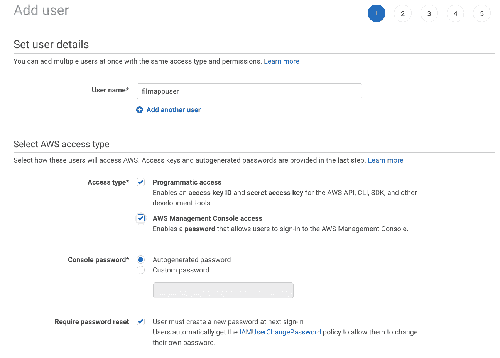
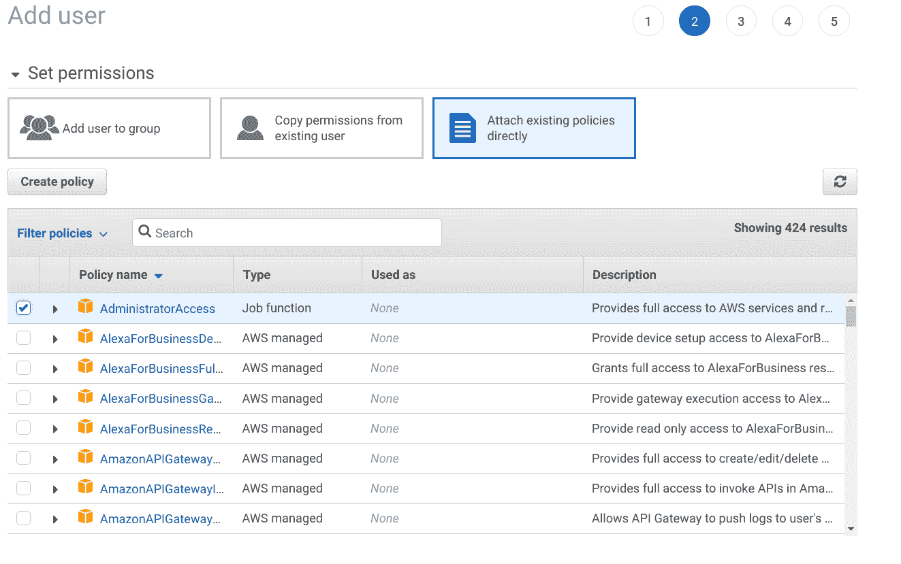
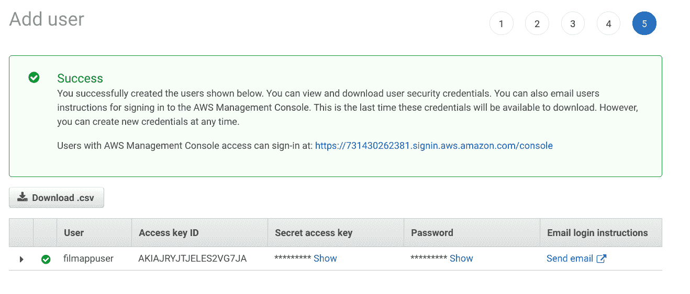
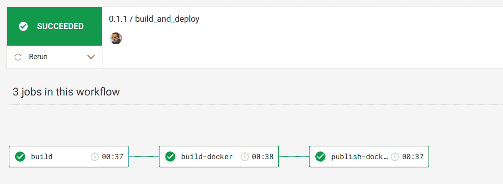
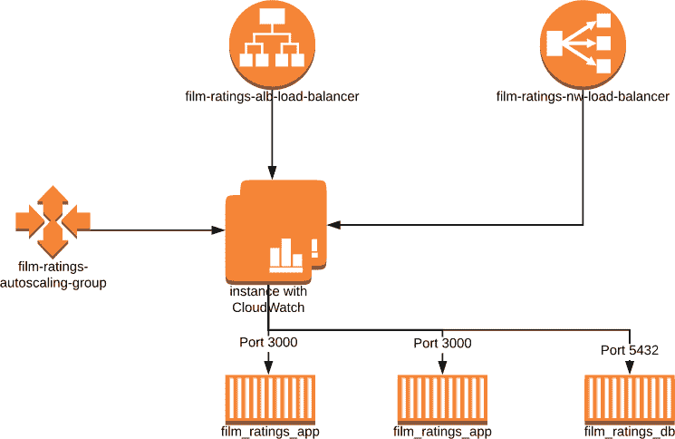
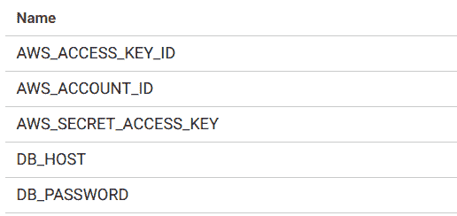
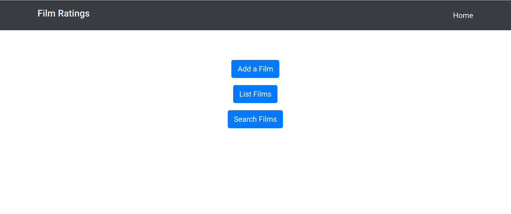
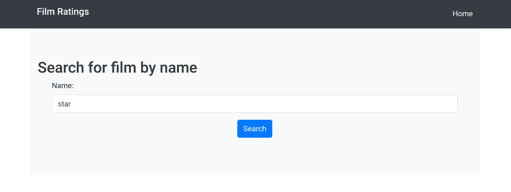
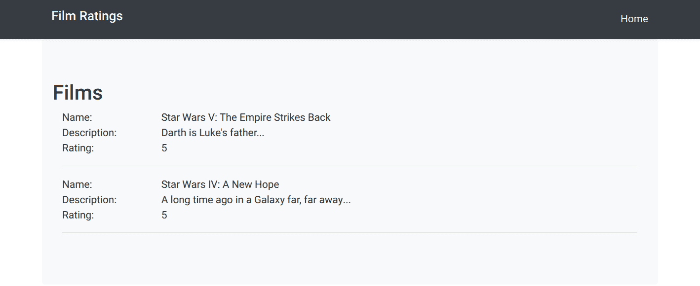
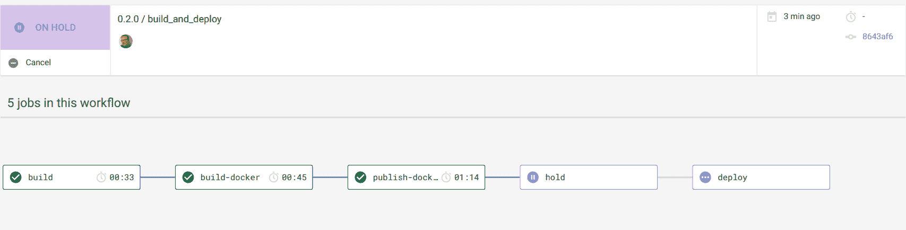

# 使用 Terraform 部署到 AWS -部署 Clojure 应用程序| CircleCI

> 原文：<https://circleci.com/blog/deploy-a-clojure-web-application-to-aws-using-terraform/>

这是关于构建、测试和部署 Clojure web 应用程序的系列文章的第三篇。你可以在这里找到第一个帖子[，在这里](https://circleci.com/blog/build-a-clojure-web-app-using-duct/)找到第二个[。](https://circleci.com/blog/package-a-clojure-web-application-using-docker/)

在本帖中，我们将重点关注如何使用 [HashiCorp Terraform](https://www.terraform.io/) 建立一个相当复杂的基础设施，用 PostgreSQL 容器托管我们的 web 应用 Docker 容器，然后使用 CircleCI 在零宕机的情况下部署到我们的基础设施。如果你不想从头开始创建前两篇文章中描述的 web 应用程序，你可以通过分叉[这个](https://github.com/chrishowejones/blog-film-handler)库并检查`part-2`分支来获得源代码。

尽管我们正在构建一个 Clojure 应用程序，但是只需要有限的 Clojure 知识就可以完成本系列的这一部分。

## 先决条件

为了构建这个 web 应用程序，您需要安装以下软件:

1.  [Java JDK 8 或更高版本](https://openjdk.java.net/install/)——clo jure 运行在 Java 虚拟机上，实际上只是一个 Java 库(JAR)。我用版本 8 构建了这个，但是一个更好的版本应该也可以。
2.  [Leiningen](https://leiningen.org/) - Leiningen，通常被称为 lein(读作‘line’)是最常用的 Clojure 构建工具。
3.  Git -无处不在的分布式版本控制工具。
4.  Docker——一个工具，旨在通过使用容器来简化应用程序的创建、部署和运行。
5.  Docker Compose -一个定义和运行多容器 Docker 应用程序的工具。
6.  HashiCorp Terraform -以可预测和可复制的方式创建和改变基础设施的工具。这个博客是用 V0.12.2 版测试的。
7.  SSH 作为命令行实用程序安装。如果你还没有安装 SSH 的话，你可能需要使用搜索引擎来获得安装说明，因为它依赖于你的操作系统。

您还需要注册:

1.  [CircleCI 账号](https://circleci.com/) - CircleCI 是一个持续集成和交付平台。
2.  GitHub 账户 - GitHub 是一个基于网络的托管服务，使用 Git 进行版本控制。
3.  Docker Hub 帐户 - Docker Hub 是一个基于云的存储库，Docker 用户和合作伙伴可以在其中创建、测试、存储和分发容器映像。
4.  [AWS 账户](https://aws.amazon.com/)——亚马逊网络服务提供按需计算平台。

**注意:** *我们将要构建的基础设施在支持我们所需的 AWS 服务方面会涉及少量成本。如果您离开服务大约一个小时来完成本教程，费用将在$0.50 到$1.00 之间。*

你还需要设置你的 CircleCI、Docker Hub 和 Web 应用 Github 账户，如本系列的第 1 部分和第 2 部分所述。

## 创建 AWS 帐户和凭据

首先，我们需要注册一个 [AWS 账户](https://portal.aws.amazon.com/billing/signup?nc2=h_ct&src=header_signup&redirect_url=https%3A%2F%2Faws.amazon.com%2Fregistration-confirmation#/start)。虽然你可以选择“免费”账户，但由于我们将使用的资源，仍然需要付费。一旦你完成了，你会想要拆除基础设施，我会在这篇博客中告诉你怎么做。

拥有 AWS 帐户后，以 root 用户身份登录。您用来注册的电子邮件是您的用户名，但请确保您点击**作为根帐户**登录。登录后，从**服务**菜单中选择 **IAM** (身份访问和管理)。

从屏幕左侧的导航栏中选择**用户**，点击**添加用户**。创建一个用户，并确保您给它编程和控制台访问。



通过创建新角色或直接附加现有策略，为用户提供`Administrator Access`。



您可以保留默认设置并接受设置向导中的其他内容，但是在您离开添加用户成功屏幕之前，请务必仔细记下`AWS_ACCESS_KEY_ID`和`AWS_SECRET_ACCESS_KEY`。



创建 IAM 用户后，记下您的帐户 id ( [如何找到您的 AWS 帐户 id](https://docs.aws.amazon.com/IAM/latest/UserGuide/console_account-alias.html#FindingYourAWSId) )，选择帐户名称或号码旁边的向下箭头并从下拉菜单中选择“注销”，注销 root 用户。

现在，以新创建的 IAM 用户身份登录您的帐户。如果您看到**根用户登录**，请确保选择**登录不同的账户**。使用您之前记下的 AWS 帐户 id、您设置的用户名(在我的例子中是 filmappuser)以及您为管理控制台访问设置的密码。

登录后，从**服务**下拉菜单中选择 **EC2** ，并点击 EC2 仪表板上**资源**中的**密钥对**。

点击**创建密钥对**并输入密钥对名称。我在地形中使用了`film_ratings_key_pair`,所以如果你不想编辑地形，就用它作为名字。将自动下载的`.pem`文件复制到您的`.ssh/`目录下，并对该文件设置权限，如下所示:

```
chmod 400 ~/.ssh/film_ratings_key_pair.pem 
```

## 让应用程序等待数据库

这一步不是绝对必要的，但是它加速了弹性容器服务(ECS)资源的设置，所以值得一做。当 web 应用程序在其 ECS 任务容器中启动时，它必须通过负载平衡器连接到数据库任务容器。我们将在下一节看到更多这方面的内容。然而，负载平衡器可能需要几分钟来注册数据库容器，如果我们让 web 应用程序尝试立即连接，它将会失败，然后 ECS 将不得不销毁应用程序容器并启动一个新的容器，这需要更多时间。

为了尽量减少这种情况，我们将添加一个[借用脚本](https://github.com/vishnubob/wait-for-it)来等待数据库连接。在 web 应用项目的根目录下创建一个`wait-for-it.sh`文件，并将该文件的[内容剪切并粘贴到您新创建的文件中。](https://github.com/vishnubob/wait-for-it/blob/master/wait-for-it.sh)

然后将电影分级 web 应用程序项目中的`Dockerfile`改为如下所示:

```
FROM openjdk:8u181-alpine3.8

WORKDIR /

RUN apk update && apk add bash

COPY wait-for-it.sh wait-for-it.sh

COPY target/film-ratings.jar film-ratings.jar
EXPOSE 3000

RUN chmod +x wait-for-it.sh

CMD ["sh", "-c", "./wait-for-it.sh --timeout=90 $DB_HOST:5432 -- java -jar film-ratings.jar"] 
```

这确保了`wait-for-it.sh`脚本运行并反复尝试连接到端口 5432 上的`DB_HOST`。如果它在 90 秒内连接上，它就会运行`java -jar film-ratings.jar`。

另外，将您的`project.clj`文件中的版本更新为`0.1.1`:

```
(defproject film-ratings "0.1.1"
... 
```

完成这些更改后，将它们添加并提交到 Git，然后推送到电影分级项目的 GitHub 存储库:

```
$ git add . --all
$ git commit -m "Add wait for it script"
[master 45967e8] Add wait for it script
2 files changed, 185 insertions(+), 1 deletion(-)
create mode 100644 wait-for-it.sh
$ git push 
```

您可以在您的 CircleCI [仪表板](https://circleci.com/dashboard)中检查 CircleCI 构建是否运行正常。

现在将您的更改标记为`0.1.1`和`push`，这样 CircleCI 就会将它发布为最新版本:

```
$ git tag -a 0.1.1 -m "v0.1.1"
$ git push origin 0.1.1
...
 * [new tag]         0.1.1 -> 0.1.1 
```

在 CircleCI 上检查`build_and_deploy`工作流是否将 Docker 图像发布到 Docker Hub。



## 使用 Terraform 的 AWS 基础设施

我们将使用 Terraform 在 AWS 中构建一个类似生产的基础设施。这是相当多的 Terraform 配置，所以我不打算遍历我已经定义的每个资源。您可以在闲暇时随意查看这些代码。

首先，使用库标题右边的 fork 按钮将我的[film-ratings-terra form](https://github.com/chrishowejones/film-ratings-terraform)repo 分支到 GitHub 中，并将分支后的版本克隆到本地机器上。

```
$ git clone <the github URL for your forked version of chrishowejones/film-ratings-terraform> 
```

既然您已经派生并克隆了 Terraform 存储库，让我们来看看它的一些重要部分。Terraform 的总体功能是什么？

下图是基础设施中几个更重要部分的极其简化的版本。



简化的 AWS 基础设施

这表明我们将设置两个名为`film_ratings_app`和`film_ratings_db`的 ECS 任务，它们将在 ECS 容器中运行，包含两个应用程序实例和一个数据库实例。app 和 db 任务将在它们自己的服务中运行，类似地分别称为`film_ratings_app_service`和`film_ratings_db_service`(图中未显示)。

以下是应用服务和应用任务定义:

```
resource "aws_ecs_service" "film_ratings_app_service" {
  name            = "film_ratings_app_service"
  iam_role        = "${aws_iam_role.ecs-service-role.name}"
  cluster         = "${aws_ecs_cluster.film_ratings_ecs_cluster.id}"
  task_definition = "${aws_ecs_task_definition.film_ratings_app.family}:${max("${aws_ecs_task_definition.film_ratings_app.revision}", "${data.aws_ecs_task_definition.film_ratings_app.revision}")}"
  depends_on      = [ "aws_ecs_service.film_ratings_db_service"]
  desired_count   = "${var.desired_capacity}"
  deployment_minimum_healthy_percent = "50"
  deployment_maximum_percent = "100"
  lifecycle {
    ignore_changes = ["task_definition"]
  }

  load_balancer {
    target_group_arn  = "${aws_alb_target_group.film_ratings_app_target_group.arn}"
    container_port    = 3000
    container_name    = "film_ratings_app"
  }
} 
```

film-ratings-app-service.tf

**注:** *最低健康百分比为 50%。这允许服务停止一个容器任务(只留下一个在运行)，以便在我们进行滚动部署时使用释放的资源来启动容器任务的新版本。*

```
data "aws_ecs_task_definition" "film_ratings_app" {
  task_definition = "${aws_ecs_task_definition.film_ratings_app.family}"
  depends_on = ["aws_ecs_task_definition.film_ratings_app"]
}

resource "aws_ecs_task_definition" "film_ratings_app" {
  family                = "film_ratings_app"
  container_definitions = <<DEFINITION
[
  {
    "name": "film_ratings_app",
    "image": "${var.film_ratings_app_image}",
    "essential": true,
    "portMappings": [
      {
        "containerPort": 3000,
        "hostPort": 3000
      }
    ],
    "environment": [
      {
        "name": "DB_HOST",
        "value": "${aws_lb.film_ratings_nw_load_balancer.dns_name}"
      },
      {
        "name": "DB_PASSWORD",
        "value": "${var.db_password}"
      }
    ],
    "logConfiguration": {
        "logDriver": "awslogs",
        "options": {
          "awslogs-group": "film_ratings_app",
          "awslogs-region": "${var.region}",
          "awslogs-stream-prefix": "ecs"
        }
    },
    "memory": 1024,
    "cpu": 256
  }
]
DEFINITION
} 
```

film-ratings-app-task-definition.tf

应用程序实例需要通过端口 5432 与数据库实例通信。为了做到这一点，他们需要通过网络负载平衡器(`film-ratings-nw-load-balancer`)路由他们的请求，因此当我们设置`film_ratings_app`任务时，我们需要将网络负载平衡器的 DNS 名称传递给容器，以便容器中的应用程序可以使用它作为与数据库对话的`DB_HOST`。

```
...
resource "aws_lb_target_group" "film_ratings_db_target_group" {
  name                = "film-ratings-db-target-group"
  port                = "5432"
  protocol            = "TCP"
  vpc_id              = "${aws_vpc.film_ratings_vpc.id}"
  target_type         = "ip"

  health_check {
    healthy_threshold   = "3"
    unhealthy_threshold = "3"
    interval            = "10"
    port                = "traffic-port"
    protocol            = "TCP"
  }

  tags {
    Name = "film-ratings-db-target-group"
  }
}

resource "aws_lb_listener" "film_ratings_nw_listener" {
  load_balancer_arn = "${aws_lb.film_ratings_nw_load_balancer.arn}"
  port              = "5432"
  protocol          = "TCP"

  default_action {
    target_group_arn = "${aws_lb_target_group.film_ratings_db_target_group.arn}"
    type             = "forward"
  }
} 
```

network-load-balancer.tf

应用程序负载平衡器(`film-ratings-alb-load-balancer`)是我们将用来指向我们的浏览器。它将负责将 HTTP 请求路由到`film_ratings_app`容器的两个实例之一，为我们将默认端口 80 映射到端口 3000。

```
...
resource "aws_alb_target_group" "film_ratings_app_target_group" {
  name                = "film-ratings-app-target-group"
  port                = 3000
  protocol            = "HTTP"
  vpc_id              = "${aws_vpc.film_ratings_vpc.id}"
  deregistration_delay = "10"

  health_check {
    healthy_threshold   = "2"
    unhealthy_threshold = "6"
    interval            = "30"
    matcher             = "200,301,302"
    path                = "/"
    protocol            = "HTTP"
    timeout             = "5"
  }

  stickiness {
    type  = "lb_cookie"
  }

  tags = {
    Name = "film-ratings-app-target-group"
  }
}

resource "aws_alb_listener" "alb-listener" {
  load_balancer_arn = "${aws_alb.film_ratings_alb_load_balancer.arn}"
  port              = "80"
  protocol          = "HTTP"

  default_action {
    target_group_arn = "${aws_alb_target_group.film_ratings_app_target_group.arn}"
    type             = "forward"
  }
}

resource "aws_autoscaling_attachment" "asg_attachment_film_rating_app" {
  autoscaling_group_name = "film-ratings-autoscaling-group"
  alb_target_group_arn   = "${aws_alb_target_group.film_ratings_app_target_group.arn}"
  depends_on = [ "aws_autoscaling_group.film-ratings-autoscaling-group" ]
} 
```

application-load-balancer.tf

所示基础设施的另一个重要部分是,`film_ratings_db`容器装载了一个卷，该卷被映射到一个弹性文件系统卷，以便在运行容器的 EC2 实例之外持久存储数据。我们这样做是为了，如果我们必须放大或缩小实例(或者如果实例死亡)，我们不会丢失数据库中的数据。

```
resource "aws_ecs_task_definition" "film_ratings_db" {
  family                = "film_ratings_db"
  volume {
    name = "filmdbvolume"
    host_path = "/mnt/efs/postgres"
  }
  network_mode = "awsvpc"
  container_definitions = <<DEFINITION
[
  {
    "name": "film_ratings_db",
    "image": "postgres:alpine",
    "essential": true,
    "portMappings": [
      {
        "containerPort": 5432
      }
    ],
    "environment": [
      {
        "name": "POSTGRES_DB",
        "value": "filmdb"
      },
      {
        "name": "POSTGRES_USER",
        "value": "filmuser"
      },
      {
        "name": "POSTGRES_PASSWORD",
        "value": "${var.db_password}"
      }
    ],
    "mountPoints": [
        {
          "readOnly": null,
          "containerPath": "/var/lib/postgresql/data",
          "sourceVolume": "filmdbvolume"
        }
    ],
    "logConfiguration": {
        "logDriver": "awslogs",
        "options": {
          "awslogs-group": "film_ratings_db",
          "awslogs-region": "${var.region}",
          "awslogs-stream-prefix": "ecs"
        }
    },
    "memory": 512,
    "cpu": 256
  }
]
DEFINITION
} 
```

film-ratings-db-task-definition.tf

启动配置确保当 EC2 实例启动时，通过`user_data`条目挂载 EFS 卷。

```
...
  user_data                   = <<EOF
                                  #!/bin/bash
                                  echo ECS_CLUSTER=${var.ecs_cluster} >> /etc/ecs/ecs.config
                                  mkdir -p /mnt/efs/postgres
                                  cd /mnt
                                  sudo yum install -y amazon-efs-utils
                                  sudo mount -t efs ${aws_efs_mount_target.filmdbefs-mnt.0.dns_name}:/ efs
                                  EOF 
```

启动-配置. tf

## 创建 AWS 基础设施

我们几乎已经准备好运行我们的 Terraform 了，但在此之前，我们需要确保我们有各种变量的所有正确值。我们来看一下`terraform.tfvars`文件。

```
# You may need to edit these variables to match your config
db_password= "password"
ecs_cluster="film_ratings_cluster"
ecs_key_pair_name="film_ratings_key_pair"
region= "eu-west-1"
film_ratings_app_image= "chrishowejones/film-ratings-app:latest"

# no need to change these unless you want to
film_ratings_vpc = "film_ratings_vpc"
film_ratings_network_cidr = "210.0.0.0/16"
film_ratings_public_01_cidr = "210.0.0.0/24"
film_ratings_public_02_cidr = "210.0.10.0/24"
max_instance_size = 3
min_instance_size = 1
desired_capacity = 2 
```

泰若人

如果需要，您可以编辑密码，但是对于这个演示来说，这并不是真正必要的。您也可以通过设置环境变量`TF_VAR_db_password`来覆盖密码。`ecs_key_pair_name`值必须与您之前在`.ssh/`目录中为 AWS 用户创建的密钥对的名称相匹配。您还必须将`film_ratings_app_image`更改为您的图像的 Docker Hub 存储库图像名称，而不是我的(确保您已经发布了名称正确的 Docker Hub 存储库图像——如果您已经完成了本博客系列的[第 2 部分](https://circleci.com/blog/package-a-clojure-web-application-using-docker/),您应该已经发布了)。

如果您想使用与我正在使用的不同的 AWS 区域，您将需要更改`region`值。`data.tf`文件确保`${data.aws_ami.latest_ecs.id}`变量被设置为适合您所在地区的 [ECS 优化 AMI 映像](https://docs.aws.amazon.com/AmazonECS/latest/developerguide/ecs-optimized_AMI.html)。

不应该有理由去改变其他任何东西。

## 运行地形

一旦正确设置了`terraform.tfvars`值，就需要在克隆的`film-ratings-terraform`目录中初始化 Terraform:

```
$ terraform init

Initializing provider plugins...
- Checking for available provider plugins on https://releases.hashicorp.com...
...
Terraform has been successfully initialized!

You may now begin working with Terraform. Try running "terraform plan" to see
any changes that are required for your infrastructure. All Terraform commands
should now work.

If you ever set or change modules or backend configuration for Terraform,
rerun this command to reinitialize your working directory. If you forget, other
commands will detect it and remind you to do so if necessary. 
```

然后，您可以运行一个 Terraform 计划来检查应用该计划时将会创建哪些资源。系统将提示您输入 AWS 访问密钥 id 和 AWS 秘密访问密钥。如果您厌倦了输入这些，您可以在您的终端会话中设置环境变量`TF_VAR_aws_access_key_id`和`TF_VAR_aws_secret_access_key`。

```
$ terraform plan
var.aws_access_key_id
  AWS access key

  Enter a value: ...
...
Refreshing Terraform state in-memory prior to plan...
...
Plan: 32 to add, 0 to change, 0 to destroy.

------------------------------------------------------------------------

Note: You didn't specify an "-out" parameter to save this plan, so Terraform
can't guarantee that exactly these actions will be performed if
"terraform apply" is subsequently run.

To actually build the AWS resources listed in the plan, use the following command (enter `yes` when prompted with `Do you want to perform these actions?`):

$ terraform apply
data.aws_iam_policy_document.ecs-instance-policy: Refreshing state...
data.aws_availability_zones.available: Refreshing state...
data.aws_iam_policy_document.ecs-service-policy: Refreshing state...
...
Plan: 32 to add, 0 to change, 0 to destroy.

Do you want to perform these actions?
  Terraform will perform the actions described above.
  Only 'yes' will be accepted to approve.

  Enter a value: yes
...
aws_autoscaling_group.film-ratings-autoscaling-group: Creation complete after 1m10s (ID: film-ratings-autoscaling-group)

Apply complete! Resources: 32 added, 0 changed, 0 destroyed.

Outputs:

app-alb-load-balancer-dns-name = film-ratings-alb-load-balancer-895483441.eu-west-1.elb.amazonaws.com
app-alb-load-balancer-name = film-ratings-alb-load-balancer
ecs-instance-role-name = ecs-instance-role
ecs-service-role-arn = arn:aws:iam::731430262381:role/ecs-service-role
film-ratings-app-target-group-arn = arn:aws:elasticloadbalancing:eu-west-1:731430262381:targetgroup/film-ratings-app-target-group/8a35ef20a2bab372
film-ratings-db-target-group-arn = arn:aws:elasticloadbalancing:eu-west-1:731430262381:targetgroup/film-ratings-db-target-group/5de91812c3fb7c63
film_ratings_public_sg_id = sg-08af1f2ab0bb6ca95
film_ratings_public_sn_01_id = subnet-00b42a3598abf988f
film_ratings_public_sn_02_id = subnet-0bb02c32db76d7b05
film_ratings_vpc_id = vpc-06d431b5e5ad36195
mount-target-dns = fs-151074dd.efs.eu-west-1.amazonaws.com
nw-lb-load-balancer-dns-name = film-ratings-nw-load-balancer-4c3a6e6a0dab3cfb.elb.eu-west-1.amazonaws.com
nw-lb-load-balancer-name = film-ratings-nw-load-balancer
region = eu-west-1 
```

Terraform 可能需要五分钟才能运行，负载平衡器和 ECS 服务可能还需要五分钟才能正确识别彼此。您可以通过登录 AWS 控制台并从**服务**下拉列表中选择 **ECS** ，选择您的集群(默认情况下名为`film_ratings_cluster`，并检查附加到每个服务的日志来检查进度。`film_ratings_app_service`可能需要一点时间来连接，有时，即使使用`wait-for-it.sh`脚本，第一个启动的任务可能无法连接到数据库，您必须等待自动缩放来启动另一个任务实例。

一旦 ECS 服务和任务启动，您就可以使用`app-alb-load-balancer-dns-name`值作为 URL，尝试通过您的浏览器连接到应用程序(在上面的输出中显示为`film-ratings-alb-load-balancer-895483441.eu-west-1.elb.amazonaws.com`，但是您的值会有所不同)。

如果您最初看到 HTTP 状态 502 或 503，请不要担心，因为即使在 ECS 服务启动后，应用程序负载平衡器也需要几分钟时间来检测一切是否正常。最后，如果您在浏览器中输入 alb 负载平衡器 DNS 名称的 URL，在我的示例中为`film-ratings-alb-load-balancer-895483441.eu-west-1.elb.amazonaws.com`，您应该会看到这个。


在这一点上，值得注意的是，要拆除所有这些资源，您可以发出`terraform destroy`命令(如果您真的想销毁所有资源，在提示时输入‘yes’)。

## 让 CircleCI 部署到 ECS 集群

接下来，我们希望使用我们的持续集成服务 CircleCI 来为我们发布 Docker 实例。

到目前为止，在我们的 CircleCI 配置中，每当我们向 GitHub 推送更改时，我们都在构建和测试我们的应用程序，每当我们在 GitHub 中标记我们的项目时，我们都在构建、测试、打包为 Docker 容器，并将 Docker 容器发布到 Docker Hub。

在本文的这一部分，我们将添加配置，以便在标记项目时将打包的 Docker 容器推送到我们的 ECS 集群，但是我们将添加一个手动批准步骤，该步骤允许我们控制开始部署到 ECS 的时间。由于我们已将 ECS 服务设置为使用滚动部署，因此该流程将在零宕机的情况下部署我们已更改、已标记的应用程序。

现在我们的`.circleci/config.yml`有三份工作，`build`、`build-docker`和`publish-docker`。在`publish-docker`下面再加一个工作叫`deploy`。

```
 ...
  deploy:
    docker:
      - image: circleci/python:3.6.1
    environment:
      AWS_DEFAULT_OUTPUT: json
      IMAGE_NAME: chrishowejones/film-ratings-app
    steps:
      - checkout
      - restore_cache:
          key: v1-{{ checksum "requirements.txt" }}
      - run:
          name: Install the AWS CLI
          command: |
            python3 -m venv venv
            . venv/bin/activate
            pip install -r requirements.txt
      - save_cache:
          key: v1-{{ checksum "requirements.txt" }}
          paths:
            - "venv"
      - run:
          name: Deploy
          command: |
            . venv/bin/activate
            ./deploy.sh
... 
```

。圆形/config.yml

该作业将使用`pip`(Python 包管理器)通过读取 CLI 包要求的`requirements.txt`文件来安装 AWS CLI 工具。然后运行步骤`Deploy`运行一个我们还没有创建的`deploy.sh`脚本。*记住将* `IMAGE_NAME` *更改为您的映像而不是我的映像的 Docker Hub 存储库映像名称。在我们继续之前，让我们将我们需要的额外工作添加到`build_and_deploy`工作流程的末尾。*

```
...
      - hold:
          requires:
            - publish-docker
          type: approval
          filters:
            branches:
              ignore: /.*/
            tags:
              only: /^\d+\.\d+\.\d+$/
      - deploy:
          requires:
            - hold
          filters:
            branches:
              ignore: /.*/
            tags:
              only: /^\d+\.\d+\.\d+$/ 
```

。圆形/config.yml

我们已经向`build_and_deploy`工作流添加了两个新任务。第一个是`hold`，要求前面的`publish-docker`步骤在执行之前完成，类型为“批准”。“批准”类型是一个内置的 CircleCI 类型，它将停止工作流，并要求用户单击**批准**以继续任何后续步骤。

`deploy`工作依赖于`hold`被批准。

**注意:** *和`build_and_deploy`工作流中的每一个步骤一样，这些步骤只有在语义版本样式标签被推送时才会被触发(如 0.1.1)。*

让我们在项目根目录中添加`requirements.txt`文件，以确保 CircleCI 安装了 AWS CLI 工具。该文件的内容应该是:

```
awscli>=1.16.0 
```

requirements.txt

让我们通过在我们项目的根目录中创建这个新文件来添加在`deploy`作业中引用的`deploy.sh`脚本。

```
#!/usr/bin/env bash

# more bash-friendly output for jq
JQ="jq --raw-output --exit-status"

configure_aws_cli(){
        aws --version
        aws configure set default.region eu-west-1 # change this if your AWS region differs
        aws configure set default.output json
}

deploy_cluster() {

    family="film_ratings_app"

    make_task_def
    register_definition
    if [[ $(aws ecs update-service --cluster film_ratings_cluster  --service film_ratings_app_service --task-definition $revision | \
                   $JQ '.service.taskDefinition') != $revision ]]; then
        echo "Error updating service."
        return 1
    fi

    # wait for older revisions to disappear
    # not really necessary, but nice for demos
    for attempt in {1..15}; do
        if stale=$(aws ecs describe-services --cluster film_ratings_cluster --services film_ratings_app_service | \
                       $JQ ".services[0].deployments | .[] | select(.taskDefinition != \"$revision\") | .taskDefinition"); then
            echo "Waiting for stale deployments:"
            echo "$stale"
            sleep 45
        else
            echo "Deployed!"
            return 0
        fi
    done
    echo "Service update took too long."
    return 1
}

make_task_def(){
        task_template='[
                {
                    "name": "film_ratings_app",
                    "image": "%s:%s",
                    "essential": true,
                    "portMappings": [
                      {
                          "containerPort": 3000,
                          "hostPort": 3000
                      }
                    ],
                    "environment": [
                      {
                        "name": "DB_HOST",
                        "value": "%s"
                      },
                      {
                        "name": "DB_PASSWORD",
                        "value": "%s"
                      }
                    ],
                    "logConfiguration": {
                      "logDriver": "awslogs",
                      "options": {
                        "awslogs-group": "film_ratings_app",
                        "awslogs-region": "eu-west-1",
                        "awslogs-stream-prefix": "ecs"
                      }
                    },
                    "memory": 1024,
                    "cpu": 256
                }
        ]'

        task_def=$(printf "$task_template" $IMAGE_NAME $CIRCLE_TAG $DB_HOST $DB_PASSWORD)
}

register_definition() {

    if revision=$(aws ecs register-task-definition --container-definitions "$task_def" --family $family | $JQ '.taskDefinition.taskDefinitionArn'); then
        echo "Revision: $revision"
    else
        echo "Failed to register task definition"
        return 1
    fi

}

configure_aws_cli
deploy_cluster 
```

deploy.sh

这个脚本将为我们的`film_ratings_app`任务创建一个新的任务定义。如果你看一下配置，它反映了`film-ratings-app-task-definition.tf`中的地形定义。然后，它将这个新任务部署到集群中。

请注意，`make_task_def`函数中设置的`task_def`会替换名为`$IMAGE_NAME`、`$CIRCLE_TAG`、`$DB_HOST`和`$DB_PASSWORD`的变量的值。稍后我们将在 CircleCI 项目环境变量中设置这些变量。

**注意:** *如果您使用的是与`eu-west-1`不同的 AWS 区域，您需要更改第 8 & 67 行的条目。*

在继续之前，让我们使这个新的脚本文件可执行。

```
$ chmod +x deploy.sh 
```

现在，让我们将这些变量和我们需要的 AWS 变量添加到 CircleCI 配置中。

进入你的 CircleCI [仪表盘](https://circleci.com/dashboard)选择你的电影分级项目的设置，在**构建设置**下选择**环境变量**，输入以下变量:



**注意:** *这里应该已经设置了`DOCKERHUB_PASS`和`DOCKERHUB_USERNAME`。*

使用创建用户时获得的 AWS 访问密钥 id 和 AWS 秘密访问密钥(与运行 Terraform 时设置的值相同)。记住你可以在这里找到你的 AWS 账户 id。将您的`DB_PASSWORD`设置为您在`terraform.tfvars`文件中使用的任何值。

`DB_HOST`值需要是将 TCP 请求路由到`film_ratings_db`任务实例的网络负载平衡器的 DNS 名称。您可以在`terraform apply`命令的输出中找到这一点，或者登录到您的 AWS 管理控制台，从**服务**导航到 **EC2** ，并从那里导航到**负载平衡器**，如果您选择`film-ratings-nw-load-balancer`条目，您应该会看到 DNS 名称(在**基本配置**部分)。

```
nw-lb-load-balancer-dns-name = film-ratings-nw-load-balancer-4c3a6e6a0dab3cfb.elb.eu-west-1.amazonaws.com
nw-lb-load-balancer-name = film-ratings-nw-load-balancer
region = eu-west-1 
```

terraform 应用命令的输出

在这里的例子中，CircleCI 中的`DB_HOST`变量应该设置为`film-ratings-nw-load-balancer-4c3a6e6a0dab3cfb.elb.eu-west-1.amazonaws.com`。

**注意:** *如果您已经销毁了您的 AWS 资源，您将需要使用`film-ratings-terraform`目录中的`terraform apply`命令重新设置它们，以设置 AWS 资源来获得网络负载平衡器 DNS。*

一旦设置了环境变量，就可以提交对 CircleCI 配置和新部署脚本文件的更改，并将它们推送到 GitHub。

```
$ git add . --all
$ git commit -m "Added config to deploy to ECS"
$ git push origin master 
```

## 更改应用程序并部署

现在，我们将通过向我们的应用程序添加一些功能，然后对其进行标记并将更改部署到 ECS 群集，来证明 CircleCI 配置正在工作。

让我们在应用程序中添加一个搜索特性。

首先，将路由和处理程序键的映射添加到`resources/film_ratings/config.edn`文件中，以显示搜索表单并处理搜索表单的 post:

```
... 
:duct.module/ataraxy
 {\[:get "/"\] [:index]
  "/add-film"
  {:get [:film/show-create]
   \[:post {film-form :form-params}\] [:film/create film-form]}
  \[:get "/list-films"\] [:film/list]
  "/find-by-name"
  {:get [:film/show-search]
   \[:post {search-form :form-params}\] [:film/find-by-name search-form]}}

 :film-ratings.handler/index {}
 :film-ratings.handler.film/show-create {}
 :film-ratings.handler.film/create {:db #ig/ref :duct.database/sql}
 :film-ratings.handler.film/list {:db #ig/ref :duct.database/sql}
 :film-ratings.handler.film/show-search {}
 :film-ratings.handler.film/find-by-name {:db #ig/ref :duct.database/sql}
... 
```

resources/film _ ratios/config . edn

接下来，让我们将`show-search`和`find-by-name`键的处理程序添加到`src/film_ratings/handler/film.clj`文件的底部:

```
...

(defmethod ig/init-key :film-ratings.handler.film/show-search [_ _]
  (fn [_]
    [::response/ok (views.film/search-film-by-name-view)]))

(defmethod ig/init-key :film-ratings.handler.film/find-by-name [_ {:keys [db]}]
  (fn [{[_ search-form] :ataraxy/result :as request}]
    (let [name (get search-form "name")
          films-list (boundary.film/fetch-films-by-name db name)]
      (if (seq films-list)
        [::response/ok (views.film/list-films-view films-list {})]
        [::response/ok (views.film/list-films-view [] {:messages [(format "No films found for %s." name)]})])))) 
```

src/film _ ratings/handler/film . clj

让我们在`src/film_ratings/views/index.clj`文件的索引视图中添加一个新按钮:

```
(defn list-options []
  (page
    [:div.container.jumbotron.bg-white.text-center
     [:row
      [:p
       [:a.btn.btn-primary {:href "/add-film"} "Add a Film"]]]
     [:row
      [:p
       [:a.btn.btn-primary {:href "/list-films"} "List Films"]]]
     [:row
      [:p
       [:a.btn.btn-primary {:href "/find-by-name"} "Search Films"]]]])) 
```

src/film _ ratings/handler/index . clj

现在我们需要在`src/film_ratings/views/film.clj`文件底部的`search-films-by-name-view`视图:

```
...

(defn search-film-by-name-view
  []
  (page
   [:div.container.jumbotron.bg-light
    [:div.row
     [:h2 "Search for film by name"]]
    [:div
     (form-to [:post "/find-by-name"]
              (anti-forgery-field)
              [:div.form-group.col-12
               (label :name "Name:")
               (text-field {:class "mb-3 form-control" :placeholder "Enter film name"} :name)]
              [:div.form-group.col-12.text-center
               (submit-button {:class "btn btn-primary text-center"} "Search")])]])) 
```

src/film _ ratings/views/film . clj

数据库边界协议和相关实现需要在`find-by-name`处理程序中引用的`fetch-films-by-name`函数。在`src/film_ratings/boundary/film.clj`文件中为协议添加适当的功能和协议扩展，如下所示:

```
...
(defprotocol FilmDatabase
  (list-films [db])
  (fetch-films-by-name [db name])
  (create-film [db film]))

(extend-protocol FilmDatabase
  duct.database.sql.Boundary
  (list-films [{db :spec}]
    (jdbc/query db ["SELECT * FROM film"]))
  (fetch-films-by-name [{db :spec} name]
    (let [search-term (str "%" name "%")]
     (jdbc/query db ["SELECT * FROM film WHERE LOWER(name) like LOWER(?)" search-term])))
  (create-film [{db :spec} film]
    (try
     (let [result (jdbc/insert! db :film film)]
       (if-let [id (val (ffirst result))]
         {:id id}
         {:errors ["Failed to add film."]}))
     (catch SQLException ex
       (log/errorf "Failed to insert film. %s\n" (.getMessage ex))
       {:errors [(format "Film not added due to %s" (.getMessage ex))]})))) 
```

src/film _ ratings/boundary/film . clj

另外，将项目文件中构建的版本号更改为`0.2.0`。

```
(defproject film-ratings "0.2.0"
... 
```

现在，您应该能够通过运行以下命令对此进行测试:

```
$ lein repl
nREPL server started on port 43477 on host 127.0.0.1 - nrepl://127.0.0.1:43477
REPL-y 0.3.7, nREPL 0.2.12
Clojure 1.9.0
Java HotSpot(TM) 64-Bit Server VM 1.8.0_191-b12
    Docs: (doc function-name-here)
          (find-doc "part-of-name-here")
  Source: (source function-name-here)
 Javadoc: (javadoc java-object-or-class-here)
    Exit: Control+D or (exit) or (quit)
 Results: Stored in vars *1, *2, *3, an exception in *e

user=> (dev)
:loaded
dev=> (go)
:duct.server.http.jetty/starting-server {:port 3000}
:initiated
dev=> 
```

如果你打开浏览器到 [http://localhost:3000/](http://localhost:3000/) ，你应该在索引上看到**搜索电影**



现在将一些电影添加到您的测试(SQLite)数据库中，并使用**搜索电影**将您带到搜索表单。填写你的一部或多部电影的部分名称。



按下**搜索**，查看搜索结果是否符合您的预期。



也可以尝试非匹配搜索。


是时候将您的更改提交到 GitHub 了。

```
$ git add . --all
$ git commit -m "Added search for films"
$ git push origin master 
```

您可以在您的 CircleCI [仪表板](https://circleci.com/dashboard)中检查 CircleCI 构建是否运行正常。

接下来，我们将用新版本`0.2.0`标记我们的构建。

```
$ git tag -a 0.2.0 -m "v0.2.0"
$ git push origin 0.2.0         
...
 * [new tag]         0.2.0 -> 0.2.0 
```

这将触发 CircleCI 中的`build_and_deploy`工作流

大约几分钟后，您应该看到工作流完成发布到 Docker Hub，然后继续等待。



如果您单击暂停作业，然后**批准**它，工作流将继续并部署到 ECS。部署步骤可能需要几分钟，AWS 弹性容器服务可能需要五分钟来滚动部署这两个实例。您可以在 ECS 控制台中检查 ECS 部署的进度。如果您尝试在大约 5 分钟后在浏览器中输入应用程序负载平衡器 DNS 名称，您应该会看到新的搜索按钮，您可以添加电影并搜索它们。

**运行** `film-ratings-terraform` **目录中的** `terraform destroy` **命令，不要忘了销毁 AWS 资源。**

## 摘要

恭喜你！如果您已经阅读了整个博客系列，那么您已经使用 PostgreSQL 数据库创建了一个 Clojure web 应用程序，测试了它，构建了它，将其打包到 Docker 容器中，发布了该容器，建立了一个 AWS 弹性容器服务，并使用 Terraform 部署到集群🎉！

这是一个相当现实的设置，虽然有点简单，但可以用在实时 web 应用程序中。您可能希望添加一个指向应用程序负载平衡器的 web 域，使用 TLS 证书保护通信，并添加更多的监控，但是您已经构建了所需的大部分内容。

* * *

Chris Howe-Jones 是顾问 CTO、软件架构师、精益/敏捷蔻驰、开发人员和 DevCycle 的技术导航员。他主要从事 Clojure/ClojureScript、Java 和 Scala 方面的工作，客户从跨国组织到小型创业公司。

[阅读更多克里斯·豪-琼斯的文章](/blog/author/chris-howe-jones/)