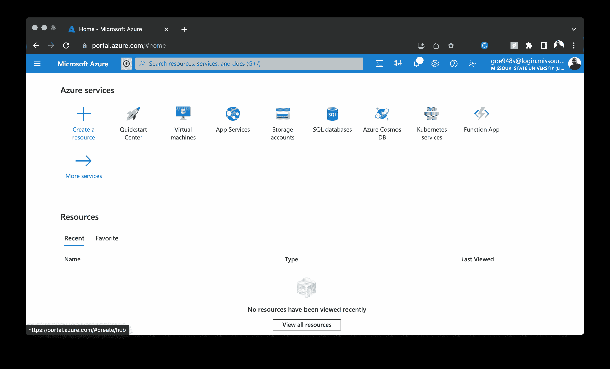

# 将 Dockerized Laravel 应用程序部署到 Azure | CircleCI

> 原文：<https://circleci.com/blog/deploy-a-dockerized-laravel-app/>

> 本教程涵盖:
> 
> 1.  编写一个样例 Laravel 应用程序
> 2.  创建连续部署配置来构建和部署容器映像
> 3.  将 Laravel 应用程序部署到 Azure 容器注册中心

随着 web 应用程序变得越来越复杂，软件工程团队必须依赖许多不同的产品和服务来创建最佳的开发人员体验。应用程序开发生态系统已经超越了版本控制和托管部署。手动管理所有服务中新特性的部署会在软件开发生命周期中产生严重的瓶颈。它也引入了人为错误的风险。

在本文中，我将描述如何通过 CircleCI 使用 GitHub 进行版本控制，将 Dockerized Laravel 应用程序部署到 Microsoft Azure。您将获得一个先前构建的 Laravel API 项目，从中构建一个容器映像，然后将该映像推送到 Azure 容器注册中心。然后，您将学习如何创建一个 Azure web 服务作为应用程序，并将容器映像连接到它。

微软 Azure Web Apps 是一个平台即服务 [(PaaS)](https://searchcloudcomputing.techtarget.com/definition/Platform-as-a-Service-PaaS) ，它让你发布在多个框架上运行的、用不同编程语言编写的 Web 应用。然后，您可以使用 CI/CD 工具来构建、测试和部署 web 应用程序，以获得更快的发布周期、更高效的开发和更高质量的代码。

## 先决条件

除了对 Laravel 和 PHP 有一个基本的了解之外，您还需要以下物品来从本教程中获得最大的收益:

*   Docker 桌面安装在您的本地机器上。你可以按照 Docker 的教程去做 [Windows](https://docs.docker.com/desktop/windows/install/) 或者 [macOS](https://docs.docker.com/desktop/mac/install/) 。
*   一个 [GitHub](https://github.com/join) 账户。
*   一个 [CircleCI](https://circleci.com/signup/) 账户。
*   一个天蓝色的账户。

> 我们的教程是平台无关的，但是使用 CircleCI 作为例子。如果你没有 CircleCI 账号，请在 注册一个免费的 [**。**](https://circleci.com/signup/)

## 克隆演示项目

通过运行以下命令克隆样本 Laravel 项目:

```
git clone https://github.com/yemiwebby/laravel-azure-api.git 
```

接下来，转到刚刚创建的新文件夹的根目录。通过运行以下命令设置项目:

```
cd laravel-azure-api

composer install 

cp .env.example .env

php artisan key:generate

php artisan serve 
```

这些命令将从终端将目录更改为`laravel-azure-api`项目，并且:

*   安装项目的所有依赖项
*   创建一个`.env`文件并将`.env.example`文件的内容复制到其中
*   生成应用程序密钥
*   运行应用程序

默认情况下，您的申请将送达`http://127.0.0.1:8000/`。转到该端点查看 json 响应。


您可以使用此命令来运行单元测试:

```
php vendor/bin/phpunit 
```

## 审查部署策略

既然您已经在本地运行了应用程序，现在是时候回顾一下您的部署策略了。除了包含配置文件来设置 CircleCI 的部署之外，不需要对项目代码进行任何更改。

按照时间顺序，您需要:

1.  在[Azure container registry(ACR)](https://azure.microsoft.com/en-us/services/container-registry/#overview)上创建一个注册表来托管您的容器映像，并获取访问密钥。ACR 是微软拥有的一个私人注册中心，用于托管 [Docker](https://www.docker.com/) 图像。
2.  为项目创建一个容器映像，构建，然后在本地运行该容器。
3.  将 Docker 映像发布到 Azure 容器注册中心。
4.  创建一个 Azure web 应用程序，并将其与发布的容器映像链接。
5.  启用连续部署并创建一个配置文件，以便在 CircleCI 上构建和部署容器映像。
6.  将项目推送到 GitHub，连接 CircleCI。
7.  将容器映像部署到 Azure 容器注册表。

## 创建 Azure 容器注册表

如果您还没有帐户，[在 Azure 上创建一个帐户](https://azure.microsoft.com/en-us/free/)。转到 Azure 门户仪表盘，点击**创建资源。**



选择**容器>容器注册表**来创建一个新的注册表。


在注册表创建页面上，输入所需的详细信息。


**注:** *您可以为此项目创建新的资源组，也可以使用现有的资源组。*

点击**审核+创建**。您将被重定向到可以查看注册表信息的页面。点击**创建**来设置一个新的注册中心实例。

### 从注册表获取访问密钥

在本节中，您将在 Azure 容器注册表中启用 Docker 访问。这一步对部署过程至关重要。启用 Docker 访问允许您通过 CLI 远程登录 Azure container registry 并向其推送图像。

打开注册表，在**设置**部分找到**访问键**链接。

这将显示注册表名称和登录服务器。使用切换按钮启用管理员用户。然后，复制用户名和任何密码，最好是第一个。把这个放在手边的某个地方；在教程的后面部分，您将会用到它。


## 本地容器化应用程序

下一步是编写一个定制的 Docker 文件，它将允许您构建一个容器映像。从应用程序的根目录，创建一个名为`Dockerfile`的新文件。打开文件并将以下内容粘贴到其中:

```
FROM php:8.0.20

RUN curl -sS https://getcomposer.org/installer | php -- \
     --install-dir=/usr/local/bin --filename=composer

COPY --from=composer:latest /usr/bin/composer /usr/bin/composer

RUN apt-get update && apt-get install -y zlib1g-dev \
    libzip-dev \
    unzip

RUN docker-php-ext-install pdo pdo_mysql sockets zip

RUN mkdir /app

ADD . /app

WORKDIR /app

RUN composer install

CMD php artisan serve --host=0.0.0.0 --port=8000

EXPOSE 8000 
```

PHP 版本 8 用作基础映像。随后的命令安装 composer，Laravel 应用程序的扩展，并启用 PHP PDO 和 MySQL 扩展。

安装完成后，将工作目录设置为`app`，并将文件从本地机器复制到容器的工作目录中。然后运行`composer install`并包含运行应用程序的命令。

## 建立码头工人形象

运行以下命令为项目构建 Docker 映像:

```
docker build -t laravelapidemo.azurecr.io/laravelapidemo:latest . 
```

该命令将在项目中查找 docker 文件，并根据包含的指令构建容器映像。请注意，上面的命令使用前面创建的注册表中的注册表名称和登录服务器。这种方法的好处是很容易将容器映像映射到 Azure 容器注册中心。


## 运行 Docker 映像

现在，我们已经成功地构建了本地版本的容器映像，使用以下命令运行它以确保它能够工作:

```
docker run -d -p 8000:8000 laravelapidemo.azurecr.io/laravelapidemo 
```

这将在端口 800 上运行应用程序。请访问`http://localhost:8000`进行验证。

## 将 Docker 映像推送到 Azure 注册表

接下来，登录之前创建的 Azure 容器注册表，并将容器映像推送到其中。从终端发出以下命令:

```
docker login -u DOCKER_USER -p DOCKER_PASS laravelapidemo.azurecr.io 
```

用您的值替换这些占位符:

*   `DOCKER_USER`:获取容器注册表的用户名。
*   `DOCKER_PASS`:来自容器注册表的密码。

登录后，使用以下命令将映像推送到 Azure 注册表:

```
docker push laravelapidemo.azurecr.io/laravelapidemo:latest 
```


## 为容器创建 Azure web 应用程序

接下来，您需要创建一个 [Azure Web App](https://azure.microsoft.com/en-us/services/app-service/web/) ，并将其与容器映像连接。进入 Azure 门户主页，点击**创建资源**。

选择**Containers>Web App for Containers**创建一个新的 Web App 服务实例。


您将被重定向到创建 Web 应用程序页面。选择 Azure 订阅和资源组。如果需要，创建一个新的资源组。`Docker container`默认为选中，如果为否，点击选中。


从 Docker 选项卡中，选择图像源及其各自的 Docker 图像。


当您点击**查看+创建**时，您将被重定向到一个页面，在此您可以查看 web 应用程序的详细信息。点击**创建**来设置一个新的 Azure web 应用。

当这个过程完成后，你可以访问 [URL](https://laravel-docker-demo.azurewebsites.net/) ，查看部署到 Azure 的应用程序。


## 支持持续部署

每次你的 Docker 图片更新时，你都希望应用程序能收到更新。为此，您需要为 web app 服务启用连续部署。

点击 web 应用名称，然后点击**部署中心**。在设置选项卡上，滚动到**连续部署**按钮并点击选择。点击**保存**保存更改。


选择连续部署后，每当在 Azure Container Registry 上重建 Docker 映像时，该 web 应用程序都会触发 Laravel 应用程序的新部署。

## 自动化部署

在此步骤中，您将为 CircleCI 添加管道配置。该管道自动测试并运行构建容器映像并将其推送到 Azure 容器注册中心的命令。

在项目的根目录下，打开`.circleci/config.yml`文件。如下所示更新其内容:

```
version: 2.1
orbs:
  docker: circleci/docker@2.1.2
jobs:
  build-and-test:
    description: Setup laravel application and run tests
    docker:
      # Specify the version you desire here
      - image: cimg/php:8.0-browsers

    steps:
      - checkout

      - run:
          name: "Prepare environment"
          command: |
            sudo apt update
      # Download and cache dependencies
      - restore_cache:
          keys:
            # "composer.lock" can be used if it is committed to the repo
            - v1-dependencies-{{ checksum "composer.json" }}
            # fallback to using the latest cache if no exact match is found
            - v1-dependencies-

      - run:
          name: "Install dependencies"
          command: composer install -n --prefer-dist

      - save_cache:
          key: v1-dependencies-{{ checksum "composer.json" }}
          paths:
            - ./vendor

      - run:
          name: "Create .env file and generate app key"
          command: |
            mv .env.example .env
            php artisan key:generate

      - run:
          name: "Run tests"
          command: php vendor/bin/phpunit

  build-docker-image:
    executor:
      name: docker/docker
      tag: "3.6"
    steps:
      - checkout
      - docker/install-docker-tools
      - setup_remote_docker:
          version: 20.10.14
          docker_layer_caching: true
      - run:
          name: "Build and push Docker image"
          command: |
            docker build -t laravelapidemo.azurecr.io/laravelapidemo:latest .
            docker login -u $DOCKER_USER -p $DOCKER_PASS laravelapidemo.azurecr.io
            docker push laravelapidemo.azurecr.io/laravelapidemo:latest

workflows:
  test-and-deploy:
    jobs:
      - build-and-test
      - build-docker-image:
          requires:
            - build-and-test 
```

这是配置的明细。

CircleCI 配置总是从版本开始。对于本教程，我们使用版本`2.1`。

配置的下一部分指定了两个不同的作业:

*   `build-and-test`
*   `build-docker-image`

`build-and-test`作业使用 CircleCI PHP 8 Docker 映像，从 GitHub 签出我们的项目，安装项目的依赖项，设置环境变量，并运行应用程序的测试。

`build-docker-image`作业为从 Github 存储库中提取的代码创建一个 Docker 映像，并用容器的最新版本更新 Azure 容器注册表。`requires`键指定在`build`任务完成之前`build-docker-image`不会运行。

## 将应用程序连接到 CircleCI

现在您需要在 GitHub 上建立一个存储库，并将项目链接到 CircleCI。查看[将项目推送到 GitHub](https://circleci.com/blog/pushing-a-project-to-github/) 以获取指示。

登录您的 CircleCI 帐户。如果你注册了你的 GitHub 账户，你所有的库都可以在你项目的仪表盘上看到。

点击`laravel-azure-api`项目旁边的**设置项目**。


系统将提示您编写新的配置文件，或者在项目中使用现有的配置文件。选择现有的分支，并输入您的代码在 GitHub 上所在的分支的名称。点击**走吧**。


您的第一个工作流将开始运行。

`build-docker-image`作业将失败，因为您尚未提供您的 Azure container 注册表凭据。

要解决这个问题，您需要添加用户名和密码环境变量。点击**项目设置**。

点击**环境变量**。创建这些变量:

*   `DOCKER_USERNAME`变量是为容器注册中心获得的用户名。
*   `DOCKER_PASS`变量是容器注册表中的密码。

回到仪表板。点击**从开始**重新运行工作流程。

这一次，您的工作流将成功运行。现在，您可以在本地对代码库进行更改，并使用持续部署将其推送到 GitHub。

## 结论

现在你知道了。使用 Docker、CircleCI 和 Microsoft Azure，您能够自动化 Laravel 应用程序的部署过程。您执行了设置过程，以确保每次更新项目并将更改推送到 GitHub 时，CircleCI 都会使用配置细节来构建新的容器映像并更新相关的 Azure 容器注册表。随着 Azure web app 上启用持续部署，webhook 资源将被触发，以将新版本的容器映像推送到 web app。

我希望本教程对你有所帮助。[点击这里](https://github.com/yemiwebby/laravel-api-docker)查看您构建的项目的完整源代码。

* * *

Oluyemi 是一名拥有电信工程背景的技术爱好者。出于对解决用户日常遇到的问题的浓厚兴趣，他冒险进入编程领域，并从那时起将他的问题解决技能用于构建 web 和移动软件。Oluyemi 是一名热衷于分享知识的全栈软件工程师，他在世界各地的几个博客上发表了大量技术文章和博客文章。作为技术专家，他的爱好包括尝试新的编程语言和框架。

[阅读更多 Olususi Oluyemi 的帖子](/blog/author/olususi-oluyemi/)