# 使用 Quali Torque orb | CircleCI 按需部署应用环境

> 原文：<https://circleci.com/blog/deploy-application-environments-with-torque/>

大多数开发者关心的是构建下一个大东西。自动化您的构建、测试和发布过程允许您继续关注创新和向您的用户交付价值。通过将同类最佳的 CI/CD 工作流编排功能与托管环境即服务相结合，开发人员可以专注于构建未来。

[Quali Torque orb](https://circleci.com/developer/orbs/orb/quali/torque) 允许开发者直接从他们的 CircleCI 管道按需触发应用环境。通过利用 Torque orb 的预定义命令，CircleCI 用户可以轻松地将 Torque 环境即服务平台集成到他们的项目中。在本教程中，我们将演示如何设置 Torque 帐户和应用程序环境，以及如何使用 Torque orb 从 CircleCI 管道中自动部署您的环境。

## 在 Torque UI 中设置应用程序环境

您只需要遵循几个简单的步骤，就可以建立并运行一个全功能的环境。首先，[注册一个免费的 Torque 账户](https://app.qtorque.io/sign_up?utm_source=bd-joint-marketing&utm_medium=referral&utm_campaign=circleci-blog)并设置密码，然后按照下面的步骤操作。

### 在 Torque 中定义您的云帐户

下一步通常由管理员完成，就是在 Torque 中定义一个云帐户。从左侧菜单导航到管理控制台。在云账户管理部分点击**连接云**，然后按照说明在 [AWS](https://community.qtorque.io/amazon-web-services-aws-53/adding-an-aws-cloud-account-224) 、 [Azure](https://community.qtorque.io/microsoft-azure-54/adding-an-azure-cloud-account-321) 或 [Kubernetes](https://community.qtorque.io/kubernetes-55/adding-a-kubernetes-compute-service-to-torque-372) 上设置账户。

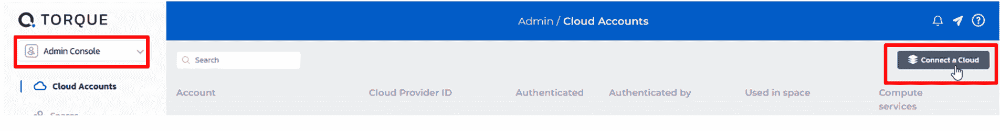

在这个例子中，我们将使用 AWS 作为我们的云提供商。

### 添加蓝图存储库

在 Torque 中，应用环境的模板被称为蓝图。Torque 遵循开发人员的最佳实践，所有蓝图都存储在一个源代码控制存储库中，并自动同步。我们目前支持 GitHub 和 Bitbucket，并且正在积极增加更多的支持。检查[扭矩位置的最新集成](https://community.qtorque.io/integrating-torque-in-your-ci-cd-40)。

在下面的例子中，我们将使用 GitHub。

在 GitHub 中，创建一个存储库。复制存储库的 URL。我们建议通过分叉示例存储库(在示例空间中)来创建存储库。

接下来，在扭矩中，执行以下步骤:

1.  访问您的共享空间。
2.  打开设置页面。
3.  单击“存储库”选项卡。您可以在空间中设置两个不同的存储库，一个用于沙盒，另一个用于生产环境。在我们的例子中，我们将为沙盒环境设置一个 repo。
4.  点击**添加一个存储库**。
5.  选择您希望使用的源代码管理工具(GitHub ),并将复制的 URL 粘贴到“添加 GitHub 存储库”弹出窗口中。
6.  点击**连接**。
7.  授权 Torque 访问您的 GitHub 库。

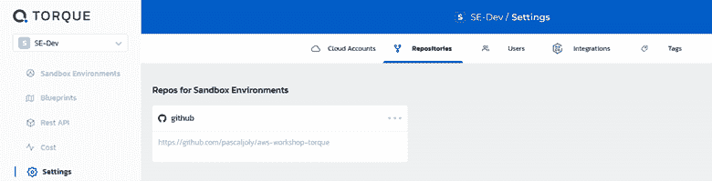

### 为你的蓝图建模

DevOps 工程师为代表所需应用程序及其基础架构的蓝图建模。每个蓝图都可以有输入参数、自定义标记，并且可能会因管道所处的阶段而有所不同。

有几种方法可以在 Torque 中创建蓝图:

*   使用示例库中的 YAML 本地语言，其中包含您可以用来创建新蓝图的示例
*   通过导入现有的地形模板
*   通过导入现有的舵图

让我们回顾一下我们将在本项目的其余部分使用的示例应用程序。这个应用程序被称为促销管理器。这是一个简单的电子商务销售工具，产生促销优惠。

DevOps 团队希望在 Torque 中建模 Promotions Manager 应用程序环境，将其集成到自动化的 CircleCI 工作流中，并使用它来自动测试最新版本。

在这种情况下，我们使用 YAML 方法，并借鉴我们团队正在开发的现有蓝图。使用您最喜欢的 IDE 编辑 YAML 代码，并将其签入您在上一步中在 Torque 中定义的 Git 存储库中。

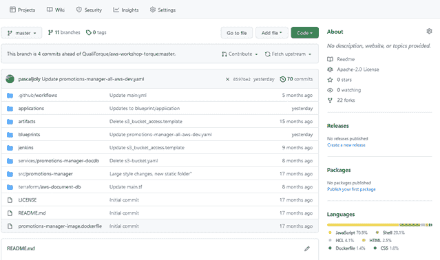

作为参考，这个蓝图可以在本教程的[演示库中找到。](https://github.com/QualiSystemsLab/demo-for-circle-ci)

我们的蓝图包含三种应用服务:

1.  运行在 MongoDB 上的后端数据库
2.  API 服务器
3.  网络服务器

我们将在 AWS 上部署这个应用程序，AWS 是我们在 cloud account settings 一节中定义的云提供商。

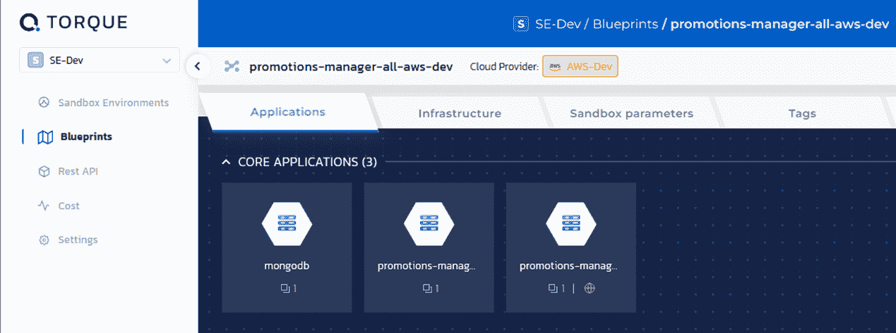

一旦您的蓝图出现在 Torque blueprint 目录中，您就可以使用切换功能发布它，并在将它包含到您的 CircleCI 工作流中之前测试它以确保它正确部署。

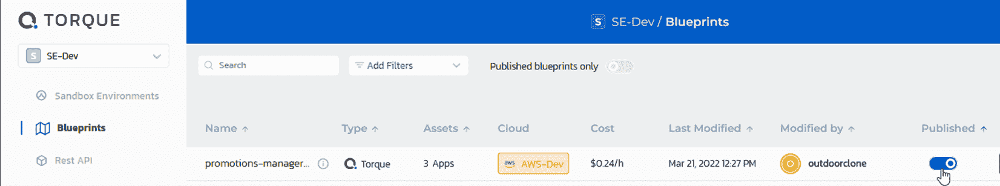

要测试它，导航到沙盒环境并从目录中选择蓝图。接下来，设置沙盒参数。您可以将所有参数保留为默认值，并输入一个名称。

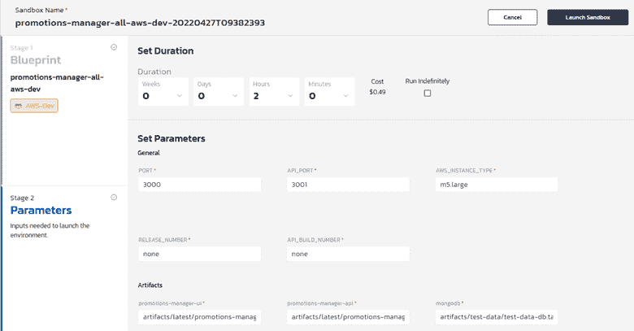

最后，启动沙箱并验证它是否正确部署。

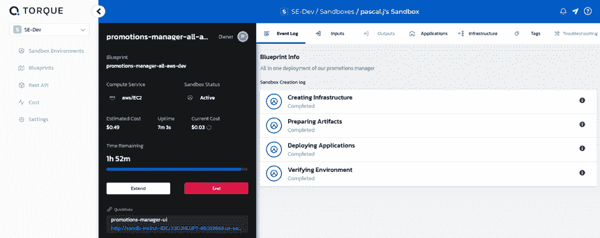

您还可以点击快速链接，并检查您的应用程序的 web UI 前端。

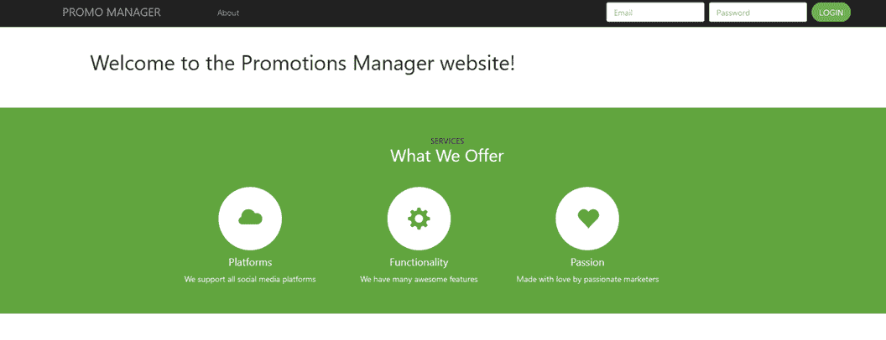

现在您确信您的应用程序在 Torque 中正确部署了，您可以结束沙箱或者让它按照沙箱持续时间参数中的定义自动结束。

## 作为 CI 工作流的一部分，自动化应用程序环境的部署

下一步是[在 CircleCI](https://circleci.com/docs/project-build/#adding-projects) 中创建一个项目，并将来自 [Torque orb 注册表](https://circleci.com/developer/orbs/orb/quali/torque)的命令包含在您的配置文件中。如果你还没有 CircleCI 账户，你需要[注册一个。](https://circleci.com/signup/)

在我们的例子中，我们将使用 GitHub 帐户登录 CircleCI，并[连接为我们的 Torque 蓝图](https://circleci.com/docs/projects/)定义的 Git 存储库。

我们将创建一个简单的项目，该项目将启动一个沙箱来部署我们的 Promotions Manager 蓝图，运行一个测试，并终止该沙箱。

**注意:** *在一个典型的场景中，您会想要测试您的应用程序代码的最新版本。这意味着您还将添加一个构建步骤作为工作流的触发点，并使其成为项目的第一步。*

一旦您的存储库在项目列表中列出，您将配置环境变量来定义您的 Torque [上下文](https://circleci.com/docs/contexts/)。

### 配置您的 CircleCI 管道

在 CircleCI web 应用程序中，导航到“项目”部分，并从 Promotions Manager 存储库旁边的菜单中选择**项目设置**。然后导航到环境变量页面。

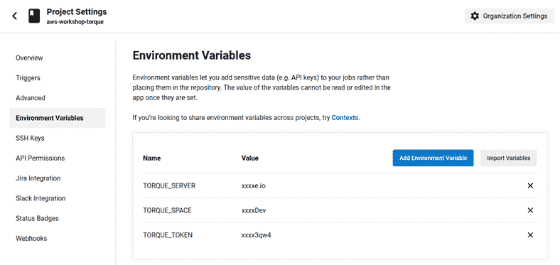

接下来，添加以下三个变量:

*   **TORQUE_SERVER** :你的 TORQUE 服务器的 URL(`https://app.qtorque.io`)
*   **Torque_SPACE** :您在 TORQUE 中的空间名称，当您登录 TORQUE 时会出现在屏幕的左上角
*   **TORQUE_TOKEN** :在 TORQUE 中，导航到 Settings > Integrations 选项卡并选择 CircleCI。点击**连接**，然后点击**新令牌**。输入为此变量生成的值。

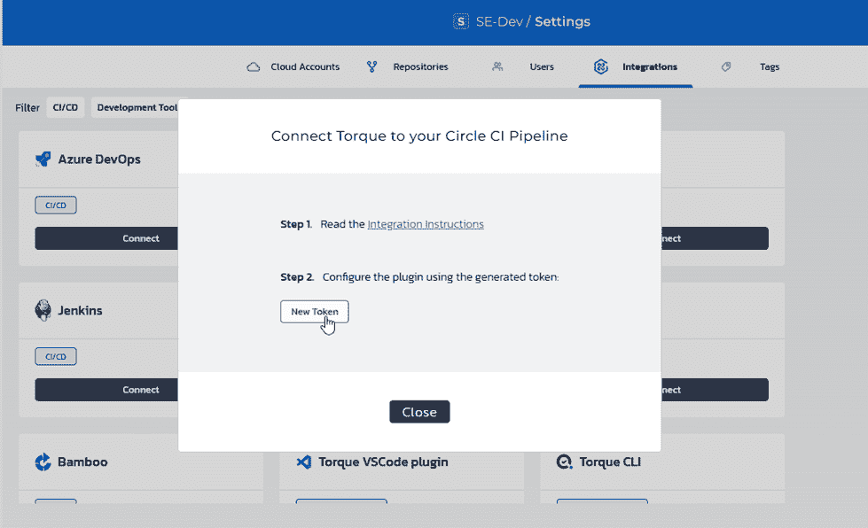

接下来，您就可以生成 CircleCI 项目的 config.yml 文件了。回到您的项目，选择**配置文件**。

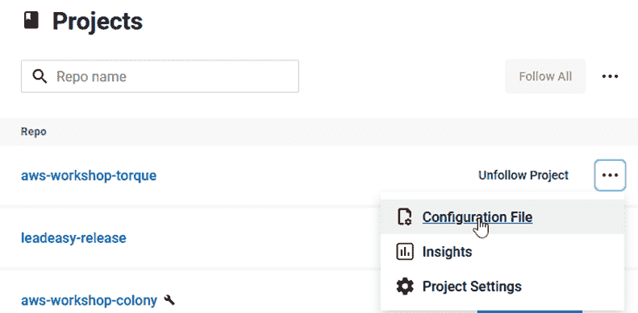

我们将使用[扭矩 orb 库](https://circleci.com/developer/orbs/orb/quali/torque)中定义的步骤:

*   **`start-sandbox`** :部署扭矩沙箱
*   **`end-sandbox`** :终止扭矩沙箱

我们还将运行一个快速测试来检索应用程序端点，您可以根据需要随意添加自己的运行状况检查、安全测试或性能验证。

在我们的推广应用程序示例中，配置文件如下所示(直接取自我们的[示例报告](https://github.com/QualiSystemsLab/demo-for-circle-ci/blob/master/.circleci/config.yml)):

```
version: 2.1

orbs:
  torque: quali/torque@1.0.0
  aws-s3: circleci/aws-s3@1.0.11
jobs:
  test:
    docker:
      - image: circleci/ruby:2.4.1
    steps:
      - torque/start-sandbox:
          sandbox-name: "circleci-test"
          blueprint: "promotions-manager-all-aws-dev"
          inputs: "{'AWS_INSTANCE_TYPE': 'm5.large','PORT':'3000','API_PORT':'3001', 'RELEASE_NUMBER':'none', 'API_BUILD_NUMBER':'none'}"
          artifacts: "{'promotions-manager-ui':'artifacts/latest/promotions-manager-ui.master.tar.gz','promotions-manager-api':'artifacts/latest/promotions-manager-api.master.tar.gz', 'mongodb': 'artifacts/test-data/test-data-db.tar' }"
      - run:
          name: Functional test
          command: |
            SB_ENDPOINT="SB_${SANDBOX_ID}_SHORTCUT_1"
            echo "Checking Sandbox ${!SB_ENDPOINT}"
      - torque/end-sandbox:
          sandbox-id: SANDBOX_ID
workflows:
  testpromotionmanager:
    jobs:
      - test 
```

确保指定所有输入参数(逗号分隔的列表)来启动沙箱。第一次运行这个流程时，使用与在 Torque 中直接测试应用程序部署时相同的值。

在后端，这个工作流调用 Torque REST API 来根据蓝图名称和可选参数触发沙盒环境的部署。类似地，一旦测试完成，沙盒环境终止，基础设施被重置为其初始状态。

### 运行管道

最后一步是运行您的持续集成管道。您可以直接从 CircleCI UI(第一次创建或修改配置文件时)或者根据合并到主分支的最新代码自动完成这项工作。

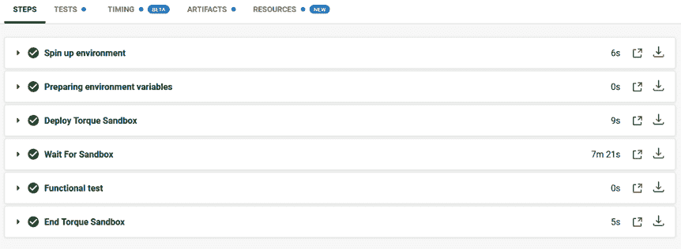

## 结论

只需几个步骤，您就能够以完全自动化的方式自动化应用程序的部署和测试。您可以使用类似的方法非常快速地构建和运行更复杂的管道，从开发到测试，一直到生产，发布您自己的多服务云应用程序。

欲了解更多信息，请访问 Quali 网站上的 [Torque 社区](https://community.qtorque.io/)和 [CircleCI 合作伙伴简介](https://www.quali.com/partner-profile/circleci/)。