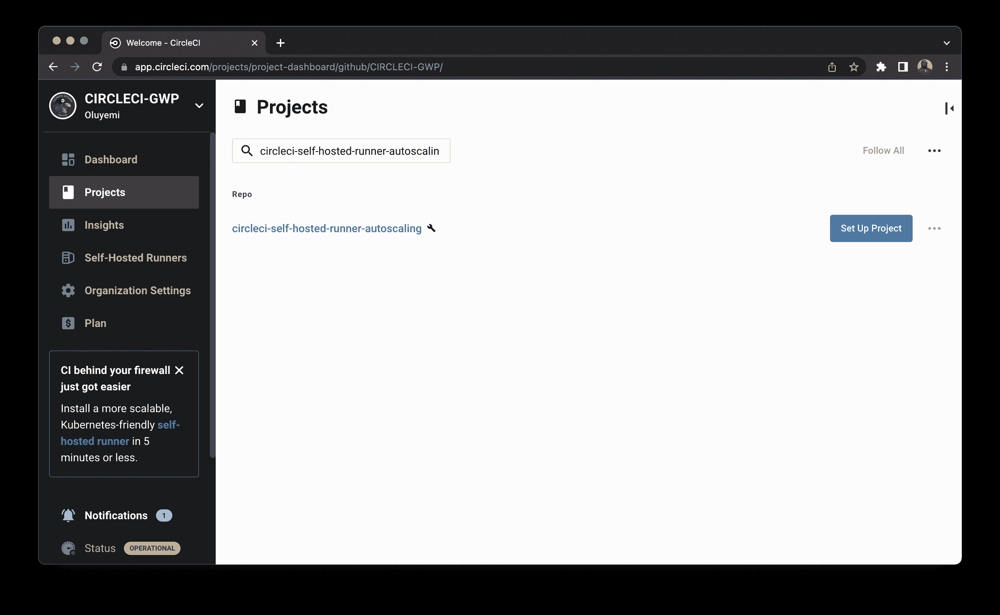
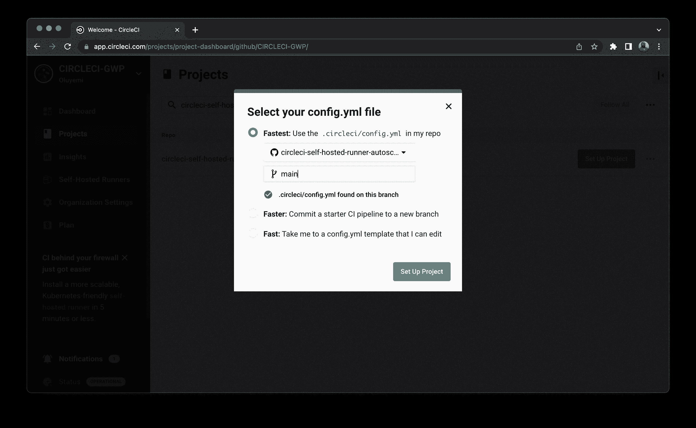
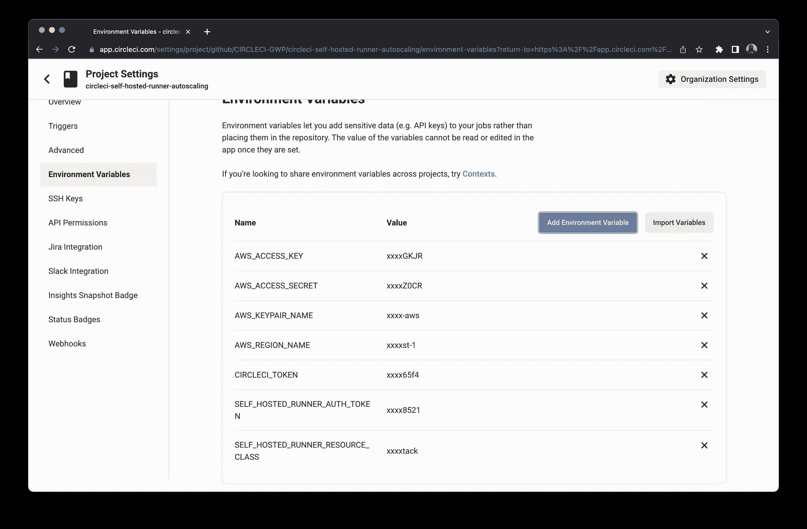
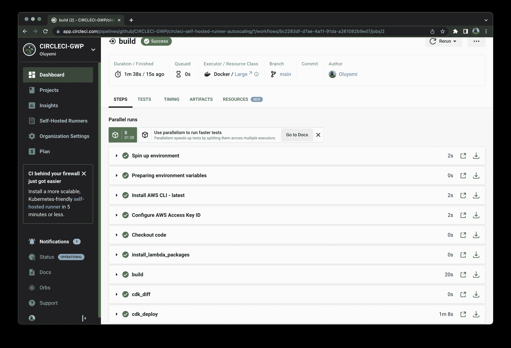
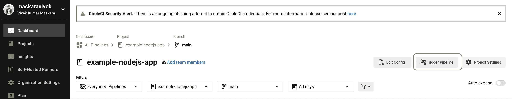
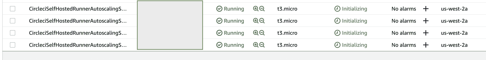
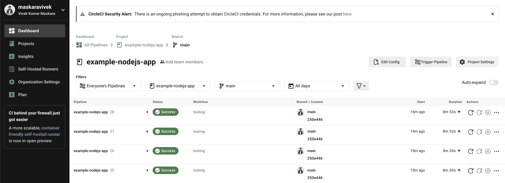

# 使用 AWS CDK | CircleCI 部署自动缩放自托管跑步者

> 原文：<https://circleci.com/blog/deploy-autoscaling-self-hosted-runners-using-aws-cdk/>

> 本教程涵盖:
> 
> 1.  定义 AWS CDK 应用程序和 AWS Lambda 处理器
> 2.  创建自宿主运行程序资源类
> 3.  部署应用程序，然后自动化部署

您可以使用 CircleCI 的云资源来运行您的 CI/CD 作业，但有时您可能希望在您的基础架构上运行它们。如果您的团队强加了特权访问和控制要求，自托管基础架构可能最适合运行您的工作。CircleCI 的[自主跑步者](https://circleci.com/docs/runner-overview)让你做到这一点。很容易[开始](https://circleci.com/blog/install-runner-in-five-minutes/)并开始使用自托管运行器。

如果您发现您的团队的资源需求每天都在波动，那么您可以考虑实现一个自动伸缩的解决方案来根据需求增加资源。

在本教程中，您将学习如何使用由 AWS 开发的基础设施代码(IaC)工具 [AWS CDK](https://aws.amazon.com/cdk/) 来设置自动缩放。如果你对使用 AWS GUI 控制台实现自动缩放的[感兴趣，有一个配套教程。](https://circleci.com/blog/autoscale-self-hosted-runners-aws/)

## 先决条件

请参考此列表来设置本教程所需的一切。

## 创建新的 AWS CDK 项目

为您的 CDK 项目创建一个新目录，并导航到其中。

```
mkdir circleci-self-hosted-runner-autoscaling
cd circleci-self-hosted-runner-autoscaling 
```

使用 CDK CLI 运行`cdk init`命令，该命令使用 Typescript 创建一个新的 CDK 项目。`app`参数指定您将用于初始化项目的模板。

```
cdk init app --language typescript 
```

这个命令用几个文件创建一个新的 CDK 项目。

确保`aws-cdk-lib >= 2.32.0`在`package.json`中定义。如果现有版本较低，请手动更新 CDK 库版本。

## 为自动缩放添加 Lambda 函数

在本节中，您将定义一个 AWS Lambda 函数来根据当前需求设置所需的运行实例数量。

在 CDK 项目的根目录下创建一个`lambda/auto-scaling-lambda`目录。在`lambda/auto-scaling-lambda`目录中，添加一个用于定义依赖关系的`package.json`文件。

在`package.json`文件中，定义项目的名称并添加您的处理程序将使用的`node-fetch`依赖项。

```
{
  "name": "auto-scaling-lambda",
  "version": "0.1.0",
  "dependencies": {
    "node-fetch": "^2.6.7"
  }
} 
```

一旦添加了依赖项，运行`lambda/auto-scaling-lambda`目录中的`npm install`命令来安装软件包。

接下来，在`lambda/auto-scaling-lambda`目录中添加一个`index.js`文件来定义 Lambda 处理程序。该函数将调用 [CircleCI runner tasks API](https://circleci.com/docs/runner-api#get-api-v2-tasks) 来获取挂起作业的数量。根据响应，它将更新 AWS 自动缩放组中的实例计数。

将此代码添加到`index.js`文件中:

```
const AWS = require("aws-sdk");
const fetch = require("node-fetch");
AWS.config.update({ region: "us-west-2" });
const { env } = require("process");

const SECRET_NAME = env.SECRET_NAME;
const SECRET_REGION = env.SECRET_REGION;
const AUTO_SCALING_MAX = env.AUTO_SCALING_MAX;
const AUTO_SCALING_GROUP_NAME = env.AUTO_SCALING_GROUP_NAME;
const AUTO_SCALING_GROUP_REGION = env.AUTO_SCALING_GROUP_REGION;

exports.handler = async (event, context) => {
  return await getTasks().then(async (data) => {
    let numInstances = 0;
    if (data["unclaimed_task_count"] < AUTO_SCALING_MAX) {
      numInstances = data["unclaimed_task_count"];
    } else {
      numInstances = AUTO_SCALING_MAX;
    }

    await updateNumInstances(numInstances);
    return numInstances;
  });
};

async function updateNumInstances(numInstances) {
  const autoScaling = new AWS.AutoScaling({ region: AUTO_SCALING_GROUP_REGION });
  const params = {
    AutoScalingGroupName: AUTO_SCALING_GROUP_NAME,
    MinSize: 0,
    MaxSize: AUTO_SCALING_MAX,
    DesiredCapacity: numInstances,
  };
  await autoScaling.updateAutoScalingGroup(params).promise();
}

async function getTasks() {
  const secret = await getSecret();
  const url = `https://runner.circleci.com/api/v2/tasks?resource-class=${secret["resource_class"]}`;
  const headers = {
    "Circle-Token": secret["circle_token"],
  };

  const response = await fetch(url, {
    headers: headers,
  });
  const data = await response.json();
  return data;
}

async function getSecret() {
  const params = {
    SecretId: SECRET_NAME,
  };
  const data = await new AWS.SecretsManager({ region: SECRET_REGION })
    .getSecretValue(params)
    .promise();
  if ("SecretString" in data) {
    let secret = JSON.parse(data.SecretString);
    return secret;
  } else {
    let buff = new Buffer(data.SecretBinary, "base64");
    let decodedBinarySecret = buff.toString("ascii");
    return JSON.parse(decodedBinarySecret);
  }
} 
```

请注意:

*   Lambda 函数使用 [AWS Secrets Manager](https://aws.amazon.com/secrets-manager/) 来检索认证任务 API 所需的 CircleCI 令牌。它接收机密名称作为环境变量。
*   该函数还接收 AWS EC2 自动缩放组名称作为环境变量。它使用 NodeJS 的 AWS SDK 调用自动缩放服务 API 来更新实例计数。

## 定义 AWS EC2 启动脚本

一旦启动，您需要在 AWS EC2 实例上配置并运行 CircleCI 自托管 runner 服务。定义一个 shell 脚本，该脚本安装所需的软件包，创建 CircleCI runner 服务，并启动该服务以使其可被发现。在`scripts/install_runner.sh`处创建一个文件，并添加以下代码片段:

```
#!/bin/bash

#-------------------------------------------------------------------------------
# CircleCI Runner installation script
# Based on the documentation at https://circleci.com/docs/2.0/runner-installation/
#-------------------------------------------------------------------------------

# Prerequisites:
# Complete these:
# https://circleci.com/docs/2.0/runner-installation/#authentication
# This script must be run as root
# This script was tested on Ubuntu 22.04

platform="linux/amd64"                                  # Runner platform: linux/amd64 || linux/arm64 || platform=darwin/amd64
prefix="/opt/circleci"                                  # Runner install directory

CONFIG_PATH="/opt/circleci/launch-agent-config.yaml"    # Determines where Runner config will be stored
SERVICE_PATH="/opt/circleci/circleci.service"           # Determines where the Runner service definition will be stored
TIMESTAMP=$(date +"%g%m%d-%H%M%S-%3N")                  # Used to avoid Runner naming collisions

AUTH_TOKEN="<SELF_HOSTED_RUNNER_AUTH_TOKEN>"  # Auth token for CircleCI
RUNNER_NAME="<SELF_HOSTED_RUNNER_NAME>"           # A runner name - this is not the same as the Resource class - keep it short, and only with letters/numbers/dashes/underscores
UNIQUE_RUNNER_NAME="$RUNNER_NAME-$TIMESTAMP"            # Runners must have a unique name, so we'll append a timestamp
USERNAME="circleci"                                     # The user which the runner will execute as

#-------------------------------------------------------------------------------
# Update; install dependencies
#-------------------------------------------------------------------------------

apt update
apt install coreutils curl tar gzip -y

#-------------------------------------------------------------------------------
# Download, install, and verify the binary
#-------------------------------------------------------------------------------

sudo mkdir -p "$prefix/workdir"
base_url="https://circleci-binary-releases.s3.amazonaws.com/circleci-launch-agent"
echo "Determining latest version of CircleCI Launch Agent"
agent_version=$(curl "$base_url/release.txt")
echo "Using CircleCI Launch Agent version $agent_version"
echo "Downloading and verifying CircleCI Launch Agent Binary"
curl -sSL "$base_url/$agent_version/checksums.txt" -o checksums.txt
file="$(grep -F "$platform" checksums.txt | cut -d ' ' -f 2 | sed 's/^.//')"
sudo mkdir -p "$platform"
echo "Downloading CircleCI Launch Agent: $file"
curl --compressed -L "$base_url/$agent_version/$file" -o "$file"
echo "Verifying CircleCI Launch Agent download"
grep "$file" checksums.txt | sha256sum --check && chmod +x "$file"; sudo cp "$file" "$prefix/circleci-launch-agent" || echo "Invalid checksum for CircleCI Launch Agent, please try download again"

#-------------------------------------------------------------------------------
# Install the CircleCI runner configuration
# CircleCI Runner will be executing as the configured $USERNAME
# Note the short idle timeout - this script is designed for auto-scaling scenarios - if a runner is unclaimed, it will quit and the system will shut down as defined in the below service definition
#-------------------------------------------------------------------------------

sudo bash -c 'cat > /opt/circleci/launch-agent-config.yaml' << EOF
api:
  auth_token: $AUTH_TOKEN
runner:
  name: $UNIQUE_RUNNER_NAME
  command_prefix: ["sudo", "-niHu", "$USERNAME", "--"]
  working_directory: /opt/circleci/workdir/%s
  cleanup_working_directory: true
  idle_timeout: 5m
  max_run_time: 5h
  mode: single-task
EOF

# Set correct config file permissions and ownership
chown root: /opt/circleci/launch-agent-config.yaml
chmod 600 /opt/circleci/launch-agent-config.yaml

#-------------------------------------------------------------------------------
# Create the circleci user & give permissions to working directory
# This user should NOT already exist
#-------------------------------------------------------------------------------

adduser --disabled-password --gecos GECOS "$USERNAME"
chown -R "$USERNAME" "$prefix/workdir"

#-------------------------------------------------------------------------------
# Create the service
# The service will shut down the instance when it exits - that is, the runner has completed with a success or error
#-------------------------------------------------------------------------------

sudo bash -c 'cat > /opt/circleci/circleci.service' << EOF
[Unit]
Description=CircleCI Runner
After=network.target
[Service]
ExecStart=$prefix/circleci-launch-agent --config $CONFIG_PATH
ExecStopPost=shutdown now -h
Restart=no
User=root
NotifyAccess=exec
TimeoutStopSec=18300
[Install]
WantedBy = multi-user.target
EOF

#-------------------------------------------------------------------------------
# Configure your runner environment
# This script must be able to run unattended - without user input
#-------------------------------------------------------------------------------
sudo apt install -y nodejs npm

#-------------------------------------------------------------------------------
# Enable CircleCI Runner service and start it
# This MUST be done last, as it will immediately advertise to the CircleCI server that the runner is ready to use
#-------------------------------------------------------------------------------
sudo systemctl enable $prefix/circleci.service
sudo systemctl start circleci.service 
```

请注意，该脚本包含作为虚拟值的`<SELF_HOSTED_RUNNER_AUTH_TOKEN>`和`<SELF_HOSTED_RUNNER_NAME>`，它们将被环境变量中的值替换。在下一节中，CDK 堆栈中的 AWS EC2 自动缩放组将使用 shell 脚本。

## 为应用程序定义 CDK 结构

在本节中，您将为您的应用程序定义所有的 CDK 构造。AWS CDK 构造是云组件，封装了配置细节并粘合了使用一个或多个 AWS 服务的逻辑。CDK 为最常用的 AWS 服务提供了一个构造库。

当您使用`app`模板生成 CDK 项目时，会为您创建包含`CircleciSelfHostedRunnerAutoscalingStack`类的`lib/circleci-self-hosted-runner-autoscaling-stack.ts`文件。您将在该文件中定义 CDK 构造。

```
//  The snippet shows the original contents for reference. You do not need to replace the file contents.
import { Stack, StackProps } from "aws-cdk-lib";
import { Construct } from "constructs";

export class CircleciSelfHostedRunnerAutoscalingStack extends Stack {
  constructor(scope: Construct, id: string, props?: StackProps) {
    super(scope, id, props);

    // we will add all the constructs here
  }
} 
```

首先，将`StackProps`扩展到`CircleciSelfHostedRunnerAutoscalingStackProps`并定义一些额外的属性。您正在扩展`StackProps`，以便堆栈可以从 CDK 应用程序接收一些自定义参数。

```
import { Stack, StackProps } from "aws-cdk-lib";
import { Construct } from "constructs";

// extend StackProps
export interface CircleciSelfHostedRunnerAutoscalingStackProps extends StackProps {
  maxInstances: string;
  keypairName: string;
  runnerName: string;
}

export class CircleciSelfHostedRunnerAutoscalingStack extends Stack {
  // use CircleciSelfHostedRunnerAutoscalingStackProps instead of StackProps
  constructor(scope: Construct, id: string, props?: CircleciSelfHostedRunnerAutoscalingStackProps) {
    super(scope, id, props);
  }
} 
```

接下来，列出所有需要在堆栈中定义的自动缩放结构:

*   一个 [VPC](https://docs.aws.amazon.com/vpc/latest/userguide/what-is-amazon-vpc.html) ，一个[安全组](https://docs.aws.amazon.com/vpc/latest/userguide/VPC_SecurityGroups.html)，以及一个 [AMI](https://docs.aws.amazon.com/AWSEC2/latest/UserGuide/AMIs.html) 用于您的 AWS EC2 实例。
*   AWS EC2 的自动缩放组，在启动时执行自定义用户脚本。
*   使用 AWS secret manager 存储 CircleCI 令牌和资源类。
*   AWS Lambda 函数，每分钟运行一次，以更新所需的实例计数。

### 定义 AWS EC2 的结构

在本节中，您将为创建 AWS EC2 自动缩放组时所需的内容定义 AWS CDK 结构。您需要为 EC2 实例定义一个 VPC、一个安全组和一个 AMI。

要定义一个 VPC，在`lib/circleci-self-hosted-runner-autoscaling-stack.ts`文件中定义的`constructor`内添加一个 CDK 构造。

```
import { Stack,
    StackProps,
    //update the existing import to add aws_ec2
    aws_ec2 as ec2,
 } from 'aws-cdk-lib';

constructor(scope: Construct, id: string, props?: CircleciSelfHostedRunnerAutoscalingStackProps) {
    super(scope, id, props);

    // we will add all the constructs here
    // provide a unique name for your S3 bucket
    const circleCIVpc = new ec2.Vpc(this, "CircleCISelfHostedRunnerVPC", {
        maxAzs: 1,
        subnetConfiguration: [{
        name: 'public-subnet-1',
        subnetType: ec2.SubnetType.PUBLIC,
        cidrMask: 24,
        }]
    });
} 
```

要定义一个安全组，将这个代码片段添加到在`lib/circleci-self-hosted-runner-autoscaling-stack.ts`文件中定义的`constructor`中。

```
import { Stack,
    StackProps,
    //update the existing import to add aws_ec2
    aws_ec2 as ec2,
 } from 'aws-cdk-lib';

constructor(scope: Construct, id: string, props?: CircleciSelfHostedRunnerAutoscalingStackProps) {
    super(scope, id, props);

    // add the security group below the existing constructs
    const circleCISecurityGroup = new ec2.SecurityGroup(this, 'CircleCISelfHostedRunnerSecurityGroup', {
        vpc: circleCIVpc,
    });

    circleCISecurityGroup.addIngressRule(
        ec2.Peer.anyIpv4(),
        ec2.Port.tcp(22),
        'allow SSH access from anywhere',
    );
} 
```

要为 EC2 实例定义一个 AMI，将这个代码片段添加到在`lib/circleci-self-hosted-runner-autoscaling-stack.ts`文件中定义的`constructor`中。一个文件是可用的 [AWS SAM 参数](https://docs.aws.amazon.com/serverless-application-model/latest/developerguide/sam-specification-template-anatomy.html)用于获取所选 AWS 区域的 Ubuntu 实例的 AMI ID。

```
import { Stack,
    StackProps,
    //update the existing import to add aws_ec2
    aws_ec2 as ec2,
 } from 'aws-cdk-lib';

constructor(scope: Construct, id: string, props?: CircleciSelfHostedRunnerAutoscalingStackProps) {
    super(scope, id, props);

    // add the AMI below the existing constructs
    const amiSamParameterName = '/aws/service/canonical/ubuntu/server/focal/stable/current/amd64/hvm/ebs-gp2/ami-id'

    const ami = ec2.MachineImage.fromSsmParameter(
      amiSamParameterName, {
      os: ec2.OperatingSystemType.LINUX
    });
} 
```

### 定义自动缩放组

接下来，定义一个 AWS EC2 自动缩放组来管理您的实例。将这段代码添加到在`lib/circleci-self-hosted-runner-autoscaling-stack.ts`文件中定义的`constructor`中。

```
import {
    StackProps,
    aws_ec2 as ec2,
    //update the existing import to add aws_autoscaling
    aws_autoscaling as autoscaling,
} from 'aws-cdk-lib';

constructor(scope: Construct, id: string, props ?: CircleciSelfHostedRunnerAutoscalingStackProps) {

    // add the following code snippet below the existing constructs
    const instanceTypeName = "t3.micro"
    const instanceType = new ec2.InstanceType(instanceTypeName);

    const circleCiAutoScalingGroup = new autoscaling.AutoScalingGroup(this, 'CircleCiSelfHostedRunnerASG', {
        vpc: circleCIVpc,
        instanceType: instanceType,
        machineImage: ami,
        securityGroup: circleCISecurityGroup,
        keyName: props!!.keypairName,
        vpcSubnets: {
            subnetType: ec2.SubnetType.PUBLIC
        },
        minCapacity: 0,
        maxCapacity: Number(props!!.maxInstances),
    });
} 
```

如果您想要 SSH 到 EC2 实例，您需要使用 AWS 控制台手动[创建 EC2 密钥对](https://docs.aws.amazon.com/AWSEC2/latest/UserGuide/create-key-pairs.html)。否则，您可以在定义自动缩放构造时省略`keyName`属性。

自动缩放 CDK 构造允许您附加一个将在实例启动时执行的用户数据脚本。通过在堆栈文件中添加以下代码片段，将用户数据脚本附加到自动缩放组:

```
import { readFileSync } from 'fs';
const { env } = require("process");

constructor(scope: Construct, id: string, props ?: CircleciSelfHostedRunnerAutoscalingStackProps) {

    // add the following code snippet below the existing constructs
    let userDataScript = readFileSync('./scripts/install_runner.sh', 'utf8');

    userDataScript = userDataScript.replace('<SELF_HOSTED_RUNNER_AUTH_TOKEN>', env.SELF_HOSTED_RUNNER_AUTH_TOKEN);
    userDataScript = userDataScript.replace('<SELF_HOSTED_RUNNER_NAME>', props!!.runnerName);

    circleCiAutoScalingGroup.addUserData(userDataScript);
} 
```

请注意，用户数据脚本中的 auth token 占位符被替换为环境变量中的值，而 runner name 占位符被替换为 stack 属性值。

### 使用 AWS Secret Manager 存储凭据

CircleCI 令牌和资源类名应该安全地存储。您将使用 [AWS Secret Manager](https://aws.amazon.com/secrets-manager/) 来存储凭证，而不是将它们存储为明文。将这个代码片段添加到在`lib/circleci-self-hosted-runner-autoscaling-stack.ts`文件中定义的`constructor`中，以创建一个新的秘密。

```
import {
    //update the existing import to add aws_secretsmanager
    aws_secretsmanager as secretsmanager,
    SecretValue,
  } from 'aws-cdk-lib';

constructor(scope: Construct, id: string, props ?: CircleciSelfHostedRunnerAutoscalingStackProps) {

    // add the following code snippet below the existing constructs
    const circleCISecret = new secretsmanager.Secret(this, 'CircleCiSelfHostedRunnerSecret', {
        secretName: 'circleci-self-hosted-runner-secret',
        secretObjectValue: {
            "resource_class": SecretValue.unsafePlainText(env.SELF_HOSTED_RUNNER_RESOURCE_CLASS),
            "circle_token": SecretValue.unsafePlainText(env.CIRCLECI_TOKEN),
        }
    });
} 
```

请注意，您正在从 CircleCI 环境变量中获取凭证。AWS Lambda 函数将在调用 CircleCI tasks API 之前从 secrets manager 获取这些凭证。您还可以将凭证设置为 AWS Lambda 环境变量，但是任何有权访问 AWS 控制台的人都可以查看这些值。

### 创建 AWS Lambda 函数

首先，为 AWS Lambda 函数定义一个执行角色。执行角色应该有权限从秘密管理器获取凭证并更新自动缩放计数。将这段代码添加到在`lib/circleci-self-hosted-runner-autoscaling-stack.ts`文件中定义的`constructor`中。

```
import {
    //update the existing import to add aws_iam
    aws_iam as iam,
} from 'aws-cdk-lib';

constructor(scope: Construct, id: string, props ?: CircleciSelfHostedRunnerAutoscalingStackProps) {

    // add the following code snippet below the existing constructs
    const lambdaPolicyDocument = new iam.PolicyDocument({
        statements: [
            new iam.PolicyStatement({
                resources: [circleCiAutoScalingGroup.autoScalingGroupArn],
                actions: ["autoscaling:UpdateAutoScalingGroup"],
            }),
            new iam.PolicyStatement({
                resources: [circleCISecret.secretArn],
                actions: ["secretsmanager:GetSecretValue"],
            })
        ],
    });

    const inferenceLambdaRole = new iam.Role(this, `CircleCIAutoScalingLambdaRole`, {
        assumedBy: new iam.ServicePrincipal("lambda.amazonaws.com"),
        description: "Role assumed by auto scaling lambda",
        inlinePolicies: {
            lambdaPolicy: lambdaPolicyDocument,
        },
        managedPolicies: [
            iam.ManagedPolicy.fromAwsManagedPolicyName("service-role/AWSLambdaBasicExecutionRole")
        ]
    });
} 
```

要定义一个 AWS Lambda 函数，添加一个 CDK 构造，在`lib/circleci-self-hosted-runner-autoscaling-stack.ts`文件中定义的`constructor`内创建一个 AWS Lambda 函数。

```
import {
    //update the existing import to add aws_lambda and Duration
    aws_lambda as lambda,
    Duration,
} from 'aws-cdk-lib';

constructor(scope: Construct, id: string, props ?: CircleciSelfHostedRunnerAutoscalingStackProps) {

    // add the following code snippet below the existing constructs
    const autoScalingLambda = new lambda.Function(this, 'CircleCiSelfHostedRunnerAutoScalingLambda', {
        functionName: 'CircleCiSelfHostedRunnerAutoScalingLambda',
        code: lambda.Code.fromAsset('./lambda/auto-scaling-lambda/'),
        runtime: lambda.Runtime.NODEJS_14_X,
        handler: "index.handler",
        environment: {
            "SECRET_NAME": circleCISecret.secretName,
            "SECRET_REGION": props?.env?.region || 'us-west-2',
            "AUTO_SCALING_MAX": props!!.maxInstances,
            "AUTO_SCALING_GROUP_NAME": circleCiAutoScalingGroup.autoScalingGroupName,
            "AUTO_SCALING_GROUP_REGION": props?.env?.region || 'us-west-2'
        },
        timeout: Duration.minutes(1),
        role: inferenceLambdaRole
    });
} 
```

### 安排 Lambda 定期运行

最后，安排 AWS Lambda 函数每分钟触发一次。您可以根据预期的工作量选择不同的频率。将这段代码添加到在`lib/circleci-self-hosted-runner-autoscaling-stack.ts`文件中定义的`constructor`中。

```
import {
    //update the existing import to add aws_lambda and Duration
    aws_events as events,
    aws_events_targets as targets,
} from 'aws-cdk-lib';

constructor(scope: Construct, id: string, props ?: CircleciSelfHostedRunnerAutoscalingStackProps) {

    // add the following code snippet below the existing constructs
    const eventRule = new events.Rule(this, 'CircleCiLambdaSchedule', {
        schedule: events.Schedule.rate(Duration.minutes(1)),
    });

    eventRule.addTarget(new targets.LambdaFunction(autoScalingLambda))
} 
```

## 更新 CDK 应用程序

堆栈接受一些需要从 T2 CDK 应用程序传递过来的参数。用以下代码片段替换`bin/circleci-self-hosted-runner-autoscaling.ts`文件中的代码:

```
import "source-map-support/register";
import * as cdk from "aws-cdk-lib";
import { CircleciSelfHostedRunnerAutoscalingStack } from "../lib/circleci-self-hosted-runner-autoscaling-stack";
const { env } = require("process");

const app = new cdk.App();
new CircleciSelfHostedRunnerAutoscalingStack(app, "CircleciSelfHostedRunnerAutoscalingStack", {
  maxInstances: "4",
  keypairName: env.AWS_KEYPAIR_NAME,
  runnerName: "aws-runner",
}); 
```

请注意，您对最大实例数和流道名称的值进行了硬编码。另外，`AWS_KEYPAIR_NAME`是从一个环境变量中获取的。

## 部署 CDK 堆栈

现在，您可以继续将应用程序部署到 AWS 帐户。首先手动部署应用程序，以确保在自动化部署之前一切正常。

**注意:** *本地部署要求您在机器上设置 AWS CLI、AWS CDK CLI 和一些环境变量。如果您想直接使用 CircleCI 测试您的 CDK 堆栈，您可以跳过这一节。*

在第一次部署之前，您需要使用`cdk` CLI 引导项目。应用程序的引导提供了 AWS CDK 部署应用程序可能需要的资源。从项目的根目录发出以下命令:

```
cdk bootstrap 
```

> 确保您在系统上配置了 AWS 凭据。请参考配置 AWS 凭据的先决条件部分中的链接。如果配置了凭据，CDK 将自动使用它们。

接下来，将应用程序部署到 AWS 帐户。

```
cdk deploy 
```

在部署堆栈之前，确保在本地设置了所需的环境变量。您需要设置`AWS_KEYPAIR_NAME`、`SELF_HOSTED_RUNNER_RESOURCE_CLASS`、`SELF_HOSTED_RUNNER_AUTH_TOKEN`和`CIRCLECI_TOKEN`来部署 app。

执行该命令后，可能会提示您确认应用于您的帐户的 IAM 角色/策略更改。如果应用程序设置正确，部署应该会成功。

## 使用 CircleCI 自动部署

干得好！您可以使用命令行手动部署 CDK 应用程序。现在，您可以自动化工作流，这样，每当您将代码推送到主分支时，就可以自动打包和部署基础结构的更改。要自动化部署，请执行以下操作:

1.  更新。gitignore
2.  更新 NPM 脚本
3.  添加配置脚本
4.  为应用程序创建一个 CircleCI 项目
5.  设置环境变量

### 更新。gitignore

由`cdk init`命令生成的代码包含一个默认忽略所有`.js`文件的`.gitignore`文件。用以下代码片段替换`.gitignore`的内容:

```
!jest.config.js
*.d.ts
node_modules

# CDK asset staging directory
.cdk.staging
cdk.out 
```

### 更新 NPM 脚本

您的 CircleCI 部署配置使用 NPM 脚本来执行 deploy 和 diff 命令。将这些脚本添加到根级`package.json`文件:

```
// update the aws-cdk-lambda-circle-ci/package.json file with the following scripts
{
  ...
  "scripts": {
    ...
    // add the ci_diff and ci_deploy scripts
    "ci_diff": "cdk diff -c env=${ENV:-stg} 2>&1 | sed -r 's/\\x1B\\[([0-9]{1,2}(;[0-9]{1,2})?)?[mGK]//g' || true",
    "ci_deploy": "cdk deploy -c env=${ENV:-stg} --require-approval never"
  },
  ...
} 
```

### 添加配置脚本

在项目的根目录中添加一个`.circleci/config.yaml`脚本(包含 CI 管道的配置文件)。将以下代码片段添加到其中:

```
version: 2.1

orbs:
  aws-cli: circleci/aws-cli@2.0.6
executors:
  default:
    docker:
      - image: "cimg/node:14.18.2"
    environment:
      AWS_REGION: "us-west-2"
jobs:
  build:
    executor: "default"
    steps:
      - aws-cli/setup:
          aws-access-key-id: AWS_ACCESS_KEY
          aws-secret-access-key: AWS_ACCESS_SECRET
          aws-region: AWS_REGION_NAME
      - checkout
      - run:
          name: "install_lambda_packages"
          command: |
            cd lambda/auto-scaling-lambda && npm install
            cd ../
      - run:
          name: "build"
          command: |
            npm install
            npm run build
      - run:
          name: "cdk_diff"
          command: |
            if [ -n "$CIRCLE_PULL_REQUEST" ]; then
              export ENV=stg
              if [ "${CIRCLE_BRANCH}" == "develop" ]; then
                export ENV=prd
              fi 
              pr_number=${CIRCLE_PULL_REQUEST##*/}
              block='```'
              diff=$(echo -e "cdk diff (env=${ENV})\n${block}\n$(npm run --silent ci_diff)\n${block}")
              data=$(jq -n --arg body "$diff" '{ body: $body }') # escape
              curl -X POST -H 'Content-Type:application/json' \
                -H 'Accept: application/vnd.github.v3+json' \
                -H "Authorization: token ${GITHUB_TOKEN}" \
                -d "$data" \
                "https://api.github.com/repos/${CIRCLE_PROJECT_USERNAME}/${CIRCLE_PROJECT_REPONAME}/issues/${pr_number}/comments"
            fi
      - run:
          name: "cdk_deploy"
          command: |
            if [ "${CIRCLE_BRANCH}" == "main" ]; then
              ENV=prd npm run ci_deploy
            elif [ "${CIRCLE_BRANCH}" == "develop" ]; then
              ENV=stg npm run ci_deploy
            fi 
```

CI 脚本使用 [CircleCI 的 aws-cli orb](https://circleci.com/developer/orbs/orb/circleci/aws-cli) 来设置 aws 配置(访问密钥和密码)。`build`作业安装包，计算差异，并部署更改。`cdk_diff`步骤只在 pull 请求上执行，并在 PR 上添加一个总结基础设施变更的注释。

`cdk_deploy`命令检查分支并部署在`prd`或`stg`环境中。注意，`cdk_deploy`命令执行在`package.json`文件中定义的`ci_deploy`脚本。

您的管道配置将负责构建、打包和部署 CDK 堆栈到指定的 AWS 帐户。提交更改并将其推送到 GitHub 存储库。

**注意:** *如果与您所在地区不同，请不要忘记更换上面指定的`AWS_REGION`。*

### 为应用程序创建一个 CircleCI 项目

使用 [CircleCI 控制台](https://app.circleci.com/)将存储库设置为 CircleCI 项目。在 CircleCI 控制台上，点击**项目**，搜索 GitHub repo 名称，并为您的项目点击**设置项目**。



系统将提示您手动添加新的配置文件或使用现有的配置文件。因为您已经将所需的配置文件推送到代码库，所以选择**最快的**选项。输入承载配置文件的分支的名称。点击**设置项目**继续。



完成设置将触发管道。不出所料，管道将在第一次运行时失败，因为您还没有定义环境变量。

### 设置环境变量

从项目仪表盘中点击**项目设置**，进入**环境变量**选项卡。点击**添加环境变量**按钮，添加新的键值。

您需要添加这些环境变量:

*   `AWS_ACCESS_KEY`是创建 AWS 凭证时获得的访问密钥。
*   `AWS_ACCESS_SECRET`是创建 AWS 凭证时获得的密码。
*   `AWS_REGION_NAME`是您希望部署应用程序的区域。
*   `AWS_KEYPAIR_NAME`是使用 AWS 控制台创建的 EC2 密钥对的名称。
*   `SELF_HOSTED_RUNNER_RESOURCE_CLASS`是您在创建自托管运行程序资源类时设置的运行程序名称。
*   `SELF_HOSTED_RUNNER_AUTH_TOKEN`是在创建自托管 runner 资源类时获得的令牌。
*   `CIRCLECI_TOKEN`是 CircleCI 个人访问令牌。它与 CircleCI runner 令牌不同。



配置好环境变量后，重新运行管道。这一次它应该会成功构建。



## 测试自动缩放设置

现在，您的自动缩放堆栈已经成功部署，您可以使用它来运行一些作业。为了测试设置，使用示例 NodeJS 应用程序，您可以使用这个链接来[克隆它。](https://github.com/CIRCLECI-GWP/example-nodejs-app)

要使用自托管运行器运行作业，请确保作业配置使用您之前创建的自托管资源类。参考下面的代码片段作为设置`resource_class`的示例:

```
version: 2.1
workflows:
  testing:
    jobs:
      - runner-test

jobs:
  runner-test: # this can be any name you choose
    machine: true
    resource_class: tutorial-gwp/auto-scaling-st ack
    steps:
      - checkout # checkout source code
      - run:
          name:
          command: npm test 
```

按照上一节中的步骤为 NodeJS 应用程序创建一个 CircleCI 项目。在 CircleCI 项目页面，点击**触发管道**为您的应用程序触发一个作业。您可以多次单击它，让多个作业同时运行。



转到 AWS EC2 控制台，注意新实例正在旋转。正在运行的实例数量将等于挂起作业的数量。



如果挂起作业的数量超过 AWS EC2 自动缩放组的`maxCapacity`,那么只有`maxCapacity`数量的实例将被加速。一旦其中一个作业完成执行，其他未决作业将被处理。

几分钟后，您会注意到所有的作业都已成功完成。



## 结论

在本教程中，您学习了如何使用 AWS CDK 根据需求自动缩放自托管跑步者。借助 AWS CDK，您可以使用自己熟悉的语言为应用程序提供资源。AWS CDK 允许您在定义应用程序时使用逻辑语句和面向对象的技术。CircleCI 的自托管运行器满足独特的架构要求、特权访问和控制要求。通过自动扩展自托管跑步者资源，您可以优化成本并根据需求增加额外资源。

在 GitHub 上查看本教程中使用的[完整源代码](https://github.com/CIRCLECI-GWP/circleci-self-hosted-runner-autoscaling)。如果您试图定义一个类似的堆栈，GitHub 项目也可以用作模板。

示例 NodeJS 应用程序的源代码可以在[这里](https://github.com/CIRCLECI-GWP/example-nodejs-app)找到。

* * *

Vivek Kumar Maskara 是 JP 摩根的一名软件工程师。他喜欢写代码，开发应用程序，创建网站，并写关于他的经历的技术博客。他的简介和联系方式可以在[maskaravivek.com](https://www.maskaravivek.com/)找到。

[阅读更多 Vivek Maskara 的帖子](/blog/author/vivek-maskara/)