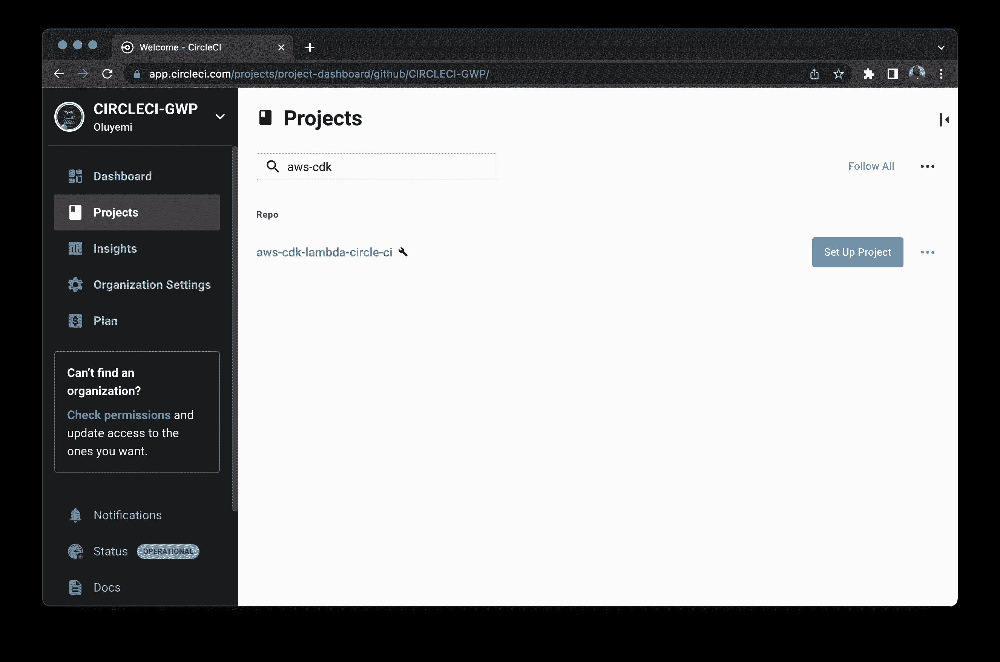
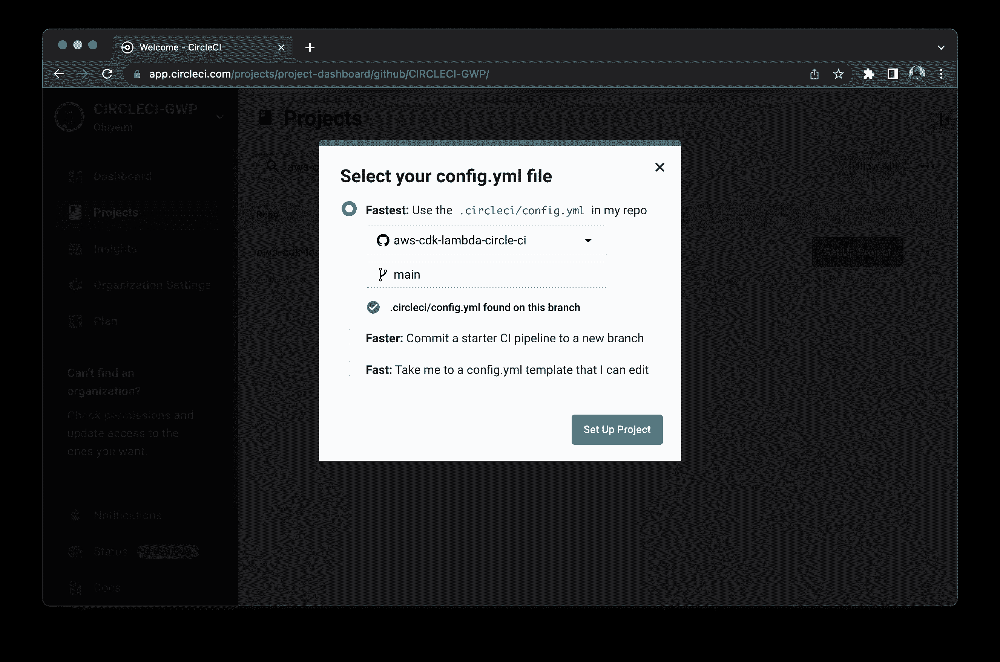
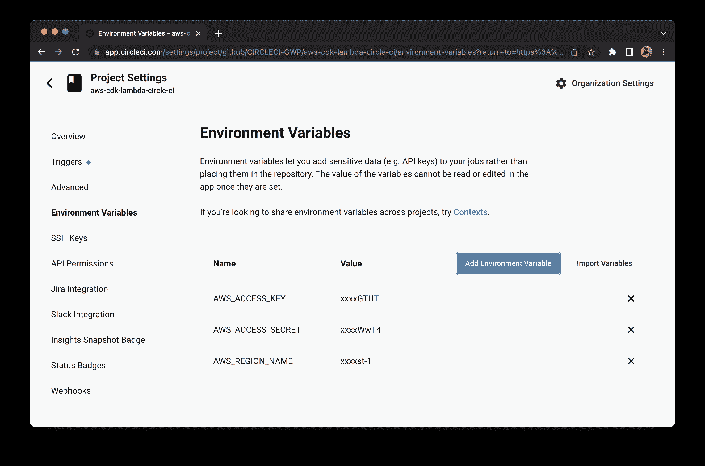
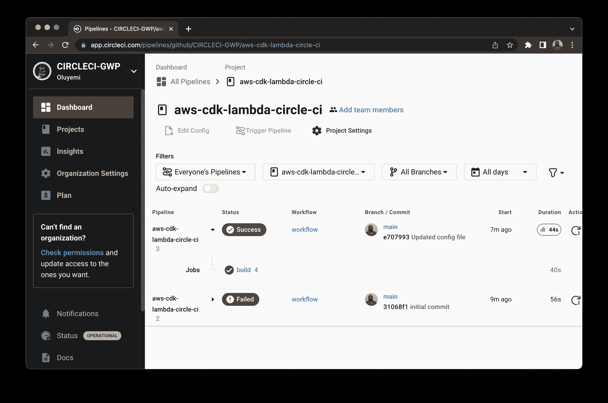

# 通过 AWS CDK | CircleCI 自动部署 AWS lambda 功能

> 原文：<https://circleci.com/blog/deploy-aws-lambda-cdk/>

> 本教程涵盖:
> 
> 1.  定义您的 AWS CDK 应用程序和 AWS Lambda 处理程序
> 2.  手动构建和部署 CDK 应用程序
> 3.  自动化部署

这是由两部分组成的系列教程的第一部分。您还可以学习如何使用 AWS CDK 来自动部署带有 Lambda 授权器的 REST APIs】。

当您构建基于云的应用程序时，您可以选择使用云提供商提供的 GUI(图形用户界面)或 CLI(命令行界面)来部署资源。这种方法在只有少量资源的情况下可以很好地工作，但是随着应用程序复杂性的增加，手动管理基础设施会变得很困难。

您可以使用像 Terraform 或 AWS CDK 这样的解决方案，让您以编程方式管理基础设施代码，而不是手动部署云资源。借助富有表现力的面向对象编程语言，AWS CDK 允许您使用现有的技能和工具来开发云基础设施，从而加快开发过程。使用 AWS CDK 消除了对上下文切换的需要，因为您可以使用相同的 IDE 和工具来定义基础结构代码和运行时代码。AWS CDK 还使您的代码与 git 工作流的集成更加容易，并允许您使用 [CI/CD 管道](https://circleci.com/blog/what-is-a-ci-cd-pipeline/)来自动化部署过程。

在本教程中，我将指导您使用 AWS 云开发工具包(CDK)来部署一个与 AWS S3 和 AWS DynamoDB 交互的 AWS Lambda 函数。

## 先决条件

对于本教程，您需要在系统上设置 Node.js 来定义您的 AWS CDK 应用程序和 AWS Lambda 处理程序。您还需要在您的系统上安装 AWS CLI 和 AWS CDK CLI，以便您可以配置 AWS 凭据并手动构建您的 CDK 应用程序。您将需要一个用于部署应用程序的 AWS 帐户和一个用于自动化部署的 CircleCI 帐户。

下面是跟随本教程所需的所有东西的列表:

> 我们的教程是平台无关的，但是使用 CircleCI 作为例子。如果你没有 CircleCI 账号，请在 注册一个免费的 [**。**](https://circleci.com/signup/)

## 创建新的 AWS CDK 项目

首先，为您的 CDK 项目创建一个新目录，并导航到其中。

```
mkdir aws-cdk-lambda-circle-ci
cd aws-cdk-lambda-circle-ci 
```

接下来，使用 CDK CLI 运行`cdk init`命令，这将使用 TypeScript 创建一个新的 CDK 项目。`app`参数指定初始化项目时使用的模板。

```
cdk init app --language typescript 
```

执行此命令会创建一个新的 CDK 项目，其中包含几个文件。在本教程的后面，我将解释其中一些文件的重要性以及它们中定义的结构。

**注意:** *CDK 支持 TypeScript、Python、Java、C#等多种语言。你可以选择使用任何你觉得舒服的语言。*

## 添加 NodeJS Lambda 函数

在本节中，您将使用 Node.js 定义一个 AWS Lambda 函数。Lambda 函数演示了如何将 CSV 文件保存到 AWS S3 并向 DynamoDB 表中添加一个条目。

首先，在 CDK 项目的根目录下创建一个`lambda`目录。在`lambda`目录中，添加一个用于 lambda 处理程序的`index.js`文件和一个用于定义依赖关系的`package.json`文件。

在`package.json`文件中，定义 NodeJS 项目的名称，并添加一些将被我们的处理程序使用的依赖项。以下是该文件应该包含的内容:

```
{
    "name": "ddb-s3-lambda-function",
    "version": "0.1.0",
    "dependencies": {
        "csv-stringify": "^6.0.5",
        "fs": "0.0.1-security",
        "uuid": "^8.3.2"
    }
} 
```

添加完依赖项后，运行`lambda`目录中的`npm install`命令来安装软件包。

接下来，在`index.js`文件中，定义一个空函数。在本教程的后面部分，您将实现这个函数。

```
exports.handler = async function (event) {

} 
```

现在，您可以开始实施了。创建一个包含虚拟数据的 CSV 文件，并将其保存为临时文件。将这段代码添加到您之前创建的`index.js`文件的底部:

```
// add imports at the top of the file
var fs = require('fs');
const {stringify} = require('csv-stringify');

function writeCsvToFileAndUpload(filePath, objectKey) {
    var data = getCsvData();
    var output = stringify(data);

    fs.writeFileSync(filePath, output);
    // we will add the uploadFile method later
    uploadFile(filePath, objectKey);
}

function getCsvData() {
    // return some CSV data
    return [
      ['1', '2', '3', '4'],
      ['a', 'b', 'c', 'd']
    ];
} 
```

接下来，在`index.js`文件中定义另一个函数，它采用本地文件路径和 S3 对象路径，并将文件上传到 AWS S3。

```
// add imports at the top of the file
const AWS = require('aws-sdk');
AWS.config.update({ region: 'us-west-2' });

const s3 = new AWS.S3();
const BUCKET_NAME = process.env.BUCKET_NAME

const uploadFile = (fileName, objectKey) => {
    // Read content from the file
    const fileContent = fs.readFileSync(fileName);

    // Setting up S3 upload parameters
    const params = {
        Bucket: BUCKET_NAME,
        Key: objectKey,
        Body: fileContent
    };

    // Uploading files to the bucket
    s3.upload(params, function (err, data) {
        if (err) {
            throw err;
        }
        console.log(`File uploaded successfully. ${data.Location}`);
    });
    return objectKey;
}; 
```

该函数读取本地文件的内容，并使用`AWS.S3` SDK 的`upload`函数上传文件。

最后，添加您在`index.js`文件中创建的空 AWS Lambda 处理程序的实现。Lambda 处理程序在其事件参数中接收`jobId`。处理程序首先将 CSV 文件上传到 AWS S3，然后用`jobId`和上传对象的 S3 路径更新 DynamoDB 表。

```
//add import at the top of the file
const { v4: uuidv4 } = require('uuid');

var ddb = new AWS.DynamoDB();
const TABLE_NAME = process.env.TABLE_NAME

exports.handler = async function (event) {
    try {
        const uploadedObjectKey = generateDataAndUploadToS3()
        const jobId = event['jobId']
        var params = {
            TableName: TABLE_NAME,
            Item: {
                'jobId': { S: jobId },
                'reportFileName': { S: uploadedObjectKey }
            }
        };

        // Call DynamoDB to add the item to the table
        await ddb.putItem(params).promise();;
        return {
            "status": "success",
            "jobId": jobId,
            "objectKey": uploadedObjectKey
        }
    } catch (error) {
        throw Error(`Error in backend: ${error}`)
    }
}

const generateDataAndUploadToS3 = () => {
    var filePath = '/tmp/test_user_data.csv'
    const objectKey = `${uuidv4()}.csv`;
    writeCsvToFileAndUpload(filePath, objectKey)
    return objectKey
} 
```

处理程序使用`AWS.DynamoDB` SDK 的`putItem`方法在 DynamoDB 表中插入一个新项目。

## 为应用程序定义 CDK 结构

现在您已经定义了 AWS Lambda 处理程序，您可以定义将在您的应用程序中使用的所有 CDK 构造。AWS CDK 构造是云组件，封装了配置细节和使用一个或多个 AWS 服务的粘合逻辑。CDK 为最常用的 AWS 服务提供了一个构造库。

使用`app`模板生成 CDK 项目会创建`lib/aws-cdk-lambda-circle-ci-stack.ts`文件。这个文件包含了`AwsCdkLambdaCircleCiStack`类。使用此文件定义 CDK 构件。

```
//  The snippet shows the original contents for reference. You do not need to replace the file contents.
import { Stack, StackProps } from 'aws-cdk-lib';
import { Construct } from 'constructs';

export class AwsCdkLambdaCircleCiStack extends Stack {
  constructor(scope: Construct, id: string, props?: StackProps) {
    super(scope, id, props);

    // we will add all the constructs here
  }
} 
```

接下来，检查您的应用程序需要什么。这些任务将在本教程的下一节中描述。

*   创建一个 AWS S3 存储桶来保存由 AWS Lambda 函数上传的 CSV 文件。
*   创建一个 DynamoDB 表，其中的`jobId`和对象键将由 AWS Lambda 函数更新。
*   定义一个将使用 S3 和 DymamoDB 表的 AWS Lambda 函数。确保 AWS Lambda 函数将`BUCKET_NAME`和`TABLE_NAME`作为参数。
*   确保 AWS Lambda 函数有足够的权限对 S3 存储桶和 DymamoDB 表执行操作。

### 定义 AWS S3 时段

要定义一个 AWS S3 桶，需要添加一个 CDK 构造，在`lib/aws-cdk-lambda-circle-ci-stack.ts`文件中定义的`constructor`内创建一个 AWS S3 桶。AWS S3 时段名称在所有 AWS 帐户中都是唯一的，因此您需要为您的时段提供一个唯一的名称。

```
import { Stack, 
  StackProps,
  //update the existing import to add aws_s3
  aws_s3 as s3
 } from 'aws-cdk-lib';

constructor(scope: Construct, id: string, props?: StackProps) {
  super(scope, id, props);

  // we will add all the constructs here
  // provide a unique name for your S3 bucket
  const circleCiGwpBucket = new s3.Bucket(this, "circle-ci-gwp-bucket", {
    bucketName: "<YOUR_BUCKET_NAME>",
  });
} 
```

此时，如果您尝试部署堆栈，它将简单地部署一个 CloudFormation 应用程序，并为您创建一个 AWS S3 存储桶。

### 定义一个 DynamoDB 表

要定义 DynamoDB 表，添加一个 CDK 构造，在`lib/aws-cdk-lambda-circle-ci-stack.ts`文件中定义的`constructor`内创建一个 DynamoDB 表。

```
import {
  Stack,
  StackProps,
  aws_s3 as s3,
  //update the existing import to add aws_dynamodb
  aws_dynamodb as dynamodb
} from 'aws-cdk-lib';

constructor(scope: Construct, id: string, props?: StackProps) {
  // other code //
  //add the following construct after the existing code in the constructor
  const circleCiGwpTable = new dynamodb.Table(this, "CircleCIGwpTable", {
    tableName: "CircleCIGwpTable",
    partitionKey: { name: "jobId", type: dynamodb.AttributeType.STRING },
  });
} 
```

表名在您的 AWS 帐户中必须是唯一的。如果您的 AWS 帐户中已经有一个名为`CircleCIGwpTable`的表，那么在定义 DynamoDB 构造时更新`tableName`。

注意，您已经将`jobId`定义为表的[主分区键](https://docs.aws.amazon.com/amazondynamodb/latest/developerguide/HowItWorks.CoreComponents.html#HowItWorks.CoreComponents.PrimaryKey)。这将确保`jobId`值在表中是唯一的。

### 定义 AWS Lambda 函数

要定义一个 AWS Lambda 函数，添加一个 CDK 构造，在`lib/aws-cdk-lambda-circle-ci-stack.ts`文件中定义的`constructor`内创建一个 AWS Lambda 函数。AWS Lambda 函数将使用 NodeJS 运行时，并将使用我们在`lambda`目录中定义的代码。此外，S3 桶名称和 DynamoDB 表名称将作为环境变量传递给该函数。

```
import {
  Stack,
  StackProps,
  aws_s3 as s3,
  aws_dynamodb as dynamodb,
  //update the existing import to add aws_lambda and Duration
  aws_lambda as lambda,
  Duration
} from 'aws-cdk-lib';

constructor(scope: Construct, id: string, props?: StackProps) {
  // other code //
  //add the following construct after the existing code in the constructor
  const circleCiGwpLambda = new lambda.Function(
    this,
    "CircleCiGwpLambda",
    {
      runtime: lambda.Runtime.NODEJS_14_X,
      handler: "index.handler",
      timeout: Duration.seconds(30),
      code: lambda.Code.fromAsset("lambda/"),
      environment: {
        TABLE_NAME: circleCiGwpTable.tableName,
        BUCKET_NAME: circleCiGwpBucket.bucketName
      },
    }
  );
} 
```

这个代码片段指定 AWS Lambda 函数的超时是 30 秒。Lambda 函数的最长执行时间可达 15 分钟。

### 授予 AWS Lambda 函数权限

最后，授予 AWS Lambda 函数足够的权限。Lambda 函数需要对 S3 对象的`putObject`权限。通过在`lib/aws-cdk-lambda-circle-ci-stack.ts`的构造函数中的现有代码后添加以下构造来授予这些权限:

```
circleCiGwpBucket.grantPut(circleCiGwpLambda); 
```

Lambda 函数还需要对 DynamoDB 表的读/写权限。在`lib/aws-cdk-lambda-circle-ci-stack.ts`的构造函数中的现有代码后添加以下构造:

```
circleCiGwpTable.grantReadWriteData(circleCiGwpLambda); 
```

您可以使用 [AWS CDK IAM 模块](https://docs.aws.amazon.com/cdk/api/v1/docs/aws-iam-readme.html)定义更复杂的 IAM 策略。

## 部署 CDK 堆栈

现在，您已经在堆栈中定义了 CDK 构造，您可以将应用程序部署到 AWS 帐户。首先手动部署项目，确保一切正常。然后，一旦您验证了它的功能，您就可以使用 CircleCI 自动化部署。

在第一次部署项目之前，您需要使用`cdk` CLI 引导项目。应用程序的引导提供了 AWS CDK 部署应用程序可能需要的资源。这些资源可能包括用于存储部署相关文件的 S3 存储桶和用于授予部署权限的 IAM 角色。从项目的根目录发出以下命令:

```
cdk bootstrap 
```

确保您在系统上配置了 AWS 凭据。如果配置了凭据，CDK 将自动使用它。

接下来，将应用程序部署到 AWS 帐户。

```
cdk deploy 
```

执行该命令后，可能会提示您确认将应用于您的帐户的 IAM 角色/策略更改。如果您的应用程序设置正确，并且您的系统具备所有的先决条件，那么部署应该会成功。

## 使用 CircleCI 自动部署应用程序

现在您已经使用命令行手动部署了 CDK 应用程序，您可以自动化工作流了。自动化工作流意味着，每当您将代码推送到主分支时，基础结构的变更可以被自动打包和部署。您需要完成以下任务:

*   更新`.gitignore`
*   更新 NPM 脚本
*   添加配置脚本
*   创建 CircleCI 项目
*   设置环境变量

### 更新。gitignore

由`cdk init`命令生成的代码包含一个默认忽略所有`.js`文件的`.gitignore`文件。用以下代码片段替换`.gitignore`的内容:

```
!jest.config.js
*.d.ts
node_modules

# CDK asset staging directory
.cdk.staging
cdk.out 
```

### 更新 NPM 脚本

CircleCI 部署配置使用 NPM 脚本来执行`deploy`和`diff`命令。将这些脚本添加到根级`package.json`文件中:

```
// update the aws-cdk-lambda-circle-ci/package.json file with the following scripts
{
  ... 
  "scripts": {
    ...
    // add the ci_diff and ci_deploy scripts
    "ci_diff": "cdk diff -c env=${ENV:-stg} 2>&1 | sed -r 's/\\x1B\\[([0-9]{1,2}(;[0-9]{1,2})?)?[mGK]//g' || true",
    "ci_deploy": "cdk deploy -c env=${ENV:-stg} --require-approval never"
  },
  ...
} 
```

### 添加配置脚本

首先，在包含 CI 管道配置文件的项目根目录中添加一个`.circleci/config.yml`脚本。将以下代码片段添加到其中:

```
version: 2.1

orbs:
  aws-cli: circleci/aws-cli@2.0.6
executors:
  default:
    docker:
      - image: 'cimg/node:14.18.2'
    environment:
      AWS_REGION: 'us-west-2'
jobs:
  build:
    executor: 'default'
    steps:
      - aws-cli/setup:
          aws-access-key-id: AWS_ACCESS_KEY
          aws-secret-access-key: AWS_ACCESS_SECRET
          aws-region: AWS_REGION_NAME
      - checkout
      - run:
          name: 'install_lambda_packages'
          command: |
            cd lambda/authorizer && npm install
            cd ../../
            cd lambda/processJob && npm install
            cd ../../
      - run:
          name: 'build'
          command: |
            npm install
            npm run build
      - run:
          name: 'cdk_diff'
          command: |
            if [ -n "$CIRCLE_PULL_REQUEST" ]; then
              export ENV=stg
              if [ "${CIRCLE_BRANCH}" == "develop" ]; then
                export ENV=prd
              fi 
              pr_number=${CIRCLE_PULL_REQUEST##*/}
              block='```'
              diff=$(echo -e "cdk diff (env=${ENV})\n${block}\n$(npm run --silent ci_diff)\n${block}")
              data=$(jq -n --arg body "$diff" '{ body: $body }') # escape
              curl -X POST -H 'Content-Type:application/json' \
                -H 'Accept: application/vnd.github.v3+json' \
                -H "Authorization: token ${GITHUB_TOKEN}" \
                -d "$data" \
                "https://api.github.com/repos/${CIRCLE_PROJECT_USERNAME}/${CIRCLE_PROJECT_REPONAME}/issues/${pr_number}/comments"
            fi
      - run:
          name: 'cdk_deploy'
          command: |
            if [ "${CIRCLE_BRANCH}" == "main" ]; then
              ENV=prd npm run ci_deploy
            elif [ "${CIRCLE_BRANCH}" == "develop" ]; then
              ENV=stg npm run ci_deploy
            fi 
```

CI 脚本使用 [CircleCI 的 aws-cli orb](https://circleci.com/developer/orbs/orb/circleci/aws-cli) 来设置 aws 配置——访问密钥和密码。`build`作业有几个不同的步骤，安装软件包，计算`diff`，并部署变更。`cdk_diff`步骤只在拉请求时执行，并在 PR 上添加一个总结基础设施变更的注释。

`cdk_deploy`命令检查分支并仅在`prd`或`stg`环境中部署。`cdk_deploy`命令执行`package.json`文件中定义的`ci_deploy`脚本。

管道配置将负责构建、打包和部署 CDK 堆栈到指定的 AWS 帐户。提交更改并[将它们推送到 Github](https://circleci.com/blog/pushing-a-project-to-github/) 存储库。

**注意:** *一定要把`AWS_REGION`换成自己的地区，如果不一样的话。*

### 为应用程序创建一个 CircleCI 项目

接下来，使用 [CircleCI 控制台](https://app.circleci.com/)将存储库设置为 CircleCI 项目。在控制台的**项目**选项卡上，搜索 GitHub repo 名称。点击**为您的项目设置项目**。



系统将提示您手动添加新的配置文件或使用现有的配置文件。您已经将所需的配置文件推送到代码库，所以选择**最快**选项，并输入托管您的配置文件的分支的名称。点击**设置项目**继续。



完成设置将自动触发管道。管道将在第一次运行时失败，因为我们还没有定义环境变量。

### 设置环境变量

从项目仪表盘中点击**项目设置**，然后点击**环境变量**选项卡。点击**添加环境变量**。您应该已经创建了 AWS 访问密钥和密码，如本教程的先决条件中所述。将这些值分别作为`AWS_ACCESS_KEY`和`AWS_ACCESS_SECRET`相加。另外，将`AWS_REGION_NAME`的环境变量设置为您希望部署应用程序的地区。



配置好环境变量后，再次运行管道。这一次它应该会成功构建。



## 结论

本教程向您展示了 AWS CDK 如何简化基础设施相关代码的管理。借助 AWS CDK，您可以使用自己熟悉的语言为应用程序提供资源。AWS CDK 允许您在定义应用程序时使用逻辑语句和面向对象的技术。此外，AWS CDK 使用行业标准协议使基础设施代码可测试。

本教程向您展示了定义 AWS Lambda 函数的一个非常常见的用例，该函数具有与其他 AWS 服务交互的包依赖关系。我希望您同意用所有 AWS 服务定义堆栈并使用这里概述的步骤授予它细粒度的权限是多么简单。你可以在 GitHub 上查看本教程中使用的完整的[源代码](https://github.com/CIRCLECI-GWP/aws-cdk-lambda-circle-ci)。如果你想定义一个类似的堆栈，GitHub 项目也可以作为你的模板。

* * *

Vivek Kumar Maskara 是 JP 摩根的一名软件工程师。他喜欢写代码，开发应用程序，创建网站，并写关于他的经历的技术博客。他的简介和联系方式可以在[maskaravivek.com](https://www.maskaravivek.com/)找到。

[阅读更多 Vivek Maskara 的帖子](/blog/author/vivek-maskara/)