# 部署一个 dockerized。NET 核心应用到 Azure 容器实例| CircleCI

> 原文：<https://circleci.com/blog/deploy-dockerized-dotnet-core-to-azure/>

> 本教程涵盖:
> 
> 1.  对 ASP.NET 核心应用程序进行归档
> 2.  创建连续部署配置来构建和部署容器映像
> 3.  部署。NET 核心应用程序到 Azure 容器注册表

在本教程中，您将学习如何使用 Docker 构建一个定制的 ASP.NET 核心容器，并在 Azure Container Registry 上托管容器映像，Azure Container Registry 是微软拥有的一个平台，允许您在私有注册表中构建、存储和管理容器映像。

在本教程结束时，您将能够应用在此获得的知识，将 Microsoft Azure registry 上的容器映像与 web app 服务链接起来，并启动您的应用程序。您将了解如何确保由于对您的代码库所做的更改而构建的每个新容器图像将自动更新应用程序。

为此，我们将:

*   在[Azure Container Registry(ACR)](https://azure.microsoft.com/en-us/services/container-registry/#overview)上创建一个注册表来托管我们的容器映像，并获取访问密钥
*   为项目创建一个容器映像，并在本地构建和运行该容器
*   将 Docker 映像发布到创建的 Azure 容器注册中心
*   创建一个 Azure web 应用程序，并将其与发布的容器图像链接
*   启用连续部署，并创建一个配置文件，以便在 CircleCI 上构建和部署我们的容器映像
*   将项目推送到 GitHub，并与 CircleCI 连接
*   将容器映像部署到 Azure 容器注册中心

## 先决条件

本教程需要以下内容:

> 我们的教程是平台无关的，但是使用 CircleCI 作为例子。如果你没有 CircleCI 账号，请在 注册一个免费的 [**。**](https://circleci.com/signup/)

## 克隆演示项目

在本节中，您将从 GitHub 上的存储库中克隆本教程的演示项目。从终端运行:

```
git clone https://github.com/yemiwebby/docker-dotnet-api.git 
```

一旦该过程完成，您将把项目下载到一个`docker-dotnet-api`文件夹中。我们将继续建立一个容器注册中心来托管将为我们的项目生成的容器映像。

## 创建 Azure 容器注册表

Azure 容器注册表存储了该项目的图像。要创建它，请转到 Azure 门户主页，然后单击**创建资源。然后选择**集装箱>集装箱登记处**。**

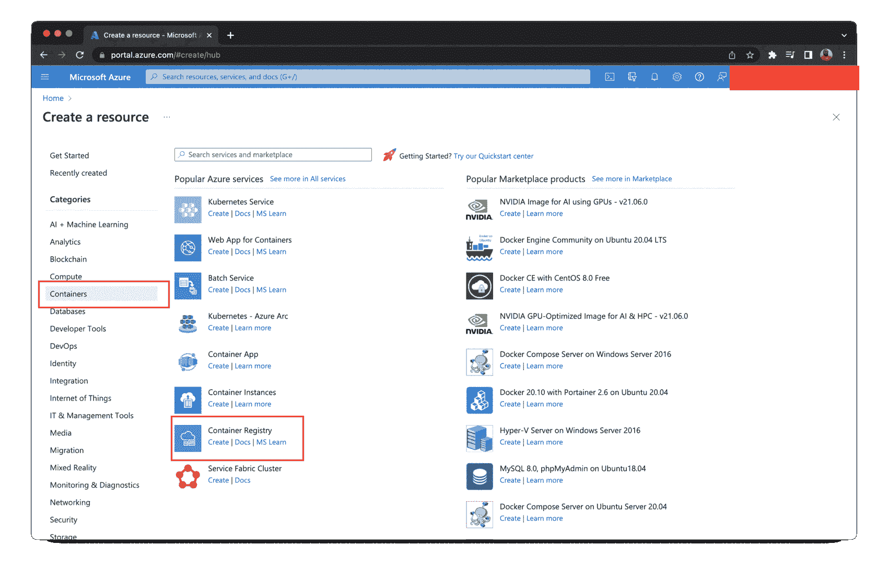

在注册表创建页面上，我使用了名称`dotnetcoreapi`。你可以使用任何你想要的名字；只是记得在你跟随教程的时候用它来代替我的。接下来，输入注册表所需的详细信息。

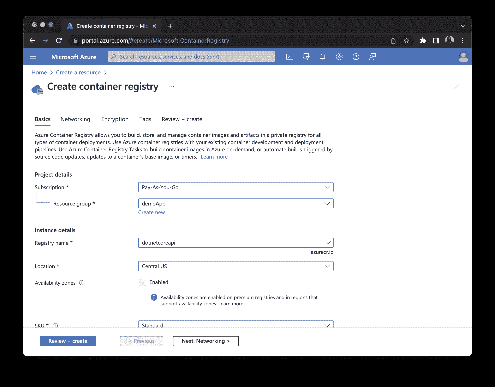

点击**审核+创建**。您将被重定向到可以查看注册表信息的页面。然后，点击**创建**来设置一个新的注册中心实例。

### 从注册表中获取访问密钥

在本节中，您将在 Azure 容器注册表中启用 Docker 访问。这对于部署过程至关重要，因为它允许您通过 CLI 远程登录 Azure container registry 并向其推送映像。

要启用 Docker 访问，打开注册表，进入**设置**部分，点击**访问键**。

这将显示注册表名称和登录服务器。使用切换按钮启用**管理员用户**。然后，复制用户名和任何密码，最好是第一个。请将它放在手边，因为在教程的后面会用到它。

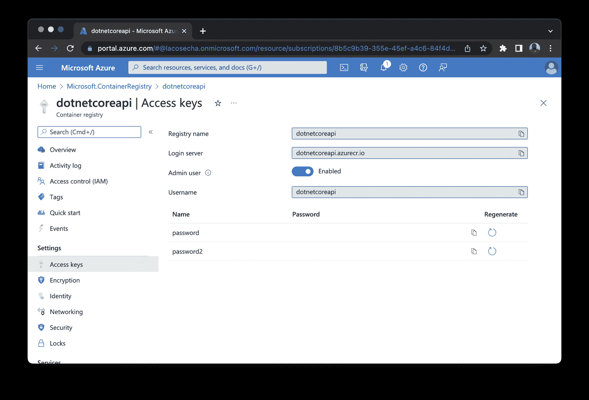

## 容器化应用程序

接下来，您将使用已经包含在克隆项目中的定制 Dockerfile 文件来构建一个容器映像。Dockerfile 具有安装所有项目依赖项、构建项目并运行它所需的命令。转到应用程序的根目录，打开 docker 文件，并确保它包含以下内容:

```
# Build Stage
FROM mcr.microsoft.com/dotnet/sdk:6.0 AS build
WORKDIR /src
COPY . ./
RUN dotnet restore
RUN dotnet publish -c Release -o out

# Serve Stage
FROM mcr.microsoft.com/dotnet/aspnet:6.0
WORKDIR /app
COPY --from=build /src/out .
ENTRYPOINT [ "dotnet", "docker-dotnet-api.dll" ] 
```

上面的文件中指定了两个不同的阶段:

*   `Build`采用[。NET SDK](https://hub.docker.com/_/microsoft-dotnet-sdk) 来安装任何需要的依赖项，并在将项目发布到名为`out`的文件夹之前编译项目。
*   `Serve`使用[ASP.NET 核心运行时映像](https://hub.docker.com/_/microsoft-dotnet-aspnet)从指定的工作目录运行应用程序，在本例中是`app`。

这有时被称为[多级 Dockerfile](https://docs.docker.com/develop/develop-images/multistage-build/) 。它将开发和生产指令合并到一个 Dockerfile 文件中，降低了流程的复杂性。

## 建立码头工人形象

在本节中，您将使用上一步中的注册表 URL 来构建项目的 Docker 映像。运行以下命令:

```
docker build -t dotnetcoreapi.azurecr.io/dotnet-api:latest . 
```

**注意:** *用您为注册表 URL 和登录服务器详细信息选择的名称替换`dotnetcoreapi.azurecr.io`和`dotnet-api`。*

基于应用程序和 Dockerfile 文件的内容，这个命令将构建容器映像。因为它使用了您之前创建的注册中心名称和登录服务器，所以它可以很容易地将容器映像映射到 Azure 容器注册中心。

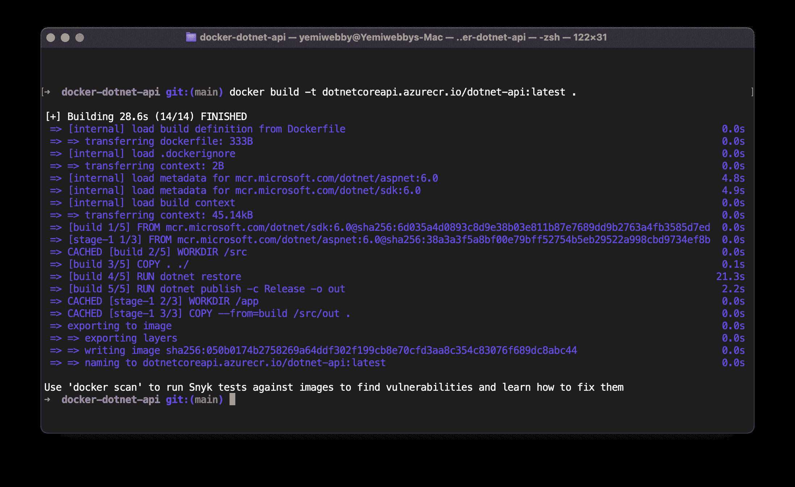

## 在本地运行 Docker 映像

现在您已经构建了本地版本的容器映像，通过运行以下命令确保它能够工作:

```
docker run -d -p 5001:80 dotnetcoreapi.azurecr.io/dotnet-api 
```

该命令在后台运行容器，将容器 ID 打印到终端，并在端口`5001`上运行应用程序。请访问`http://localhost:5001/api/weather`查看。

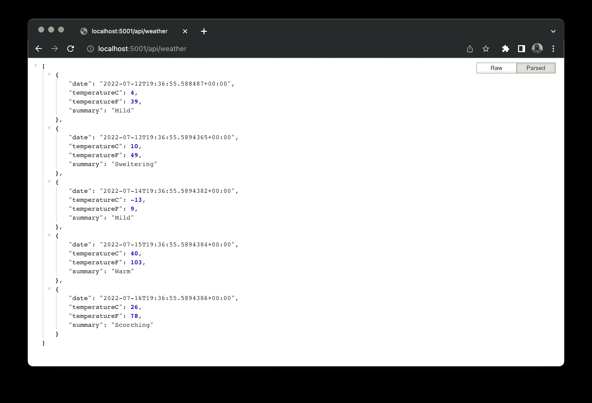

## 将 Docker 映像部署到 Azure 容器注册表

下一步是登录 Azure 容器注册中心，并将容器映像推送到注册中心。从终端运行:

```
docker login -u DOCKER_USER -p DOCKER_PASS dotnetcoreapi.azurecr.io 
```

如果需要，用您的注册表 URL 替换`dotnetcoreapi.azurecr.io`。然后，用适当的值替换以下占位符:

*   `DOCKER_USER`是容器注册表的用户名。
*   `DOCKER_PASS`是容器注册表的密码。

登录后，通过运行以下命令将映像推送到 Azure 注册表:

```
docker push dotnetcoreapi.azurecr.io/dotnet-api:latest 
```

该映像将被部署到 Azure registry。

## 为容器创建 web 应用服务

接下来，您需要创建一个 [Azure Web App](https://azure.microsoft.com/en-us/services/app-service/web/) ，并将其与容器映像连接。进入 Azure 门户主页，点击**创建资源**。

然后选择**Containers>Web App for Containers**来创建一个新的 Web App 服务实例。

您将被重定向到创建 Web 应用程序页面。选择 Azure 订阅和资源组。如果没有资源组，请创建一个新的资源组。确保选择了默认值`Docker container`。

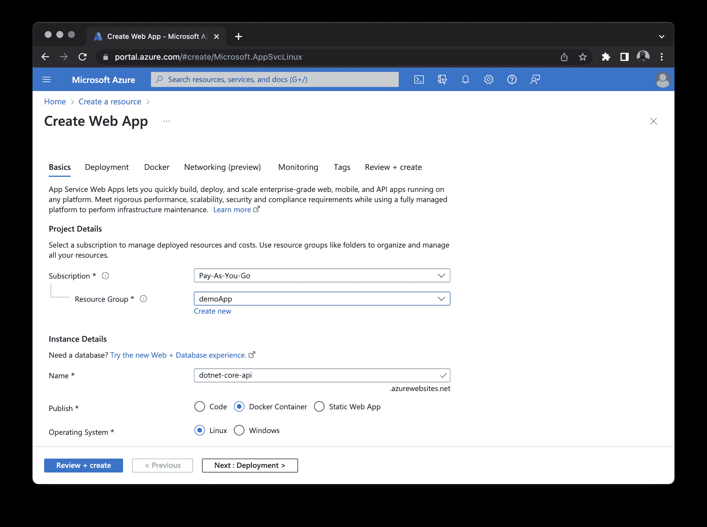

从 **Docker** 选项卡中，选择图像源及其 Docker 图像。

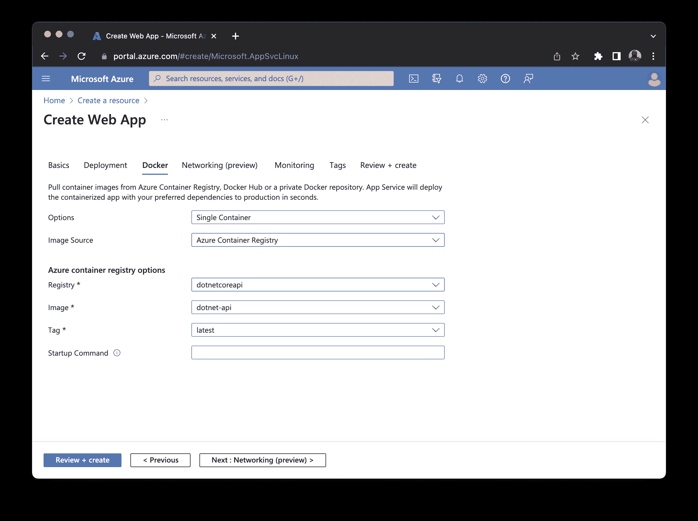

点击**审核+创建**。您将被重定向到一个页面，在该页面上您可以查看 web 应用程序的详细信息。点击**创建**来设置一个新的 Azure web 应用。

您可以访问 URL `https://dotnet-core-api.azurewebsites.net/api/weather`来查看部署到 Azure 的应用。

## 在 Azure 上设置连续部署

每次你的 Docker 图片更新时，你都想让应用程序接收更新。为了确保这一点，您需要为 web app 服务启用连续部署。

单击 web 应用程序名称，然后转到部署部分。点击**部署中心**，然后向下滚动设置选项卡。通过选择单选按钮来打开连续部署。点击**保存**。

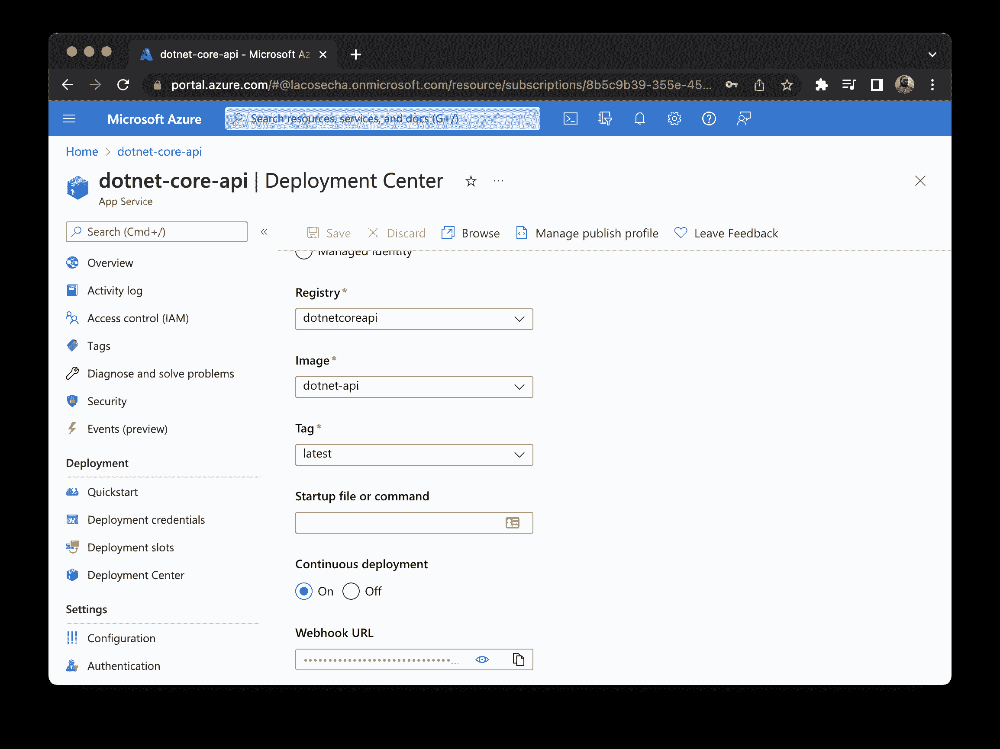

选择连续部署后，web 应用程序将触发的新部署。每次在 Azure Container Registry 上重新构建 Docker 映像时，都会调用. NET Core 应用程序。

## 使用 CircleCI 自动化部署

下一步是为 CircleCI 添加管道配置。该配置将自动测试并运行命令来构建容器映像并将其推送到 Azure 容器注册中心。

在项目的根目录下，打开`.circleci/config.yml`文件并用以下内容更新它:

```
version: 2.1
orbs:
  docker: circleci/docker@2.1.2
jobs:
  build-docker-image:
      executor:
        name: docker/docker
        tag: "3.6"
      steps:
        - checkout
        - docker/install-docker-tools
        - setup_remote_docker:
            docker_layer_caching: true
        - run:
            name: Build and push Docker image
            command: |
              docker build -t dotnetcoreapi.azurecr.io/dotnet-api:latest .
              docker login -u $DOCKER_USER -p $DOCKER_PASS dotnetcoreapi.azurecr.io
              docker push dotnetcoreapi.azurecr.io/dotnet-api:latest
workflows:
  build-and-deploy:
    jobs:
      - build-docker-image 
```

这些脚本从 CircleCI 中拉入 [Docker orb。他们使用它的执行器来安装 Docker 构建所需的工具，并将映像推送到 Azure 容器注册中心。](https://circleci.com/developer/orbs/orb/circleci/docker)

在 GitHub 上建立一个资源库，并将项目链接到 CircleCI。查看[将您的项目推送到 GitHub](https://circleci.com/blog/pushing-a-project-to-github/) 以获取指导。

## 与 CircleCI 连接

登录您的 CircleCI 帐户。如果你注册了你的 GitHub 账户，你所有的库都可以在你项目的仪表盘上看到。搜索`docker-dotnet-api`项目。

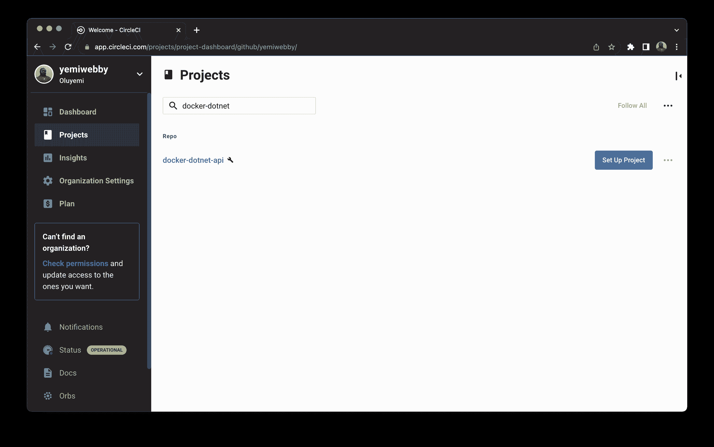

点击**设置项目**按钮。将提示您是否已经在项目中定义了 CircleCI 的配置文件。输入分支名称(对于本教程，我们使用`main`)。点击**设置项目**按钮完成该过程。

此构建将失败，因为它需要 Azure 容器注册表凭据，而您尚未添加它们。

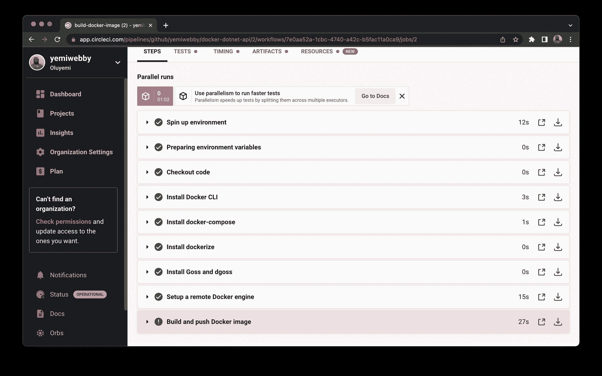

## 创建环境变量

要解决凭证问题，请单击**项目设置**按钮，然后单击**环境变量**。添加这两个新变量:

*   `DOCKER_USER`是容器注册表的用户名
*   `DOCKER_PASS`是容器注册表的密码。

点击**从开始**重新运行工作流程。

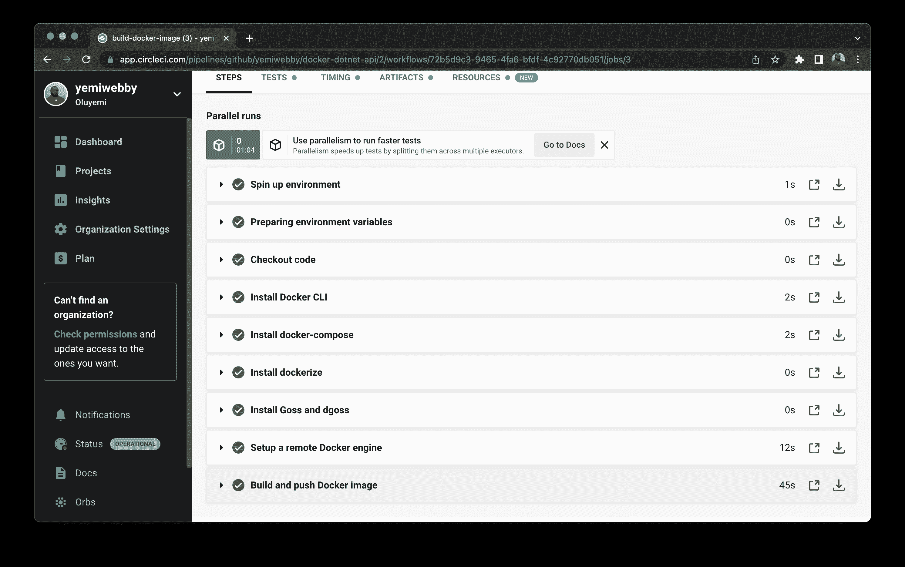

您的工作流将成功运行。您可以在本地对代码库进行一些更改，并将其推送到 GitHub，以进一步测试持续部署流程。

就是这样！

去网址查看直播 app: `https://dotnet-core-api.azurewebsites.net/api/weather`。

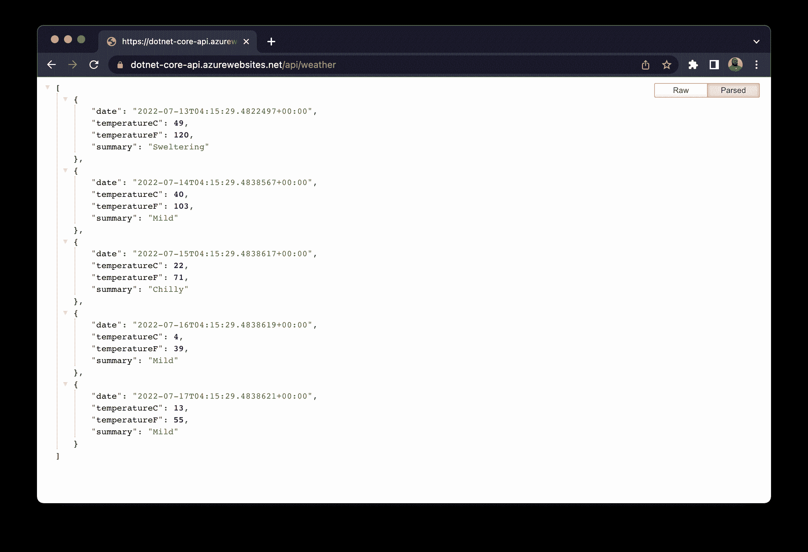

**注意:** *请注意，您在 Microsoft Azure 上的 URL 应该与上面显示的不同。*

## 结论

您刚刚学习了如何轻松地将 ASP.NET 核心应用程序 dockerize，将容器映像部署到 Microsoft Azure Container Registry，并在 web 服务上启动它。

有了 Azure web app 上启用的持续部署，你就可以确信，一旦你将新版本的容器映像推送到注册中心，应用就会一直自动更新。

我希望本教程对你有所帮助。访问[样例库](https://github.com/yemiwebby/docker-dotnet-api)获取该项目的完整源代码。

* * *

Oluyemi 是一名拥有电信工程背景的技术爱好者。出于对解决用户日常遇到的问题的浓厚兴趣，他冒险进入编程领域，并从那时起将他的问题解决技能用于构建 web 和移动软件。Oluyemi 是一名热衷于分享知识的全栈软件工程师，他在世界各地的几个博客上发表了大量技术文章和博客文章。作为技术专家，他的爱好包括尝试新的编程语言和框架。

[阅读更多 Olususi Oluyemi 的帖子](/blog/author/olususi-oluyemi/)