# 将 ASP.NET 核心应用程序自动部署到 Heroku | CircleCI

> 原文：<https://circleci.com/blog/deploy-dotnetcore-heroku/>

> 本教程涵盖:
> 
> 1.  设置示例 ASP.NET 核心项目
> 2.  在 Heroku 上创建应用程序
> 3.  配置您的 ASP.NET 部署管道

以其跨平台兼容性和优雅的结构而闻名，[ASP.NET 核心](https://dotnet.microsoft.com/learn/aspnet/what-is-aspnet-core)是微软为构建现代网络应用而创建的开源框架。有了它，开发团队可以构建[单一的 web 应用](https://en.wikipedia.org/wiki/Monolithic_application)和任意大小和复杂度的 RESTful APIs。

得益于 CircleCI 改进的基础设施以及对 Windows 平台和技术的支持，为 ASP.NET 核心应用程序设置自动化部署流程变得更加容易。

本文将指导您将 ASP.NET 核心应用程序自动部署到 Heroku。

## 先决条件

以下是您需要从本教程中获得最大收益的项目列表:

> 我们的教程是平台无关的，但是使用 CircleCI 作为例子。如果你没有 CircleCI 账号，请在 注册一个免费的 [**。**](https://circleci.com/signup/)

## 克隆和运行演示 ASP.NET 核心项目

首先，您将从 GitHub 克隆一个用 ASP.NET 核心 MVC 构建的简单应用程序。为此，请输入以下命令:

```
git clone https://github.com/yemiwebby/dotnet-heroku-starter.git dotnet-heroku-demo-app 
```

这会将 starter 应用程序下载到您的开发文件夹中名为`dotnet-heroku-demo-app`的文件夹中(或者您运行命令的位置)。

接下来，进入新克隆的应用程序并运行该应用程序:

```
// Move into the project folder
cd dotnet-heroku-demo-app

// run the application
dotnet watch run 
```

您可能会得到一个关于框架版本兼容性的错误。

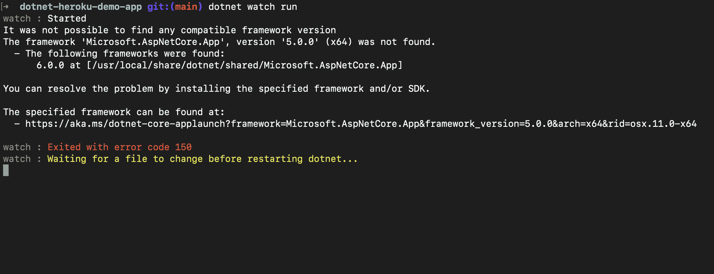

发生此错误的原因是，默认情况下，. NET framework 应用程序在生成它的版本上运行。演示应用程序是用 ASP.NET 核心版本`3.1`构建的。如果您运行的是不同的版本，将会出现该错误。通过运行以下命令，检查计算机上安装的当前版本:

```
dotnet --version 
```

如果输出的版本不是版本`3.1`，您可以通过编辑应用程序根目录中的`demoDotnet.csproj`文件来修复它。像这样更新:

```
<Project Sdk="Microsoft.NET.Sdk.Web">
  <PropertyGroup>
    <TargetFramework>netcoreapp5.0</TargetFramework>
  </PropertyGroup>
</Project> 
```

将`5.0`替换为之前在您的终端上显示的版本。如果你有一个类似于`a.b.c`的版本，你只需要在配置中添加`a.b`。完成后，用`dotnet watch run`再次运行项目。

导航至`http://localhost:5000`，打开默认主页。

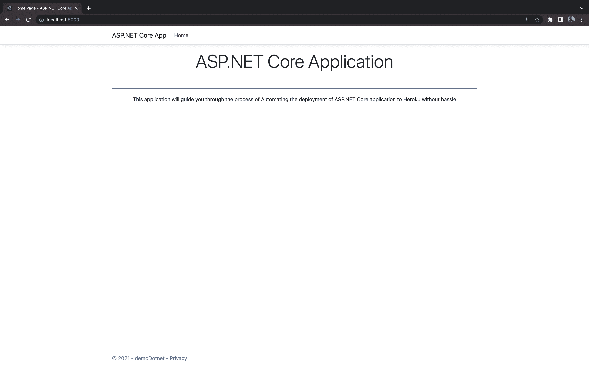

这里没发生什么事情。对 ASP.NET 核心应用程序默认主页上的内容做了一个小的修改。

现在，按下`CTRL + C`停止应用程序运行。

## 在 Heroku 上创建应用程序

接下来您需要做的是在 Heroku 上创建一个新的应用程序。新的应用程序将托管和运行我们的 ASP.NET 核心应用程序。前往 [Heroku 仪表盘](https://dashboard.heroku.com/login)开始。点击**新增**，然后点击**新增 App** 。在表单中填写您的应用程序和您所在地区的名称。

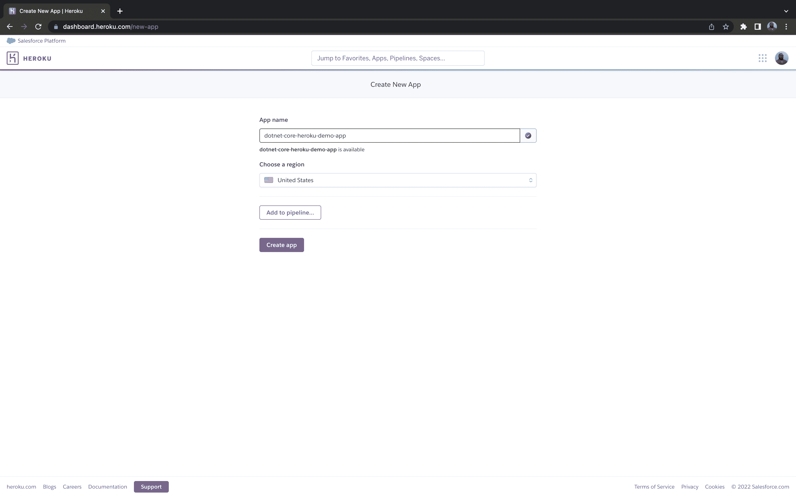

然后，点击**创建 app** 按钮。您将被重定向到新创建的应用程序的**部署**视图。

## 添加 ASP.NET 核心构建包

正如在 [Heroku Buildpacks](https://www.heroku.com/elements/buildpacks) 页面上所详述的，Buildpacks 扩展了 Heroku 的构建系统，以支持您选择的任何编程语言。构建包也使二进制包对运行时可用。

为了在 Heroku 上成功运行这个项目，您需要添加一个 buildpack。为此，点击**设置**选项卡。在**构建包**部分，点击**添加构建包**按钮。

这将打开一个表单，您可以在其中选择一个官方支持的构建包，或者为您的构建包提供一个 URL。目前，Heroku 还没有官方支持的 ASP.NET 核心构建包。没关系，您可以提供. NET 核心构建包的 URL。将`https://github.com/heroku-softtrends/heroku-buildpack-dotnetcore.git`粘贴到输入栏，点击**保存更改**。

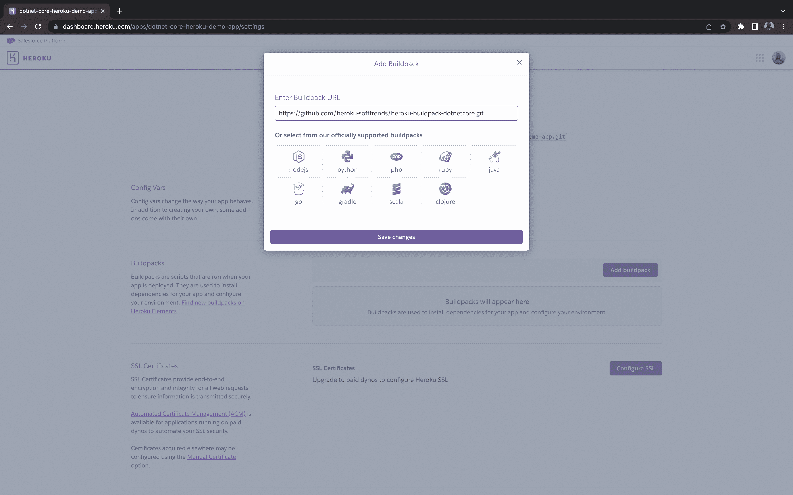

我们最不需要的就是 API 密钥。您将使用此密钥和应用程序名称将您的 ASP.NET 部署管道连接到 Heroku。要获取您的 API 密钥，请打开[帐户设置](https://dashboard.heroku.com/account)页面。

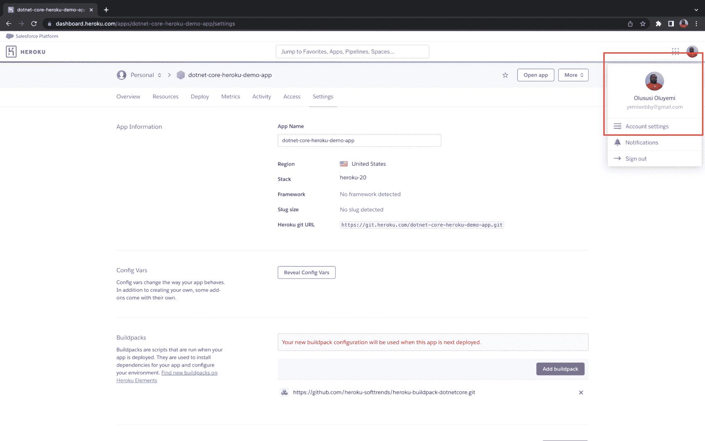

滚动到 **API 键**部分。

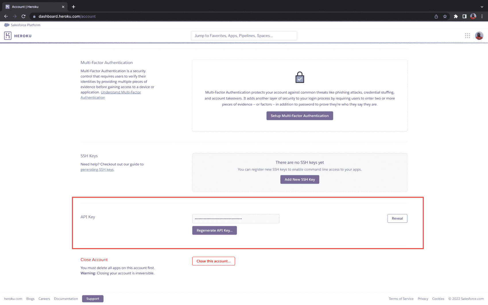

点击**显示**按钮，复制 API 密钥。将它保存在您以后可以轻松找到的地方。

## 添加 CircleCI 配置文件

接下来，我们需要为 CircleCI 添加 ASP.NET 部署管道配置。对于这个项目，管道将由安装项目的依赖项和为生产编译应用程序的步骤组成。

在项目的根目录下，创建一个名为`.circleci`的文件夹。在该文件夹中，创建一个名为`config.yml`的文件。在新创建的文件中，添加以下配置:

```
version: 2.1
orbs:
  heroku: circleci/heroku@1.2.6
  windows: circleci/windows@2.4.1
jobs:
  build:
    description: Build application with Release configuration
    executor:
      name: windows/default
    steps:
      - checkout
      - restore_cache:
          keys:
            - dotnet-packages-v1-{{ checksum "demoDotnet.csproj" }}
      - run:
          name: "Install project dependencies"
          command: dotnet.exe restore
      - run:
          name: "Build Application according to some given configuration"
          command: dotnet.exe build --configuration Release
workflows:
  heroku_deploy:
    jobs:
      - heroku/deploy-via-git 
```

这个配置引入了 Heroku orb `circleci/heroku`，它自动让我们访问一组强大的 Heroku 任务和命令。其中一个任务是`heroku/deploy-via-git`，它直接从你的 GitHub repo 将你的应用程序部署到你的 Heroku 账户。它还引入了 [Windows orb](https://circleci.com/developer/orbs/orb/circleci/windows) ，为您提供了构建 Windows 项目的工具，如通用 Windows 平台(UWP)应用程序、. NET 可执行文件或特定于 Windows 的项目(如。NET 框架)。

该配置指定了一个名为`build`的作业。它使用`windows/default`执行器，安装项目所需的所有依赖项，然后构建项目。

接下来，我们需要在 GitHub 上建立一个存储库，并将项目链接到 CircleCI。查看[将您的项目推送到 GitHub](https://circleci.com/blog/pushing-a-project-to-github/) 以获得逐步说明。

接下来，登录您的 CircleCI 帐户。如果你注册了你的 GitHub 账户，你所有的库都可以在你项目的仪表盘上看到。

点击**为您的`dotnet-heroku-demo-app`项目设置项目**。

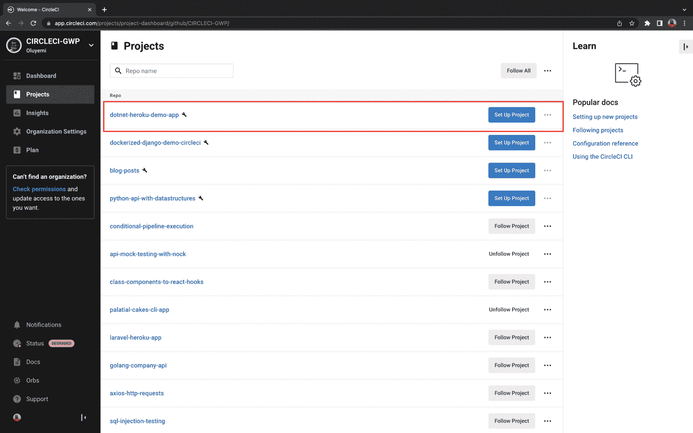

系统将提示您编写新的配置文件，或者在项目中使用现有的配置文件。选择现有选项。在 GitHub 上输入您的代码所在的分支的名称，然后点击**设置项目**按钮。

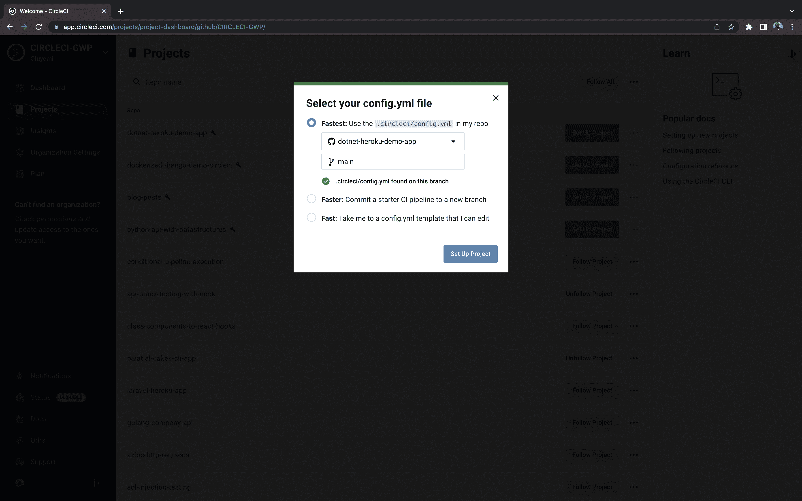

您的第一个工作流将开始运行，但会失败。

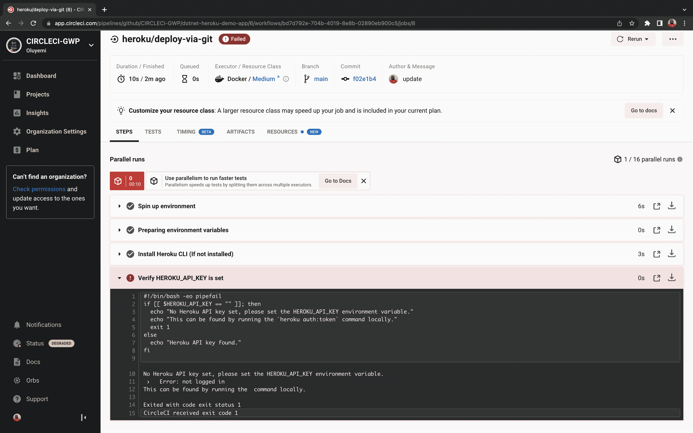

此部署过程失败，因为我们没有提供 Heroku API 密钥。我们现在可以解决这个问题。点击**项目设置**按钮，然后点击**环境变量**。添加这两个新变量:

*   `HEROKU_APP_NAME`是 Heroku ( `dotnet-core-heroku-demo-app`)中的应用名称
*   `HEROKU_API_KEY`是您从帐户设置页面获取的 Heroku API 密钥

从失败的中选择**重新运行工作流以重新运行 Heroku 部署。这一次，您的工作流将成功运行。**

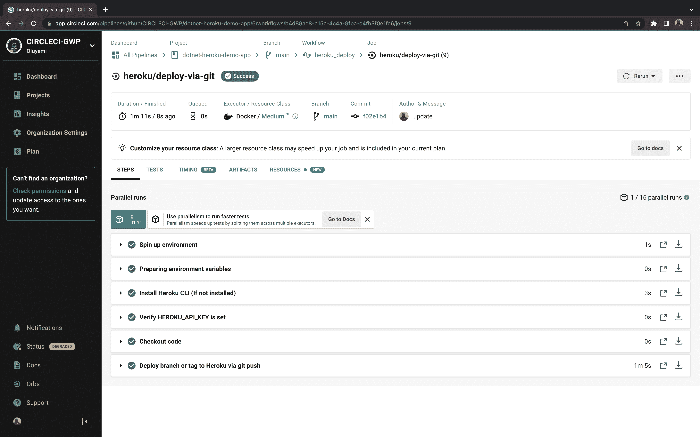

要确认工作流是否成功，您可以在浏览器中打开新部署的应用程序。您的应用程序的 URL 应该是这样的格式`https://<HEROKU_APP_NAME>.herokuapp.com/`

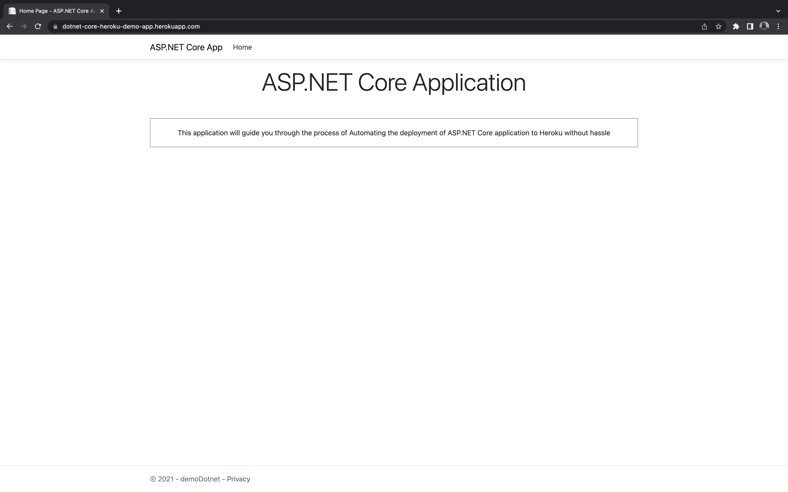

## 结论

在本教程中，我向您展示了如何轻松地将 ASP.NET 核心应用程序部署到 Heroku 平台。CircleCI 基础设施使使用现有工具快速处理部署变得容易，让您和您的团队有宝贵的时间专注于开发您的应用程序。

我希望本教程对你有所帮助。完整的源代码可以在 GitHub 上找到。

* * *

Oluyemi 是一名拥有电信工程背景的技术爱好者。出于对解决用户日常遇到的问题的浓厚兴趣，他冒险进入编程领域，并从那时起将他的问题解决技能用于构建 web 和移动软件。Oluyemi 是一名热衷于分享知识的全栈软件工程师，他在世界各地的几个博客上发表了大量技术文章和博客文章。作为技术专家，他的爱好包括尝试新的编程语言和框架。

[阅读更多 Olususi Oluyemi 的帖子](/blog/author/olususi-oluyemi/)