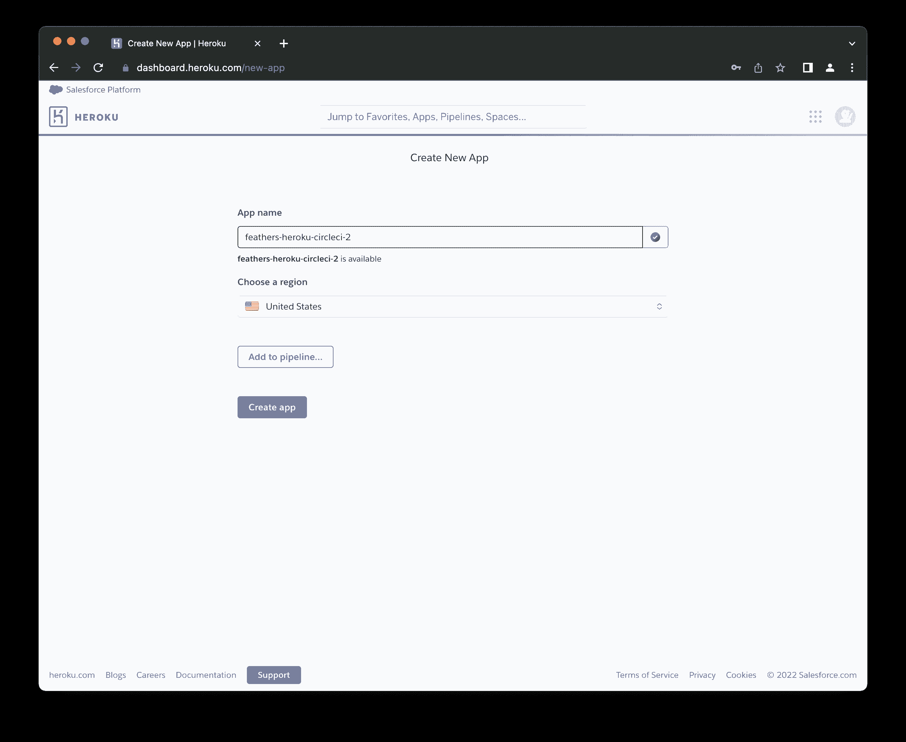

# 将 FeathersJS 应用程序自动部署到 Heroku | CircleCI

> 原文：<https://circleci.com/blog/deploy-feathersjs-heroku/>

> 本教程涵盖:
> 
> 1.  创建 FeathersJS API
> 2.  在 Heroku 上创建和设置项目
> 3.  自动部署到 Heroku

这是由两部分组成的系列之一。你还可以学习如何自动测试 FeathersJS 应用程序。

自动化不仅仅是构建解决方案来取代复杂或耗时的手动流程。正如流行的说法，“任何能够自动化的事情都应该自动化。”例如，将更新部署到应用程序可以而且应该是自动化的。在本教程中，我将向您展示如何设置一个 [FeathersJS](https://feathersjs.com/) 应用程序到 [Heroku](https://www.heroku.com/) 的免提部署。我将指导您实现一个持续部署(CD)管道，以便在推出更改时立即发布应用程序的更新。我们将使用的示例应用程序是一个管理测验问题的 API。它提供了创建、阅读、更新和删除测验问题的端点。

## 先决条件

开始之前，请确保您的系统上安装了以下项目:

*   10.0.0 的最低 [NodeJS](https://nodejs.org/en/) 版本
*   像 [NPM](https://www.npmjs.com/) 或[纱](https://classic.yarnpkg.com/en/)这样的最新的 JavaScript 包管理器
*   FeathersJS CLI

通过运行以下命令安装 FeathersJS CLI:

```
npm install -g @feathersjs/cli 
```

对于存储库管理和持续集成/持续部署，您需要:

> 我们的教程是平台无关的，但是使用 CircleCI 作为例子。如果你没有 CircleCI 账号，请在 注册一个免费的 [**。**](https://circleci.com/signup/)

## 为什么是费瑟斯和赫罗库？

FeathersJS 是一个轻量级 web 框架，用于使用 JavaScript 或 TypeScript 创建实时应用程序和 REST APIs。FeathersJS 工具集包括一个架构模式，它使得创建可伸缩的 REST APIs 和实时应用程序变得容易。您可以在几分钟内构建原型，在几天内构建生产就绪的应用。

Heroku 是一个平台即服务(PaaS ),使开发人员能够完全在云中构建、运行和操作应用程序。通过关注维护基于云的应用程序的更高要求方面，Heroku 允许开发人员专注于构建应用程序，而不是维护服务器。

## 入门指南

为项目创建新文件夹:

```
mkdir feathers_heroku

cd feathers_heroku 
```

接下来，使用 Feathers CLI `generate`命令生成一个新应用程序。

```
feathers generate app 
```

对于这个项目，我们将使用 JavaScript。还有，我们只想做一个 REST API。回答 CLI 中的问题，如下所示:

```
? Do you want to use JavaScript or TypeScript? JavaScript
? Project name feathers-heroku
? Description
? What folder should the source files live in? src
? Which package manager are you using (has to be installed globally)? npm
? What type of API are you making? REST
? Which testing framework do you prefer? Jest
? This app uses authentication No
? Which coding style do you want to use? ESLint 
```

在您做任何事情之前，更新索引页面，让访问者知道 API 正在构建中。在`public/index.html`中，向`main`元素添加一条“在建”消息:

```
<main class="container">
  <!--  Image declaration-->
  <h1 class="center-text">This API is under construction</h1>
  <!--  Footer declaration-->
</main> 
```

接下来，使用以下命令运行您的应用程序:

```
npm run dev 
```

默认情况下，应用程序运行在端口 3030。在您的浏览器中输入`http://localhost:3030/`即可访问。


## 配置 Heroku

下一步是在 Heroku 上创建一个新的应用程序。你可以从 Heroku [仪表盘](https://dashboard.heroku.com/new-app)上完成这项工作。点击**新建**，然后点击**新建 App。**如图所示填写表格。如果需要，您可以为应用程序使用不同的名称和地区。



点击**创建应用**按钮。然后，您将被重定向到新创建的应用程序的**部署**视图。

接下来，您需要添加一个构建包。点击**设置**选项卡。在**构建包**部分，点击**添加构建包**。


在打开的表单上，您可以选择一个官方支持的构建包，或者为您的构建包提供一个 URL。选择 **nodejs** 使用官方支持的 Heroku nodejs 构建包。点击**保存修改**。Node.js 将用于构建您的下一个部署。

您最不需要的就是 API 密钥。你要用这个把你的 CircleCI 管道连接到 Heroku。要获取 API 密钥，请打开[账户设置](https://dashboard.heroku.com/account)页面，向下滚动到 **API 密钥**部分。


点击**显示**按钮，复制显示的 API 密钥。

## 配置 CircleCI

接下来，我们需要为 CircleCI 添加管道配置。对于这个项目，管道将由两个步骤组成:

1.  **打造**。在这里，我们构建项目并安装项目依赖项。理想情况下，我们应该在这个阶段运行项目测试。然而，为了保持本教程的合理长度，我们将跳过测试。
2.  部署到 Heroku 。如果构建阶段成功完成，您可以将最新的更改部署到 Heroku。

在项目的根目录下，创建一个名为`.circleci`的文件夹。在其中，创建一个名为`config.yml`的文件。在新创建的文件中，添加以下配置:

```
# Use the latest 2.1 version of CircleCI pipeline process engine.
version: 2.1

orbs:
  heroku: circleci/heroku@1.2.6
  node: circleci/node@4.7.0

jobs:
  build:
    executor: node/default
    steps:
      - checkout
      - node/install-packages:
          cache-path: ~/project/node_modules
          override-ci-command: npm install

workflows:
  sample:
    jobs:
      - build
      - heroku/deploy-via-git:
          force: true # this parameter instructs the push to use a force flag when pushing to the heroku remote, see: https://devcenter.heroku.com/articles/git
          requires:
            - build 
```

这种配置吸引了 Heroku orb `circleci/heroku`。这个球体给你提供了一套强大的 Heroku 任务和命令。其中一个任务是`heroku/deploy-via-git`，直接从 GitHub repo 将您的应用程序部署到您的 Heroku 帐户。该配置使用 Node.js orb `circleci/node`，它允许您在默认启用缓存的情况下安装包。

在配置中还指定了一个名为`build`的任务，它检查最新的代码并安装在`package.json`文件中指定的包。

最后，有一个工作流运行`build`作业，然后是`heroku/deploy-via-git`作业。注意，有一个`requires`选项告诉 CircleCI 只有在构建工作完成后才运行`deploy-via-git`。

接下来，在 GitHub 上建立一个存储库，并将项目链接到 CircleCI。看到这个帖子寻求帮助:[把你的项目推到 GitHub](https://circleci.com/blog/pushing-a-project-to-github/) 。

登录您的 CircleCI 帐户。如果你注册了你的 GitHub 账户，你所有的库都会显示在你项目的仪表盘上。

在您的`feathers_heroku`项目旁边，点击**设置项目**。

CircleCI 检测项目中的`config.yml`文件。点击**使用现有配置**，然后**开始建造**。您的第一个工作流将开始运行，但是，它将失败！这是可以预料的。


部署过程失败，因为您没有提供 Heroku API 密钥。现在就去解决它。点击**项目设置**按钮，然后点击**环境变量**。添加两个新变量如下:

*   `HEROKU_APP_NAME`变量是 Heroku ( `deno-heroku-circleci`)中的 app 名称。
*   `HEROKU_API_KEY`变量是您从帐户设置页面检索的 Heroku API 密钥。

选择**从失败的**选项重新运行工作流，以重新运行 Heroku 部署。要确认工作流是否成功，您可以在浏览器中打开新部署的应用程序。应用程序的 URL 应该是这样的格式:`https://<HEROKU_APP_NAME>.herokuapp.com/`。

你将会看到你正在建设的索引页面。

## 实现`questions`服务

是时候添加功能来处理我们的 API 上的问题了。对于本教程，问题将包含这些属性的字段:

*   困难
*   问题
*   回答正确

创建问题时，默认情况下会分配一个唯一的主键。

使用以下命令创建数据库支持的服务:

```
feathers generate service 
```

对于这项服务，使用`NeDB`，只需按**回车**即可确认。使用`Questions`作为服务名，并用默认值确认所有其他提示。只需按下**回车**:

```
 ? What kind of service is it? NeDB
  ? What is the name of the service? Questions
  ? Which path should the service be registered on? /questions
  ? What is the database connection string? nedb://../data 
```

有了这个命令，FeathersJS 就为您的问题提供了 CRUD 操作所需的一切。此时，您已经有了一个包含这些端点的 API:

*   `GET /questions`逐页列出所有问题。
*   `POST /questions`创建一个新问题。
*   `GET questions/123`返回 id 为 123 的问题的详细信息。您还可以在这个请求中包含查询:`questions/123?difficulty=medium`。
*   `PATCH /questions/123`和`PUT /questions/123`用 id 123 更新问题的细节。
*   `DELETE /questions/123`删除 id 为 123 的问题。

您可以为您的应用程序提供服务，并向任何端点发出请求。对于本教程，在使用新的 API 之前，先植入数据库并覆盖一些默认功能。

当您收到添加问题的请求时，您希望在将请求保存到数据库之前，只从请求中检索前面指定的三个值。通过覆盖`create`服务方法来实现。打开`src/services/questions/questions.class.js`并对其进行编辑以匹配以下代码:

```
// src/services/questions/questions.class.js
const { Service } = require("feathers-nedb");

exports.Questions = class Questions extends Service {
  create(data, params) {
    const { question, correctAnswer, difficulty } = data;
    const quizData = { question, correctAnswer, difficulty };
    return super.create(quizData, params);
  }
}; 
```

接下来，创建一个播种器，为您提供一些示例问题。在`src/services/questions`目录中，创建一个名为`questions.seed.js`的新文件。将此代码添加到新创建的文件中:

```
// src/services/questions/questions.seed.js
exports.seedQuestions = [
  {
    difficulty: "medium",
    question: "The HTML5 standard was published in 2014.",
    correctAnswer: "True",
  },
  {
    difficulty: "medium",
    question:
      "Which computer hardware device provides an interface for all other connected devices to communicate?",
    correctAnswer: "Motherboard",
  },
  {
    difficulty: "medium",
    question: "On which day did the World Wide Web go online?",
    correctAnswer: "December 20, 1990",
  },
  {
    difficulty: "medium",
    question: "What is the main CPU is the Sega Mega Drive / Sega Genesis?",
    correctAnswer: "Motorola 68000",
  },
  {
    difficulty: "medium",
    question: "Android versions are named in alphabetical order.",
    correctAnswer: "True",
  },
  {
    difficulty: "medium",
    question:
      "What was the first Android version specifically optimized for tablets?",
    correctAnswer: "Honeycomb",
  },
  {
    difficulty: "medium",
    question:
      "Which programming language shares its name with an island in Indonesia?",
    correctAnswer: "Java",
  },
  {
    difficulty: "medium",
    question: "What does RAID stand for?",
    correctAnswer: "Redundant Array of Independent Disks",
  },
  {
    difficulty: "medium",
    question:
      "Which of the following computer components can be built using only NAND gates?",
    correctAnswer: "ALU",
  },
  {
    difficulty: "medium",
    question:
      "What was the name of the security vulnerability found in Bash in 2014?",
    correctAnswer: "Shellshock",
  },
]; 
```

接下来，打开`src/services/questions/questions.service.js`并编辑它以匹配以下代码:

```
// src/services/questions/questions.service.js
// Initializes the `Questions` service on path `/questions`
const { Questions } = require("./questions.class");
const createModel = require("../../models/questions.model");
const hooks = require("./questions.hooks");
const { seedQuestions } = require("./questions.seed");

module.exports = async function (app) {
  const options = {
    Model: createModel(app),
    paginate: app.get("paginate"),
  };

  // Initialize our service with any options it requires
  app.use("/questions", new Questions(options, app));

  // Get our initialized service so that we can register hooks
  const service = app.service("questions");

  //get the total number of questions in the database
  const { total: totalQuestions } = await service.find({
    query: {
      $limit: 0,
    },
  });

  //seed the database if there are no questions saved
  if (totalQuestions === 0) {
    await seedQuestions.forEach((question) => {
      service.create(question);
    });
  }

  service.hooks(hooks);
}; 
```

请注意，该代码片段中的代码首先检查数据库中的问题数量，只有当没有问题时才播种。这可以防止种子程序在每次启动本地服务器时运行。

## 使用 Postman 测试 FeathersJS API

现在你可以用 Postman 来测试你的 API 了。

向`http://localhost:3030/questions`发送一个`POST`请求。


向`http://localhost:3030/questions`发送`GET`请求以检索问题列表。


整洁！最后，用最新的代码更新 git 存储库。不要忘记从索引页中删除“正在建设中”的消息。

```
git add .

git commit -m "Implement CRUD functionality for questions"

git push origin main 
```

您的 CircleCI 构建再次运行，完成后，您的 Heroku 应用程序将更新为最新代码。干得好！

## 结论

在本教程中，我向您展示了如何使用 GitHub、CircleCI 和 Heroku 为 FeathersJS API 设置 CI/CD 管道。

通过自动化发布新特性的过程，生产环境中的人为错误风险大大降低。产品还增加了一定程度的质量保证，因为只有当新特性的行为符合预期时，才会部署新特性。也就是说，只有当他们通过了指定的测试用例。

这也有助于更有效的软件管理过程和更快乐的开发人员。重复的，平凡的方面是自动化的，所以你的团队可以专注于解决问题和创造。要了解持续集成和部署的更多好处，请访问[什么是 CI/CD 管道](https://circleci.com/blog/what-is-a-ci-cd-pipeline/)。

本教程的全部代码可以在 GitHub 上找到。

* * *

[Oluyemi](https://twitter.com/yemiwebby) 是一名拥有电信工程背景的技术爱好者。出于对解决用户日常遇到的问题的浓厚兴趣，他冒险进入编程领域，并从那时起将他解决问题的技能用于构建 web 和移动软件。Oluyemi 是一名热衷于分享知识的全栈软件工程师，他在世界各地的几个博客上发表了大量技术文章和博客文章。由于精通技术，他的爱好包括尝试新的编程语言和框架。

* * *

Oluyemi 是一名拥有电信工程背景的技术爱好者。出于对解决用户日常遇到的问题的浓厚兴趣，他冒险进入编程领域，并从那时起将他的问题解决技能用于构建 web 和移动软件。Oluyemi 是一名热衷于分享知识的全栈软件工程师，他在世界各地的几个博客上发表了大量技术文章和博客文章。作为技术专家，他的爱好包括尝试新的编程语言和框架。

[阅读更多 Olususi Oluyemi 的帖子](/blog/author/olususi-oluyemi/)