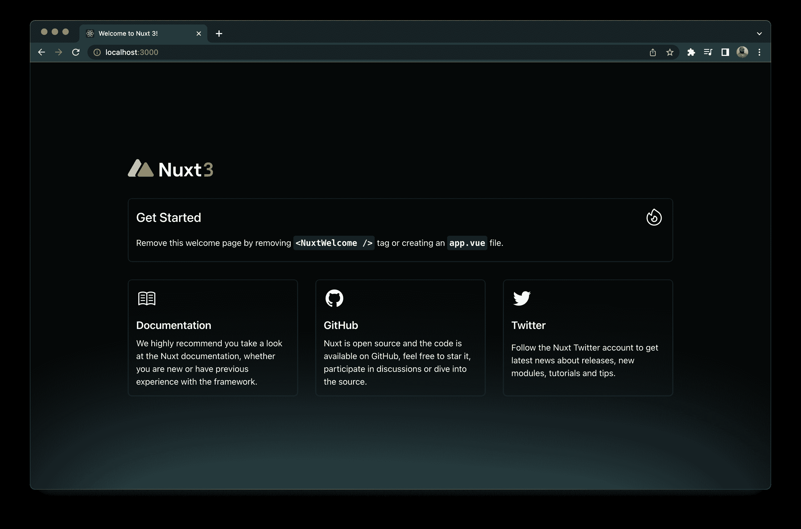
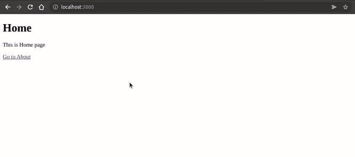
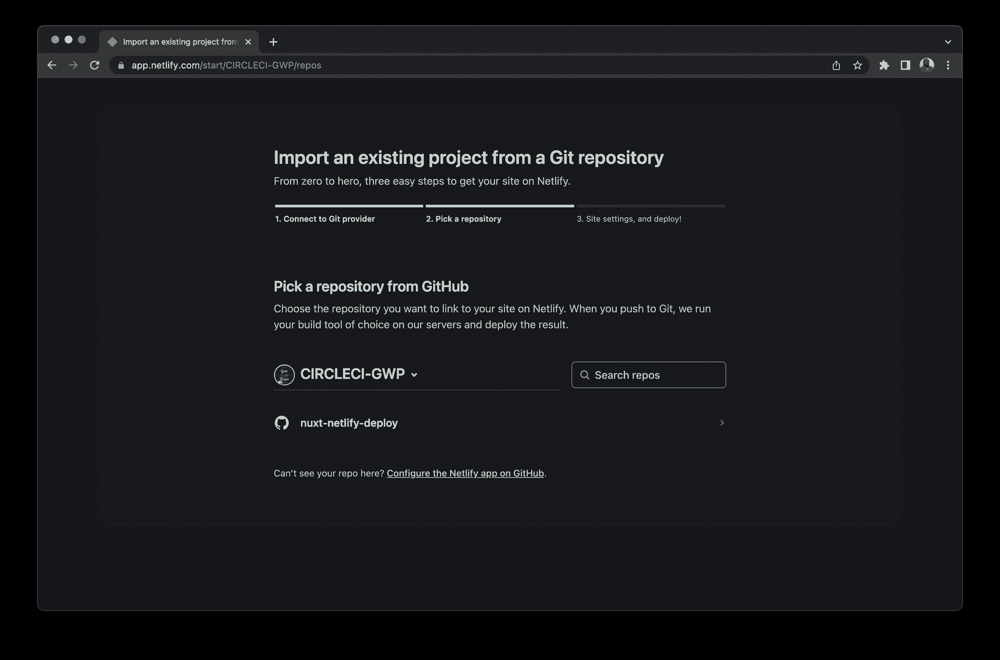
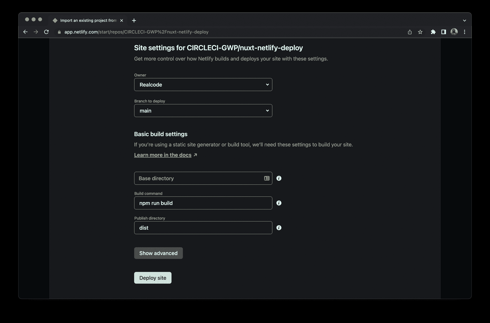
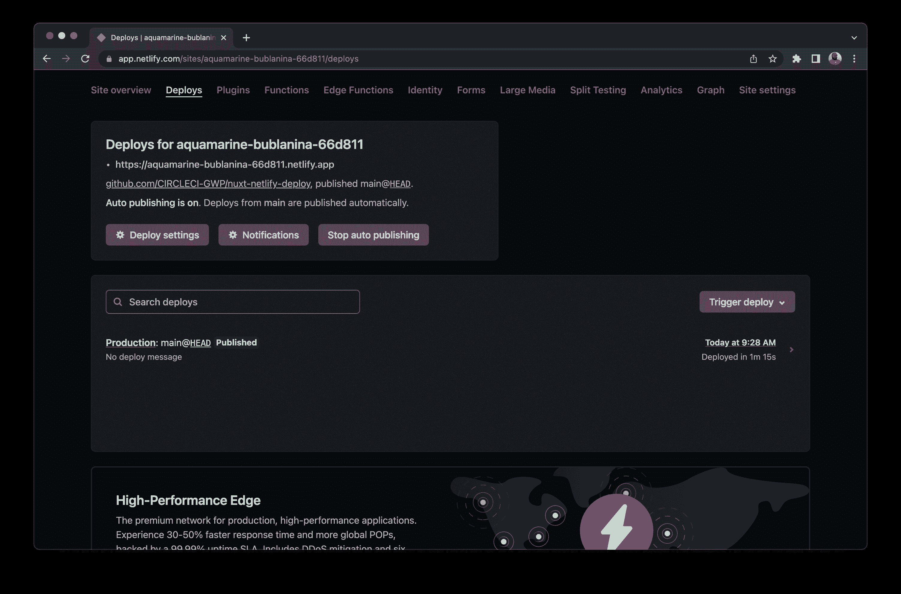
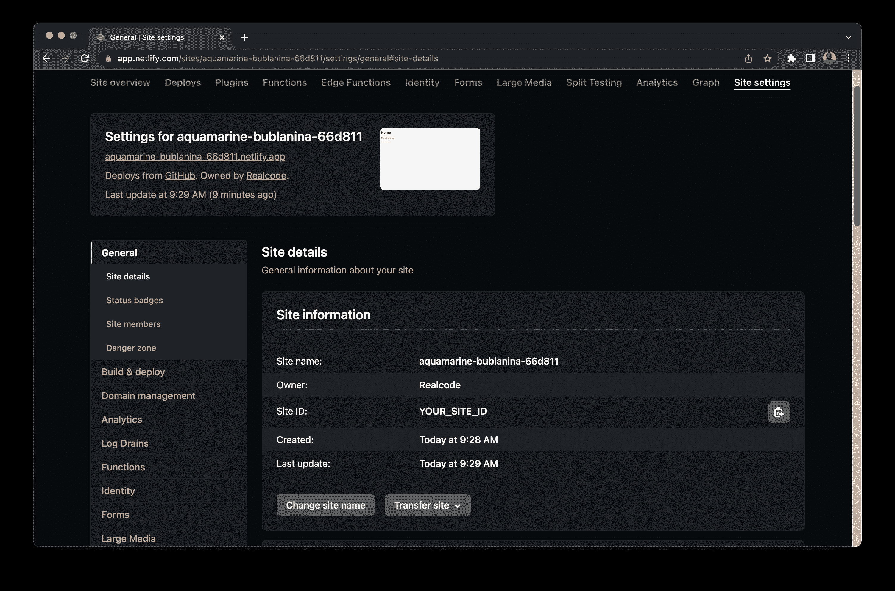
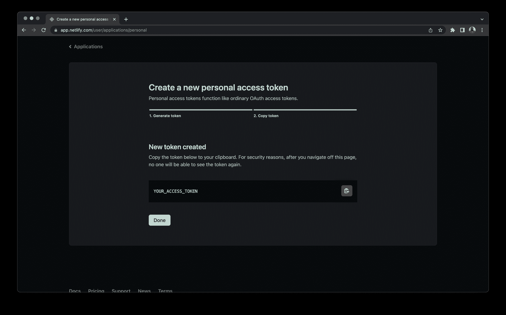
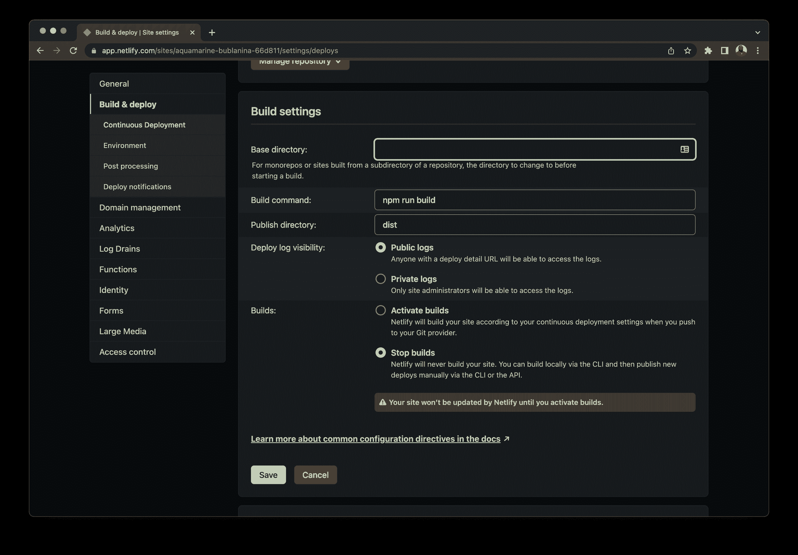
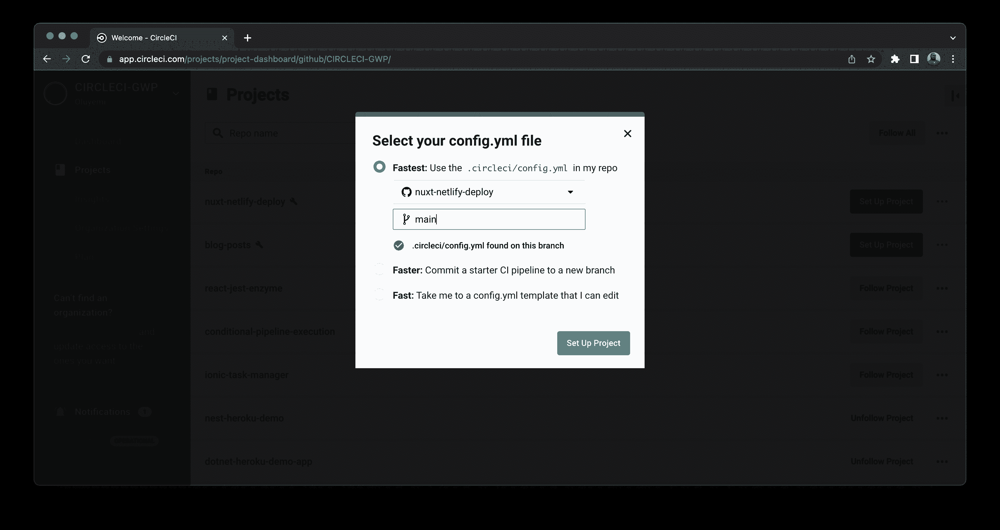
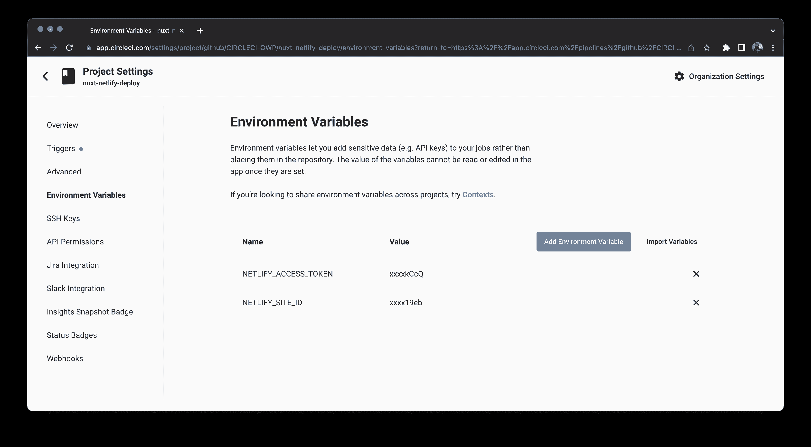

# 在 Netlify | CircleCI 中构建并部署一个 Nuxt3 应用程序

> 原文：<https://circleci.com/blog/deploy-nuxt3-app-to-netlify/>

> 本教程涵盖:
> 
> 1.  构建 Nuxt3 应用程序
> 2.  为应用程序编写自动化测试
> 3.  将应用部署到 Netlify

假设您想在 Netlify 上构建和部署一个 Nuxt3 应用程序。因为 Netlify 上不允许自定义脚本，所以在将网站部署到 Jamstack 托管平台之前，您将无法执行自动化测试等自定义任务。这就是持续集成/持续部署发挥作用的地方。使用 CI/CD 系统，您可以运行创建成功部署的自动化测试。在本教程中，我将带领您构建一个 Nuxt3 应用程序，为它编写自动化测试，并在 Netlify 上部署它。

## Nuxt.js 是什么？

Nuxt.js 是一个元框架，用于构建通用应用程序，或者运行在客户端和服务器端的应用程序。它是一个基于 Vue.js 构建的免费开源 JavaScript 库。Nuxt.js 的想法来自于 [Next.js](http://nextjs.org) ，它为 React.js 生态系统提供了类似的目的。

## 什么是 Netlify？

Netlify 是开发团队托管 Jamstack 网站的热门选择。它允许您只需点击几下鼠标，即可连接您的存储库并部署您的静态网站。有时你有一个复杂的构建步骤，你需要对它进行一些控制。

## 先决条件

要完成本教程，您需要:

> 我们的教程是平台无关的，但是使用 CircleCI 作为例子。如果你没有 CircleCI 账号，请在 注册一个免费的 [**。**](https://circleci.com/signup/)

## 设置 Nuxt3 应用程序

第一步是设置一个要部署到 Netlify 的 Nuxt3 应用程序。

打开您的终端，导航到您想要的路径，并运行以下命令:

```
npx nuxi init nuxt3-app 
```

接下来，导航到`nuxt3-app`目录，通过运行以下命令安装 NPM 依赖项:

```
cd nuxt3-app
npm install 
```

安装完依赖项后，通过运行以下命令启动 Nuxt3 开发服务器:

```
npm run dev -- -o 
```

使用浏览器访问`http://localhost:3000`，它显示了一个新的 Nuxt3 应用程序的默认主页。



## 在 Nuxt3 应用程序中添加页面

要使您的网站更具互动性，您可以向其中添加页面。

在项目的根目录下创建一个`pages`目录。在`pages`目录中，创建一个`index.vue`文件并添加以下代码:

```
<template>
  <div>
    <h1>Home</h1>
    <p>This is Home page</p>
    <nuxt-link to="/about">Go to About</nuxt-link>
  </div>
</template> 
```

接下来，在`pages`目录中，创建一个`about.vue`文件，并将以下代码添加到其中:

```
<template>
  <div>
    <h1>About</h1>
    <p>This is About page</p>
    <nuxt-link to="/">Go to Home</nuxt-link>
  </div>
</template> 
```

最后，保存你的进度，在浏览器上访问 Nuxt3 应用。



## 安装 Netlify CLI

[Netlify 命令行界面(CLI)](https://www.npmjs.com/package/netlify-cli) 允许您通过在 CI/CD 系统定制版本中运行命令行脚本，将您的网站部署到 Netlify。您需要将 CLI 作为开发依赖项安装到您的项目中。

转到项目的根目录，在终端中运行以下命令:

```
npm install --save-dev netlify-cli 
```

一旦安装完成，[将项目代码推送到 GitHub](https://circleci.com/blog/pushing-a-project-to-github/) 。

## 设置网络生活

首先，访问 [Netlify 的仪表板](http://app.netlify.com)，点击**添加新站点** > **导入一个现有项目**。

接下来，选择 **GitHub** 作为您的提供商，并搜索您的 GitHub 存储库。如果你的项目没有出现在列表中，点击**在 GitHub** 上配置 Netlify 应用程序并授权 Netlify 访问你的库。



接下来，快速回顾一下您的 Netlify 项目的基本构建设置。如果一切正常，点击**部署站点**允许 Netlify 首次部署您的 Nuxt3 应用。



构建过程完成后，请访问应用仪表板上的部署 URL。在我们这里是`https://aquamarine-bublanina-66d811.netlify.app/`。



最后，当从 CircleCI 部署到 Netlify 时，您将需要一个站点 ID 和一个个人访问令牌:

*   对于`SITE ID`,请使用您网站的应用 ID。点击**站点设置**选项卡，然后点击**常规** > **站点详情**即可找到。

    

*   点击**用户设置**，然后点击**应用**，即可获得`Personal Access token`。将您的访问令牌保存在安全的地方；您将无法再次显示它。

### 停止网络构建

有了这个设置，无论何时按下`main_ branch`按钮，都会触发两次部署。一个部署在 Netlify，另一个部署在 CircleCI。为了节省资源，您只想从单一来源进行部署；在这种情况下，CircleCI。这意味着您需要禁用 Netlify 上的构建。

在 Netlify 仪表板上返回到您站点的页面。点击**站点设置**选项卡。在侧面菜单栏上点击**构建&部署**，然后点击**编辑设置**，选择**停止构建**。完成后保存您的更改。



就是这样。现在 Netlify 不会在你推进到你的主分支时触发项目部署。

## 设置 CircleCI

现在 Netlify 设置完成了，您可以开始设置 CircleCI 了。

在项目的根目录下，创建一个`.circleci`目录，并向其中添加一个`config.yml`文件。在这里，您将使用 CircleCI 编写构建和部署您的网站到 Netlify 的配置。现在，打开新创建的文件并添加以下内容:

```
version: 2.1
jobs:
  build:
    working_directory: ~/repo
    docker:
      - image: cimg/node:14.19.0
    steps:
      - checkout
      - run:
          name: Update NPM
          command: "sudo npm install -g npm"
      - restore_cache:
          key: dependency-cache-{{ checksum "package-lock.json" }}
      - run:
          name: Install Dependencies
          command: npm install
      - save_cache:
          key: dependency-cache-{{ checksum "package-lock.json" }}
          paths:
            - ./node_modules
      - run:
          name: Nuxt3 Build
          command: npm run generate
      - save_cache:
          key: nuxt3-public-cache-{{ .Branch }}
          paths:
            - ./.output/public

workflows:
  build-deploy:
    jobs:
      - build:
          filters:
            branches:
              only:
                - main 
```

这种配置:

*   从存储库中检出项目
*   安装并缓存项目依赖项
*   构建(`npm run generate`)并缓存`.output/public`目录，该目录保存 Nuxt3 网站的生产构建
*   将工作流配置为仅在推送至主分支时运行

接下来，[将这些新的变更](https://circleci.com/blog/pushing-a-project-to-github/)推送到您的 GitHub 存储库中。

现在，在 [CircleCI 仪表板](https://app.circleci.com)上，从左侧边栏菜单中点击**项目**。

从项目列表中，找到您的项目并点击**设置项目**。您将收到 CircleCI 自动检测您的配置文件的通知。快速浏览一下，点击**设置项目**。



这将在 CircleCI 上成功触发构建，但不会部署到 Netlify。这是因为您尚未添加凭据。接下来你会这么做。

接下来，点击**项目设置**。在项目设置页面，点击左侧工具条菜单中的**环境变量**。在此页面上，添加这两个环境变量:

*   `NETLIFY_SITE_ID`是您的 Netlify 应用程序的应用程序 ID。
*   `NETLIFY_ACCESS_TOKEN`是您的网络个人访问令牌。



## 更新 CircleCI 配置文件

现在您已经在 CircleCI 上设置了项目，您可以使用部署凭证更新配置文件，并使用 Netlify CLI 部署您的网站。

更新`config.yml`文件的内容，如下所示:

```
version: 2.1
jobs:
  build:
    working_directory: ~/repo
    docker:
      - image: cimg/node:14.19.0
    steps:
      # 1
      - checkout
      - run:
          name: Update NPM
          command: "sudo npm install -g npm"
      - restore_cache:
          key: dependency-cache-{{ checksum "package-lock.json" }}
      # 2
      - run:
          name: Install Dependencies
          command: npm install
      - save_cache:
          key: dependency-cache-{{ checksum "package-lock.json" }}
          paths:
            - ./node_modules
      # 3
      - run:
          name: Nuxt3 Build
          command: npm run generate
      - save_cache:
          key: nuxt3-public-cache-{{ .Branch }}
          paths:
            - ./.output/public
      # 4
      - run:
          name: Deploy to Netlify
          command: ./node_modules/.bin/netlify deploy --site $NETLIFY_SITE_ID --auth $NETLIFY_ACCESS_TOKEN --prod --dir=./.output/public
# 5
workflows:
  version: 2
  build-deploy:
    jobs:
      - build:
          filters:
            branches:
              only:
                - main 
```

此更新添加了脚本，以便使用您之前创建的凭据直接部署到 Netlify。

接下来，对您的代码进行一些修改，以验证新网站确实是从 CircleCI 部署的，并且[将您的修改推送到 GitHub](https://circleci.com/blog/pushing-a-project-to-github/) 。此按钮将触发部署管道，并将您的网站部署到 Netlify。


构建成功后，再次访问您的网站以验证您部署的更改。


您可能希望访问 Netlify 仪表板，以验证 Netlify 上没有触发任何构建。

## 结论

在本文中，您学习了使用 CircleCI 在 Netlify 上构建和部署 Nuxt3 应用程序。这个 CI/CD 系统允许您运行定制脚本，这些脚本有时会在 Netlify 等托管平台上被阻止。接下来，您可以使用 [CircleCI webhooks 从您的 CMS 触发部署](https://circleci.com/blog/using-circleci-webhooks/)。

如果你使用 [Heroku](https://www.heroku.com/) 作为你的托管平台，你可以阅读我们关于[使用 CircleCI 管道定制部署到 Heroku](https://circleci.com/blog/continuous-deployment-to-heroku/) 的教程。