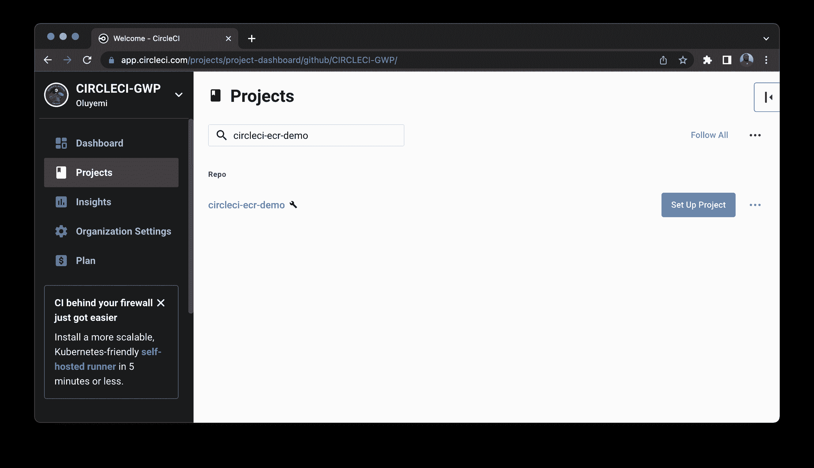

# 自动将私有 Docker 映像部署到 Amazon ECR - CircleCI

> 原文：<https://circleci.com/blog/deploy-private-docker-image-amazon-ecr/>

本文介绍了如何使用 CircleCI orbs 构建生产级 Docker 映像并将其推送到 Amazon 弹性容器注册中心(ECR)进行存储。

## 什么是亚马逊 ECR？

亚马逊 ECR 是一个完全托管的私有 Docker 容器注册中心，开发者可以很容易地存储、管理和部署 Docker 容器映像。亚马逊 ECR 与亚马逊弹性容器服务[亚马逊 ECSe](https://aws.amazon.com/ecs/) 和亚马逊弹性 Kubernetes 服务[亚马逊 EKS](https://aws.amazon.com/eks/) 无缝集成。亚马逊 ECR 也可以和其他云厂商一起使用。

## 为什么要使用像 Amazon ECR 这样的私有 Docker 注册中心？

*   在许多情况下，分离开发、测试和生产注册是可取的。
*   它是完全托管的，因此无需运营自己的容器存储库或担心底层基础架构的扩展。
*   很安全。具有扫描功能和基于角色的访问控制的私有容器注册表提供了更多的安全性、治理(IAM)和高效管理。它通过 HTTPS 传输您的容器图像，并自动加密您的静态图像。
*   在运行容器的系统附近运行注册中心可以减少部署延迟并减少网络中断的风险。

开发人员需要使用注册表来存储应用程序开发过程中创建的图像。[持续集成](https://circleci.com/continuous-integration/)管道连接构建容器图像，并将这些工件推入亚马逊 ECR。想象一个管道，其中您推送一个 commit，该 commit 触发 CircleCI 上的一个构建，该构建将一个新图像推送到 Amazon ECR 中。然后，您的注册中心可以启动 webhook 并触发部署。所有这些都不需要人工做任何事情。注册中心使得这种完全自动化的管道更加容易。放在注册表中的容器映像可以在开发的不同阶段使用。在几个步骤中，使用 [CircleCI orbs](https://circleci.com/orbs/) ，我们将封装一个简单的 Node.js 应用程序，构建映像，并将其推送到 Amazon ECR。

## 设置 Amazon ECR

从 AWS 管理控制台中，选择 IAM。此服务允许您管理对 AWS 资源的访问。


创建角色/用户。我把我的名字叫做`ci-cd-ecr`，但是任何名字都可以。确保您选择了**访问键-编程访问**选项。


接下来，为用户设置权限。点击**直接附加已有保单**。这个截屏显示了在 AWS 上成功地为您的图像创建一个私有存储库并拥有其他修改的完全访问权限所需的内容。


点击**下一个**两次，创建新用户。

您将收到一条成功消息以及您的用户凭据。该页面只显示一次，因此请记下**访问密钥 ID** 和**秘密访问密钥**，稍后将会用到。或者，您可以下载提供的包含相同凭据的 csv 文件。


## 使用 AWS-ECR orb 设置 CircleCI 管道

这个演示的代码可以在 GitHub [这里](https://github.com/CIRCLECI-GWP/circleci-ecr-demo)找到。使用以下命令克隆应用程序:

```
git clone https://github.com/CIRCLECI-GWP/circleci-ecr-demo 
```

在`.circleci/`文件夹中找到 CircleCI 配置文件。使用 orbs，正如您将看到的，您可以构建一个映像并将其推送到 Amazon ECR，只需 13 行配置！aws-ecr orb 预装了以下命令:

*   建立形象
*   登录亚马逊 ECR
*   创建一个 Amazon ECR repo(如果不存在)
*   将图片推送到亚马逊 ECR

以下是您的管道的完整配置:

```
version: 2.1

orbs:
  aws-ecr: circleci/aws-ecr@8.1.3

workflows:
  build_and_push_image:
    jobs:
      - aws-ecr/build-and-push-image:
          context: aws-dev
          create-repo: true
          dockerfile: Dockerfile
          path: .
          repo: circleci-ecr-demo
          tag: "$CIRCLE_SHA1" 
```

这个配置文件使用 [Amazon 弹性容器注册中心](https://circleci.com/developer/orbs/orb/circleci/aws-ecr) orb 来构建和部署 Docker 映像。`dockerfile:`命令指定 docker 文件的路径。演示报告使用以下 Dockerfile 文件:

```
# Set the base image to use for subsequent instructions
FROM node:alpine

# Add metadata to an image
LABEL app="simple-node-application"
# Directive to set environmental variables key to value pair
ENV NPM_CONFIG_LOGLEVEL warn

# Set the working directory for any subsequent ADD, COPY, CMD, ENTRYPOINT,
# or RUN instructions that follow it in the Dockerfile
WORKDIR /usr/src/app

# Copy files or folders from source to the dest path in the image's filesystem.
COPY package.json /usr/src/app/
COPY . /usr/src/app/

# Execute any commands on top of the current image as a new layer and commit the results.
RUN npm install --production

# Define the network ports that this container will listen on at runtime.
EXPOSE 3000

# Configure the container to be run as an executable.
ENTRYPOINT ["npm", "start"] 
```

## 为 Amazon ECR 添加上下文和设置环境变量

在您的 CircleCI 仪表板中，通过单击侧边栏中的链接进入组织设置页面。接下来，选择**上下文**。点击**创建上下文**按钮，为您的上下文添加一个唯一的名称。该上下文出现在安全性设置为`All members`的列表中，表示组织中的任何人都可以在运行时访问该上下文。正如本教程的`.circleci/config.yml`配置中所指定的，上下文名称应该是`aws-dev`。


接下来，选择 aws-credentials 上下文。


点击**添加环境变量**按钮。输入要与此上下文关联的变量名和值。点击**添加变量**按钮保存。`aws-dev`上下文需要这三个环境变量:

*   `AWS_ACCESS_KEY_ID`是您之前创建的`ci-cd-ecr` IAM 角色的 AWS 访问键 id。
*   `AWS_SECRET_ACCESS_KEY`是您之前创建的`ci-cd-ecr` IAM 角色的 AWS 密钥。
*   `AWS_ECR_REGISTRY_ID`是与 ECR 账户相关的 12 位 AWS id。这也称为帐户 ID。
*   `AWS_REGION`是您的 ECR 资源所在的 AWS 区域。

**注意:** *你不必设置`$CIRCLE_SHA1`，因为它是所有 CircleCI 项目中可用的默认变量。这是当前构建的最后一次提交的`SHA1`散列。使用 Git 提交散列让您能够跟踪容器中的内容。理想情况下，它允许您将容器追溯到其 Docker 映像，然后追溯到映像中包含的 Docker 文件和代码。在自动化执行环境中，这将带您回到导致 Docker 映像构建的提交。*

## 将应用程序连接到 CircleCI

下一步是在 GitHub 上建立一个资源库，并将项目链接到 CircleCI。查看[将项目推送到 GitHub](https://circleci.com/blog/pushing-a-project-to-github/) 以获取指示。

登录您的 CircleCI 帐户。如果你注册了你的 GitHub 账户，你所有的库都可以在你项目的仪表盘上看到。找到您的项目(本例中为`circleci-ecr-demo`)并点击**设置项目**。



在 GitHub 上输入您的代码所在的分支的名称，然后点击**设置项目**。

您的第一个工作流将开始运行并成功完成。


要查看存储库信息，请转到您的 [AWS 管理控制台](https://console.aws.amazon.com/ecr/repositories)。

## 结论

CircleCI 和 Amazon ECR 都成功配置后，您就可以开始构建映像并将它们推送到存储库了。

只需几行代码，您就可以构建 Docker 图像并将其推送到 Amazon ECR。CircleCI orbs 通过将预构建的命令、作业和执行器导入 CircleCI 配置文件来节省时间，提供了与云服务和其他工具的轻松集成。

* * *

Dominic Motuka 是 Andela 的 DevOps 工程师，在 AWS 和 GCP 支持、自动化和优化生产就绪部署方面拥有 4 年多的实践经验，利用配置管理、CI/CD 和 DevOps 流程。

[阅读多米尼克·莫图卡的更多帖子](/blog/author/dominic-motuka/)