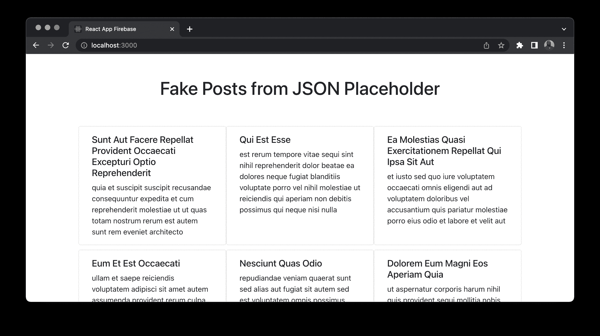
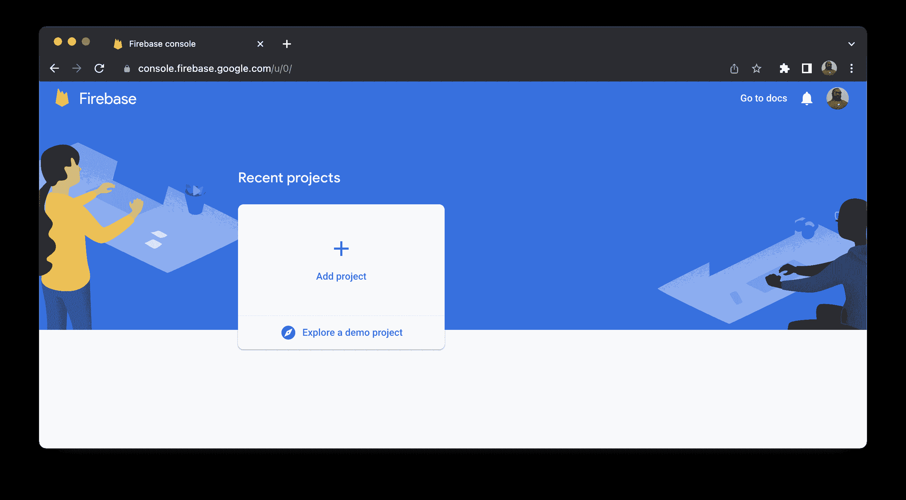
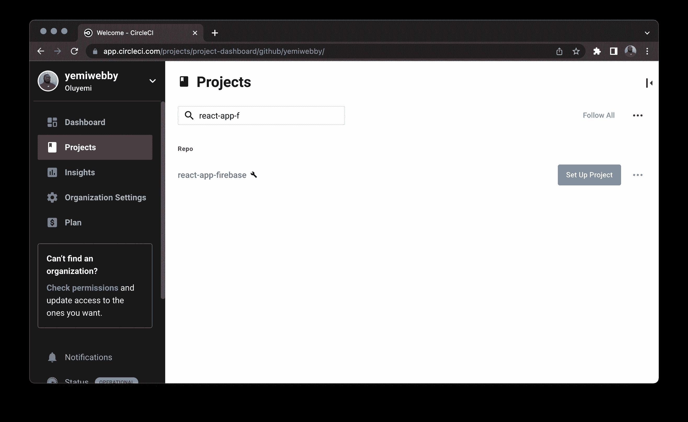
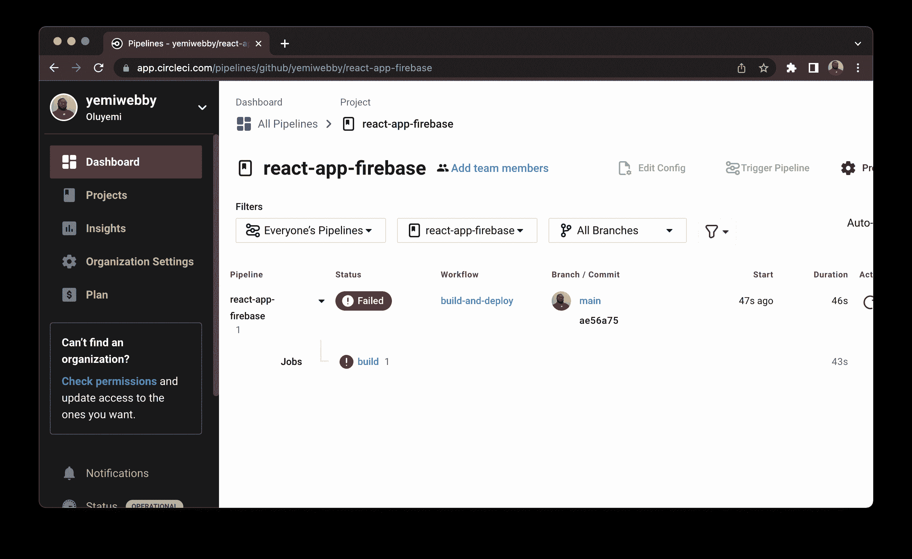
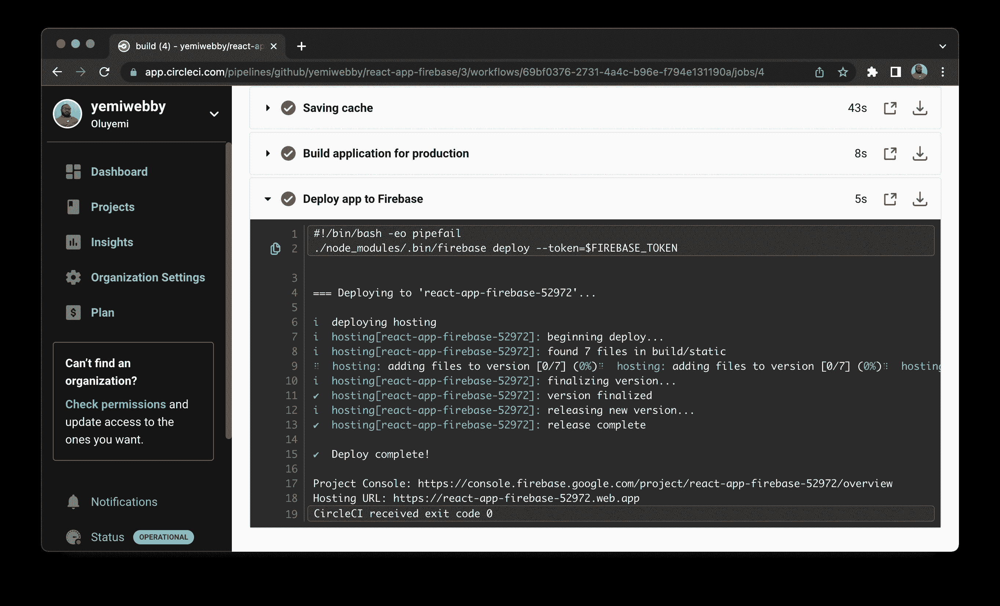
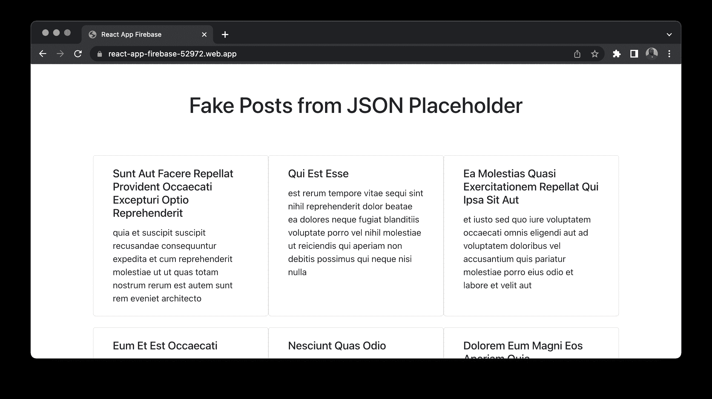

# 将 React 应用程序自动部署到 Firebase | CircleCI

> 原文：<https://circleci.com/blog/deploy-react-apps-to-firebase/>

> 本教程涵盖:
> 
> 1.  构建一个示例 React 应用程序
> 2.  在 Firebase 上设置和配置应用程序
> 3.  创建连续部署管道

许多平台为 React 和其他 JavaScript 框架提供免费的托管服务。这些框架可用于构建单页面应用程序，这在您需要发布最小可行产品或快速概念验证时非常方便。您的开发伙伴正在利用这些工具，您也可以。为了缩小选择范围，我将在本教程中重点介绍 Firebase。

Firebase 是 Google 开发的一个开发平台，提供文件存储、托管、数据库、认证和分析。Firebase 是免费的，默认提供 SSL 证书，并在多个地区提供令人印象深刻的速度。

在本教程中，您将学习如何通过使用 CircleCI 设置连续部署管道，在 Firebase 上托管 React 应用程序。

## 先决条件

对于本教程，您需要:

> 我们的教程是平台无关的，但是使用 CircleCI 作为例子。如果你没有 CircleCI 账号，请在 注册一个免费的 [**。**](https://circleci.com/signup/)

## 克隆演示项目

首先，在 GitHub 上克隆本教程的演示项目。使用 Git 发出以下命令:

```
git clone https://github.com/yemiwebby/react-app-firebase.git 
```

这个演示应用程序从测试用的免费 Rest API 中检索虚拟用户列表。

接下来，进入新克隆的应用程序，安装其依赖项，并使用以下命令运行应用程序:

```
// change directory
cd react-app-firebase

// install dependencies
npm install

// Run the application
npm run start 
```

前往`http://localhost:3000`查看本地主页。



现在您已经知道演示应用程序正在工作，您已经准备好在 Firebase 上建立一个项目了。

## 在 Firebase 上建立一个项目

你需要一个免费帐户来访问 Firebase 提供的所有功能，所以打开一个 [Firebase 帐户](https://console.firebase.google.com/u/0/)并进入 Firebase 控制台页面。



接下来，使用以下步骤:

1.  点击**添加项目**按钮。
2.  输入项目的名称。我给我的取名为`react-app-firebase`。请记住，项目 id 在 Firebase 中是唯一的。
3.  点击**继续**。
4.  禁用谷歌分析；这个项目不需要它。
5.  再次点击**继续**。

您已经成功地在 Firebase 上创建了一个项目。

## 配置 Firebase 托管

为了在 Firebase 上成功地托管您的应用程序，您需要安装它的工具，并在您的项目中初始化它。

打开新的终端。运行以下命令以全局安装 Firebase 工具:

```
npm install -g firebase-tools 
```

安装完成后，您现在可以全局访问 Firebase 命令行界面工具。您可以使用它们将代码和资产部署到新创建的 Firebase 项目中。

## 将 React 连接到 Firebase

从终端登录到您的 Firebase 帐户:

```
firebase login 
```

该命令将打开一个浏览器，并提示您选择一个帐户。

接下来，确保您在`react-app-firebase`项目的根目录下，并发出以下命令来初始化它:

```
firebase init 
```

系统会提示您回答一些问题。

*   选择托管:为 Firebase 托管配置文件，并(可选)设置 GitHub 操作部署。
*   使用现有项目:选择您之前创建的 Firebase 项目(`react-app-firebase`)。
*   输入`build`作为公共目录。
*   配置为单页 app: `Yes`。
*   使用 GitHub 设置自动构建和部署:`No`。对于本教程，我们使用 CircleCI 来运行测试和处理部署。

以下是终端的输出:

```
 ######## #### ########  ######## ########     ###     ######  ########
     ##        ##  ##     ## ##       ##     ##  ##   ##  ##       ##
     ######    ##  ########  ######   ########  #########  ######  ######
     ##        ##  ##    ##  ##       ##     ## ##     ##       ## ##
     ##       #### ##     ## ######## ########  ##     ##  ######  ########

You are about to initialize a Firebase project in this directory:

  /Users/yemiwebby/tutorial/circleci/react-app-firebase

? Which Firebase features do you want to set up for this directory? Press Space to select features, th
en Enter to confirm your choices. Hosting: Configure files for Firebase Hosting and (optionally) set u
p GitHub Action deploys, Hosting: Set up GitHub Action deploys

=== Project Setup

First, lets associate this project directory with a Firebase project.
You can create multiple project aliases by running firebase use --add, 
but for now we will just set up a default project.

? Please select an option: Use an existing project
? Select a default Firebase project for this directory: react-app-firebase-52972 (react-app-firebase)
i  Using project react-app-firebase-52972 (react-app-firebase)

=== Hosting Setup

Your public directory is the folder (relative to your project directory) that
will contain Hosting assets to be uploaded with firebase deploy. If you
have a build process for your assets, use your builds output directory.

? What do you want to use as your public directory? build
? Configure as a single-page app (rewrite all urls to /index.html)? Yes
? Set up automatic builds and deploys with GitHub? No
✔  Wrote build/index.html

i  Writing configuration info to firebase.json...
i  Writing project information to .firebaserc...

✔  Firebase initialization complete! 
```

项目的初始化过程还在项目的根目录下生成了两个唯一的文件。这些文件是成功部署所必需的，并且必须签入源代码管理。

*   `firebase.json`包含您项目的托管配置。它指示 Firebase CLI 上传和部署项目目录中的文件。
*   `.firebaserc`指定成功部署到 Firebase 后，连接到上传代码的项目。

## 配置 CircleCI

克隆的项目中已经存在配置文件。转到`.circleci/config.yml`。打开它，确保它与以下内容匹配:

```
version: 2.1
jobs:
  build:
    working_directory: ~/project
    docker:
      - image: cimg/node:17.4.0
    steps:
      - checkout
      - run:
          name: Update NPM
          command: "sudo npm install -g npm"
      - restore_cache:
          key: dependency-cache-{{ checksum "package-lock.json" }}
      - run:
          name: Install Dependencies
          command: npm install
      - run: npm install --save-dev firebase-tools    
      - save_cache:
          key: dependency-cache-{{ checksum "package-lock.json" }}
          paths:
            - ./node_modules
      - run:
          name: Build application for production
          command: npm run build 
      - run:
          name: Deploy app to Firebase
          command: ./node_modules/.bin/firebase deploy --token=$FIREBASE_TOKEN  
workflows:
  build-and-deploy:
    jobs:
      - build 
```

这个配置指定了在 CircleCI 上安装和构建 React 应用程序所需的所有工具。它用`npm install --save-dev firebase-tools`安装了 Firebase 工具，并设置了一个命令，一旦测试成功，就自动将应用程序部署到 Firebase。

部署将需要`FIREBASE_TOKEN`。您是从终端登录的，因此可以使用 Firebase CLI 轻松创建令牌。输入以下命令:

```
firebase login:ci 
```

这将打开一个浏览器，您可以在其中验证您的帐户。然后，令牌会打印在您的终端上。

把这个复制下来，保存在方便的地方。在本教程的后面部分，您将需要它。

下一步是在 GitHub 上建立一个资源库，并将项目链接到 CircleCI。查看[将项目推送到 GitHub](https://circleci.com/blog/pushing-a-project-to-github/) 以获取指示。

一旦你的 GitHub 库被更新，登录到你的 CircleCI 账户。如果你注册了你的 GitHub 账户，你所有的库都可以在你项目的仪表盘上看到。

接下来，找到你的`react-app-firebase`项目，点击**设置项目**。



系统将提示您编写新的配置文件或使用现有的配置文件。选择现有的分支，并输入您的代码在 GitHub 上所在的分支的名称。点击**设置项目**。

您的第一个工作流将开始运行。但是构建将会失败，因为您还没有创建`FIREBASE_TOKEN`环境变量。



要解决这个问题，您需要添加`FIREBASE_TOKEN`作为环境变量。点击**项目设置**，然后点击左边栏的**环境变量**。创建此变量:

*   `FIREBASE_TOKEN`是您之前从终端生成的令牌的值。

回到仪表板，单击**从失败的**重新运行工作流。这将触发工作流，该工作流现在已成功构建。



转到上一步中显示的主机 URL。对我来说网址是:`https://react-app-firebase-52972.web.app`。



## 结论

在本教程中，我们回顾了在 Firebase 上托管 React 应用程序的逐步过程。您下载了一个现有的 React 应用程序，并利用 CircleCI 基础设施来确保应用程序的部署不需要任何人工交互。

这里解释的过程适用于现有的和新的 React 应用程序。完整的源代码可以在 GitHub 的[这里找到。](https://github.com/yemiwebby/react-app-firebase)

* * *

Oluyemi 是一名拥有电信工程背景的技术爱好者。出于对解决用户日常遇到的问题的浓厚兴趣，他冒险进入编程领域，并从那时起将他的问题解决技能用于构建 web 和移动软件。Oluyemi 是一名热衷于分享知识的全栈软件工程师，他在世界各地的几个博客上发表了大量技术文章和博客文章。作为技术专家，他的爱好包括尝试新的编程语言和框架。

[阅读更多 Olususi Oluyemi 的帖子](/blog/author/olususi-oluyemi/)