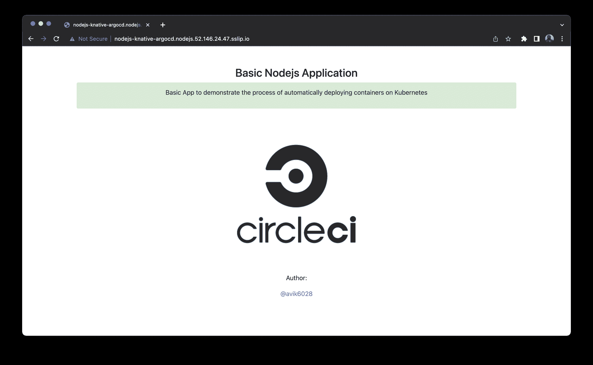

# 使用 Knative 和 ArgoCD | CircleCI 在 Kubernetes 上部署无服务器工作负载

> 原文：<https://circleci.com/blog/deploy-serverless-workload-with-knative/>

> 本教程涵盖:
> 
> 1.  设置 Knative 和 ArgoCD
> 2.  监控和访问示例应用程序
> 3.  创建一个管道，在 Kubernetes 集群上持续部署您的无服务器工作负载

容器和微服务彻底改变了应用程序在云上的部署方式。自 2014 年推出以来， [Kubernetes](https://kubernetes.io/) 已经成为容器编排的标准工具。它提供了一组原语来运行弹性的分布式应用程序。

开发人员面临的一个主要困难是能够更多地关注代码的细节，而不是代码的基础设施。无服务器的计算方法是解决这个问题的有效方法。

无服务器允许通过抽象底层基础设施来运行事件驱动的功能。与传统的平台即服务(PaaS)相比，无服务器允许您的开发团队专注于服务的功能。基础设施问题，如扩展和容错，不再是一个障碍。

Knative 是一个开源的企业级解决方案，用于构建无服务器和事件驱动的应用程序。它的组件可以用来在 Kubernetes 上构建和部署无服务器应用程序。Knative 最初由 Google 开发，现在有来自 IBM、Red Hat 和 VMWare 的贡献者。

ArgoCD 是一个 Kubernetes-native 连续部署(CD)工具。它通过从 Git 存储库中提取代码更改，直接将代码更改部署到 Kubernetes 资源中。ArgoCD 遵循 GitOps 模式，不像某些外部 CD 解决方案那样只能支持基于推送的部署。该工具使开发人员能够从一个统一的平台控制应用程序更新和基础架构设置。

在本教程中，您将学习如何使用 [CircleCI](https://circleci.com/signup) 和 [ArgoCD](https://argoproj.github.io/cd/) 在 [Azure Kubernetes 服务](https://azure.microsoft.com/en-us/services/kubernetes-service/#overview) (AKS)上使用 [Knative](https://kubernetes.io/docs/concepts/overview/working-with-objects/namespaces/) 部署一个 [Node.js](https://nodejs.org/) 应用程序作为无服务器工作负载。您将使用 [CircleCI orbs](https://circleci.com/orbs/) 创建一个持续集成管道，这些 orbs 是 YAML 配置的可重用包，将重复的配置片段压缩到一行代码中。当您在 [GitHub](https://github.com/) 库中推送代码时，管道被触发。结果是一个自动管道，触发 ArgoCD 在 Kubernetes 集群上部署最新版本的应用程序。

## 先决条件

要完成本教程，您需要:

在你准备好这些东西之后，你就可以进入下一部分了。

## 克隆 Node.js 应用程序

在本教程中，我们主要关注在 Kubernetes 上部署应用程序。为了节省时间，您可以直接[将](https://docs.github.com/en/repositories/creating-and-managing-repositories/cloning-a-repository) [Node.js 应用程序](https://github.com/Lucifergene/nodejs-knative-argocd)克隆到您的 GitHub，并继续剩余的过程。

要克隆项目，请运行:

```
git clone https://github.com/CIRCLECI-GWP/nodejs-knative-argocd.git 
```

该存储库中有两个分支:

*   `main`分支只包含 Node.js 应用程序代码。
*   `circleci-project-setup`分支包含应用程序代码，以及您将在本教程中创建的所有 YAML 文件。

检查到`main`分支。

Node.js 应用程序位于`app.js`文件中:

```
const express = require("express");
const path = require("path");
const morgan = require("morgan");
const bodyParser = require("body-parser");
/* eslint-disable no-console */
const port = process.env.PORT || 1337;
const app = express();
app.use(morgan("dev"));
app.use(bodyParser.json());
app.use(bodyParser.urlencoded({ extended: "true" }));
app.use(bodyParser.json({ type: "application/vnd.api+json" }));
app.use(express.static(path.join(__dirname, "./")));
app.get("*", (req, res) => {
  res.sendFile(path.join(__dirname, "./index.html"));
});
app.listen(port, (err) => {
  if (err) {
    console.log(err);
  } else {
    console.log(`App at: http://localhost:${port}`);
  }
});
module.exports = app; 
```

这段代码的关键是应用程序将要运行的`port number`。这种情况下就是`1337`。

通过首先安装依赖项，您可以在本地运行应用程序。在项目的根目录中，键入:

```
npm install 
```

然后使用以下命令运行应用程序:

```
node app.js 
```

应用程序现在应该在地址`http://localhost:1337`启动并运行。

## 容器化 Node.js 应用程序

将应用程序部署到 Kubernetes 的第一步是将其容器化。使用 Docker 作为容器运行时工具的容器化应用程序要求您创建一个 [Dockerfile](https://docs.docker.com/engine/reference/builder/) 。Dockerfile 是一个文本文档，它包含用户可以在命令行上调用的所有命令来组合一个图像。

在项目的根目录下创建一个新文件，命名为`Dockerfile`。将此内容复制到文件:

```
# Set the base image to use for subsequent instructions
FROM node:alpine
# Set the working directory for any subsequent ADD, COPY, CMD, ENTRYPOINT,
# or RUN instructions that follow it in the Dockerfile
WORKDIR /usr/src/app
# Copy files or folders from source to the dest path in the image's filesystem.
COPY package.json /usr/src/app/
COPY . /usr/src/app/
# Execute any commands on top of the current image as a new layer and commit the results.
RUN npm install --production
# Define the network ports that this container will listen to at runtime.
EXPOSE 1337
# Configure the container to be run as an executable.
ENTRYPOINT ["npm", "start"] 
```

如果您已经安装了 [Docker](https://docs.docker.com/get-docker/) ，那么您可以在本地构建并运行容器进行测试。在本教程的后面，你将学习如何使用 CircleCI orbs 来自动化这个过程。

要构建和标记容器，您可以键入:

```
docker build -t nodejs-knative-argocd:latest . 
```

通过从终端运行以下命令，确认映像已成功创建:

```
docker images 
```

然后使用以下命令运行容器:

```
docker run -it -p 1337:1337 nodejs-knative-argocd:latest 
```

应用程序现在应该在地址`http://127.0.0.1:1337`启动并运行。

提交并[推送](https://circleci.com/blog/pushing-a-project-to-github/)对 GitHub 库的更改。

## 配置 Knative 服务清单

在 Knative 中，[服务](https://knative.dev/docs/serving/services/)用于部署应用程序。要使用 Knative 创建应用程序，您必须创建一个定义服务的 [YAML](https://yaml.org/) 文件。该 YAML 文件指定关于应用程序的元数据，指向应用程序的托管图像，并允许配置服务。

在项目的根目录下创建一个名为`knative`的目录。然后，在新目录下创建一个新文件，并将其命名为`service.yaml`。

`service.yaml`的内容是:

```
apiVersion: serving.knative.dev/v1
kind: Service
metadata:
  creationTimestamp: null
  name: nodejs-knative-argocd
spec:
  template:
    metadata:
      creationTimestamp: null
      name: nodejs-knative-argocd
    spec:
      containerConcurrency: 0
      containers:
        - image: docker.io/avik6028/nodejs-knative-argocd:latest
          name: user-container
          ports:
            - containerPort: 1337
              protocol: TCP
          readinessProbe:
            successThreshold: 1
            tcpSocket:
              port: 0
          resources: {}
      enableServiceLinks: false
      timeoutSeconds: 300
status: {} 
```

这个代码块的关键是`spec.template.metadata.name`和`spec.template.spec.containers[0].image`。它们表示模板和容器映像的名称，将使用 Knative 在 Kubernetes 集群上进行提取和部署。在持续集成过程中，这些值将使用最新的容器图像信息进行更新。

将这些文件提交并推入您之前克隆的 GitHub 存储库的`main`分支。

## 启动 Azure Kubernetes 服务(AKS)群集

在本教程中，您将学习在 [AKS](https://azure.microsoft.com/en-us/services/kubernetes-service/#overview) 集群上部署应用程序。要创建 AKS 群集，您应该在计算机上安装 Microsoft Azure 帐户和 Azure CLI。[将 CLI 连接到你的 Azure 账户](https://docs.microsoft.com/en-us/cli/azure/authenticate-azure-cli)。

现在，您可以在 Azure CLI 的帮助下启动 AKS 集群。

使用以下命令创建资源组:

```
az group create --name NodeRG --location eastus 
```

启动双节点集群:

```
az aks create --resource-group NodeRG --name NodeCluster --node-count 2 --enable-addons http_application_routing 
```

**注意:** *如果您之前在系统中生成了任何 SSH 密钥，您需要在命令中添加可选参数`--generate-ssh-keys`。如果缺少 SSH 公钥和私钥文件，该参数将自动生成它们。密钥将存储在`~/.ssh`目录中。*

AKS 群集将需要 10 到 15 分钟才能启动。

## 在 Kubernetes 集群中安装 Knative

一旦集群启动并运行，您需要在集群内部安装 Knative，使用它来部署您的无服务器工作负载。

要安装该应用程序，请再次使用 Azure CLI。

使用以下命令配置`kubectl`连接到 AKS:

```
az aks get-credentials --resource-group NodeRG --name NodeCluster 
```

要安装 Knative 核心组件和自定义资源，请执行以下命令:

```
kubectl apply -f https://github.com/knative/serving/releases/download/knative-v1.7.1/serving-crds.yaml
kubectl apply -f https://github.com/knative/serving/releases/download/knative-v1.7.1/serving-core.yaml 
```

Knative 还需要一个网络层来对外公开其服务。你需要安装 [Kourier](https://github.com/knative-sandbox/net-kourier) ，一个轻量级的 Knative 服务入口。

```
kubectl apply -f https://github.com/knative/net-kourier/releases/download/knative-v1.7.0/kourier.yaml 
```

通过运行以下命令，将 Knative Serving 配置为默认使用 Kourier:

```
kubectl patch configmap/config-network \
  --namespace knative-serving \
  --type merge \
  --patch '{"data":{"ingress-class":"kourier.ingress.networking.knative.dev"}}' 
```

您可以配置 DNS，这样就不需要运行带有主机头的 curl 命令。Knative 提供了一个名为`default-domain`的 Kubernetes 作业，该作业将 Knative 服务配置为使用`sslip.io`作为默认 DNS 后缀。

```
kubectl apply -f https://github.com/knative/serving/releases/download/knative-v1.7.1/serving-default-domain.yaml 
```

一旦执行了这些命令，Knative 将被安装在`knative-serving`名称空间中。要将所有资源放入命名空间:

```
kubectl get all --namespace knative-serving 
```

## 在 AKS 集群中安装 ArgoCD

一旦集群启动并运行，您需要在集群内部安装 ArgoCD，以使用它来部署您的应用程序。

要安装 ArgoCD，请输入:

```
kubectl create namespace argocd
kubectl apply -n argocd -f https://raw.githubusercontent.com/argoproj/argo-cd/stable/manifests/install.yaml 
```

当您执行这些命令时，argocd 将安装在“ArgoCD”命名空间中。要将所有资源放入命名空间:

```
kubectl get all --namespace argocd 
```

### 公开 ArgoCD API 服务器

默认情况下，ArgoCD API 服务器不会向外部 IP 公开。因为在本教程中您将从 internet 访问应用程序，所以您需要通过服务类型负载平衡器向 ArgoCD 服务器提供外部 IP。

将 argocd-server 服务类型更改为 LoadBalancer:

```
kubectl patch svc argocd-server -n argocd -p '{"spec": {"type": "LoadBalancer"}}' 
```

**注意:** *你也可以使用 Kubectl 端口转发来连接 API 服务器而不暴露服务。使用此命令:`kubectl port-forward svc/argocd-server -n argocd 8080:443`*

您现在可以使用`https://localhost:8080`访问 API 服务器。

## 访问 ArgoCD 门户网站

一旦使用外部 IP 公开了 ArgoCD API 服务器，就可以使用生成的外部 IP 地址访问门户。

因为您在`argocd`名称空间中安装了 ArgoCD，所以使用这个命令来获取该名称空间的所有资源:

```
kubectl get all --namespace argocd 
```

复制`service/argocd-server`对应的`External-IP`。


您可以在`http://<EXTERNAL-IP>`访问应用程序。
我用了`http://52.146.29.61/`。


要登录门户，您需要用户名和密码。用户名默认设置为`admin`。

要获取密码，请执行以下命令:

```
kubectl -n argocd get secret argocd-initial-admin-secret -o jsonpath="{.data.password}" | base64 -d; echo 
```

使用此用户名和密码组合登录 ArgoCD 门户网站。

## 为 ArgoCD 配置 Kubernetes 清单

要配置 ArgoCD 在 Kubernetes 上部署您的应用程序，您必须设置 ArgoCD，使用 [YAML](https://yaml.org/) 进行配置，以声明的方式连接 Git 存储库和 Kubernetes。

除此之外，您还可以从 Web 门户或使用 ArgoCD CLI 设置 ArgoCD。但是在本文中，我们试图遵循 GitOps 原则，Git 存储库应该作为唯一的事实来源，通过 YAML 文件的声明性方法效果最好。

ArgoCD 的关键特性和功能之一是通过手动或自动策略将应用程序部署到 Kubernetes 集群。

首先，在项目的根目录下创建一个名为`argocd`的目录。在新目录下创建一个新文件，命名为`config.yaml`。

### 手动同步策略

顾名思义，通过这个策略，您将能够通过 CI/CD 管道手动同步您的应用程序。无论何时进行代码更改，CI/CD 管道都会被触发，并调用 ArgoCD 服务器 API，根据您将提交的更改启动同步过程。要与 ArgoCD 服务器 API 通信，可以使用 ArgoCD CLI。您也可以使用适用于各种编程语言的 SDK 之一。

为 ArgoCD 设置手动同步策略，将其粘贴到`config.yaml`:

```
apiVersion: argoproj.io/v1alpha1
kind: Application
metadata:
  name: nodejs-knative-argocd
  namespace: argocd
spec:
  destination:
    namespace: nodejs
    server: 'https://kubernetes.default.svc'
  source:
    path: knative
    repoURL: 'https://github.com/CIRCLECI-GWP/nodejs-knative-argocd'
    targetRevision: circleci-project-setup
  project: default 
```

### 自动同步策略

ArgoCD 能够在检测到 Git 中所需清单与集群中实时状态之间的差异时，自动同步应用程序。

自动同步的一个好处是 CI/CD 管道不再需要直接访问 ArgoCD API 服务器来执行部署。取而代之的是，管道使用跟踪 Git repo 中的清单更改来提交和推送 Git 存储库。

如果您想设置为自动同步策略，您需要将其粘贴到`config.yaml`中。

```
apiVersion: argoproj.io/v1alpha1
kind: Application
metadata:
  name: nodejs-knative-argocd
  namespace: argocd
spec:
  destination:
    namespace: nodejs
    server: 'https://kubernetes.default.svc'
  source:
    path: knative
    repoURL: 'https://github.com/CIRCLECI-GWP/nodejs-knative-argocd'
    targetRevision: circleci-project-setup
  project: default
  syncPolicy:
    automated:
      prune: false
      selfHeal: false 
```

提交并[推送](https://circleci.com/blog/pushing-a-project-to-github/)这些文件到您之前克隆的 GitHub 库的`main`分支。

## 创建持续集成管道

本教程的目的是展示如何通过 CircleCI 的[持续集成](https://circleci.com/continuous-integration/) (CI)和 ArgoCD 的[持续部署](https://circleci.com/blog/a-brief-history-of-devops-part-iv-continuous-delivery-and-continuous-deployment/) (CD)在 Kubernetes 上部署无服务器工作负载。

为了创建 CI 渠道，我们将使用 CircleCI 与您的 GitHub 帐户集成。CircleCI 配置以`config.yml`文件的形式存在于项目根文件夹的`.circleci`目录下，即配置的路径为`.circleci/config.yml`。

`config.yml`的内容是:

```
version: 2.1

orbs:
  docker: circleci/docker@2.1.1
  azure-aks: circleci/azure-aks@0.3.0
  kubernetes: circleci/kubernetes@1.3.0

jobs:
  argocd-manual-sync:
    docker:
      - image: cimg/base:stable
    parameters:
      server:
        description: |
          Server IP of of ArgoCD
        type: string
      username:
        description: |
          Username for ArgoCD
        type: string
      password:
        description: |
          Password for ArgoCD
        type: string
    steps:
      - run:
          name: Install ArgoCD CLI
          command: |
            URL=https://<< parameters.server >>/download/argocd-linux-amd64
            [ -w /usr/local/bin ] && SUDO="" || SUDO=sudo
            $SUDO curl --insecure -sSL -o /usr/local/bin/argocd $URL
            $SUDO chmod +x /usr/local/bin/argocd
      - run:
          name: ArgoCD CLI login
          command: argocd login << parameters.server >> --insecure --username << parameters.username >> --password << parameters.password >>
      - run:
          name: Manual sync
          command: argocd app sync $APP_NAME
      - run:
          name: Wait for application to reach a synced and healthy state
          command: argocd app wait $APP_NAME

  argocd-configure:
    docker:
      - image: cimg/base:stable
    parameters:
      cluster-name:
        description: |
          Name of the AKS cluster
        type: string
      resource-group:
        description: |
          Resource group that the cluster is in
        type: string
    steps:
      - checkout
      - run:
          name: Pull Updated code from repo
          command: git pull origin $CIRCLE_BRANCH
      - azure-aks/update-kubeconfig-with-credentials:
          cluster-name: << parameters.cluster-name >>
          install-kubectl: true
          perform-login: true
          resource-group: << parameters.resource-group >>
      - kubernetes/create-or-update-resource:
          resource-file-path: argocd/config.yaml

  bump-docker-tag:
    docker:
      - image: cimg/base:stable
    steps:
      - run:
          name: Install yq - portable yaml processor 
          command: |
            URL=https://github.com/mikefarah/yq/releases/download/3.3.4/yq_linux_amd64
            [ -w /usr/local/bin ] && SUDO="" || SUDO=sudo
            $SUDO wget $URL
            $SUDO mv ./yq_linux_amd64 /usr/local/bin/yq
            $SUDO chmod +x /usr/local/bin/yq
      - checkout
      - run:
          name: Update Knative Service manifest
          command: |
            yq w -i knative/service.yaml spec.template.metadata.name "$APP_NAME-$CIRCLE_BUILD_NUM"
            yq w -i knative/service.yaml spec.template.spec.containers[0].image "docker.io/$DOCKER_LOGIN/$APP_NAME:$CIRCLE_SHA1"
      - add_ssh_keys:
          fingerprints:
            - "$SSH_FINGERPRINT"
      - run:
          name: Commit & Push to GitHub
          command: |
            git config user.email "$GITHUB_EMAIL"
            git config user.name "CircleCI User"
            git checkout $CIRCLE_BRANCH           
            git commit -am "Bumps docker tag [skip ci]"
            git push origin $CIRCLE_BRANCH

workflows:
  Deploy-App-on-AKS:
    jobs:
      - docker/publish:
          image: $DOCKER_LOGIN/$APP_NAME
          tag: $CIRCLE_SHA1,latest
      - bump-docker-tag:
          requires:
            - docker/publish
      - argocd-configure:
          cluster-name: $CLUSTER_NAME
          resource-group: $RESOURCE_GROUP
          requires:
            - bump-docker-tag
# Paste the following only when you opt for the ArgoCD manual-sync-policy:
      - argocd-manual-sync:
          server: $ARGOCD_SERVER
          username: $ARGOCD_USERNAME
          password: $ARGOCD_PASSWORD
          requires:
            - argocd-configure 
```

CI 工作流由 3 项工作组成:

*   `docker/publish`作业构建容器并将其推送到 Dockerhub
*   `bump-docker-tag`作业用最新的容器图像标签更新 Knative 服务 YAML
*   `argocd-configure`作业在 AKS 集群上应用 ArgoCD 配置
*   只有当你选择`manual-sync-policy`时，才需要`argocd-manual-sync`工作。对于`automatic-sync`，你可以从文件中省略这项工作。

在这个工作流中，我们广泛使用了 [CircleCI orbs](https://circleci.com/orbs/) ，它们是开源的、可共享的可参数化可重用配置元素包，包括作业、命令和执行器。orb 可以直接使用，也可以用于创建自定义作业。

提交并[推送](https://circleci.com/blog/pushing-a-project-to-github/)对 GitHub 库的更改。

## 在 CircleCI 建立项目

将应用程序部署到 AKS 的下一步是将 GitHub 存储库中的应用程序连接到 CircleCI。

进入你的 [CircleCI 仪表盘](https://app.circleci.com/)，选择左边面板的项目选项卡。现在，您必须点击与包含代码的 GitHub 存储库(nodejs-knative-argocd)相对应的`Set Up Project`按钮。


在**选择您的 config.yml 文件**屏幕上，选择**最快**选项并键入`main`作为分支名称。CircleCI 会自动定位`config.yml`文件。点击**设置项目**。

工作流将自动开始运行。但过一段时间后，它会将`status`显示为`Failed`。这是因为您必须设置一个**用户密钥**，并从 CircleCI 中的**项目设置**中配置**环境变量**。

要设置用户密钥，从**项目设置**的左侧面板中选择 **SSH 密钥**选项。在**用户密钥**部分，点击**用 GitHub** 授权。在工作流执行期间，CircleCI 需要用户密钥来代表存储库所有者将更改推送到您的 GitHub 帐户。


要配置环境变量，从**项目设置**的左侧面板中选择**环境变量**选项。选择**添加环境变量**选项。在下一个屏幕上，键入环境变量和您希望为其分配的值。


文件中使用的环境变量如下所示:

*   `APP_NAME`:容器镜像名(nodejs-knative-argocd)
*   `ARGOCD_PASSWORD` : ArgoCD 门户密码
*   `ARGOCD_SERVER` : ArgoCD 服务器 IP 地址
*   `ARGOCD_USERNAME` : ArgoCD 门户用户名(管理员)
*   `AZURE_PASSWORD` : Azure 账号密码
*   `AZURE_USERNAME` : Azure 账号用户名
*   `CLUSTER_NAME` : AKS 集群名(NodeCluster)
*   `DOCKER_LOGIN` : Dockerhub 用户名
*   `DOCKER_PASSWORD` : Dockerhub 密码
*   `GITHUB_EMAIL` : GitHub 账号邮箱
*   `RESOURCE_GROUP` : AKS 资源组(NodeRG)
*   `SSH_FINGERPRINT`:用于将更新的 Docker 标签推送到 GitHub 的用户密钥的 SSH 指纹

要定位 **SSH 指纹**，进入**项目设置**，从侧边栏选择 **SSH 密钥**。向下滚动到**用户密钥**部分并复制密钥。

重新运行工作流。这次`status`会显示`Success`。


您还会发现另一条管道，其`status`为`Not Run`。这是因为您已经通过在提交消息中包含`[skip ci]`明确指示 CircleCI 跳过管道。当 CircleCI 向 GitHub 提交更新后的配置文件时，`[skip ci]`防止了工作流的自触发循环。

## 在 ArgoCD 仪表板上监控应用程序

当工作流重新运行时，显示`Success`的`status`表示应用程序已经部署在 AKS 集群上。

要观察和监视当前在 AKS 集群上运行的资源，请登录 ArgoCD 门户网站。

在本教程的前面部分，您学习了如何获取 ArgoCD 服务器 IP、用户名和密码以登录门户。登录后，您将进入应用程序页面。


单击应用程序名称。您将被重定向到一个页面，该页面包含 AKS 集群上运行的所有资源及其实时状态的树视图。


## 在 AKS 上访问应用程序

要访问该应用程序，您需要 Knative 服务创建的`route`的 DNS 名称。

您在`nodejs`名称空间中创建了所有的资源。要获取该命名空间中的所有资源，请使用以下命令:

```
kubectl get all --namespace nodejs 
```

将`URL`复制为`service.serving.knative.dev/nodejs-knative-argocd`。


使用此 URL 访问应用程序。对我来说，网址是`http://nodejs-knative-argocd.nodejs.52.146.24.47.sslip.io/`。



## 结论

本教程到此结束。通过遵循本指南，您学习了如何开发一个自动化的 CI 管道，用于在 Kubernetes 集群上持续部署您的无服务器工作负载，遵循 Knative 和 ArgoCD 的 GitOps 实践。一旦正确配置了管道，对应用程序代码所做的任何更改都会立即反映在工作负载 URL 上。不再需要在 Kubernetes 上手动配置和部署应用程序。您可以更改环境变量的值，以便将 CircleCI 配置文件用于类似的应用程序。

本教程的完整源代码也可以在 GitHub 上找到[。](https://github.com/CIRCLECI-GWP/nodejs-knative-argocd)

* * *

* * *

Avik Kundu 是 Red Hat 的一名软件工程师。他是全栈开发人员、开源贡献者和精通 DevOps 和云的技术内容创建者。他是 AWS 社区构建者和 Microsoft Learn 学生大使。他写过关于媒体、开发和 Opensource.com 的各种工具和技术的文章和教程。他喜欢学习新技术，并在公共场合分享他的知识。

[阅读更多 Avik Kundu 的帖子](/blog/author/avik-kundu/)