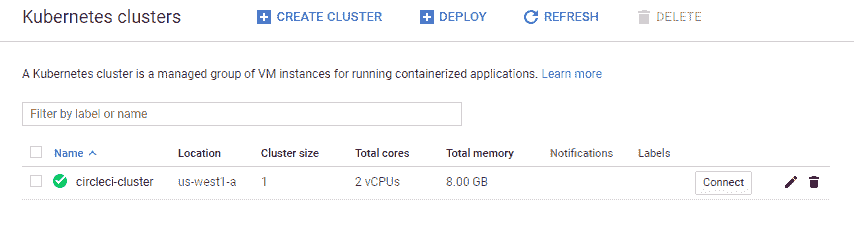
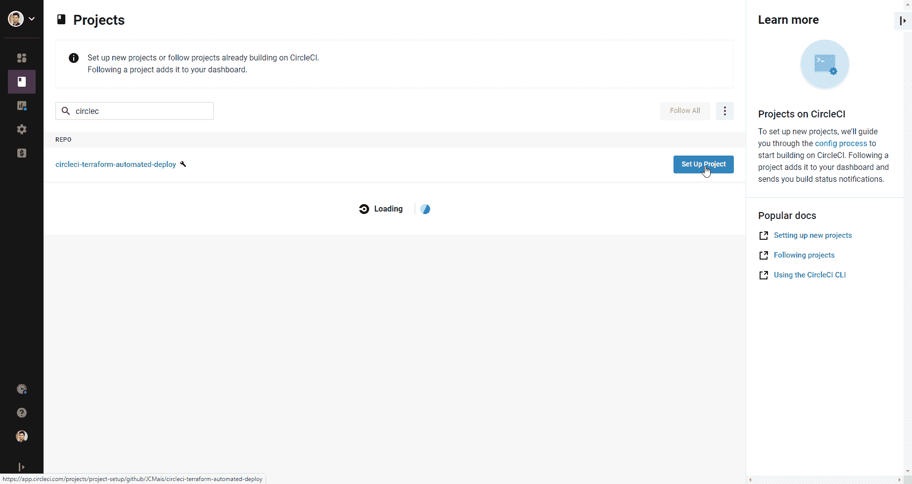
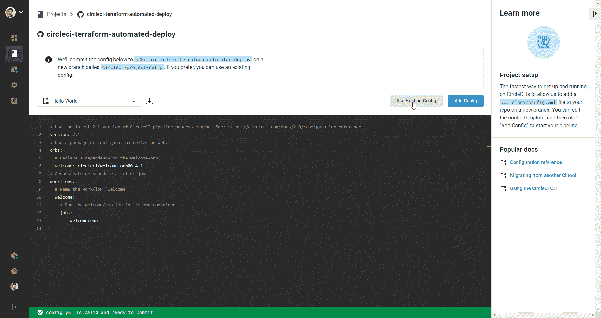
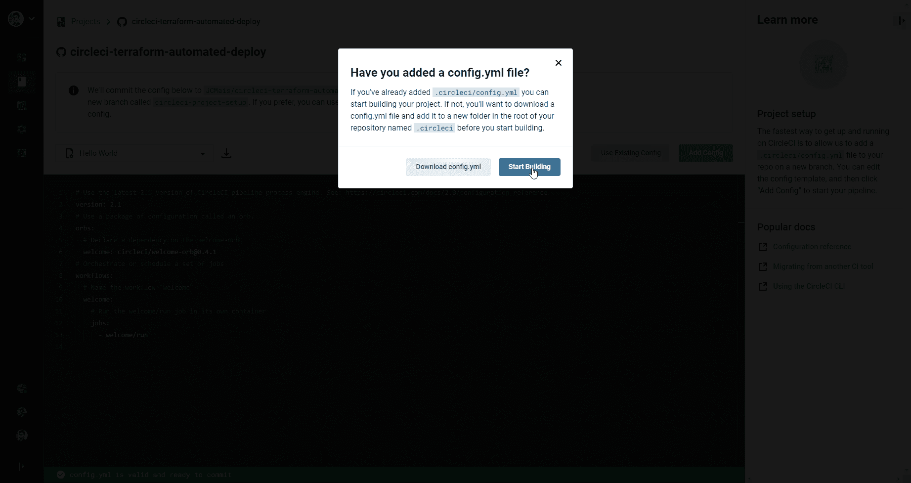
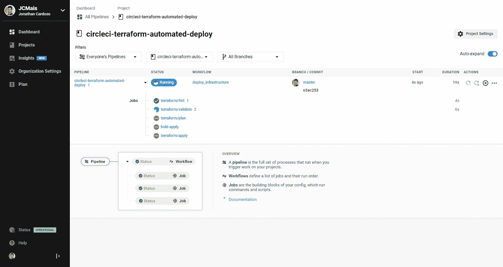
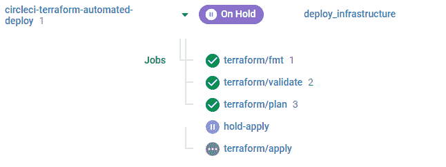
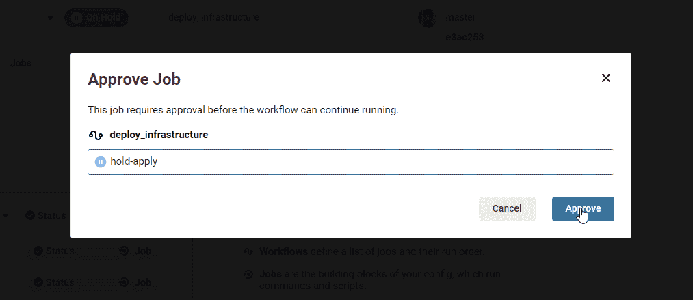
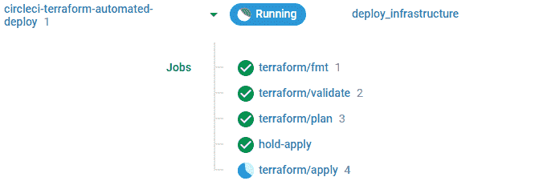

# 使用 Terraform | CircleCI 通过批准作业部署基础架构

> 原文：<https://circleci.com/blog/deploy-terraform-behind-approval-job/>

如果你正在寻找一个基础设施即代码(IaC)工具，那么 [Terraform](https://www.terraform.io/) 可能是你的首选。在本教程中，您将学习如何使用 Terraform 和 CircleCI 工作流自动部署基础架构变更。工作流将使用[批准工作](https://circleci.com/docs/workflows/#holding-a-workflow-for-a-manual-approval)。对于这个项目，我们将把我们构建的基础设施部署到[谷歌云平台](https://cloud.google.com/) (GCP)。即使你使用另一家云提供商，如 [DigitalOcean](https://digitalocean.com/) 或 [Amazon Web Services](https://aws.amazon.com/) (AWS)，你也能够适应并应用你在这里学到的东西。

**注:** *我将在本教程的稍后部分更详细地描述 Terraform 的功能。*

## 先决条件

要遵循本教程，需要做一些事情:

## 关于 CircleCI 工作流程

CircleCI 工作流是一种声明性的方式，用于指定一系列作业应该如何、何时以及以何种顺序在[管道](https://circleci.com/blog/what-is-a-ci-cd-pipeline/)中运行。在本教程中，我们将使用 CircleCI 工作流在每次提交 GitHub 存储库的主分支时部署我们的基础设施变更。

## 关于 Terraform

[Terraform](https://www.terraform.io/) 是一个工具，它允许我们使用用一种叫做 **Hashicorp 配置语言** (HCL)的专门编程语言编写的配置文件来编写基础设施。HCL 配置文件使用`.tf`扩展名。

我们将使用 Terraform 来编写 [`resources`](https://www.terraform.io/docs/configuration/resources.html) 。Terraform 资源是基础设施资源的代码表示。资源可以是服务器、防火墙规则、网络地址或基础设施的另一部分。

为了保持资源与云提供商运行的资源同步，Terraform 使用了一个 [`state`](https://www.terraform.io/docs/glossary.html#state) 。状态可以存储在不同的[后端](https://www.terraform.io/docs/backends/index.html):本地、远程存储服务或状态管理软件。

## 安装 Terraform CLI

我发现安装 Terraform CLI 最简单的方法是从官方下载页面的[下载为您的平台预先构建的二进制文件，并将其移动到当前位于您的`PATH`环境变量中的文件夹。](https://www.terraform.io/downloads.html)

**注意** : *Terraform 提供[大量关于安装](https://learn.hashicorp.com/tutorials/terraform/install-cli)的文档，如果你想尝试不同的方法。*

例如，在 Linux 上，安装 Terraform 就像运行以下命令一样简单:

```
wget -O terraform.zip https://releases.hashicorp.com/terraform/0.13.5/terraform_0.13.5_linux_amd64.zip
unzip terraform.zip && rm terraform.zip
sudo mv terraform /usr/local/bin/ 
```

通过运行以下命令确认安装正确:

```
terraform version 
```

它应该会打印出类似于`Terraform v0.13.5`的内容(Terraform 会定期更新，所以如果您的版本有所不同，请不要感到惊讶)

既然 Terraform 已经开始工作了，我们可以创建我们的项目了。

## 设置 Google 云

我们的第一个任务是在 Google Cloud 上创建一个项目来存储与 Terraform 本身相关的一切，比如状态和服务账户。使用 gcloud CLI 输入:

**注意** : *请在运行以下命令之前，通过运行`gcloud auth login`确认您已登录(使用适当的 Google 帐户),它会重定向到您的默认浏览器供您登录。*

如果您使用的是 Linux/Unix:

```
RANDOM_ID=$(perl -pe 'binmode(STDIN, ":bytes"); tr/a-z0-9//dc;' < /dev/urandom | head -c 8; echo)
gcloud projects create terraform-admin-$RANDOM_ID --name terraform-admin --set-as-default 
```

如果您在 Windows 上(并且没有使用 Linux 的 WSL - Windows 子系统)，请改为运行以下命令:

```
set RANDOM_ID=%random%%random%
gcloud projects create terraform-admin-%RANDOM_ID% --name terraform-admin --set-as-default 
```

第一行创建了一个随机 id，我们可以用它作为 Google Cloud 上项目 ID 的后缀。使用随机 ID 作为后缀很重要，因为项目 ID 必须是唯一的。第二行在 Google Cloud 上创建项目。我们把它命名为`terraform-admin`。

如果您正在使用 Google Cloud 上的一个组织，并且您希望这个项目成为它的一部分，请将该组织添加到上面的 gcloud 命令中，就像这样:`--organization [org-id]`。

该命令的最后输出应该类似于:

`Updated property [core/project] to [terraform-admin-0bqjep28]`

为了使接下来的步骤更容易，我们可以将完整的项目标识符放在一个变量中:

```
export TERRAFORM_PROJECT_IDENTIFIER=$(gcloud config get-value project) 
```

运行以下命令，将最近创建的项目链接到您的计费帐户:

```
gcloud beta billing projects \
	link $TERRAFORM_PROJECT_IDENTIFIER \
	--billing-account [billing-account-id] 
```

记得用您的账单账户的*的实际 ID 替换`billing-account-id`。如果不知道使用什么 ID，最简单的方法是运行:*

```
gcloud beta billing accounts list 
```

您的 ID 是输出的第一列。使用**打开**状态(第三列)为**真**的 ID。

接下来，在 Terraform 项目上启用所需的 API:

```
gcloud services enable \
	cloudresourcemanager.googleapis.com \
	cloudbilling.googleapis.com \
	compute.googleapis.com \
	iam.googleapis.com \
	serviceusage.googleapis.com \
	container.googleapis.com 
```

### 创建服务帐户

创建我们将与 Terraform 一起使用的服务帐户:

```
gcloud iam service-accounts create terraform \
  --display-name "Terraform admin account" 
```

它应该显示如下内容:

`Created service account [terraform].`

将服务帐户电子邮件存储在变量中:

```
export TERRAFORM_SERVICE_ACCOUNT_EMAIL="terraform@$TERRAFORM_PROJECT_IDENTIFIER.iam.gserviceaccount.com" 
```

### 创建服务帐户 JSON 密钥

创建服务帐户后，我们需要一个 JSON 键。JSON 密钥是我们将用来作为此服务帐户进行身份验证的文件:

```
gcloud iam service-accounts keys create \
	--iam-account $TERRAFORM_SERVICE_ACCOUNT_EMAIL \
  ~/gcloud-terraform-admin.json 
```

您应该会得到类似如下的输出:

`created key [d4a3ef60690cb42faa1a71c5d75c5c04f6535c5a] of type [json] as [~/gcloud-terraform-admin.json] for [terraform@terraform-admin-0bqjep28.iam.gserviceaccount.com]`

输出显示 Terraform 服务帐户密钥是在`~/gcloud-terraform-admin.json`创建的。记住这条路，因为我们以后会需要它。

### 添加角色

接下来，我们需要创建角色，以便 Terraform 可以将它们的状态存储在我们稍后将创建的存储桶中。在这一步中，我们将把`viewer`和`storage.admin`角色添加到 Terraform Google Cloud 项目的服务帐户中:

```
gcloud projects add-iam-policy-binding $TERRAFORM_PROJECT_IDENTIFIER \
  --member serviceAccount:$TERRAFORM_SERVICE_ACCOUNT_EMAIL \
  --role roles/viewer

gcloud projects add-iam-policy-binding $TERRAFORM_PROJECT_IDENTIFIER  \
  --member serviceAccount:$TERRAFORM_SERVICE_ACCOUNT_EMAIL  \
  --role roles/storage.admin 
```

它应该在每个命令之后输出项目的更新 IAM 策略。

[地形状态](https://www.terraform.io/docs/state/index.html)可以本地存储，也可以远程存储。如果你是团队的一员，或者使用多台机器，远程存储效果最好。因为我们使用的是 Google Cloud，所以我们将状态直接存储在一个存储桶中。要在 Google Cloud 上创建 bucket，运行:

```
gsutil mb -p $TERRAFORM_PROJECT_IDENTIFIER gs://$TERRAFORM_PROJECT_IDENTIFIER
gsutil versioning set on gs://$TERRAFORM_PROJECT_IDENTIFIER 
```

如果您跳过了前面的步骤，将项目链接到您的计费帐户，您将得到类似于:`Error: Failed to get existing workspaces: querying Cloud Storage failed: storage: bucket doesn't exist`的错误

bucket 名称必须是惟一的，所以我们使用了项目标识符。我们还在存储桶中启用了[版本控制](https://cloud.google.com/storage/docs/object-versioning)。

现在只剩下几个步骤来完成谷歌云的配置。

创建一个单独的项目来创建我们的 Kubernetes 集群:

```
gcloud projects create circleci-k8s-cluster-$RANDOM_ID --name circleci-k8s-cluster 
```

请注意，我们使用的是我们在之前的项目中使用的命令，但是我们使用的是名称`circleci-k8s-cluster`。另一个区别是，我们没有将此项目设置为 gcloud CLI 的默认项目。

将标识符放入变量中，就像我们之前做的那样:

```
export CIRCLECI_K8S_CLUSTER_PROJECT_IDENTIFIER=circleci-k8s-cluster-$RANDOM_ID 
```

就像 Terraform 项目一样，新项目必须链接到您的计费帐户。运行:

```
gcloud beta billing projects \
	link $CIRCLECI_K8S_CLUSTER_PROJECT_IDENTIFIER \
	--billing-account [billing-account-id] 
```

记得用您的付费帐户 ID 替换[`billing-account-id`]。

要完成 Google Cloud 设置，请授予 Terraform 服务帐户对此项目的完全访问权限。给它分配`owner`角色:

```
gcloud projects add-iam-policy-binding $CIRCLECI_K8S_CLUSTER_PROJECT_IDENTIFIER \
  --member serviceAccount:$TERRAFORM_SERVICE_ACCOUNT_EMAIL  \
  --role roles/owner 
```

### 保护项目资源的安全

凭借`owner`权限，Terraform 服务帐户可以完全访问该项目及其所有资源。对服务帐户密钥格外小心可能是明智的。

如果您在 Google Cloud 上有一个组织，您也可以在组织级别为服务帐户赋予类似的角色。这使得 Terraform 服务帐户可以访问该组织内的所有项目。我还建议将`resourcemanager.projectCreator`和`roles/billing.user`角色赋予组织级别的服务帐户。授予这些角色访问权限，可以让 Terraform 自己在 Google Cloud 上创建新项目。对于本教程，我们需要手动创建项目，然后才能在 Terraform 中使用它们。

现在我们可以转移到 Terraform 项目本身。

## 将我们的基础设施创建为代码项目

对于本教程，我们将部署一个简单的 Kubernetes 集群到 Google Cloud。我们需要做的第一件事是在 GitHub 上创建我们的存储库，并在我们的机器上初始化一个指向这个 repo 的本地存储库。将您的项目命名为`circleci-terraform-automated-deploy`。

使用 GitHub CLI，这就像运行:

```
gh repo create circleci-terraform-automated-deploy 
```

将`Visibility`设置为您想要的，并回答两个问题的`Yes`。

转到新存储库:

```
cd circleci-terraform-automated-deploy 
```

创建新文件:

```
.
|- backend.tf
|- k8s-cluster.tf
|- main.tf
|- outputs.tf
|- variables.tf 
```

创建每个文件，将它们留空:

```
touch backend.tf k8s-cluster.tf main.tf outputs.tf variables.tf 
```

以下是每个文件的描述:

*   设置存储我们状态的后端
*   `k8s-cluster.tf`为 Kubernetes 相关资源
*   `main.tf`代表资源和配置，比如我们正在使用的提供商
*   `variables.tf`对于本教程将为空
*   `outputs.tf`对于本教程也是空的

通过添加以下内容更新`backend.tf`:

```
terraform {
  backend "gcs" {
    bucket = "[full-project-identifier]"
    prefix = "terraform/state"
  }
} 
```

记得用 Terraform 正在使用的 Google 项目的完整标识符替换`[full-project-identifier]`。它存储在`$TERRAFORM_PROJECT_IDENTIFIER` shell 变量中。我们将我们的 bucket 命名为与项目标识符完全相同的名称，因此它具有相同的值。

最后，我们将导出一个名为`GOOGLE_APPLICATION_CREDENTIALS`的新 shell 变量。我们在 Terraform 中使用的`google`提供者检查这个变量以进行身份验证。新变量指向我们之前创建的服务帐户密钥:

```
export GOOGLE_APPLICATION_CREDENTIALS=~/gcloud-terraform-admin.json 
```

检查 Terraform 是否能够通过 Google Cloud 进行身份验证，以创建初始状态。在您的 git 存储库中，运行:

```
terraform init 
```

如果失败，尝试运行`terraform init -reconfigure`

您应该会看到多行输出，包括:

> Terraform 已成功初始化！

Terraform 在当前目录下创建了一个`.terraform`文件夹。我们不想将它提交给我们的存储库，所以将其添加到`.gitignore`:

```
echo ".terraform" >> .gitignore 
```

现在我们可以使用 Terraform 创建我们的 Kubernetes 集群。首先，让 Terraform 知道我们想要使用哪个版本的谷歌 Terraform 提供商。打开`main.tf`并添加:

```
provider "google" {
  project = "[circleci-project-full-identifier]"
  region  = "us-west1"
} 
```

除了 Google provider 的版本，我们还设置了`project`和`region`的默认值。创建资源时，默认情况下将使用这些值。确保用实际值替换`[circleci-project-full-identifier]`。在我们的例子中，这是`$CIRCLECI_K8S_CLUSTER_PROJECT_IDENTIFIER` shell 变量的值。

因为我们改变了一个提供者，我们也必须重新初始化 Terraform 状态。运行:

```
terraform init 
```

您的输出应该包括:

> Terraform 已成功初始化！

Terraform 资源基于实际的基础设施资源，因此要在 Google Cloud 上创建 Kubernetes 集群，我们必须创建两个资源:

链接指向每个资源的 Terraform 文档。

在存储库中创建一个名为`k8s-cluster.tf`的新文件(如果还没有创建的话):

```
touch k8s-cluster.tf 
```

用你最喜欢的编辑器打开它，写下:

```
locals {
  k8s_services = [
    "cloudapis.googleapis.com",
    "cloudresourcemanager.googleapis.com",
    "cloudtrace.googleapis.com",
    "compute.googleapis.com",
    "container.googleapis.com",
    "dataflow.googleapis.com",
    "logging.googleapis.com",
    "monitoring.googleapis.com",
    "pubsub.googleapis.com",
    "replicapool.googleapis.com",
    "replicapoolupdater.googleapis.com",
    "servicemanagement.googleapis.com",
    "serviceusage.googleapis.com",
  ]
}

resource "google_project_service" "k8s_cluster" {
  count                      = length(local.k8s_services)
  service                    = local.k8s_services[count.index]
  disable_dependent_services = true
}

resource "google_container_cluster" "circleci_cluster" {
  name     = "circleci-cluster"
  location = "us-west1-a"

  # Kubernetes Version
  min_master_version = "1.17.13-gke.2600"

  # We can't create a cluster with no node pool defined, but we want to use
  # a separately managed node pool. For that, we create the smallest possible
  # default node pool and immediately delete it.
  # This is the recommended way to manage node pools with Terraform.
  remove_default_node_pool = true
  initial_node_count       = 1

  # Setting an empty username and password explicitly disables basic auth
  master_auth {
    username = ""
    password = ""
    client_certificate_config {
      issue_client_certificate = false
    }
  }

  depends_on = [
    google_project_service.k8s_cluster
  ]
}

resource "google_container_node_pool" "circleci_cluster_primary" {
  name     = "primary"
  location = google_container_cluster.circleci_cluster.location
  cluster  = google_container_cluster.circleci_cluster.name

  node_count = 1

  node_config {
    machine_type = "e2-standard-2"

    oauth_scopes = [
      "https://www.googleapis.com/auth/devstorage.read_only",
      "https://www.googleapis.com/auth/logging.write",
      "https://www.googleapis.com/auth/monitoring",
      "https://www.googleapis.com/auth/service.management.readonly",
      "https://www.googleapis.com/auth/servicecontrol",
      "https://www.googleapis.com/auth/trace.append",
    ]
  }
} 
```

准备好 Terraform 配置文件后，我们可以测试 Terraform action planner 将为我们引入的更改输出什么:

```
terraform plan 
```

如果一切正常，您应该会看到多行输出，显示当前状态和`.tf`文件中的不同。它还应该给出变化的摘要:

> 计划:15 添加，0 更改，0 销毁。

Terraform 计划向我们的州添加 15 个资源，并通过这样做，在谷歌云上创建它们。

应用更改:

```
terraform apply 
```

现在，Terraform 将显示相同的差异，但它不会在最后退出，而是提示您应用这些更改:

> 计划:15 添加，0 更改，0 销毁。您想执行这些操作吗？Terraform 将执行上述操作。只有“是”将被接受批准。

回答`yes`。

Terraform CLI 成功退出后，Google Cloud 上的资源就准备好了。通过访问谷歌云控制台并转到`Kubernetes Engine`页面来确认这一点。



如果引用一个声称版本不受支持的 *google api* 错误不成功，请在此参考在 GKE [可用的最新次要版本，并用*常规* **GKE 发布渠道**的**默认补丁版本**更新`k8s-cluster.tf`的第 30 行；然后重新运行`terraform apply`。](https://cloud.google.com/kubernetes-engine/docs/release-notes#current_versions)

希望现在一切正常。我们将通过运行以下命令来破坏我们的基础设施:

```
terraform destroy 
```

输出应包括:

> 计划:0 添加，0 更改，15 销毁。
> 
> 真的要破坏所有资源吗？Terraform 会毁掉你所有的托管基础设施，如上图。无法撤销。只接受“是”进行确认。

回答`yes`整个基础设施将被摧毁，并从国家中移除。

现在是将一切提交给我们的存储库的好时机。不过，在此之前，还有一个非常有用的 Terraform 命令。在项目根目录下，运行:

```
terraform fmt 
```

这个命令将我们的`.tf`文件重写为规范的格式。

提交您的更改:

```
git add --all
git commit -m "terraform initial files"
git push -u origin master 
```

## 创建我们的 CircleCI 配置

为了使我们的 CircleCI 配置更容易，我们将使用一个 [CircleCI Orb](https://circleci.com/orbs/) 。orb 是可重用的代码片段，有助于自动化重复的过程，加速项目设置，并使其易于与第三方工具集成。我们要用的宝珠是 CircleCI 的官方 Terraform 宝珠: [circleci/terraform](https://circleci.com/developer/orbs/orb/circleci/terraform) 。

在 git 存储库的根目录下创建一个名为`.circleci`的新文件夹。添加一个名为`config.yml`的空文件:

```
mkdir .circleci
touch .circleci/config.yml 
```

写:

```
version: 2.1
orbs:
  terraform: "circleci/terraform@1.1.0"
workflows:
  deploy_infrastructure:
    jobs:
      - terraform/fmt:
          checkout: true
          context: terraform
      - terraform/validate:
          checkout: true
          context: terraform
          requires:
            - terraform/fmt
      - terraform/plan:
          checkout: true
          context: terraform
          persist-workspace: true
          requires:
            - terraform/validate
      - terraform/apply:
          attach-workspace: true
          context: terraform
          filters:
            branches:
              only: master
          requires:
            - terraform/plan 
```

我们正在使用 [`circleci/terraform`](https://circleci.com/developer/orbs/orb/circleci/terraform) orb 中的多个作业来为我们完成繁重的工作。工作流会做所有的事情。

对于每次提交，它将验证我们的`.tf`文件是否被正确格式化(`terraform/fmt`作业)以及它们是否有效(`terraform/validate`作业)。工作流还计划了我们对基础设施所做的更改(`terraform/plan` job)。

如果提交是在`master`分支中，我们将`apply`在`terraform/plan`作业中计划的变更。

这已经是很多自动化了。我们可能不希望在未经某人直接批准的情况下对我们的基础设施进行更改。

## 需要批准

要在应用更改之前获得批准，我们需要对`.circleci/config.yml`文件进行更改:

```
version: 2.1
orbs:
  terraform: "circleci/terraform@1.1.0"
workflows:
  deploy_infrastructure:
    jobs:
      - terraform/fmt:
          checkout: true
          context: terraform
      - terraform/validate:
          checkout: true
          context: terraform
          requires:
            - terraform/fmt
      - terraform/plan:
          checkout: true
          context: terraform
          persist-workspace: true
          requires:
            - terraform/validate
      - hold-apply:
          type: approval
          requires:
            - terraform/plan
      - terraform/apply:
          attach-workspace: true
          context: terraform
          filters:
            branches:
              only: master
          requires:
            - hold-apply 
```

我们在工作流程中引入了一项新的[审批工作](https://circleci.com/docs/workflows/#holding-a-workflow-for-a-manual-approval)。该作业将暂停我们的工作流，直到有人批准或取消该请求。现在我们的`terraform/apply`任务要求`hold-apply`任务在开始前得到批准。

批准后，`terraform/apply`作业将开始运行。

将目前为止的所有更改提交到我们的存储库:

```
git add --all
git commit -m "add circleci config"
git push 
```

## 在 CircleCI 建立项目

当你登录到你的 [CircleCI 账户](https://app.circleci.com/)后，点击侧边栏中的`Organization Settings`页面。现在我们可以在名为`terraform`的配置文件中添加我们正在使用的[上下文](https://circleci.com/docs/contexts/)。上下文是一种在 CircleCI 中跨多个项目/作业安全共享环境变量的方式。

在下一页`Contexts`中，点击`Create Context`。将上下文命名为`terraform`，并点击`Create Context`。从列表中选择新上下文以查看其详细信息。

点击`Add Environment Variable`。将环境变量命名为`GOOGLE_CREDENTIALS`。变量的值是我们的 terraform 服务帐户的`.json`键的全部内容。我们将该文件保存到`~/gcloud-terraform-admin.json`。要获取内容，请运行:

```
cat ~/gcloud-terraform-admin.json 
```

将环境变量的值设置为 JSON 密钥文件的内容后，单击`Add Environment Variable`。

现在我们已经完成了上下文的创建，返回到 CircleCI 中的项目页面(通过点击右上角的 X 图标)。搜索您为基础设施创建的 GitHub 存储库。点击`Set Up Project`。



点击`Use Existing Config`。



然后`Start Building`。



这将运行我们存储库的第一次构建。



如果一切正常，UI 将显示一个不同的图标，它到达`hold-apply`任务。



点击`terraform/plan`任务，查看`terraform plan`步骤的输出。如果正确，返回工作流程页面，点击`hold-apply`作业。您可以批准或取消它。



批准它开始`terraform/apply`。



这项工作可能需要一段时间才能完成。一旦它结束，基础设施应该可以在谷歌云控制台上使用，我们的建设将是绿色的。

成功！

当您不再需要基础结构时，您可以运行(本地):

```
terraform destroy 
```

## 结论

通过 Terraform 将基础设施作为代码使用，不仅可以提高应用新变更的速度，还可以跟踪这些变更的所有权。使用 CircleCI 自动部署所有这些将使您的基础设施更加可靠，同时提供高效的软件开发生命周期。

* * *

Jonathan Cardoso 热衷于 DevOps、开源和游戏。他有六年的经验，帮助世界各地的公司通过技术解决方案推进他们的目标。他目前在巴西担任 HelloMD 的全栈开发人员和 DevOps 专家。

[阅读乔纳森·卡多佐的更多帖子](/blog/author/jonathan-cardoso/)