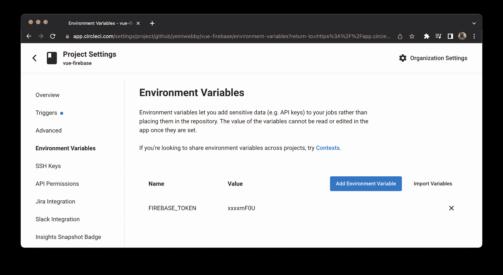

# 将 Vue.js 应用程序自动部署到 Firebase | CircleCI

> 原文：<https://circleci.com/blog/deploy-vuejs-to-firebase/>

> 本教程涵盖:
> 
> 1.  在 Firebase 上设置 Vue.js 应用程序
> 2.  使用 Firebase CLI 部署 Vue.js 应用程序
> 3.  创建连续部署管道

快速搜索一下互联网，就会发现许多服务可以免费托管单页应用程序或静态网站。Firebase 就是这些服务之一。Firebase 是 Google 开发的一个开发平台，提供文件存储、托管、数据库、认证和分析。它是免费的，默认提供 SSL 证书，并在多个地区提供令人印象深刻的速度。在本教程中，我选择 Firebase 来托管我们的演示应用程序。

在本教程中，我将指导您使用 [Firebase CLI](https://firebase.google.com/docs/cli) 。您将使用它来部署现有的 [Vue.js](https://vuejs.org/) 应用程序，GitHub 上的[是免费的。然后我们将超越手工部署，使用](https://github.com/CIRCLECI-GWP/vue-firebase) [CircleCI](https://circleci.com/) 建立一个连续部署管道。

## 先决条件

确保您正确设置了以下内容，以便遵循此要求:

对于本教程，您需要:

> 我们的教程是平台无关的，但是使用 CircleCI 作为例子。如果你没有 CircleCI 账号，请在 注册一个免费的 [**。**](https://circleci.com/signup/)

## 设置演示项目

首先将演示应用程序克隆到您计算机上的一个`vue-firebase`文件夹中。输入以下命令:

```
git clone https://github.com/yemiwebby/vue-user-app.git vue-firebase 
```

将目录更改到项目中。安装其所有依赖项，并使用以下方式为应用程序提供服务:

```
// change directory
cd vue-firebase

// install dependencies
npm install

// Run the application
npm run serve 
```

转到`http://localhost:3000`查看本地机器上的主页。


## 在本地运行单元测试

既然应用程序按预期运行，您需要确保为其组件编写的单元测试通过。打开新的终端。并输入以下命令:

```
npm run test:unit 
```

以下是预期的输出:

```
> vue-user-app@0.1.0 test:unit
> vue-cli-service test:unit

 PASS  tests/unit/user.spec.js
  User List component unit tests: 
    ✓ renders props when passed (13 ms)
    ✓ Renders the list (6 ms)
    ✓ creates a user (7 ms)

Test Suites: 1 passed, 1 total
Tests:       3 passed, 3 total
Snapshots:   0 total
Time:        0.632 s
Ran all test suites. 
```

就是这样！您的应用程序已在本地正确安装。下一步是为 Firebase 上的应用程序创建一个项目。在本教程的后面，您将使用 CircleCI 和 Firebase CLI 部署您的应用程序。

## 在 Firebase 上创建项目

如果您已经有一个 Firebase 帐户，您可以跳过这一步。

要创建一个帐户，进入 [Firebase 主页](https://firebase.google.com/)，点击**开始。**您将被重定向到一个新页面，其中包含添加新项目的说明。


### 将项目添加到 Firebase

1.  点击**添加项目**按钮。
2.  输入项目的名称。我给我的取名为`vue-firebase`。
3.  点击**继续**。
4.  禁用谷歌分析；这个项目不需要它。
5.  再次点击**继续**。


现在，您已经成功地在 Firebase 上创建了一个项目。接下来，您将把您的本地项目与 Firebase 帐户关联起来。

## 设置 Firebase 托管

为了在 Firebase 上成功地托管您的应用程序，您需要安装它的工具，并在您的项目中初始化它。

### 安装 Firebase CLI

打开新的终端。要全局安装 Firebase 工具，请运行以下命令:

```
npm install -g firebase-tools 
```

您现在可以全局访问 Firebase 命令行界面工具。您可以使用它们将代码和资产部署到新创建的 Firebase 项目中。

### 将 Vue 连接到 Firebase

从终端登录到您的 Firebase 帐户:

```
firebase login 
```


接下来，转到`vue-firebase`项目的根目录。初始化项目:

```
firebase init 
```

以下是如何回应提示:

*   选择托管:为 Firebase 托管配置文件，并(可选)设置 GitHub 操作部署。
*   使用现有项目:选择您之前创建的 Firebase 项目；我给我的取名`vue-firebase`。
*   输入`dist`作为公共目录。
*   配置为单页 app: **是**。
*   使用 GitHub 设置自动构建和部署:**否**。对于本教程，我们使用 CircleCI 来运行测试和处理部署。


项目的初始化过程在项目的根目录下生成两个唯一的文件。这些文件是成功部署所必需的，并且必须签入源代码管理:

*   `firebase.json`包含您项目的托管配置。其内容指导 Firebase CLI 更新和部署项目目录中的文件。
*   `.firebaserc`指定成功部署到 Firebase 后，连接到上传代码的项目。

## 配置 CircleCI

将`.circleci/config.yml`的内容替换为:

```
version: 2.1
jobs:
  build-and-test:
    working_directory: ~/project
    docker:
      - image: cimg/node:17.4.0
    steps:
      - checkout
      - run:
          name: Update NPM
          command: "sudo npm install -g npm"
      - restore_cache:
          key: dependency-cache-{{ checksum "package-lock.json" }}
      - run:
          name: Install Dependencies
          command: npm install
      - run: npm install --save-dev firebase-tools    
      - save_cache:
          key: dependency-cache-{{ checksum "package-lock.json" }}
          paths:
            - ./node_modules
      - run:
          name: Run test for the application
          command: npm run test:unit
      - run:
          name: Build application for production
          command: npm run build 
      - run:
          name: Deploy app to Firebase
          command: ./node_modules/.bin/firebase deploy --token=$FIREBASE_TOKEN                  
workflows:
  build-and-test:
    jobs:
      - build-and-test 
```

这个脚本:

*   拉入 Node.js 的 CircleCI Docker 图像。
*   使用映像安装所有必需的依赖项。
*   在 CircleCI 上运行应用程序的测试。
*   使用`npm install --save-dev firebase-tools`安装 Firebase 工具。
*   设置一个命令，以便在测试成功时将应用程序部署到 Firebase。

部署需要`FIREBASE_TOKEN`。因为您是从终端登录的，所以可以使用 Firebase CLI 轻松创建令牌。输入以下命令:

```
firebase login:ci 
```


复制这些信息并保存在方便的地方。你以后会需要它的。

下一步是在 GitHub 上建立一个资源库，并将项目链接到 CircleCI。查看[将项目推送到 GitHub](https://circleci.com/blog/pushing-a-project-to-github/) 以获取指示。

登录您的 CircleCI 帐户。如果你注册了你的 GitHub 账户，你所有的库都可以在你项目的仪表盘上看到。

在您的`vue-firebase`项目旁边，点击**设置项目**。


系统将提示您编写新的配置文件或使用现有的配置文件。选择现有的分支，并输入您的代码在 GitHub 上所在的分支的名称。点击**设置项目**。

您的第一个工作流将开始运行。这个构建将会失败，因为您还没有创建`FIREBASE_TOKEN`环境变量。


要解决这个问题，您需要添加`FIREBASE_TOKEN`作为环境变量。点击**项目设置**，然后点击左边栏的**环境变量**。创建此变量:

*   `FIREBASE_TOKEN`是您之前从终端生成的令牌的值。



回到仪表板。点击**从失败的**重新运行工作流程。这会触发工作流，这次应该会成功构建。

转到上一步中显示的托管 URL。对我来说网址是:`https://vue-firebase-2c246.web.app`。


## 结论

无论您使用 Firebase 还是其他托管服务，CircleCI 都可以帮助您实现 Vue.js 项目的持续集成和部署。我希望这对你有所帮助。本教程的完整源代码可以在 GitHub 上找到[。](https://github.com/CIRCLECI-GWP/vue-firebase)

* * *

Oluyemi 是一名拥有电信工程背景的技术爱好者。出于对解决用户日常遇到的问题的浓厚兴趣，他冒险进入编程领域，并从那时起将他的问题解决技能用于构建 web 和移动软件。Oluyemi 是一名热衷于分享知识的全栈软件工程师，他在世界各地的几个博客上发表了大量技术文章和博客文章。作为技术专家，他的爱好包括尝试新的编程语言和框架。

[阅读更多 Olususi Oluyemi 的帖子](/blog/author/olususi-oluyemi/)