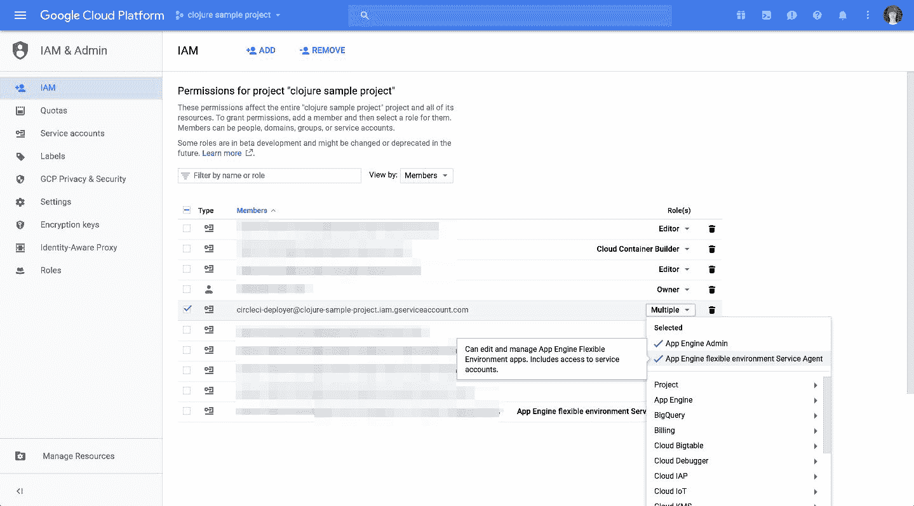
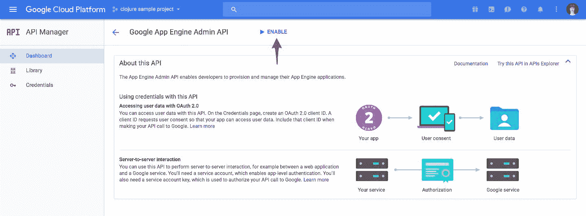
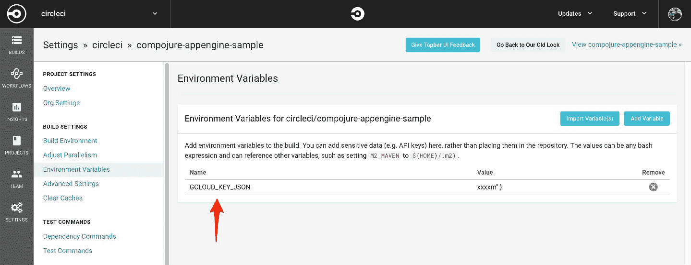
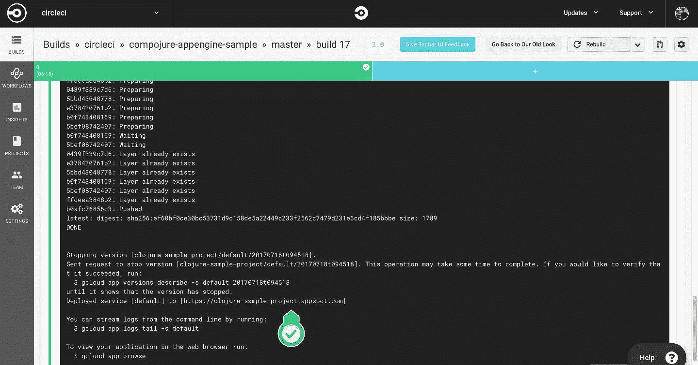

# 将 Clojure 应用程序部署到 Google Cloud - CircleCI

> 原文：<https://circleci.com/blog/deploying-clojure-applications-to-google-cloud/>

**来自出版商的说明:**您已经找到了我们的一些旧内容，这些内容可能已经过时和/或不正确。尝试在[我们的文档](https://circleci.com/docs/)或[博客](https://circleci.com/blog/)中搜索最新信息。

* * *

## 不断将 Clojure 应用部署到 Google 应用引擎

在 CircleCI 我们写了很多 Clojure。主要后端 app 是> 10 万行 Clojure 代码，前端是> 3 万行 ClojureScript。

我喜欢 Clojure 这种语言，以至于我决定也用 Clojure 做我的兼职项目。

当我意识到部署到 AWS 需要一系列精心设计的技巧来实现连续交付(在 GH -> production 上推送至 master)时，我感到非常惊讶。虽然我每天都在工作中使用 AWS，但我无法证明为我的副业项目构建自己的实现是正确的，比如秘密和蓝/绿部署。有 Kubernetes，但是目前只为我的副业项目运行 k8s 集群既不可行也不划算(开销太大)。当我在写一个 MVP 而没有时间做基础设施的时候，作为一个开发者，我需要的是在自制 CD 过程和 Kubernetes 的糟糕黑客之间找到一个很好的中间点。

我开始寻找能够让我开箱即用、配置尽可能少的 CD 的替代品。虽然 Heroku 是一个很好的选择，但我一直在寻找一种更灵活的，理想情况下负担得起的东西。

谷歌应用引擎，作为一个完全托管的应用运行时，目前符合我的标准。GAE 处理蓝/绿部署，允许比 Heroku 更多的定制。谷歌目前为每个决定创建新 GAE 账户的人提供 300 美元的信用点数，此外他们还提供免费等级。所有这些结合起来是一个很好的解决 MVP 的方法。

## 更改默认模板以支持应用引擎部署

我花了相当多的时间将我的第一个 Clojure 应用程序部署到 GAE，所以我想我应该创建一个框架项目，人们可以用它来将他们的第一个项目推出到 App Engine。我从一个全新的模板 Compojure 项目开始，只添加了一些东西。

*   Dockerfile。我们将使用 App Engine 灵活的环境，主要是因为更新总是意味着更好，Dockerfile 对于开始使用它是必不可少的。这个 [Dockerfile 本身](https://github.com/circleci/compojure-appengine-sample/blob/master/Dockerfile)非常简单。它所做的只是从小型 Clojure 基础映像开始，将项目代码添加到`/code`并执行 entrypoint 脚本。理想情况下，我们会构建一个独立的 uberjar，只将放入容器中，但同样，这种设置的目的是为了方便实验。

*   拥有[入口点脚本](https://github.com/circleci/compojure-appengine-sample/blob/master/docker-entrypoint.sh)允许我们轻松定制启动我们正在构建的服务所需的命令。Compojure lein 模板提供了一种通过`lein ring server-headless`用应用程序启动无头服务器的便捷方式。其他框架或应用类型可能需要一个简单的`lein run`来代替。

*   docker-compose . yml .[docker-compose 文件](https://github.com/circleci/compojure-appengine-sample/blob/master/docker-compose.yml)纯粹是为了更好的开发体验。`docker-compose up -d`将为您启动并运行示例应用程序。

*   。circle ci/config . yml . circle ci 工作流的[配置允许我们将测试步骤与部署分开。我们还使用两种不同的基本映像进行测试和部署——现在部署到 App Engine 只意味着推出代码，让 Google Cloud 为您完成其余工作，我们在部署时不需要 Clojure 映像。我们使用提供 Google Cloud SDK 的图片。](https://github.com/circleci/compojure-appengine-sample/blob/master/.circleci/config.yml)

让我们来看一下将 Clojure 项目部署到 Google App Engine 所需的步骤。

## 将 Clojure 项目持续部署到 Google App Engine

我们假设你已经注册了一个谷歌云账户，并且收到了谷歌提供的免费积分。

### 1.建立一个谷歌云项目，并启用谷歌应用引擎灵活的环境

我们将导航到 console.cloud.google.com，登录或注册，然后创建一个新的谷歌云项目。

### 2.创建服务帐户并启用 GAE API 访问

为了给 CircleCI deploy build 权限来推出我们应用程序的新版本，我们需要在我们的项目中创建一个服务帐户。服务帐户将需要应用引擎管理和应用引擎灵活环境服务代理权限。创建服务帐户时，将生成的 JSON 保存到磁盘。

 *给服务账号添加必要的权限*

一旦完成，我们将需要为我们的项目启用两个缺省禁用的 API 集。

在 Google Cloud 的项目控制面板中，我们可以导航到侧边栏中的 API 管理器项目，然后单击库，搜索这些项目并单击启用:

*   Google 应用引擎管理 API
*   谷歌应用引擎灵活的环境

 *启用谷歌应用引擎管理 API*

### 3.创建 CircleCI 项目并添加服务帐户凭据

我们已经将代码推送到我们的 VCS 提供商，所以现在我们导航到 CircleCI 项目页面，并从那里添加我们的 GitHub 或 Bitbucket repo 作为新的 CircleCI 2.0 项目。CircleCI 将运行一次`build`任务，我们将看到我们的测试通过了。不会触发部署步骤。

现在，我们将下载的带有服务帐户的 JSON 添加到 CircleCI 项目的加密环境变量中。我们称这个变量为`GCLOUD_KEY_JSON`。repo 中的配置会将该变量的内容输出到一个文件中，然后我们会将该文件传递给`gcloud`实用程序进行身份验证。

 *将服务帐户凭证添加到 CircleCI* 上的加密环境变量中

## 4.在 CircleCI 配置中编辑项目名称，然后推送

我们现在需要编辑 CircleCI 配置中的`gcloud`调用中的项目名称，以匹配我们在 Google Cloud 上的项目名称。一旦我们提交并推动我们的更改，CircleCI 将运行完整的构建和部署工作流，并将部署我们的应用程序。

*circle ci*上的一次成功部署作业

从现在开始，在 GitHub 或 Bitbucket 上合并 pull 请求将同时触发构建和部署作业，并持续将我们的 Clojure 应用部署到 Google App Engine。

## 逮到你了

谷歌应用引擎中的一些东西可能会惹恼你，或者让你的谷歌云账单比你想象的要大得多。

首先，自动缩放在默认情况下是启用的。这就是为什么在 app.yaml 中我们选择手动缩放并指定实例类型。

其次，JVM 无法正确解释 Docker 守护进程设置的内存限制，无论您是在本地运行应用程序，还是在基于 Docker 的环境中运行应用程序，如 Google App Engine(或 CircleCI 2.0)。Java 8 不支持基于组的内存限制。当您在运行 Java 8 应用程序的 Docker 容器上设置内存限制时，您基本上是在告诉 Docker 守护进程，如果内存使用超过了限制，就终止容器，但是 JVM 并不知道这个限制。因此，它在运行它的机器上分配尽可能多的空闲内存(而不是容器)。这会导致一致的内存不足错误。解决方案是通过设置$JAVA_OPTS 环境变量来显式地限制 JVM 的内存使用，例如，如果您希望 JVM 只使用 300M 的内存，那么可以设置为包含`-Xmx300m`。我们的 app.yaml 中指定的实例大小是最小的实例(也是最便宜的实例)，并且只有 128MB 的可用内存。在模板项目中，我们将最大 Java 堆设置为 100MB。

## 结论

为 Clojure 项目设置从 CircleCI 到 Google App Engine 的连续部署需要几个步骤，但是过程本身非常简单。

对于我个人的使用案例——快速部署辅助项目——这种设置的最大优势是 App Engine 自动处理蓝/绿部署，因此对于较小的项目，不需要在部署前关闭应用程序，并在部署完成后再次启动它(当我部署到 AWS EC2 机器时，我必须在 CD 脚本中这样做)。不再需要手动部署，不再需要在 EC2 机器上不断打开 tmux 会话(真实的故事)，也不再需要未部署的更改。