# 将基于容器的 web 应用部署到 Azure | CircleCI

> 原文：<https://circleci.com/blog/deploying-container-based-node-apps-to-azure/>

容器已经成为广泛使用的 DevOps 技术。容器使 DevOps 专业人员能够将基础设施定义为代码，从而可以为测试、部署和运行应用程序创建隔离的环境。在本文中，我们将学习如何使用 [Azure](https://azure.microsoft.com/) 容器将 [Node.js](https://nodejs.org) 应用程序部署到 Azure web 应用程序。

## 先决条件

要完成本教程，您需要:

1.  您系统上安装的 [Node.js](https://nodejs.org) (版本> = 10.3)
2.  一个蓝色的账户
3.  一个[圆](https://circleci.com/)的账户
4.  GitHub 的一个账户
5.  安装了 Azure CLI

安装并设置好所有这些之后，您就可以开始本教程了。

## 在 Azure 上创建容器注册中心

我们的第一步是在 Azure 上创建一个容器注册中心来存储和构建 Docker 容器。进入你的 Azure 门户主页，点击**创建**。然后从容器菜单中点击**容器注册表**。

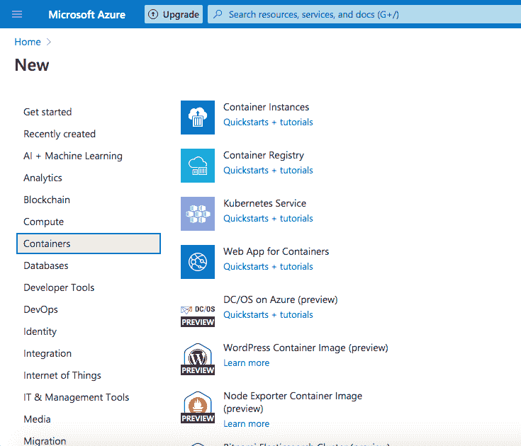

在注册表创建页面上，填写信息，包括注册表的名称。

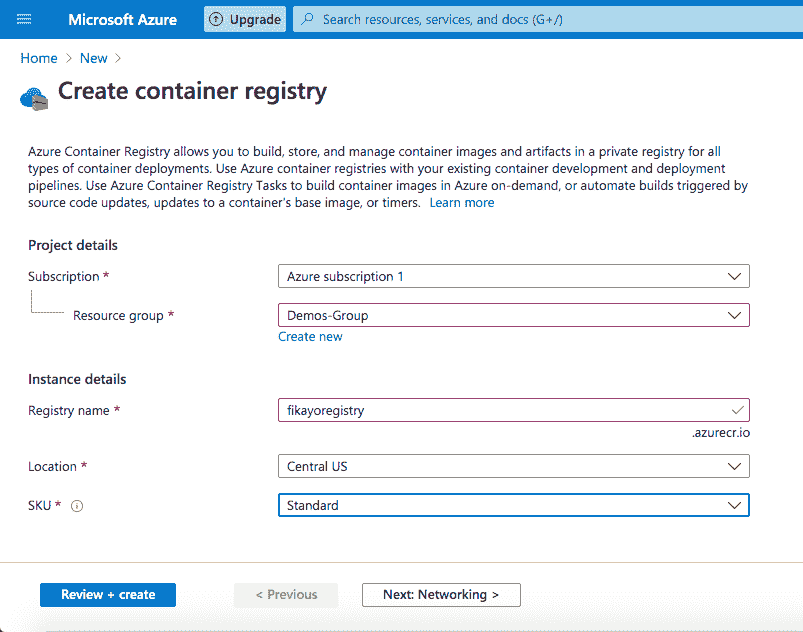

点击**审核+创建**打开审核页面。确认您的注册表信息，然后点击**创建**触发注册表创建过程。

如果您愿意，可以使用 Azure CLI 通过运行以下命令来创建注册表:

```
az acr create --name fikayoregistry --resource-group Demos-Group --sku standard --admin-enabled true 
```

我已经将我的注册表命名为`fikayoregistry`，但是您可能想要使用不同的名称。如果这样做，请确保用您选择的名称来代替。

## 克隆演示项目

下一步是使用 [Docker](https://www.docker.com/) 容器克隆 Node.js 项目以部署到 Azure。要克隆项目，请运行:

```
git clone --single-branch --branch base-project https://github.com/coderonfleek/node-azure-docker.git 
```

接下来，使用`cd node-azure-docker`进入项目的根目录，然后使用`npm install`安装依赖项。

这个项目是一个基本的 Node.js API，它有一个端点用于返回一组`todo`对象。它还包含一个用于测试端点的测试套件。

使用`npm start`命令运行应用程序。应用程序将从地址`http://localhost:5000`开始。在您的浏览器中加载以下路线`http://localhost:5000/todos`，显示`todos`列表。

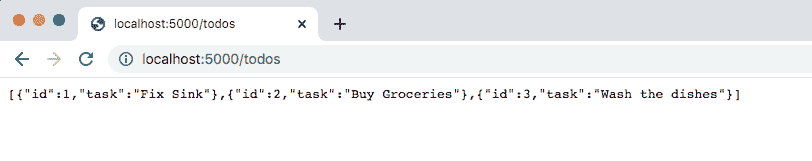

## 在 Azure Container Registry 上创建和构建 Docker 映像

下一步是创建一个 Docker 文件，这样定制的 Docker 映像就可以运行该项目。然后，它将被推送到 Azure Container Registry (ACR)并在其上构建。

在项目的根目录下，创建一个新文件，将其命名为`Dockerfile`(没有扩展名)，并输入:

```
FROM node:current-alpine
COPY . /app
WORKDIR /app
RUN npm install
ENTRYPOINT ["npm", "start"] 
```

这个文件使用一个标签为`current-alpine`的`node`图像作为它的基础。然后，它将项目的内容复制到映像中的一个`app`文件夹中，将`app`设置为工作目录，并运行`npm` install 来安装依赖项。通过运行`npm start`启动应用程序。

在项目的根目录下，使用`Dockerfile`构建图像。确保用您之前选择的名称替换`<container_registry_name>`。运行:

```
az acr build --registry <container_registry_name> --image mynodeimage . 
```

注意命令末尾的点(`.`)。确保包含它；它将构建上下文定义为当前目录。

这张图片被命名为`mynodeimage`，它将出现在`ACR`中。这个命令将文件夹的内容发送到 Azure Container Registry，它使用 Dockerfile 中的指令来构建图像并存储它。

若要查看您创建的映像，请转到门户中的 Azure 资源页面。单击您的注册表，然后从**服务**部分单击**存储库**。

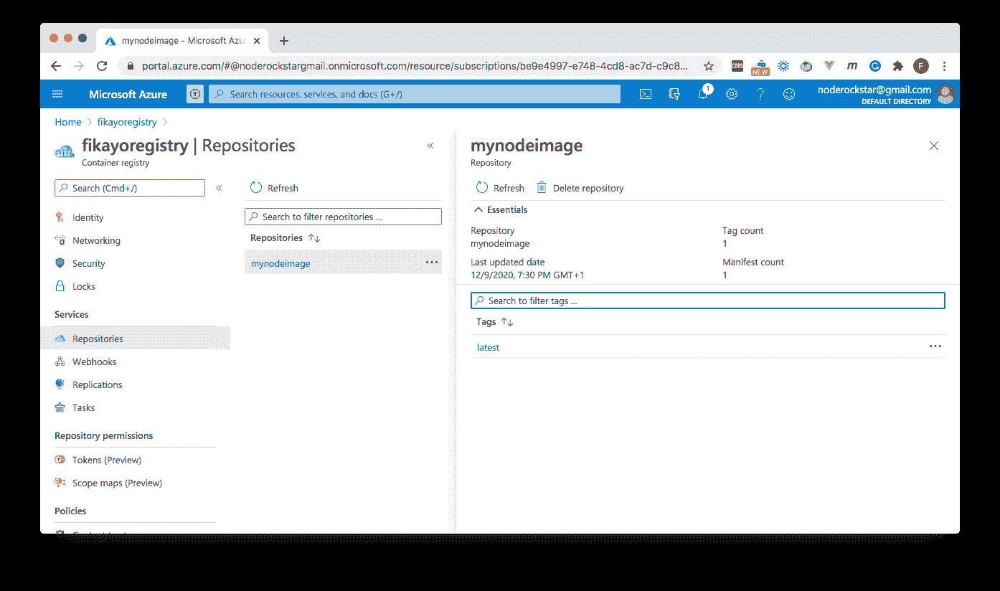

有益的是，每个新建的图像都被标记为`latest`。包含 Node.js 应用程序的 Docker 映像现在可以在您的注册表中部署到 Azure App Service。

## 在 ACR 上启用 Docker 访问

要部署应用程序，您需要在 Azure Container Registry 中启用 Docker 访问。这一步允许 Azure App 服务访问存储在注册表中的容器。

在您的资源页面中，单击注册表以打开其概述页面。从设置部分点击**访问键**。

确保**管理员用户**已启用。

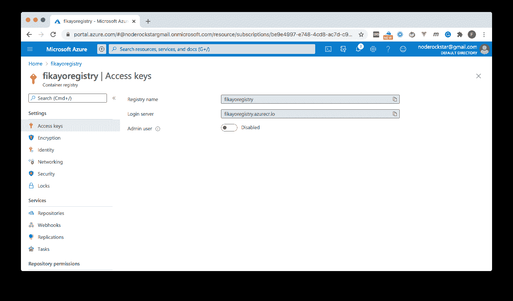

当管理员用户选项启用时，按钮将变成蓝色，并显示用户名和一些密码。这些信息为 Azure web app 提供了对注册表中图像的访问。

## 创建 web 应用程序

接下来，创建一个 [Azure Web App](https://azure.microsoft.com/en-us/services/app-service/web/) 。从 Azure 门户，通过点击**主页**，然后**创建**。选择 **Web App** 。

输入 web 应用程序名称，然后选择:

*   **Docker 容器**作为发布选项
*   **Linux** 作为操作系统

选择一个地区，然后点击**下一步:Docker** 。

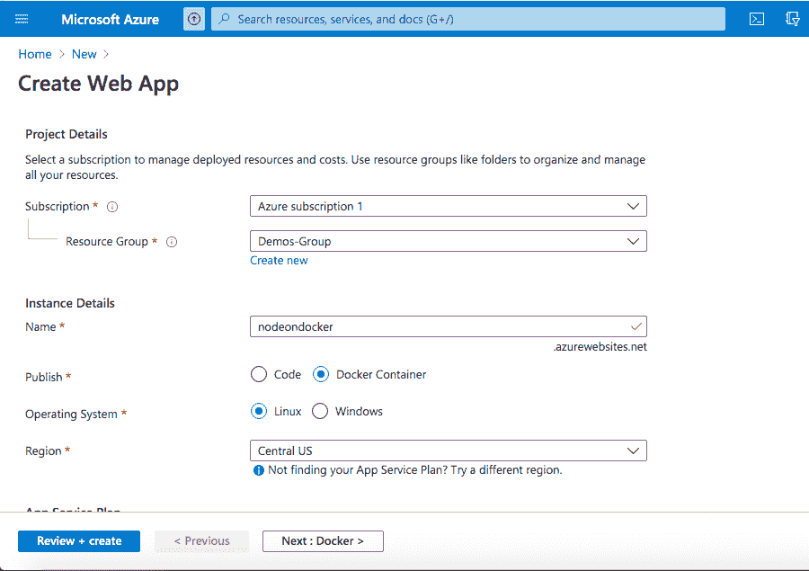

在 Docker 页面上:

*   选择单个容器选项
*   选择 Azure 容器注册表作为图像源
*   在注册表字段中输入您的注册表名称(在本教程中我使用的是`fikayoregistry`)
*   使用`mynodeimage`作为图像字段
*   对于标签，选择`latest`
*   让`Startup Command`为空；您的 docker 文件已经有一个`ENTRYPOINT`命令

现在我们准备好点击**审查+创建**来审查细节。然后点击**创建**。创建 web 应用程序后，使用浏览器访问地址`https://[YOUR_WEB_APP_NAME].azurewebsites.net/todos`。请确保将`YOUR_WEB_APP_NAME`替换为您创建的 web 应用程序的名称。我用的是`https://nodeondocker.azurewebsites.net/todos`。

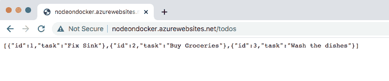

在您配置了 web 应用程序之后，Docker 映像将被提取并运行。你的应用第一次加载是“冷启动”。这意味着您的应用程序需要一些时间才能加载。每次从`Docker`映像进行新的部署时，都会有一个“冷启动”。之后，该应用程序立即可用。

## 在 web 应用程序上实现持续部署

你不是来做一次性部署的，对吧？您需要持续部署。若要在 Azure 中进行设置，请转到您的资源页面，然后单击您的 web 应用名称以打开概述页面。从侧面菜单上的设置部分，通过点击**容器设置**。在容器设置页面，向下滚动到**连续部署**选项，打开，点击**保存**。

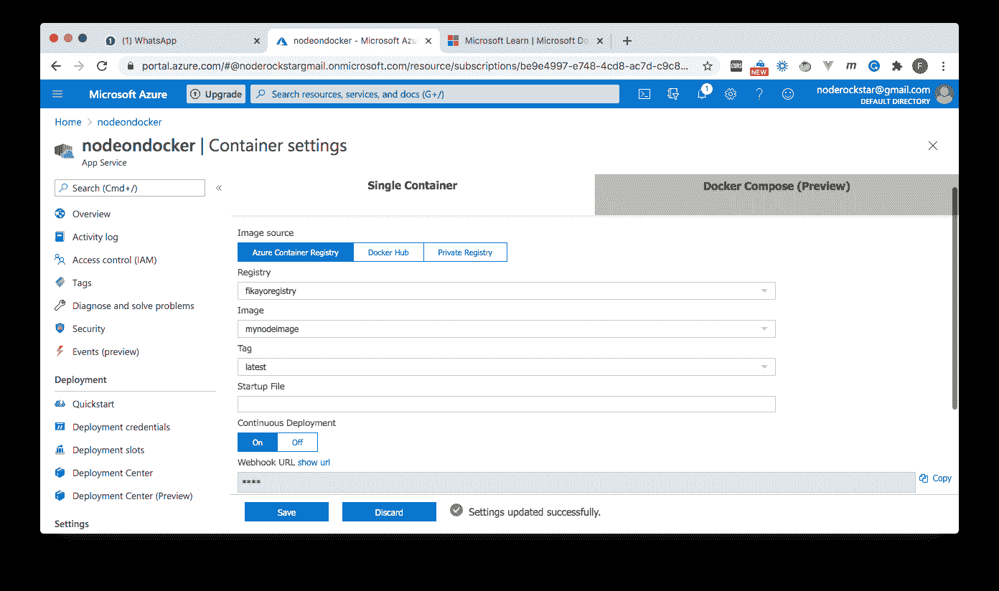

选择连续部署后，每当 Docker 映像在 Azure Container Registry 上重建时，web 应用程序将触发 Node.js 应用程序的新部署。

## 创建 CircleCI 项目

在转到 CircleCI 控制台之前，让我解释一下我们将使用容器建立到 web 应用程序的连续部署管道的策略。您已经知道，当在 Azure Container Registry 上构建或重建映像时，web 应用程序将重新部署新版本的应用程序。目标是以某种方式确保一旦代码被推送到远程存储库，就会触发新的构建。这些是我们将在本教程中使用的步骤:

*   使用 GitHub 存储库在 CircleCI 上创建一个项目
*   创建一个 [Azure 容器注册任务](https://docs.microsoft.com/en-us/azure/container-registry/container-registry-tasks-overview)。此任务监视远程存储库上的一个分支，以便在对该分支进行推送时重建映像
*   编写一个 CI/CD 管道脚本，当测试通过时，该脚本将推送到被监视的分支

我们将从在 CircleCI 建立项目开始。

首先，在项目的根目录下运行`rm -rf .git`来删除任何现有的`git`历史。接下来，[将项目推送到 GitHub 上的远程存储库](https://circleci.com/blog/pushing-a-project-to-github/)。确保这是连接到您的 CircleCI 帐户的 GitHub 帐户。

转到您的远程存储库并创建一个`deploy`分支。

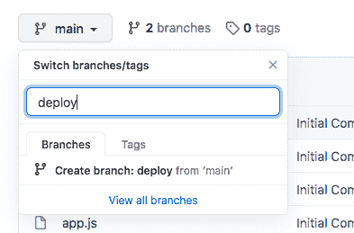

该分支将会被监视以触发对`Docker`映像的重建。

在 CircleCI 仪表板上，点击**添加项目**。

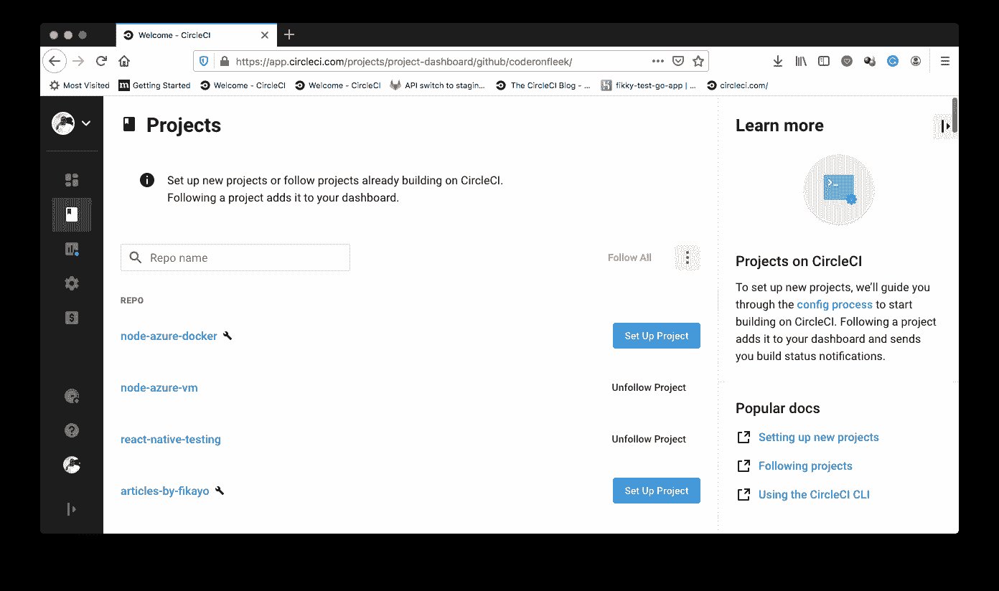

点击**设置项目**。

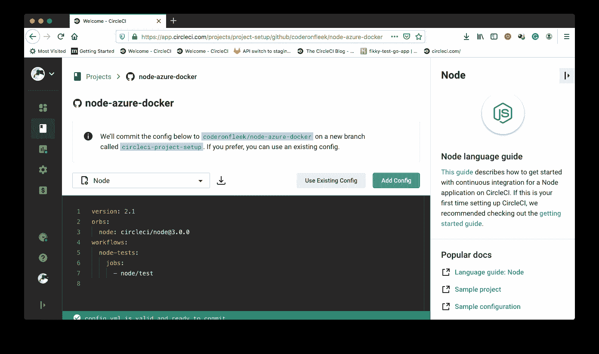

在设置页面上，点击 **Use Existing Config** 以指示 CircleCI 您将手动添加一个配置文件，而不使用示例。将提示您下载管道的配置文件或开始构建。

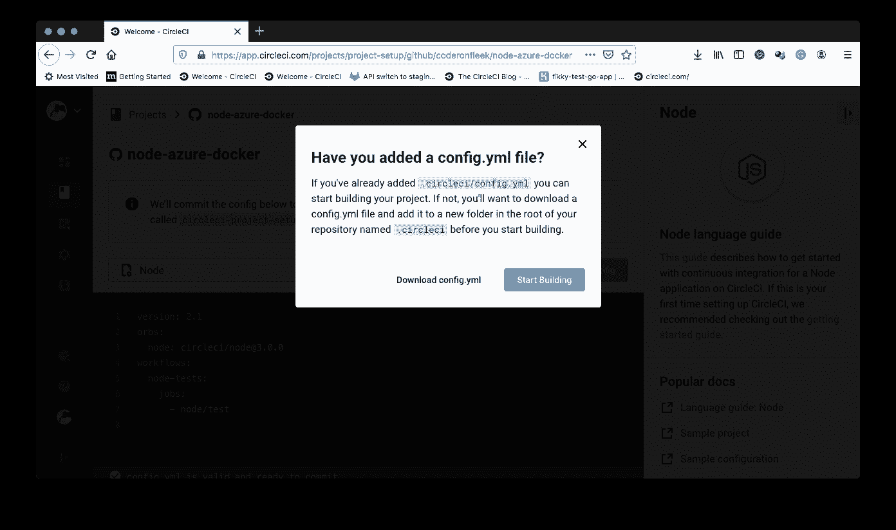

点击**开始建造**。

注意: *这个构建将会失败，因为您还没有设置配置文件。我们将在本教程的后面部分进行介绍。*

## 在 CircleCI 项目上设置 GitHub 身份验证

因为这个项目的`deploy`分支将从管道配置中被推送，所以我们需要设置认证访问，以便 CircleCI 可以访问 GitHub 上的存储库。

幸运的是，CircleCI 提供了一种添加`User API Key`来实现这一点的方法。从你的项目中，点击**项目设置**(页面右上角)，然后点击 **SSH 按键**(在侧边菜单上)。

在用户密钥部分，点击**用 GitHub** 授权。如果你已经这样做了，选项将不可见，所以跳过下一段，在**用户键**块中复制指纹。

在连接到 GitHub 之后，一个**添加用户密钥**按钮出现在用户 API 密钥部分。单击此按钮以生成指纹，我们将在本教程稍后的部署管道中使用该指纹。复制指纹并保存在安全的地方。

因为指纹将与您的 GitHub 电子邮件和用户名一起在管道脚本中使用，所以将这些凭证放在环境变量中更安全。从项目设置的侧菜单中，点击**环境变量**。添加这些环境变量:

*   `GITHUB_EMAIL`:您连接的 GitHub 账户的电子邮件
*   `GITHUB_USERNAME`:你的 GitHub 用户名
*   `GITHUB_FINGERPRINT`:生成的认证指纹

## 创建 Azure 容器存储库任务

我之前提到过，我们需要一个 Azure Container Repository 任务来监视`deploy`分支的更新和触发重建。不过，首先，我们需要一个 GitHub 个人访问令牌。

从你的 GitHub 页面，点击**设置**、**开发者设置**。从侧面菜单中，选择**个人访问令牌**。然后，点击**生成新令牌**。确认您的密码以进入令牌创建页面。

输入密钥的描述。授予除`delete_repo`之外的所有权限。对于本教程，最重要的权限是在 repo 中创建一个`webhook`的能力。我们将使用这个 webhook 向 Azure 容器注册中心发送信号，以触发`Docker`图像的新构建。

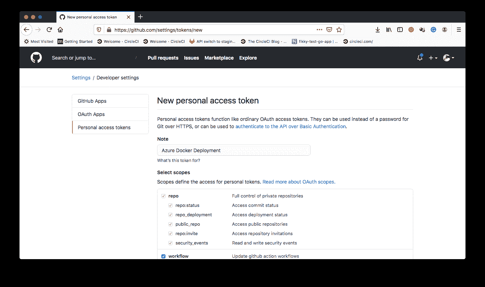

点击**生成令牌**并在令牌显示时复制令牌。该令牌将不会再次显示，因此请确保您现在获得信息。

要创建 Azure 容器注册表任务，请转到项目的根目录。使用您的存储库地址、注册表名称和 GitHub 访问令牌，运行:

```
az acr task create --registry <container_registry_name> --name buildnodeapp --image mynodeimage --context <your_github_repo>#deploy --file Dockerfile --git-access-token <access_token> 
```

这段代码创建了一个`buildnodeapp`任务，它将在每次更新被推送到`deploy`分支时重建`mynodeimage`映像。要查看您新创建的任务，请转到注册页面并点击**任务**。

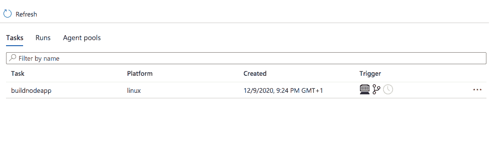

## 编写持续部署脚本

我们的下一步是使用`Docker`容器为 Node.js 应用到 Azure web 应用的持续部署编写管道脚本。为了使管道脚本能够将更新推送到 GitHub repo 的`deploy`分支，我们将使用节点包 [gh-pages](https://www.npmjs.com/package/gh-pages) 。大多数情况下，这个包用于将文件推送到一个专门的`gh-pages`分支，以将静态站点部署到 [GitHub 页面](https://pages.github.com/)。方便的是，这个包是可配置的，因此您可以将文件从一个分支推到任何一个*存储库中的另一个分支。*

在项目的根目录下，安装`gh-pages`包作为开发依赖项:

```
npm install gh-pages --save-dev 
```

接下来，在`package.json`文件中添加`deploy`脚本:

```
"scripts" : {
  ...
  "deploy" : "npx gh-pages -b deploy --message '[skip ci] Updates' -d ./"
} 
```

这个脚本调用`gh-pages`，使用`npx`将文件从`main`分支推送到`deploy`分支。我添加了`[skip ci] Updates`的`--message`参数，这样当更改被推送到这个分支时，CircleCI 就不会重新运行管道。

在项目的根目录下，创建一个名为`.circleci`的文件夹，并在其中创建一个名为`config.yml`的文件。在`config.yml`里面，输入:

```
version: 2
jobs:
  build:
    working_directory: ~/repo
    docker:
      - image: circleci/node:10.16.3
    steps:
      - checkout
      - run:
          name: update-npm
          command: "sudo npm install -g npm@5"
      - restore_cache:
          key: dependency-cache-{{ checksum "package-lock.json" }}
      - run:
          name: install-packages
          command: npm install
      - save_cache:
          key: dependency-cache-{{ checksum "package-lock.json" }}
          paths:
            - ./node_modules
      - run:
          name: Run tests
          command: npm run test

  deploy:
    working_directory: ~/repo
    docker:
      - image: circleci/node:10.16.3
    steps:
      - checkout
      - run:
          name: Configure Github credentials
          command: |
            git config user.email $GITHUB_EMAIL
            git config user.name $GITHUB_USERNAME
      - add_ssh_keys:
          fingerprints:
            - $GITHUB_FINGERPRINT
      - run:
          name: Deploy to Azure Web App Using Azure Container Registry Task
          command: npm run deploy

workflows:
  version: 2
  build:
    jobs:
      - build
      - deploy:
          requires:
            - build # only deploy once build job has completed
          filters:
            branches:
              only: main # only deploy on the main branch 
```

该文件定义了一个包含两个任务的工作流:`build`和`deploy`。

`build`作业从远程存储库中检出代码，安装依赖项，并运行测试以确保代码中没有错误。一旦`build`作业完成，`deploy`作业就会接管。它检查出代码的一个干净的副本，因为我们不想将`node_modules`文件夹从先前的作业推到被监视的分支。然后`deploy`作业配置对 GitHub 的访问，这样管道脚本就可以将更新推送到被监视的分支。然后，该作业运行 Node.js 脚本来推送更新并触发新的`Docker`映像构建。

`deploy`作业依赖于`build`作业，因此在`build`作业完成之前它不会运行。为了查看运行两个作业后部署的变化，我们需要向`todo.js`添加一个任务:

```
module.exports = [
  ...
  {
    id: 4,
    task: "Make Dinner"
  }
]; 
```

添加任务意味着我们需要更新`__tests__/apiTest.js`中的测试套件来检查四个`todo`对象。将第 15 行改为:

```
expect(res.body.length).toBe(4); 
```

保存对项目的更改，并提交到远程存储库中的主分支。

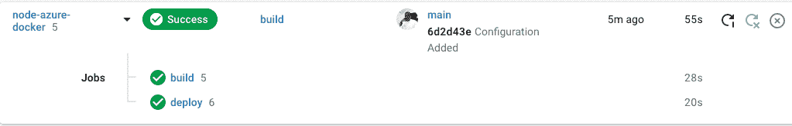

点击`deploy`作业查看详情:

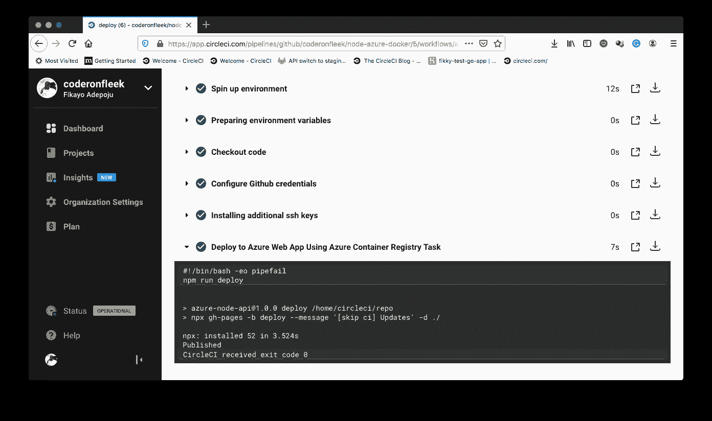

如果你在你的注册页面上点击`buildnodeapp`并点击**运行**标签，你会发现一个新构建的`Docker`映像正在运行(`cj2`)。

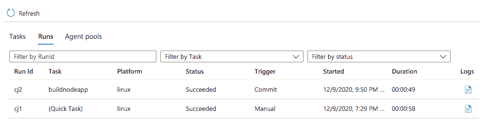

现在转到您的浏览器，在那里之前加载了`/todos`端点。当你重新加载页面时，你会发现一个新的`todo`对象。

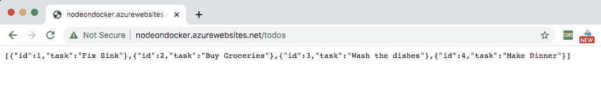

## 结论

容器为应用程序开发人员和 DevOps 架构师提供了弥合开发和生产环境之间的差距的能力，这种差距可能会导致错误或应用程序无法按预期运行。在本教程中，我们展示了如何使用容器无缝部署 Azure web 应用。我希望你能用你所学到的来改进你自己的应用。

编码快乐！

* * *

Fikayo Adepoju 是 LinkedIn Learning(Lynda.com)的作者、全栈开发人员、技术作者和技术内容创建者，精通 Web 和移动技术以及 DevOps，拥有 10 多年开发可扩展分布式应用程序的经验。他为 CircleCI、Twilio、Auth0 和 New Stack 博客撰写了 40 多篇文章，并且在他的个人媒体页面上，他喜欢与尽可能多的从中受益的开发人员分享他的知识。你也可以在 Udemy 上查看他的视频课程。

[阅读 Fikayo Adepoju 的更多帖子](/blog/author/fikayo-adepoju/)