# 使用 GCP | CircleCI 部署您的 Gradle Build 缓存节点

> 原文：<https://circleci.com/blog/deploying-gradle-build-cache-node-to-gcp/>

本教程是使用构建缓存对你的 Android Gradle 构建进行涡轮增压的后续。

这篇文章的重点是远程构建缓存，这是一种构建速度加速技术，可以在本地和 CI 构建中实现。这是一项值得了解的技术，因为:

*   如果没有缓存系统，每个构建都是一个全新的、干净的构建，因此整个项目都是从头开始构建的，即使是很小的更改。

Gradle 提供了一个构建缓存节点作为 Docker 映像。您可以通过多种方式托管此映像。在本教程中，我将带领你在免费工具 GCP (Google Cloud Platform)上建立一个构建缓存节点的步骤。

## 先决条件

要遵循本教程，需要做一些事情:

1.  对 [Gradle 构建工具](https://gradle.org/)的基本理解
2.  了解如何[在 CircleCI 上建立一个 Android 项目](https://circleci.com/docs/language-android/)
3.  了解 [Android 构建流程](https://developer.android.com/studio/build)
4.  关于 GCP 虚拟机(VM)实例、防火墙及其工作原理的基本知识

## 创建并访问您的 Google 控制台帐户

首先，您需要创建或访问您的[谷歌云平台账户](https://console.cloud.google.com/)。

**注意:** *如果您是第一次设置您的主机，请同意服务条款，然后单击**同意并继续**按钮。*

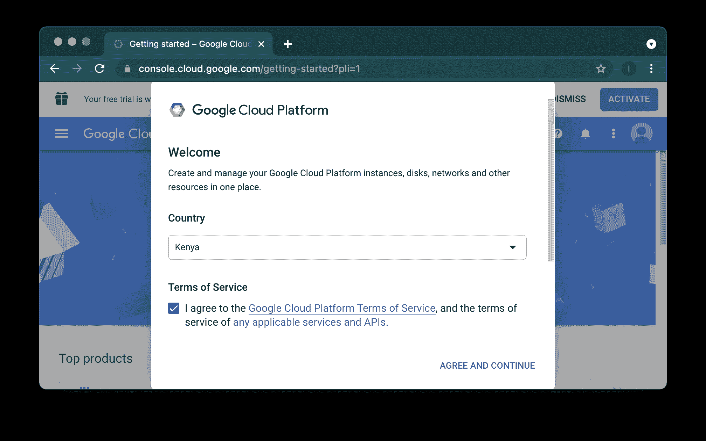

要访问 GCP 的免费产品，请从导航菜单中选择**入门**选项。然后点击**免费入门**按钮。

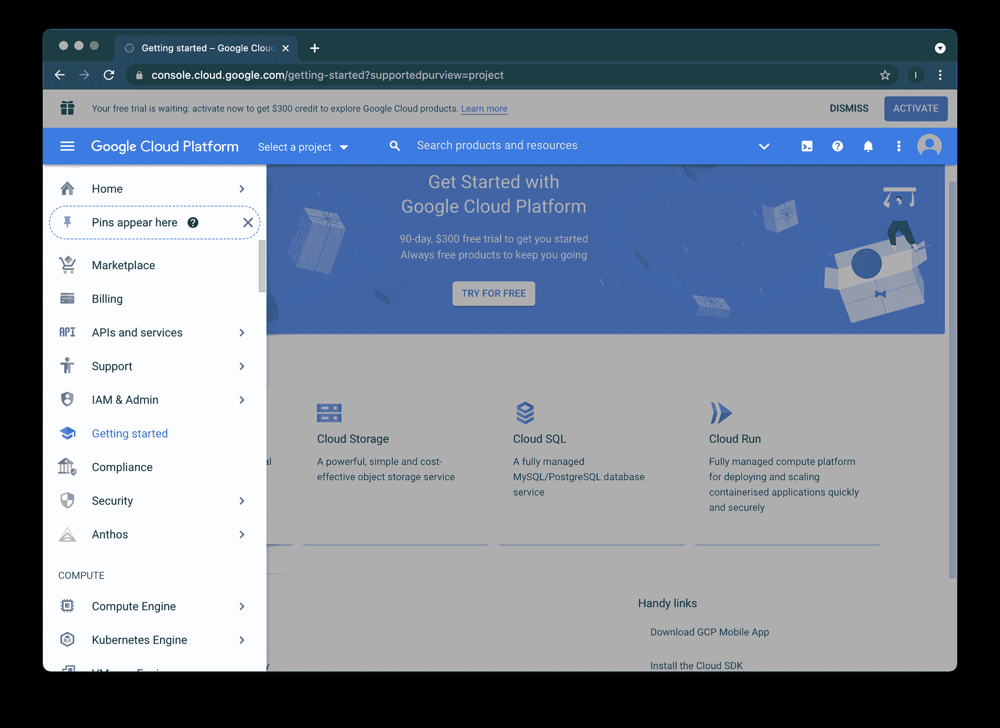

首先验证您的帐户信息。

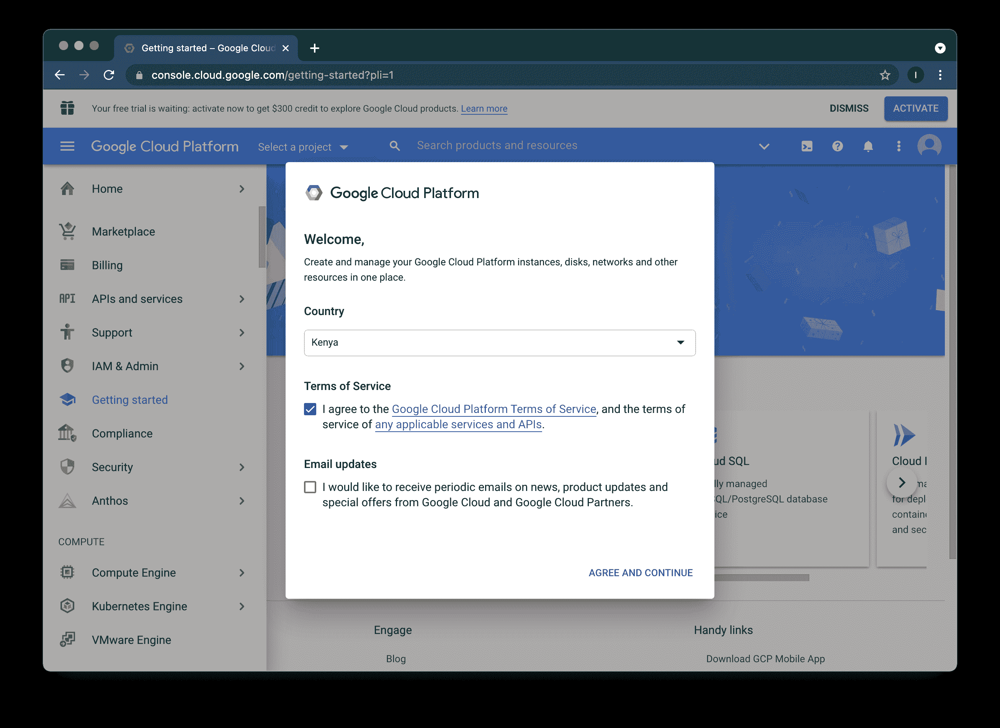

接下来，输入有效的电话号码。谷歌将向您发送确认文本。完成验证后，点击**继续**按钮。

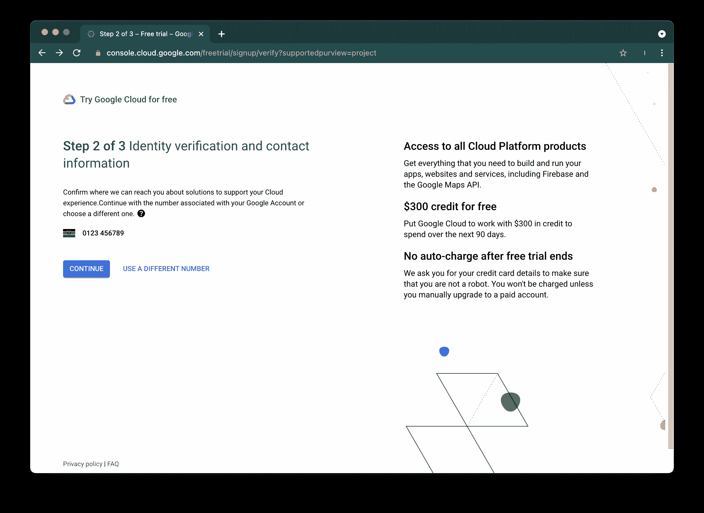

尽管下一步要求您输入付款信息，但除非您打开自动计费，否则不会向您收费。

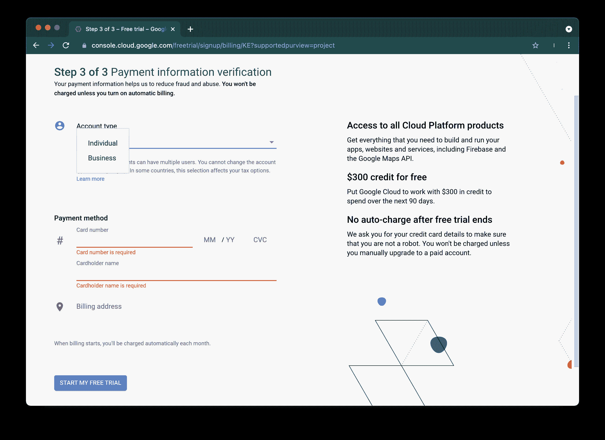

成功完成验证过程后，您会看到一条确认消息。点击**得到它**继续。

现在，您已经设置了控制台以使用免费层产品，您可以继续构建缓存节点设置。

## 设置构建缓存节点

在 GCP 实例上，构建缓存节点的过程分为两部分:

1.  在 **VPC 网络**部分下创建防火墙规则
2.  在**计算引擎**部分创建一个虚拟机实例

通过利用[构建缓存节点用户手册](https://docs.gradle.com/build-cache-node/)并为 GCP 添加一些定制配置，您可以设置您的构建缓存节点。

## 配置虚拟私有云(VPC)网络

VPC 网络是物理网络的虚拟版本，在谷歌的生产网络内部实现。它做了很多事情，但最重要的是它为您的计算引擎虚拟机(VM)实例提供连接。这一点很重要，因为默认情况下，来自网络外部的传入流量会被阻止。这意味着我们需要创建一个防火墙规则来控制到构建缓存节点 VM 实例的传入或传出流量。

## 创建防火墙规则

在 Google 控制台仪表板上，导航至:`Networking > VPC Network > Firewall`。如果系统提示，请单击**启用**以启用计算引擎。然后，点击**创建防火墙规则**按钮。

输入防火墙规则详细信息:

*   在名称字段中，输入`gradle-firewall-rule`
*   在描述字段中，输入`Ingress firewall rule for the Gradle build cache node`
*   将目标标记指定为 gradle-build-cache-node-tag
*   输入`0.0.0.0/0 192.168.2.0/24`作为源 IP 范围
*   将协议和端口指定为`tcp: 5071`

输入详细信息后，点击**创建**按钮。

 </blog/media/2021-08-27-gradle-cache-10.mp4> 

## 设置 GCP 以启动虚拟机

谷歌计算引擎(GCE)是谷歌云平台(GCP)的基础设施即服务(IaaS)组件。GCP 建立在运行谷歌搜索引擎、Gmail、YouTube 和其他服务的全球基础设施之上。谷歌计算引擎使用户能够按需启动虚拟机。

要创建 VM 实例，请转到 Google Cloud 控制台仪表板，导航到`Compute > Compute Engine > VM instances`，然后单击**创建实例**按钮。

输入虚拟机实例详细信息:

*   在名称字段中，输入`gradle-build-cache-node`。
*   选择`Europe-north1 (Finland)`作为区域。选择一个离你和你的开发团队近的。
*   选择`europe-north1-a`作为区域。
*   对于机器配置，输入`N1`表示系列。
*   为机器类型输入`n1-standard-1` (1 个 vCPU，3.75 GB 内存)。

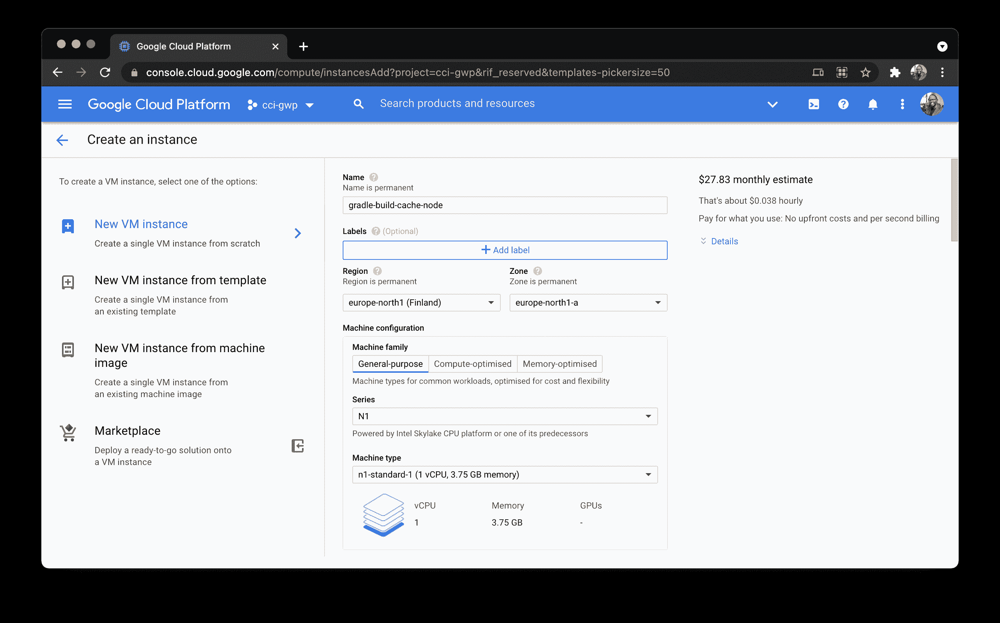

接下来，选择`Deploy a container image to this VM instance`。在容器图像字段中，输入`gradle/build-cache-node`。

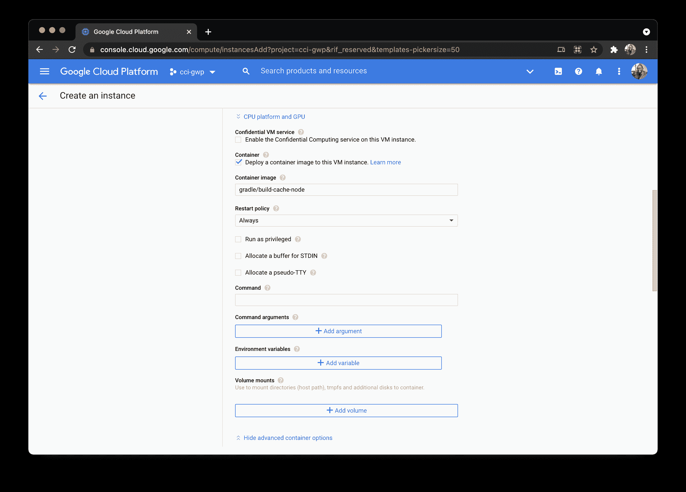

我们还需要设置一个磁盘卷供我们的构建缓存使用。展开**高级容器选项**，点击**添加卷**。然后添加这些参数:

*   对于卷类型，添加`Directory`。
*   对于挂载路径，添加`/data`。
*   对于主机路径，添加`/home/build-cache`。
*   选择`Read/write`模式。

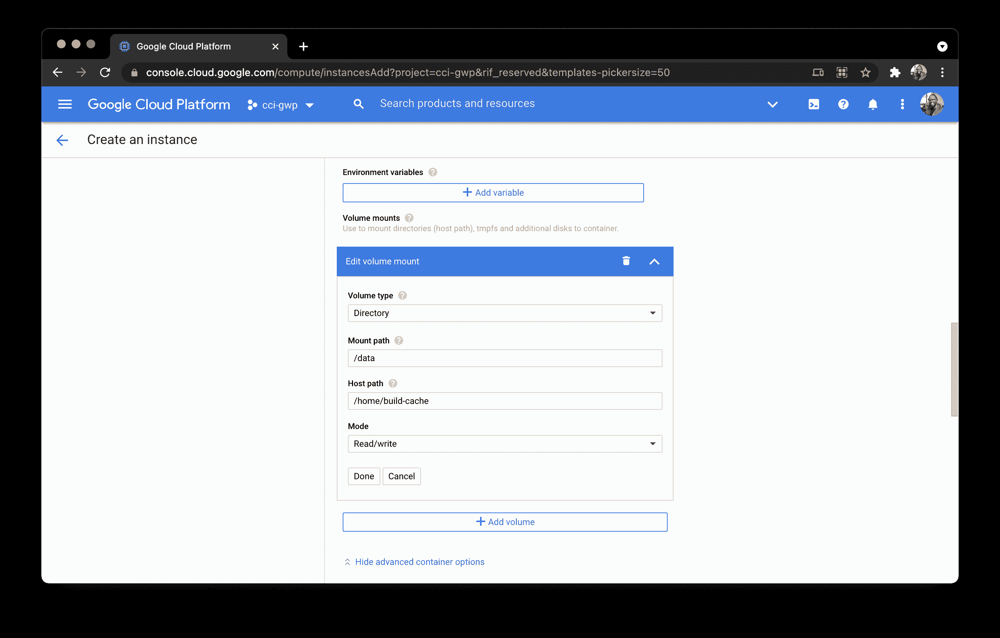

### 完成防火墙配置

您的下一个任务是添加标记和防火墙规则，以允许来自互联网的特定网络流量。展开**管理、安全、磁盘、网络、单独租赁**部分，并选择**网络**选项卡。然后添加我们之前创建的防火墙规则:

`gradle-build-cache-node-tag`

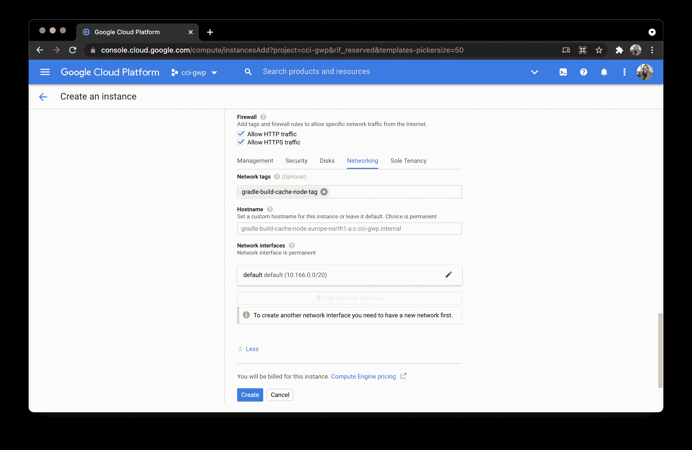

点击**创建**并等待您的新虚拟机启动。

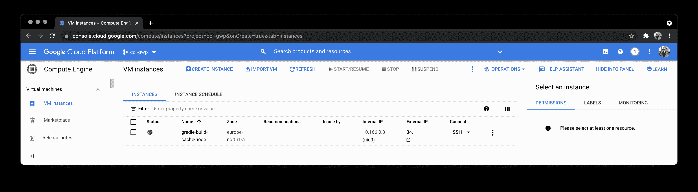

## 使用虚拟机访问缓存节点

要通过 VM 实例的外部 IP 访问缓存节点，请将`:5071`附加到外部 IP 地址的末尾。你可以在谷歌控制台上找到外部 IP 地址。

**注意:** *如果你得到一条消息，说网站不能提供安全连接，请通过 HTTP 而不是 HTTPS 访问 IP。*

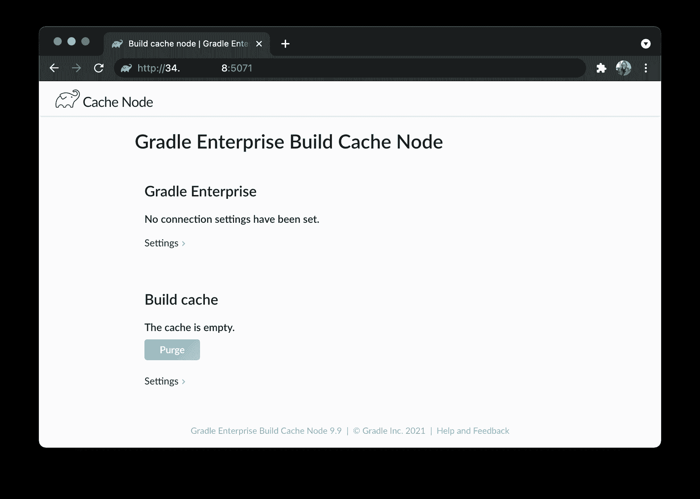

## 为生成缓存配置访问控制

下一步很重要，因为我们正在实现 UI 授权安全检查。默认情况下，内置缓存节点允许任何用户在缓存中存储和检索条目。这并不理想，因为未经授权的用户可以存储、检索和删除缓存条目。唯一允许对构建缓存节点进行更改的系统是您的 CI 服务器，使它成为您的**唯一真实的来源**。

要改变这一点，折叠构建缓存下的**设置**部分。点击**添加用户**，给新用户一个用户名，密码，访问级别`Read & write`。读&写访问允许存储工件。 **(notes)** 字段不是必需的，但是如果不同的场景有多个用户，它会很有帮助。

一旦用户被添加到系统中，就可以将匿名访问限制为`None`不允许访问或`Read`只读访问。

点击**保存**保存凭证和权限。

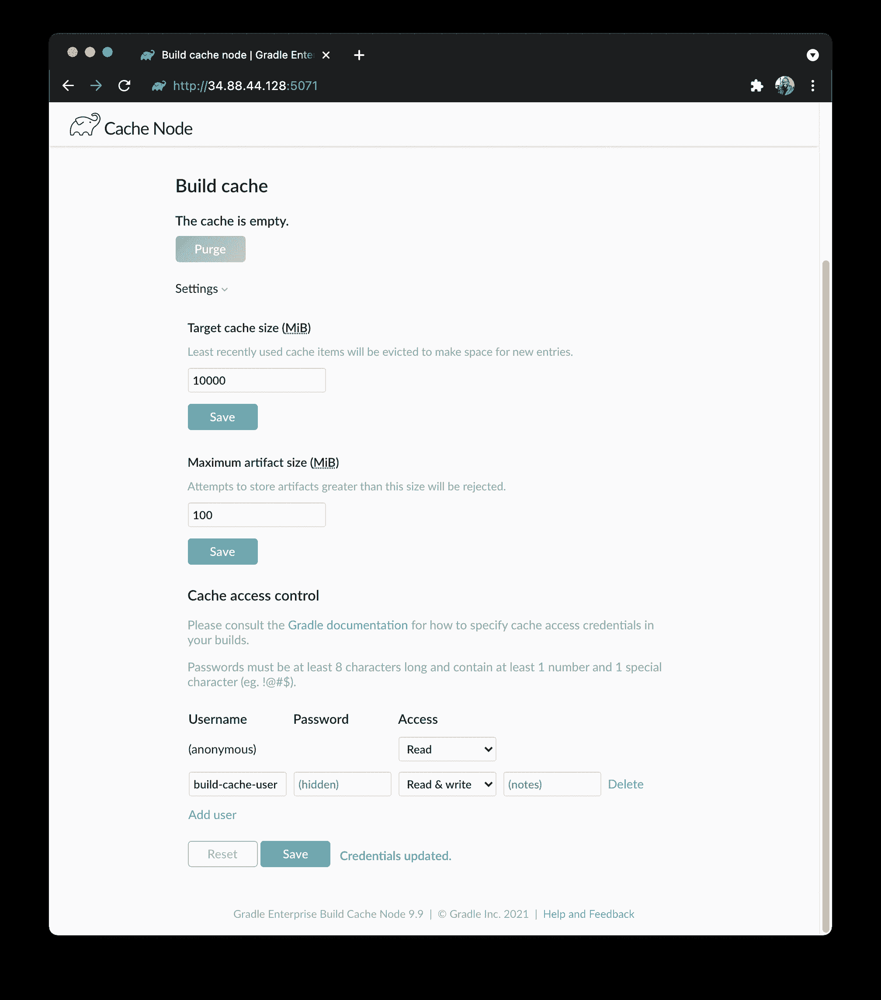

推荐的方法是创建一个具有`Read & write`访问权限的用户，并将匿名访问权限仅限于`Read`。CI 构建然后作为用户进行身份验证并写入缓存，而开发人员匿名连接并仅从缓存中读取。

**注意** : *如果你试图访问缓存节点，而你没有得到授权，你会得到一个`response status 401: Unauthorized`错误。*

## Android 项目上的缓存访问控制

您可以配置 HttpBuildCache 用来访问构建缓存服务器的凭证，如`settings.gradle`文件所示。

```
buildCache {
    remote(HttpBuildCache) {
        url = 'https://example.com:8123/cache/'
        credentials {
            username = 'build-cache-user'
            password = 'C0mplic@ted-pa$$worD'
        }
    }
} 
```

## 运行 CI 构建以验证正常工作的缓存节点

现在，我们需要确保 Gradle 构建缓存按预期工作。将您对`settings.gradle`文件所做的更改推送到 GitHub 存储库中。该推送触发 CI 构建。

一旦构建成功完成，就会有一些工件存储在构建缓存中，如 UI 仪表板上所示。

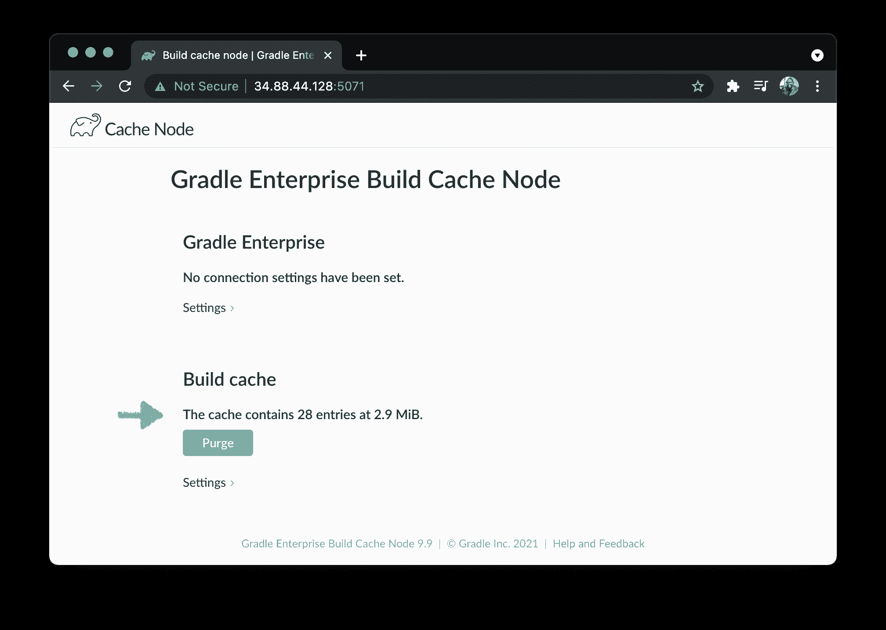

## 结论

在本教程中，您已经学习了如何使用 GCP 虚拟机实例创建和运行 Gradle build 缓存节点。你更新了你的应用，并将其缓存推送给它。您现在已经有了使用构建速度加速技术的经验，您可以将它用于您的本地和 CI 构建。有了缓存系统，您不再需要从头开始运行整个项目。这为您的团队节省了时间和资源，并让您可以更频繁地进行更小的修复和更新，因此您可以更快地添加功能和修复错误。

* * *

Taracha 是一个创造者，他的使命是帮助公司用最简单的方式解决复杂的问题。他关心的是找到他热爱的愿景和事业，并利用技术帮助这些公司解决他们的挑战。

他有超过 6 年的本地移动应用程序开发经验和 4 年的 web 应用程序开发经验。

他目前是 Premise Data 的高级软件工程师，负责新产品功能的开发和部署，并对开发人员生产力工程领域充满热情。