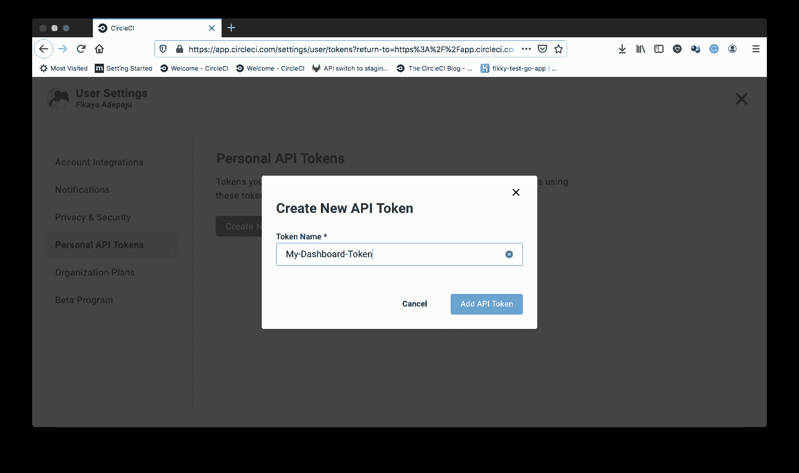
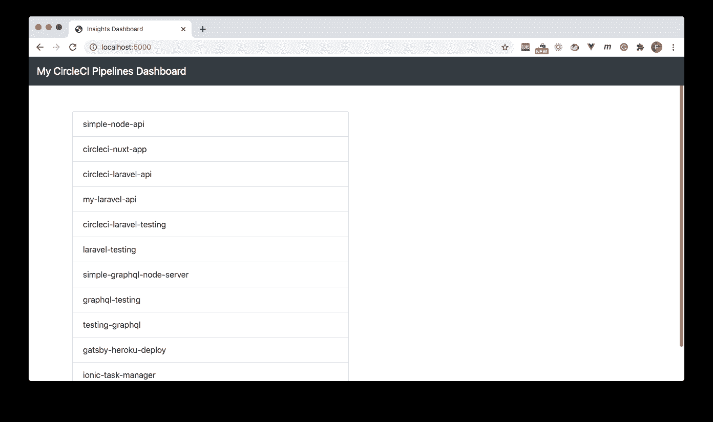
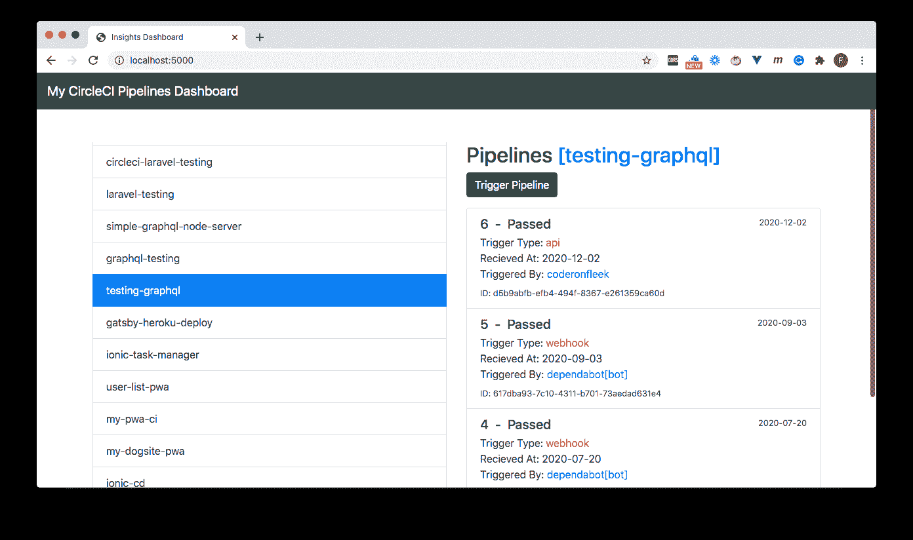

# 使用 CircleCI API 构建部署摘要仪表板| CircleCI

> 原文：<https://circleci.com/blog/deployment-dashboard/>

[CircleCI API](https://circleci.com/docs/api/v2/) 为开发人员提供了一个网关来检索关于他们的管道、项目和工作流的详细信息，包括哪些用户正在触发管道。这使得开发人员可以通过提供端点来更好地控制他们的 CI/CD 流程，可以从用户的应用程序或自动化系统远程调用这些端点来获取信息和触发流程。在本教程中，您将学习并练习如何使用 API 创建一个简单的个性化仪表板来监控您的部署管道。

## 先决条件

1.  Javascript 的基础知识
2.  您系统上安装的 [Node.js](https://nodejs.org) (版本> = 10.3)
3.  一个[圆](https://circleci.com/signup/)的账户

安装并设置好所有这些之后，是时候开始本教程了。

## 获取 CircleCI API 令牌

您的帐户需要完全的读写权限才能对 API 进行经过身份验证的调用。要授予这些权限，您需要创建一个个人 API 令牌。进入你的 CircleCI 用户设置，然后点击 **[个人 API 令牌](https://app.circleci.com/settings/user/tokens)** 。点击**创建新令牌**按钮。在令牌名称字段中，输入您可能记得的名称，然后单击**添加 API 令牌**按钮。



将显示令牌，供您复制到安全位置。请确保现在复制它，因为它不会再次显示。

## 设置 Insights 仪表板项目

我们在本教程中创建的仪表板将是一个 Node.js 应用程序，它有几个端点用于调用 CircleCI API。应用程序将在其基础(`/`)路径返回仪表板页面。

首先，创建一个新项目并导航到文件夹的根目录:

```
mkdir insights-dashboard
cd insights-dashboard 
```

接下来，脚手架一个基本的`package.json`文件:

```
npm init -y 
```

需要安装五个软件包:

1.  `express`创建应用服务器
2.  `axios`向 CircleCI API 发出`HTTP`请求
3.  `cors`处理 [CORS](https://developer.mozilla.org/en-US/docs/Web/HTTP/CORS) 的问题
4.  `dotenv`在环境变量中存储 API 令牌
5.  `body-parser`解析 [JSON](https://en.wikipedia.org/wiki/JSON) 格式的请求数据

使用以下命令一次性安装所有这些组件:

```
npm install express axios cors dotenv body-parser 
```

接下来，创建一个`.env`文件来存储 API 令牌:

```
API_KEY=YOUR_API_TOKEN 
```

用之前复制的个人 API 令牌替换`YOUR_API_TOKEN`。

## 创建仪表板端点

正如我前面提到的，应用程序的根将返回仪表板页面，这是一个使用基本(`/`)端点的`index.html`文件。项目应用程序还使用其他端点。在项目的根目录下，创建一个新文件`server.js`,输入以下代码:

```
require("dotenv").config();
const express = require("express");
const path = require("path");
const app = express();
const cors = require('cors');
let bodyParser = require("body-parser");
const axios = require("axios");

app.use(cors());

app.use(bodyParser.urlencoded({ extended: false }));
app.use(bodyParser.json());

let port = process.env.PORT || "5000";

const api_v1 = "https://circleci.com/api/v1.1/";
const api_v2 = "https://circleci.com/api/v2/";

axios.defaults.headers.common['Circle-Token'] = process.env.API_KEY;

app.get("/", (req, res) => {
    res.sendFile(path.join(__dirname+'/index.html'));
});

app.get("/getprojects", async (req, res) => {

    let projects = await axios.get(`${api_v1}projects`);

    res.send(projects.data);
});

app.get("/getpipelines", async (req, res) => {

    const project_slug = req.query.project_slug;

    let pipelines = await axios.get(`${api_v2}project/${project_slug}/pipeline`);

    res.send(pipelines.data);
})

app.post("/triggerpipeline", async (req, res) => {

    const project_slug = req.body.project_slug;

    try {
        const trigger = await axios.post(`${api_v2}project/${project_slug}/pipeline`);

        res.send(trigger.data);
    } catch (error) {
        res.send(error)
    }
})

app.get("/getworkflows/:pipeline_id", async (req, res) => {

    const pipeline_id = req.params.pipeline_id;

    let workflows = await axios.get(`${api_v2}pipeline/${pipeline_id}/workflow`);

    res.send(workflows.data);
})

app.listen(port, () => {
    console.log(`App Running at http://localhost:${port}`);
}) 
```

让我花点时间来分析一下这个文件中发生了什么。首先，导入所需的包，并为`cors`和`body-parser`设置中间件。接下来，`api_v1`和`api_v2`被定义为分别保存 CircleCI API 版本 1 和版本 2 的 URL。

然后，`axios`模块被配置为通过将`Circle-Token`报头设置为存储在环境文件(`.env`)中的令牌来发送每个请求中的 API 令牌。

接下来设置基本(`/`)端点以返回包含仪表板代码的`index.html`。该文件将在下一节中创建。

其他端点定义如下:

*   使用 CircleCI API 版本 1 从您的帐户中检索项目列表。API 版本 2 不支持检索项目，但它已经在工作中了。

*   `/getpipelines`用一个`project_slug`调用 v2 API 来检索一个项目上已经触发的管道。`project_slug`是 CircleCI 项目的“三元组”标识符格式。它的形式是`<project_type>/<org_name>/<repo_name>`。你可以阅读[这篇文章](https://circleci.com/blog/introducing-circleci-api-v2/)了解更多信息。

*   `/triggerpipeline`用一个`project_slug`调用 v2 API 来触发一个新的管道在一个项目上运行。

最后，应用程序被编程为监听指定的端口。

要完成本节教程，请打开`package.json`并添加一个`start`脚本:

```
"scripts" : {
    .....,
    "start": "node server.js"
} 
```

## 创建仪表板页面

是时候创建仪表板了。该应用程序将有两列，一列用于项目，这将立即加载。另一列将加载管道。还会有一个**触发管道**按钮来运行一个选定项目的新管道。

为了构建仪表板 UI 和功能，我们将使用 [Bootstrap](https://getbootstrap.com/) 进行样式设计，使用 [Vue.js](https://vuejs.org/) 作为前端框架。我们还将在前端使用 [axios](https://www.axios.com/) 对我们应用程序的端点进行 API 调用。如果你不理解 Vue.js，没有必要担心。你可以使用你喜欢的任何其他框架，甚至是普通的 Javascript 来实现相同的功能。

在项目的根目录下，创建`index.html`文件并输入:

```
<!DOCTYPE html>
<html lang="en">
<head>
    <meta charset="UTF-8">
    <meta name="viewport" content="width=device-width, initial-scale=1.0">
    <link rel="stylesheet" href="https://cdn.jsdelivr.net/npm/bootstrap@4.5.3/dist/css/bootstrap.min.css" integrity="sha384-TX8t27EcRE3e/ihU7zmQxVncDAy5uIKz4rEkgIXeMed4M0jlfIDPvg6uqKI2xXr2" crossorigin="anonymous">

    <script src="https://cdn.jsdelivr.net/npm/vue"></script>
    <script src="https://cdnjs.cloudflare.com/ajax/libs/axios/0.21.0/axios.min.js" integrity="sha512-DZqqY3PiOvTP9HkjIWgjO6ouCbq+dxqWoJZ/Q+zPYNHmlnI2dQnbJ5bxAHpAMw+LXRm4D72EIRXzvcHQtE8/VQ==" crossorigin="anonymous"></script>
    <title>Insights Dashboard</title>
</head>
<body>
    <nav class="navbar navbar-expand-lg navbar-dark bg-dark">
        <a class="navbar-brand" href="/#">My CircleCI Pipelines Dashboard</a>
        <button
            class="navbar-toggler"
            type="button"
            data-toggle="collapse"
            data-target="#navbarText"
            aria-controls="navbarText"
            aria-expanded="false"
            aria-label="Toggle navigation">
            <span class="navbar-toggler-icon" />
        </button>

    </nav>
    <div id="app">

        <div class="container">
            <div class="row">
                <div class="col-md-6" id="projects-section">
                    <p v-if="loadingProjects">
                        <i>Loading Projects...</i>
                    </p>
                    <ul v-else id="list" class="list-group">
                        <li class="list-group-item" v-for="project in projects" v-bind:class="{ active: selectedProject.reponame == project.reponame }" @click="loadPipelines(project)">
                            {{project.reponame}}
                        </li>

                    </ul>
                </div>

                <div class="col-md-6">
                    <div v-if="selectedProject.reponame">
                        <h2>Pipelines <span class="text-primary">[{{selectedProject.reponame}}]</span></h2>

                        <p>
                            <button @click="triggerPipeline()" type="button" class="btn btn-success" :disabled="triggeringProjectPipeline">
                                {{triggeringProjectPipeline ? "Procesing" : "Trigger Pipeline"}}
                            </button>
                        </p>

                        <p v-if="loadingPipelines">
                            <i>Loading Pipelines</i>
                        </p>
                        <div v-else class="list-group" id="pipelines-section">
                            <a v-for="pipeline in pipelines" href="#" class="list-group-item list-group-item-action">
                              <div class="d-flex w-100 justify-content-between">
                                <h5 class="mb-1">
                                    {{pipeline.number}} &nbsp;-&nbsp;
                                    <span v-if="pipeline.state == 'errored'" class="text-danger">Failed</span>
                                    <span v-else class="text-success">Passed</span>
                                </h5>
                                <small>{{pipeline.created_at.substring(0, 10)}}</small>
                              </div>
                              <p class="mb-1" v-if="pipeline.trigger">
                                  Trigger Type: <span class="text-danger">{{pipeline.trigger.type}}</span> <br /> 
                                  Recieved At: <span class="text-sucess">{{pipeline.trigger.received_at.substring(0, 10)}}</span> <br /> 
                                  Triggered By: <span class="text-primary">{{pipeline.trigger.actor.login}}</span></p>
                              <small>ID: {{pipeline.id}}</small>
                            </a>

                        </div>
                    </div>

                </div>
            </div>
        </div>
    </div>

    <script>

        var app = new Vue({
            el: '#app',
            data: {
                loadingProjects : false,
                projects: [],
                selectedProject : {},
                loadingPipelines : false,
                pipelines : [],
                triggeringProjectPipeline : false
            },
            async created(){

                this.loadingProjects = true;

                let projects = await axios.get(`getprojects`);
                this.projects = projects.data;

                this.loadingProjects = false;
            },
            methods : {
                loadPipelines : async function (project) {
                    this.selectedProject = project;

                    this.loadingPipelines = true;

                    const project_slug = `${project.vcs_type}/${project.username}/${project.reponame}`;

                    let pipelines = await axios.get(`getpipelines?project_slug=${project_slug}`);
                    console.log(pipelines);
                    this.pipelines = pipelines.data.items;

                    this.loadingPipelines = false;
                },
                triggerPipeline : async function () {

                    this.triggeringProjectPipeline = true;

                    let project = this.selectedProject;

                    const project_slug = `${project.vcs_type}/${project.username}/${project.reponame}`;

                    let trigger = await axios.post(`triggerpipeline`, {
                        project_slug
                    });
                    console.log(trigger);

                    this.loadPipelines(project);

                    this.triggeringProjectPipeline = false;
                }
            }
        })
    </script>

    <style>
        #app {
            margin-top: 50px;
        }
        #projects-section, #pipelines-section{
            height: 600px;
            overflow: scroll;
        }
    </style>
</body>
</html> 
```

在前面的代码中，引导 CSS、Vue.js 和`axios`的库是从它们各自的 cdn 中加载的。在页面的主体中，用 Bootstrap 的网格系统创建了两列来格式化**项目**部分，另一列用于**管道**和**触发管道**按钮。

在 script 标记中，创建了一个新的 Vue.js 应用程序实例，用数据变量来保存`projects`、`pipelines`和`selectedProject`。当分别向`/getprojects`、`/getpipelines`和`/triggerpipeline`端点发出 API 请求时，还会创建用于`loadingProjects`、`loadingPipelines`和`triggeringProjectPipeline`的变量来管理应用程序状态。

一旦仪表板加载，Vue.js `created`生命周期挂钩用于从您的帐户加载项目。还定义了加载管道和触发新管道在 Vue.js 实例的`methods`属性中运行的方法。

最后，在`<style>`部分，基本样式被添加到页面中。

## 测试仪表板项目

是时候了！在项目的根目录下，运行:

```
npm start 
```

应用程序应该在`http://localhost:5000`启动。在浏览器中加载这个地址，在简短的加载消息之后，您应该会看到您的项目。



单击项目以加载其管线。



单击某个项目时，该项目的管道将在下一列中加载。每个管道条目都包含详细信息，如管道状态(通过或失败)、触发管道的用户/进程、管道触发日期。还有更多。

也可以点击**触发管道**按钮运行新的管道。管道列表将被刷新以显示最近触发的管道。

## 结论

正如我们在本教程中所演示的，CircleCI API 使 DevOps 专业人员能够获得有用的信息，并为我们的项目和管道创建个性化的体验。只需几行代码，我们就能够为我们的项目开发一个交互式仪表板。想象一下您可以用 [CircleCI API](https://circleci.com/docs/api/v2/) 中的其余可用端点做些什么。

当谈到开发团队的成功时，找到正确的 [DevOps 指标来衡量](https://circleci.com/blog/how-to-measure-devops-success-4-key-metrics/)是至关重要的。了解[如何在](https://circleci.com/blog/how-to-measure-devops-success-4-key-metrics/) [2020 年软件交付状态中用四个关键基准来衡量 DevOps 的成功](https://circleci.com/resources/2020-state-of-software-delivery/):工程团队的数据支持基准。

编码快乐！

* * *

Fikayo Adepoju 是 LinkedIn Learning(Lynda.com)的作者、全栈开发人员、技术作者和技术内容创建者，精通 Web 和移动技术以及 DevOps，拥有 10 多年开发可扩展分布式应用程序的经验。他为 CircleCI、Twilio、Auth0 和 New Stack 博客撰写了 40 多篇文章，并且在他的个人媒体页面上，他喜欢与尽可能多的从中受益的开发人员分享他的知识。你也可以在 Udemy 上查看他的视频课程。

[阅读 Fikayo Adepoju 的更多帖子](/blog/author/fikayo-adepoju/)