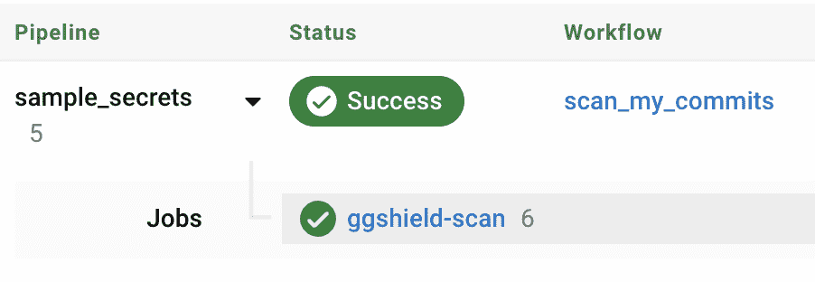

# 使用 gitguardian | circleci 检测 hhardcore 机密

> 原文：<https://circleci.com/blog/detect-hardcoded-secrets-with-gitguardian/>

开发人员正以前所未有的速度使用他们需要的软件生态系统来构建功能。这些不断扩展的选项包括开源库和包、SaaS 工具、部署系统、云服务等等。为了保证安全，我们总是需要一样东西:秘密。

## 什么是秘密？

机密是应用程序、服务或基础结构中使用的数字身份验证凭据(API 密钥、证书和令牌)。就像密码(在 MFA 的情况下加上一个设备)用于认证一个人一样，密码用于认证一个系统以实现互操作性。

观看视频:什么是秘密？

## 为什么在 CI/CD 环境中秘密是一个问题？

当软件工程师使用 CI/CD 管道将工件、应用和基础设施部署到多个环境中时，他们需要处理越来越多的凭证。有很多地方秘密会不安全地暴露出来:

*   源代码
*   构建、测试或部署 CI/CD 工作流
*   容器图像层
*   转轮控制台输出

凭据泄露不仅仅是一个安全问题；旋转泄漏的机密会中断 CI/CD 工作流。

## 秘密是如何出现在源代码中的？

两个字:人为失误。

绝大多数泄露的凭证都是错误的，并不是出于恶意。硬编码凭证可能是一种临时的解决方案，有时开发人员并没有意识到 Git 实际上在跟踪一个被删除的秘密。新开发人员不知道正确的程序，或者测试被跳过。可能出现的错误数不胜数。

## 为什么硬编码的秘密不同于其他类型的漏洞？

不像其他漏洞，它指出了代码中的特定弱点，检测秘密需要一个项目的整个代码库历史。

当一个开发人员错误地犯了一个秘密时，有两种可能性:要么承认，要么不承认。

在前一种情况下，一个非常常见的错误是删除它并简单地提交更改。这个秘密从源代码的当前状态中消失了，但是它仍然在提交历史中！

在后一种情况下，秘密很可能会到达远程版本控制系统(VCS)。在这一点上，秘密已经被认为是泄漏了(最好的情况是，它将在代码审查阶段被检测到，但是秘密可能已经需要在那一点上被旋转)。

发现隐藏在代码库历史深处的有效秘密并不罕见。秘密检测需要考虑这种攻击面*和*扫描存储库的增量变化，以防止这种泄漏。

## GitGuardian 入门

在本教程中，您将学习如何将 GitGuardian 实时监控添加到 CircleCI 工作流中，以扫描每个新提交的秘密。

GitGuardian 在历史记录或增量提交中检测存储库中的秘密。秘密检测发生在开发生命周期的多个阶段:在带有[预提交钩子](https://docs.gitguardian.com/internal-repositories-monitoring/integrations/git_hooks/pre_commit)或[预推钩子](https://docs.gitguardian.com/internal-repositories-monitoring/integrations/git_hooks/pre_push)的开发人员的本地机器上，在[预接收钩子](https://docs.gitguardian.com/internal-repositories-monitoring/integrations/git_hooks/pre_receive)中或在 CI 环境中。

有了 GitGuardian dashboard，可以在公司范围内实现可见性，以同时保护所有存储库。


仪表板还使开发人员和 AppSec 工程师能够在整个补救过程中进行协作。我们不会在教程中讨论这个，但是你可以在[文档](https://docs.gitguardian.com/internal-repositories-monitoring/incidents/overview)中了解更多。

### 先决条件

要学习本教程，您需要:

1.  一个[圆](https://circleci.com/signup/)的账户
2.  GitHub 的一个账户
3.  一个 [GitGuardian](https://dashboard.gitguardian.com/auth/signup) 账户

### 分叉样本存储库

在本教程中，您将使用来自 GitGuardian 的`sample_secrets` [测试库](https://github.com/GitGuardian/sample_secrets)。这个存储库包含各种用于测试目的的秘密。将其转到您的 GitHub 用户帐户或您是管理员的 GitHub 组织。

然后，打开 [CircleCI 项目](https://app.circleci.com/)页面，点击`sample_secrets`名称，然后选择**更快:提交一个启动 CI 管道到一个新的分支**。

这在存储库中创建了新的分支`circleci-project-setup`，包含了由`./circleci/config.yml`文件配置的演示工作流`say-hello-workflow`。

### 创建 GitGuardian API 令牌

你需要一个 GitGuardian API 令牌来使用 GitGuardian orb。从 GitGuardian 仪表盘，转到 **API >个人访问令牌**，然后点击**创建令牌**。给令牌一个`scan`范围和一个容易记住的名称:


复制令牌并放在手边；这是你唯一可以观看的时间。

**注意:** *如果您正在使用 GitGuardian 的商业计划或 30 天商业试用，请创建一个**服务帐户**，而不是个人访问令牌。**服务帐户**是一种特殊类型的 API 键，用于表示非人类用户，如 CI runner。要创建一个，请转到 **API >服务帐户**并遵循相同的步骤。*

从 CircleCI 仪表板中，单击`sample_secrets`项目，然后单击**项目设置>环境变量。**点击**添加环境变量**。将其命名为`GITGUARDIAN_API_KEY`，并赋予它与您之前复制的令牌相同的值。

## 使用 ggshield 扫描增量更改

您现在需要在 CircleCI `config.yml`中添加一个工作流来使用`ggshield` orb。

用以下内容复制并替换该文件:

```
version: 2.1

orbs:
  ggshield: gitguardian/ggshield@volatile

workflows:
  scan_my_commits:
    jobs:
      - ggshield/scan:
          name: ggshield-scan
          base_revision: <<pipeline.git.base_revision>>
          revision: <<pipeline.git.revision>> 
```

你也可以在`ggshield` [orb 注册页面](https://circleci.com/developer/orbs/orb/gitguardian/ggshield)找到这个片段。

当管道被触发时，`base_revision`和`revision`值将被填充:

*   `base_revision`是要扫描的第一个提交的提交 ID。
*   `revision`是上次扫描的提交的 ID。

在这个配置中，只扫描最新的提交，这对于 CI 管道来说很方便。您可能不想在每次管道启动时扫描整个 git 历史。该扫描对自上次修订以来的所有提交进行操作，以确保没有秘密被提交然后被删除。

当您处理完`config.yml`文件后，提交它，推送它，并转到 CircleCI 仪表板来观看管道启动。如果这是你第一次使用第三方宝珠，你可能不得不接受在**组织设置>安全>宝珠安全设置**中使用它们。



单击作业以了解有**个提交要扫描:1 个**。

```
#!/bin/bash -eo pipefail

ggshield secret scan -v ci

CIRCLE_RANGE: dea39f827dfe23f06f4ea63d7fb16ab0c363db9d...90220851160dcf018f372536da223dc0396aa247
CIRCLE_SHA1: 90220851160dcf018f372536da223dc0396aa247
Commits to scan: 1
Scanning Commits---------------------------------]    0%Scanning Commits  [####################################]  100%
secrets-engine-version: 2.71.0
No secrets have been found
commit 90220851160dcf018f372536da223dc0396aa247
Author: ***
Date: ***

CircleCI received exit code 0 
```

要验证屏蔽是否如预期的那样工作，只需对测试存储库的一个文件提交一个更改。例如，打开`sample_secrets/bucket_s3.py`文件，添加或删除尾部空白，然后提交这个更改(确保在`circle-project-setup`分支上)。

这将失败，因为 ggshield 将扫描最近的提交并检测文件中的两个秘密:

```
#!/bin/bash -eo pipefail
ggshield secret scan -v ci
CIRCLE_RANGE: 90220851160dcf018f372536da223dc0396aa247...2d08c13226628ecfb3ee9a07001c185915a84adf
CIRCLE_SHA1: 2d08c13226628ecfb3ee9a07001c185915a84adf
Commits to scan: 1
Scanning Commits---------------------------------]    0%Scanning Commits  [####################################]  100%

secrets-engine-version: 2.71.0

commit 2d08c13226628ecfb3ee9a07001c185915a84adf
Author: XXXX
Date: XXXX

🛡️  ⚔️  🛡️  2 incidents have been found in file bucket_s3.py

>>> Incident 1(Secrets detection): AWS Keys (Validity: Invalid)  (Ignore with SHA: 9f2785cab705507aaea637b8b38d8e1ff9ce8a4334dda586187cbb018ed33163) (1 occurrence)
 8  8 |
 9  9 | def aws_upload(data: Dict):
10    |     database = aws_lib.connect("AKIA************WSZ5", "hjshnk5**************************89sjkja") |_____client_id____|
10    |     database = aws_lib.connect("AKIA************WSZ5", "hjshnk5**************************89sjkja")
10 |     database = aws_lib.connect("AKIA************WSZ5", "hjshnk5**************************89sjkjb")
11 11 |     database.push(data)

>>> Incident 2(Secrets detection): AWS Keys (Validity: Invalid)  (Ignore with SHA: e8077f59453457d2b3d980be4d8655eaa901c7aa8810a6079b429477e07a57f9) (1 occurrence)
 9  9 | def aws_upload(data: Dict):
10    |     database = aws_lib.connect("AKIA************WSZ5", "hjshnk5**************************89sjkja")
10 |     database = aws_lib.connect("AKIA************WSZ5", "hjshnk5**************************89sjkjb")
|_____client_id____|
10 |     database = aws_lib.connect("AKIA************WSZ5", "hjshnk5**************************89sjkjb")
|_____________client_secret____________|
11 11 |     database.push(data)

Exited with code exit status 1
CircleCI received exit code 1 
```

**有效性:无效**告诉你两件事:

1.  秘密可以被检查(情况并非总是如此)。
2.  这个秘密不再有效了。

## 更进一步:扫描提交历史

但是，如果您想扫描所有过去的提交来寻找秘密呢？当您分叉`sample_secrets`存储库时，GitGuardian 已经为您完成了历史扫描(这是默认行为)。

进入你的 [GitGuardian 仪表板](https://dashboard.gitguardian.com/)，在**周界**页面搜索`sample_secrets`信号源。您应该看到 GitGuardian 在存储库中检测到了 9 个公开的秘密事件。


如果需要，您可以**再次扫描选择的源**。


单击源以显示机密表。历史扫描期间检测到的事件会被标记。


您可以用命令`ggshield scan repo`扫描任何任意的 git 历史，但是没有专用的 orb。

## 更进一步:补救和开发人员工作流程

如果你能走到这一步，恭喜你！可以肯定的是，提交给这个存储库的任何秘密都会打破管道，并在仪表板中报告，以及所有其他过去的事件。你可以[阅读更多](https://docs.gitguardian.com/internal-repositories-monitoring/incidents/lifecycle)关于如何利用它们来分配事件、协作和组织清理你的存储库泄露的秘密。

这里是我们给所有 GitGuardian 用户的一个建议:预防总是比补救更好，所以要尽早在开发人员的工作流程中集成秘密检测。

为了理解为什么，想象一下 GitGuardian 在 CircleCI 工作流中检测到一个广泛使用的秘密。最佳做法是立即撤销并轮换它，就好像它被破坏了一样，即使它没有被破坏。但事实是，轮换一个秘密几乎总是一项艰难的工作。对许多人来说，这可能意味着工作流程的中断。它可能会在整个 CI/CD 链中，甚至在生产中导致意外的故障。

这就是为什么我们一直提倡在开发者工作流中集成 GitGuardian 和 ggshield，作为预提交、预推送(客户端)，或者预接收(服务器端)钩子，确保没有秘密可以在第一时间到达版本控制系统。

您还可以将 GitGuardian 原生集成到源代码管理平台中:

## 结论

本教程演示了秘密是如何容易被泄露的。与运行时漏洞不同，泄漏的秘密可能会持续存在于旧的提交中，并构成真正的威胁。这就是为什么在您的 CI 工作流中使用 secrets detector 对于代码安全性是必不可少的。

这种意识是在安全、运营和开发人员之间建立共同责任文化的重要第一步，以防止生产问题，保持管道运行，并尽快补救问题。

想了解更多？访问 GitGuardian [文档](https://docs.gitguardian.com/)和[博客](https://blog.gitguardian.com/)获取最佳实践、备忘单和更多内容。