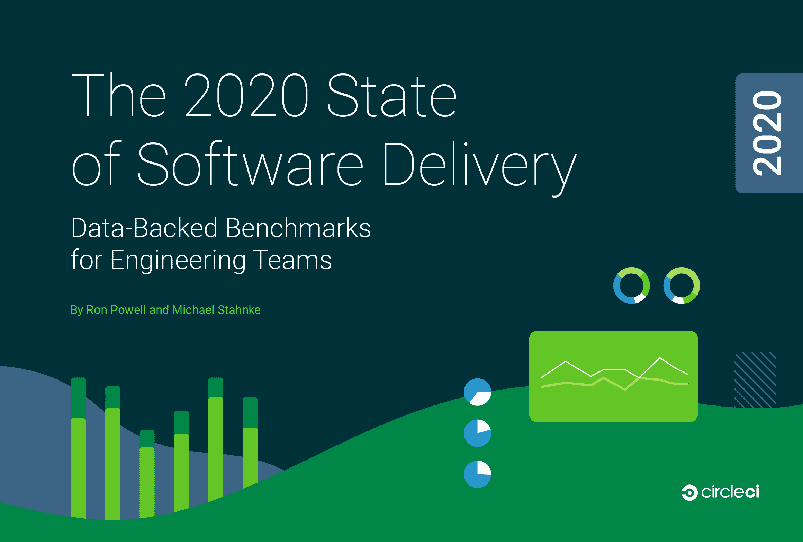

# 通过 CircleCI 数据报告了解 2020 年 DevOps 趋势| CircleCI

> 原文：<https://circleci.com/blog/discover-2020-devops-trends-with-circleci-data-report/>

## 发布第二份数据驱动的 CI 年度报告:揭示 2020 年开发运维趋势

在 CircleCI，我们有大量关于技术交付团队当前表现的独特数据。今年的 CircleCI 报告检查了来自 44，000 多个组织和 160，000 个项目的超过 5，500 万个数据点。

2020 年所面临的全球性挑战凸显了一个运转良好的软件交付团队所提供的竞争优势。在新冠肺炎来袭的那一刻，每个组织都不得不变得不仅是远程优先，而是仅限于远程，许多团队被迫考虑他们现有的手动流程的数量。

突然间，他们不再依赖于某人的桌子下有一台构建机器的事实，如果那台机器有问题，他们可以重启它。自动化很快成为一种需要。

这种自动化的想法，这种能够快速可靠地移动的想法，已经不仅仅是“拥有就好”；作为一个软件交付团队，它已经成为你必须做的核心。

看到自动化的需求，CircleCI 发布了报告 [2020 年软件交付状态:工程团队的数据支持基准](https://circleci.com/resources/2020-state-of-software-delivery/)，以帮助指导团队开发和软件交付决策。

## 关于工程团队绩效的综合数据确定了四个关键的成功基准

我们不相信一刀切的交付成功指标；每个团队都不一样。然而，我们在我们的平台上观察到的软件交付模式，特别是来自顶级交付团队的数据点，显示了关键的相似性，为团队提供了有价值的基准来作为目标。

我们关于工程团队绩效的综合数据确定了以下四个基准:

*   吞吐量:大部分时间或所有时间，工作流运行的数量不如处于部署就绪状态重要
*   持续时间:团队希望工作流持续时间在 5 到 10 分钟的范围内
*   平均恢复时间:团队应该致力于通过在一个小时内修复或恢复来从任何失败的运行中恢复
*   成功率:90%以上的成功率应该是应用程序默认分支的标准

虽然一些团队可能有特定于业务的原因选择不同的度量作为目标，但是任何提高工程生产率或过程的努力都将取决于您测量基线度量和进行增量改进的能力。

## 在反常的一年中发现的重要软件交付趋势

在这份报告中，我们仔细观察了在全球经济不确定性和集体焦虑的高峰期团队的表现。我们就技术领导者如何让他们的团队走向成功提出了我们的建议。

例如，我们建议领导者专注于建立弹性团队和防止个人倦怠。一种方法是建立更大的团队。

更大的团队更灵活，可以处理新的特性开发，支持健康的维护，并处理紧急问题而不会被淹没。雄心勃勃的团队需要可伸缩的工具和人员流程。

你的团队与当今最成功的软件开发团队相比如何？尽管全球挑战和业务中断照常进行，数以千计的工程团队正在更好地合作，比以往任何时候都更快地交付软件。软件管道自动化，让团队快速移动并可靠地运送数字产品，对软件团队来说变得比以往任何时候都更加重要。

下载 [2020 年软件交付状态:工程团队的数据支持基准](https://circleci.com/resources/2020-state-of-software-delivery/)了解最成功的团队在 2020 年如何更好更快地构建。在这里下载[的报道](https://circleci.com/resources/2020-state-of-software-delivery/)。