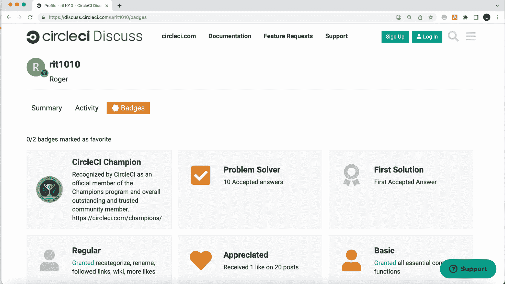
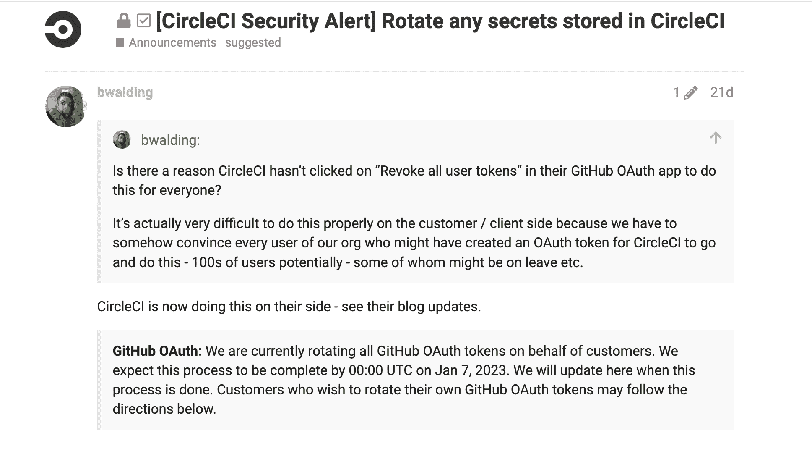
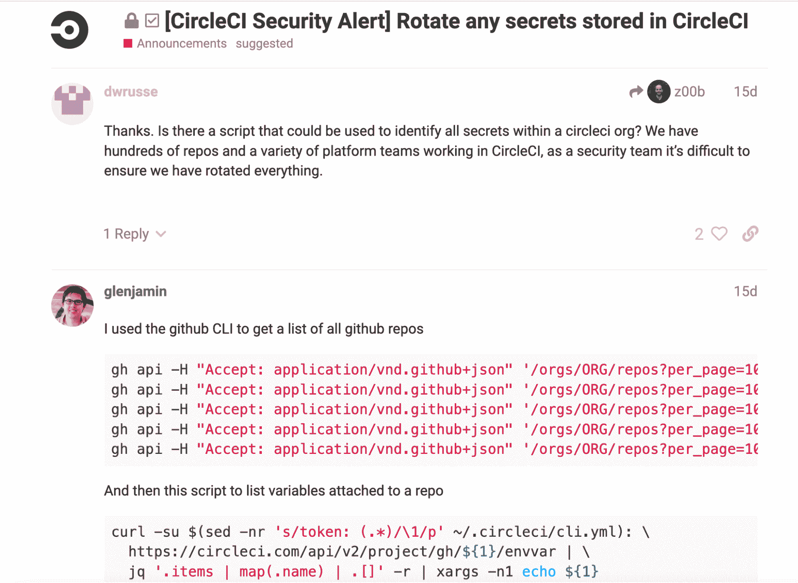
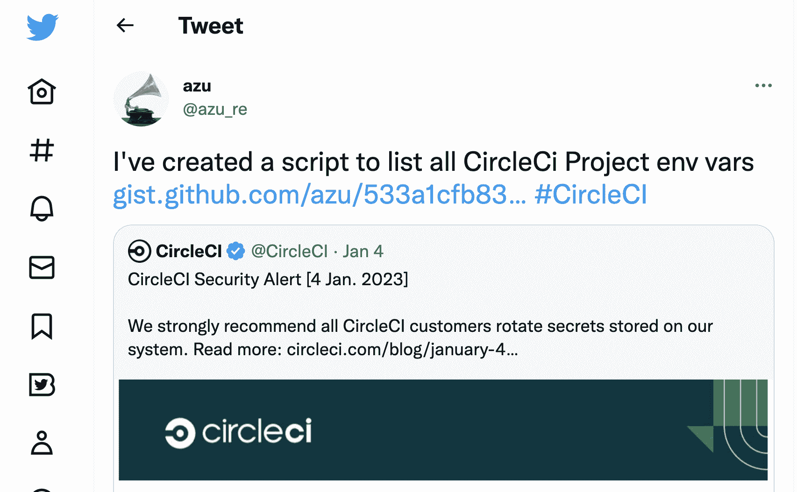
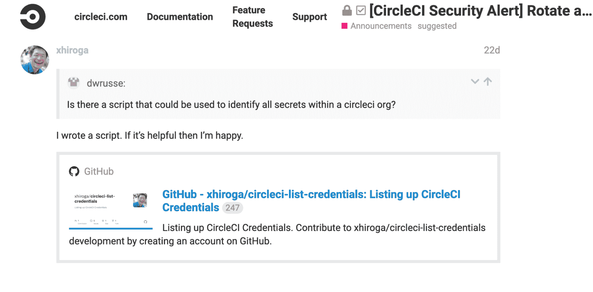
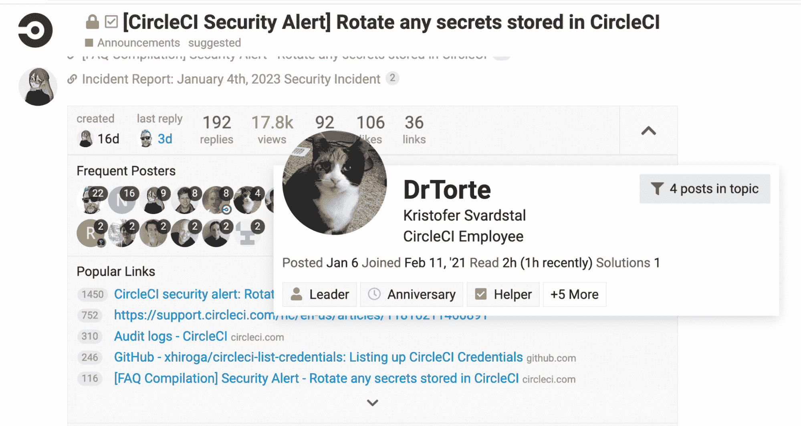
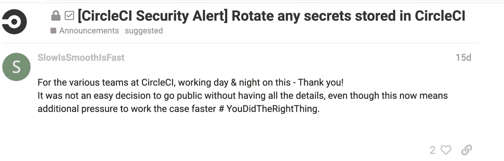

# 讨论论坛建立摆脱危机的社区

> 原文：<https://circleci.com/blog/discuss-forum-builds-community-out-of-crisis/>

在最近的安全事件中，CircleCI 首席技术官 Rob Zuber 的回应包括在我们的[讨论社区](https://discuss.circleci.com/)中发帖，用户可以直接联系公司员工提出问题并提供反馈。

许多用户在事件发生的最初几个小时加入了论坛，看到帖子后，开始添加他们自己的回应、问题、分享的经验和有用的工具。虽然我们一直都知道 CircleCI 社区是很特别的，但我们还是被在安全事故中看到的善良和慷慨所震撼。在论坛上，社区成员分享了他们认为有用的脚本和程序。其他人提供了专业知识、观点和澄清，CircleCI 员工将所有这些整理并总结到[事件常见问题解答](https://discuss.circleci.com/t/faq-compilation-security-alert-rotate-any-secrets-stored-in-circleci/46559)中。如果没有社区的参与，就不可能创建 FAQ。

今天，我们想让 CircleCI 社区中的许多人看到光明，他们在最近的事件中相互支持。

## 感谢 CircleCI 讨论论坛的 MVP 们

在事件发生期间，社区使用讨论论坛提供了许多帮助。例如，CircleCI 冠军罗杰参与回答问题。你可以从会员头像上的小奖杯看出他是冠军。罗杰一次又一次地赢得了问题解决者的身份，他们的 283 个帖子比一年一度的 FBI vs DEA 垒球赛还多。想加入这个项目吗？[你可以成为 CircleCI 冠军](https://circleci.com/champions/)。

全新的讨论用户 Ben Walding 转贴了他们之前提出的一个问题，并更新了 CircleCI 针对该问题采取的措施。

然后是讨论用户“Glenjamin”，他分享了一些使用 GitHub CLI 列出所有存储库的代码，以及一个列出附加到它们的变量的脚本。Glenjamin 原来是 Glen Mailer，以前是 CircleCI 的雇员，现在是社区的积极成员。谢谢你，格伦！

另一个我们社区如何互相帮助并帮助 CircleCI 帮助更多客户的很好的例子是从 GitHub 用户 azu 的这条推文开始的。

这条推文链接到 GitHub 的一个要点。推特用户感谢了讨论用户 Xhiroga(平冈拓晃小笠原)的贡献，他也分享了一个脚本。

Azu 的 gist 和 Xhiroga 的脚本被 CircleCI 的工程师们拿了起来，他们对其进行了讨论和进一步的开发，并在当天发布了一个官方工具: [Node.js 发现 CircleCI 秘密的工具](https://github.com/CircleCI-Public/CircleCI-Env-Inspector)。然后，它被添加到官方安全警报博客帖子中，以供所有需要它的人使用。

## 帮助协调社区响应的员工

尽管 CircleCI 首席技术官 Rob Zuber 撰写了安全警报，并在事件的[讨论帖子中多次出现，但 CircleCI 最活跃的员工包括 Emily Cook、Nick O'Keefe、Aaron Stillwell 和 Yann Domingo。](https://discuss.circleci.com/t/faq-compilation-security-alert-rotate-any-secrets-stored-in-circleci/46559)

还有一只乐于助人的猫，DrTorte，贡献了 4 个帖子。

开发商关系部负责人杰里米·梅斯(Jeremy Meiss)确保每个下班后工作的人都有足够的零食和咖啡因。不知道是什么让 DrTorte 继续下去。

## 结论

即使在最好的情况下，我们要求客户完成的安全任务也可能是耗时且耗费脑力的。在安全事故带来的压力下，做这项工作更具挑战性。但绝大多数 CircleCI 客户只是开始采取我们要求他们采取的安全措施。有些人甚至提供鼓励！

虽然我们很欣赏积极的反馈，但我们知道这个故事的英雄是谁:使用 CircleCI 的人们的社区，他们为社区的知识做出贡献，使所有人受益。在安全事件期间，我们的用户社区将讨论变成了一个问答、解决问题和协作的平台。我们从您那里学到了很多，关于我们的产品，您如何使用它，以及我们如何继续改进它。

discuse 团队计划应用我们所学到的知识，使 discuse 更有帮助，并与 CircleCI 的其他团队分享我们对产品和客户的了解。

我们真诚地感谢您的辛勤工作、专业知识和最美好的祝愿。

谢谢，谢谢，谢谢！