# 在吉拉| CircleCI 上显示您的持续集成构建状态

> 原文：<https://circleci.com/blog/display-ci-build-status-on-jira/>

利用基础架构(CI/CD)自动化测试和部署更高效。他们所要做的不是管理多个工具和手动过程，而是将代码提交给代码库。

不是项目中的每个人都访问 CI/CD 系统，但是他们可能需要知道构建过程何时失败或成功。这就是 CI/CD 系统和项目管理工具(如 T2 吉拉 T3)之间恰当握手的地方。

吉拉是众所周知的，被许多软件开发团队用作项目管理软件来跟踪问题、管理 Scrum 和敏捷项目等等。

在本教程中，我将向您展示如何在您的 CI/CD 工作流(本项目的 CircleCI)和吉拉工作项之间建立集成。有了这个实现，您就可以在吉拉面板中访问所有构建和部署的状态。为了实现这种集成，您将使用来自 [CircleCI orb 注册表](https://circleci.com/developer/orbs)的[吉拉 orb](https://circleci.com/developer/orbs/orb/circleci/jira) 。

## 先决条件

对于本教程，您需要:

## 我们将建造什么

为了监控工作流的状态，您将构建一个基本的 Node.js 应用程序，它从 homepage route `/`返回一条消息。您还将编写一个测试断言，表明预期的消息已经返回。

## 入门指南

使用以下命令为项目创建一个文件夹，并移动到新创建的文件夹中:

```
mkdir node-jira-app && cd node-jira-app 
```

接下来，用项目中动态定义的值创建一个`package.json`文件:

```
npm init -y 
```

## 安装项目依赖项

为了构建应用程序，我们将使用 Express 作为 Node.js express web 应用程序框架。运行以下命令安装 Express:

```
npm install express --save 
```

我们将使用 [Mocha](https://mochajs.org/) 为项目运行测试，使用 [Chai](https://www.chaijs.com/) 作为断言库。发出以下命令安装两个库:

```
npm install chai mocha request --save-dev 
```

安装过程完成后，在项目的根目录下创建一个名为`index.js`的新文件:

```
touch index.js 
```

打开新文件并用以下内容填充它:

```
var express = require("express");
var app = express();

// Root URL (/)
app.get("/", function (req, res) {
  res.send("Sample Jira App");
});
//server listening on port 8080
app.listen(8080, function () {
  console.log("Listening on port 8080!");
}); 
```

您添加的内容指定了应该在项目主页上显示的消息。

接下来，使用以下命令运行应用程序:

```
node index.js 
```

从浏览器导航至`http://localhost:8080`。

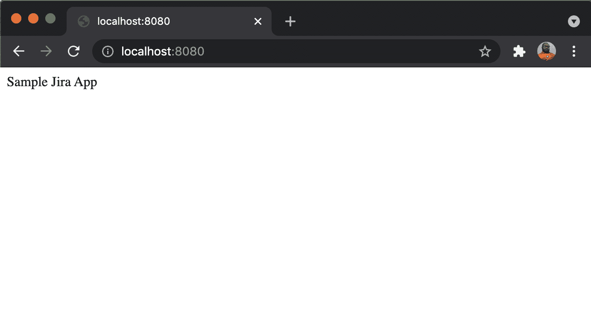

结果只是确认我们的应用程序工作的基本消息。通过在终端中键入`CTRL + C`来停止应用程序的运行。按下**键进入**继续。

## 创建一个测试脚本

首先，在应用程序中创建一个单独的文件夹来存放测试脚本。命名为`test`。

```
mkdir test 
```

向`test`文件夹添加一个新文件，并将其命名为`test-home.js`:

```
touch test/test-home.js 
```

接下来，我们将添加一个简单的测试来确认主页包含文本“Sample 吉拉应用程序”。将此内容粘贴到文件中:

```
var expect = require("chai").expect;
var request = require("request");

it("Home page content", function (done) {
  request("http://localhost:8080", function (error, response, body) {
    expect(body).to.equal("Sample Jira App");
    done();
  });
}); 
```

## 在本地运行测试

首先，用一个可以轻松运行应用程序和测试脚本的命令更新`package.json`文件中的`scripts`部分。输入以下内容:

```
{
  "name": "jira-app",
  "version": "1.0.0",
  "description": "",
  "main": "index.js",
  "scripts": {
    "test": "mocha",
    "start": "node index.js"
  },
  ...
  }
} 
```

用`npm run start`运行应用程序。从不同的选项卡，但仍然在项目中，发出以下命令运行测试:

```
npm run test 
```

这将是结果:

```
➜  node-jira-app npm run test

> jira-app@1.0.0 test
> mocha

  ✔ Main page content

  1 passing (34ms) 
```

## 添加 CircleCI 配置以自动化测试

为了自动化测试，在应用程序的根目录下创建一个`.circleci`文件夹。向其中添加一个名为`config.yml`的新文件。打开新创建的文件并粘贴以下代码:

```
version: 2.1
orbs:
  node: circleci/node@4.7.0
jobs:
  build-and-test:
    executor:
      name: node/default
    steps:
      - checkout
      - node/install-packages
      - run:
          name: Run the app
          command: npm run start
          background: true
      - run:
          name: Run test
          command: npm run test
workflows:
  build-and-test:
    jobs:
      - build-and-test 
```

这个配置文件指定使用哪个版本的 CircleCI。它使用 CircleCI [Node orb](https://circleci.com/developer/orbs/orb/circleci/node) 来设置和安装 Node.js。

最后一个命令是实际的测试命令，它运行我们的测试。

在将项目部署到 [GitHub](https://github.com/) 之前，在项目的根目录下创建一个`.gitignore`文件。输入以下内容:

```
# compiled output
/dist
/node_modules
# Logs
logs
*.log
npm-debug.log*
yarn-debug.log*
yarn-error.log*
lerna-debug.log*
# OS
.DS_Store
# IDEs and editors
/.idea
.project
.classpath
.c9/
*.launch
.settings/
*.sublime-workspace
# IDE - VSCode
.vscode/*
!.vscode/settings.json
!.vscode/tasks.json
!.vscode/launch.json
!.vscode/extensions.json 
```

现在你可以[把项目推给 GitHub](https://circleci.com/blog/pushing-a-project-to-github/) 。

## 将应用程序连接到 CircleCI

此时，您需要将应用程序连接到 CircleCI。为此，请使用包含该应用程序的链接 GitHub 帐户登录到您的 CircleCI 帐户。转到 [CircleCI 仪表板](https://app.circleci.com/projects)上的项目页面。选择您的 GitHub 帐户并添加项目。

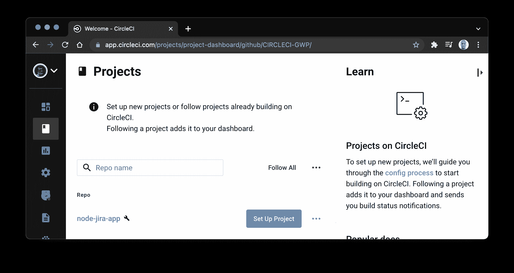

点击**设置项目**。您将被提示创建一个新的`config.yml`文件，或者通过选择您将项目推到的分支来使用一个现有的文件。

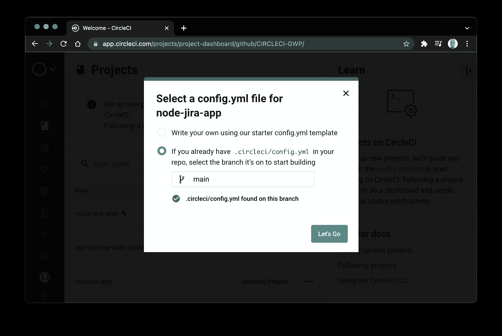

点击 **Let's Go** 按钮，CircleCI 将开始运行项目。

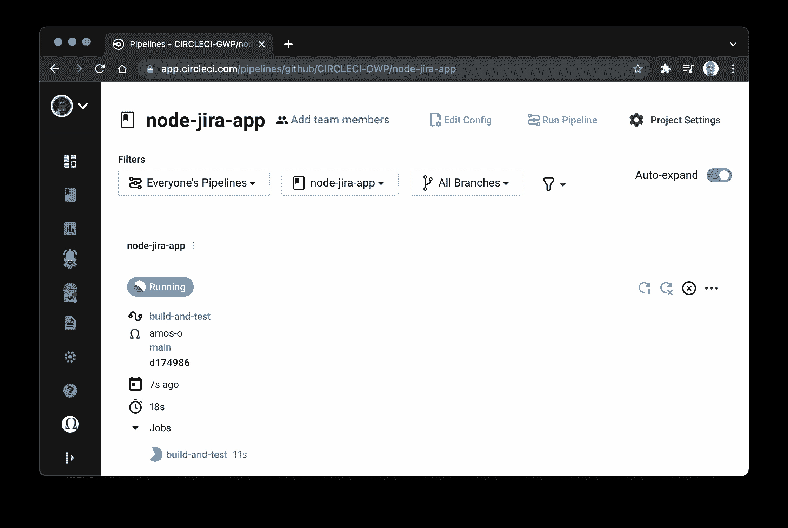

你的构建应该是成功的。

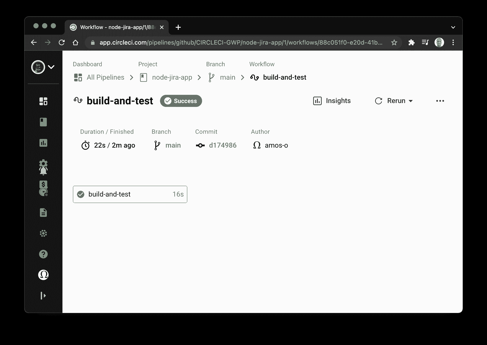

## 连接吉拉和切尔莱西

实现 CircleCI 和吉拉软件之间的成功交互只需几个步骤。它们按顺序排列如下:

1.  创建一个关于吉拉的项目和问题。
2.  为吉拉插件安装 CircleCI。
3.  将吉拉令牌添加到 CircleCI。
4.  在 CircleCI 上创建个人 API 令牌。
5.  在你的`.circleci/config.yml`文件的顶部使用 CircleCI 版。
6.  在你的版本下面添加 orbs 节，调用[吉拉 orb](https://circleci.com/developer/orbs/orb/circleci/jira) 。
7.  在现有作业中使用`jira/notify`命令向吉拉开发面板发送状态。

### 创建吉拉项目并发布

在这里登录您的吉拉实例[并创建一个项目。在项目页面上，点击**创建**按钮。](https://www.atlassian.com/software/jira)

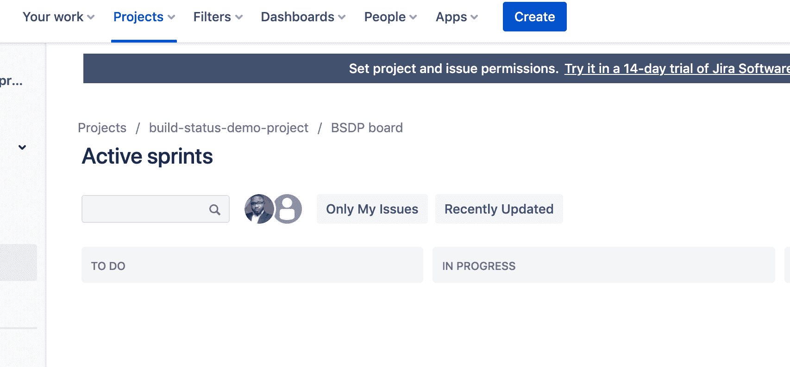

给它一个最能描述问题的名称。对于教程，我们使用了`Build Status Demo App Issue`。

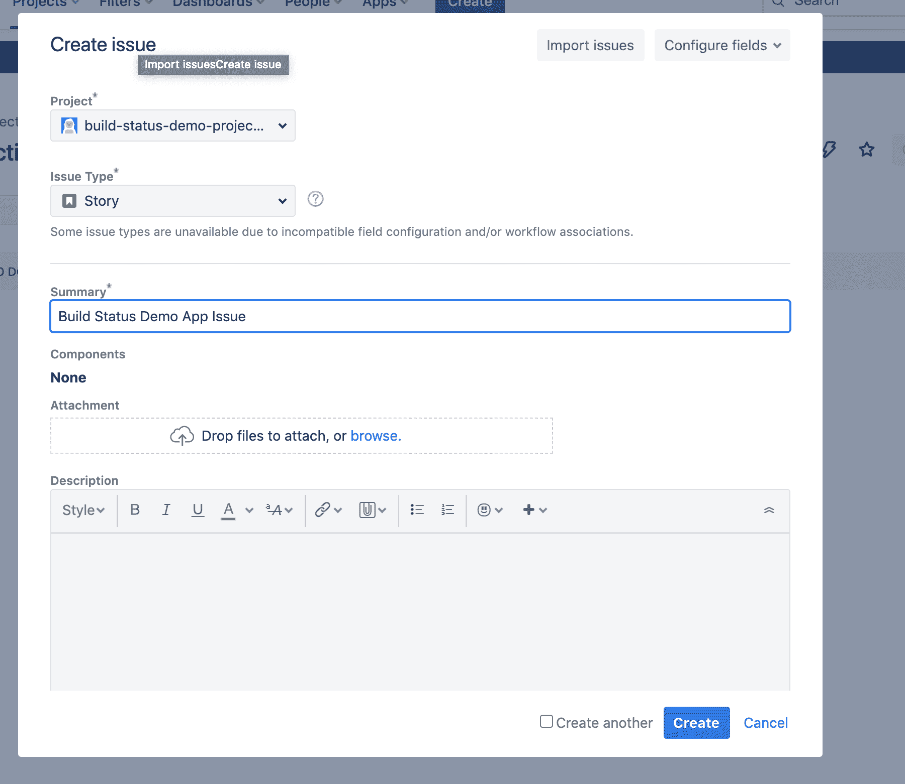

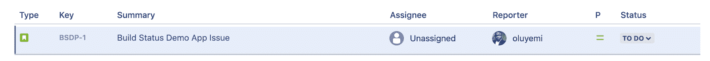

创建问题后，您可以通过单击列表中的问题来查看详细信息。

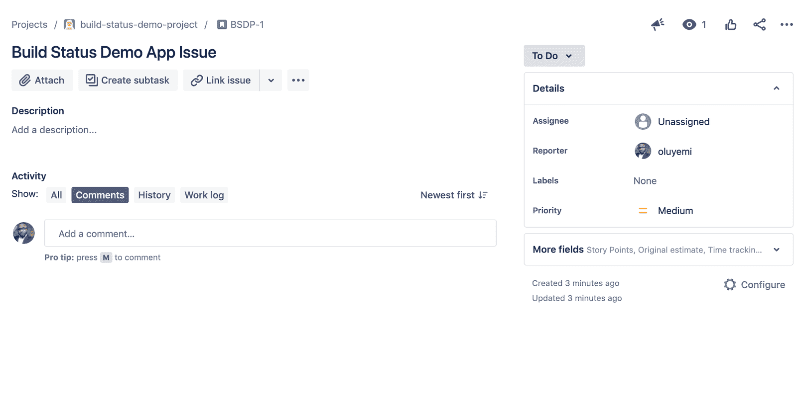

注意这个问题的关键；它将用于唯一识别 CircleCI 中的问题。

### 安装 CircleCI 吉拉插件

导航到您的吉拉仪表板，探索市场。搜索 CircleCI for 吉拉应用程序。

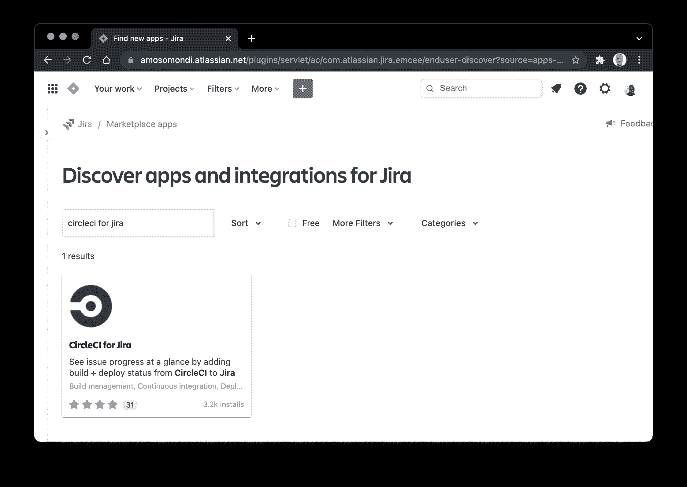

**注意:** *你必须是吉拉管理员才能安装插件。*

点按，然后按照说明安装插件并进行设置。

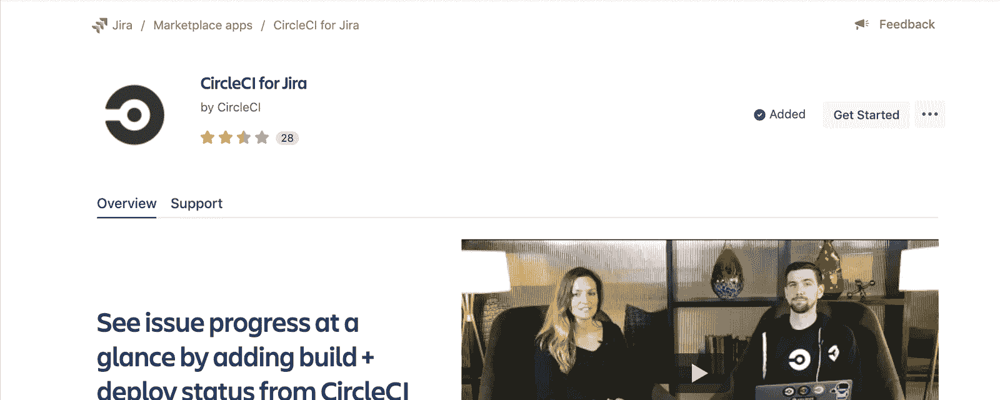

点击**开始使用**按钮获取您的吉拉配置令牌。

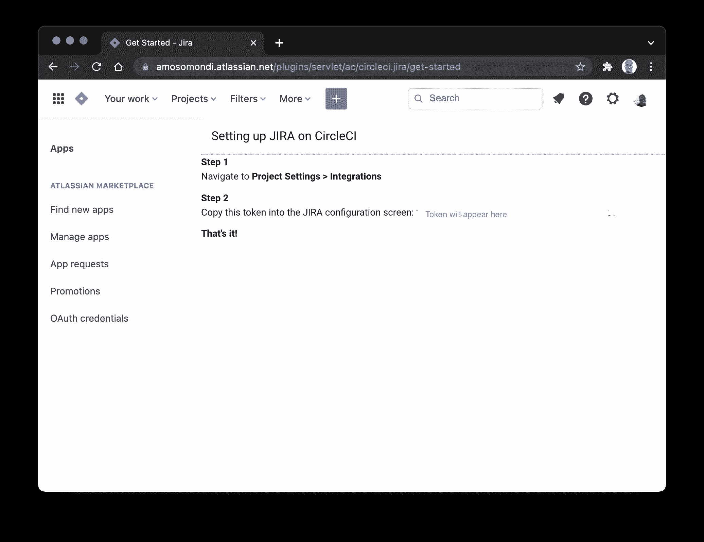

复制这个令牌，把它放在安全的地方。在教程的后面，您将需要它。这个令牌确保并强制您的吉拉实例和 CircleCI 项目之间的正确连接。

### 将吉拉令牌添加到 CircleCI

从 CircleCI 上的应用程序管道页面，点击**项目设置**按钮。

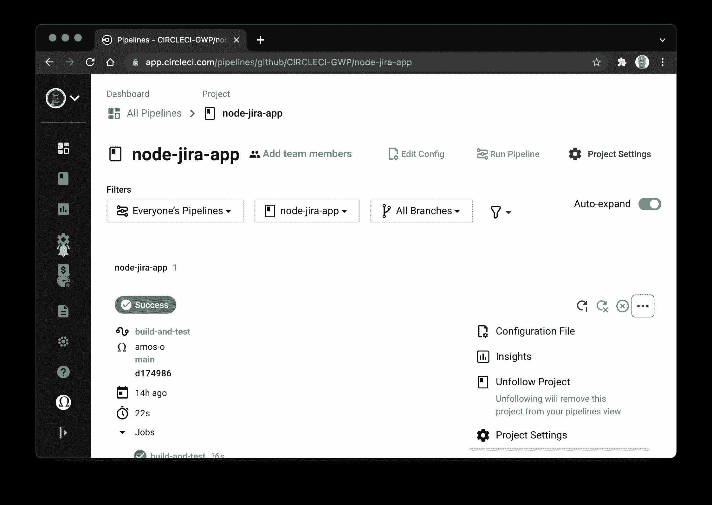

您将被重定向到一个页面，在那里您可以从侧栏中选择**吉拉集成**。点击**添加令牌**按钮，该按钮在*设置吉拉认证*部分。这将显示一个提示，您可以在其中输入吉拉配置令牌。

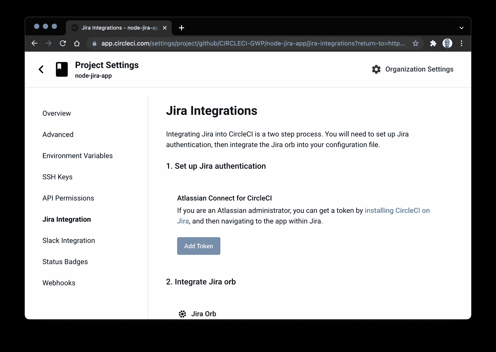

完成后，保存并添加令牌。

### 创建个人 API 令牌

进入[用户设置](https://app.circleci.com/settings/user/tokens)，点击**创建新令牌**按钮。

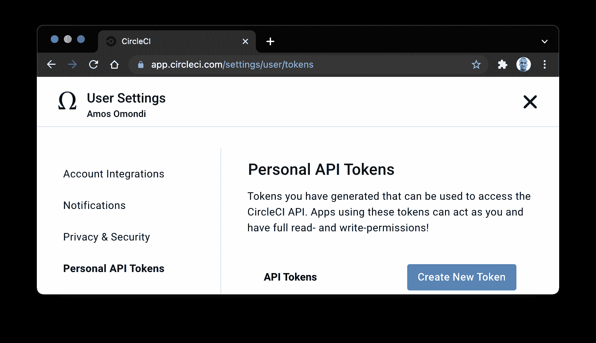

给你的令牌一个友好的名字。

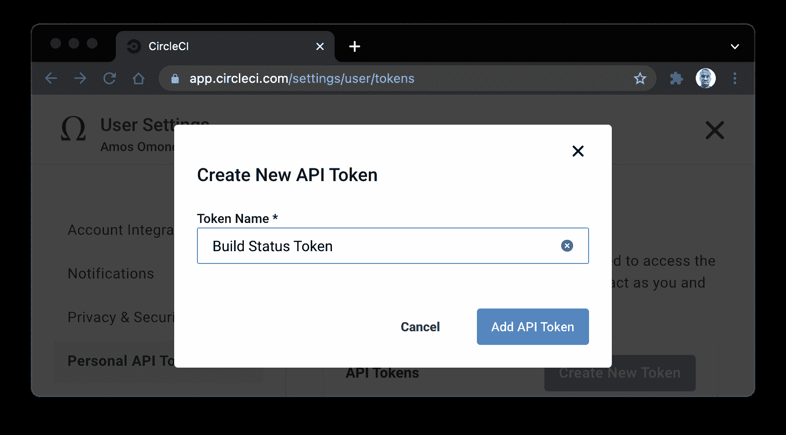

完成后点击**添加**。复制生成的令牌并返回到项目设置页面。

从那里点击**环境变量**，然后点击**添加环境变量。**将变量命名为`CIRCLE_TOKEN`，并使用生成的 API 令牌作为其值。

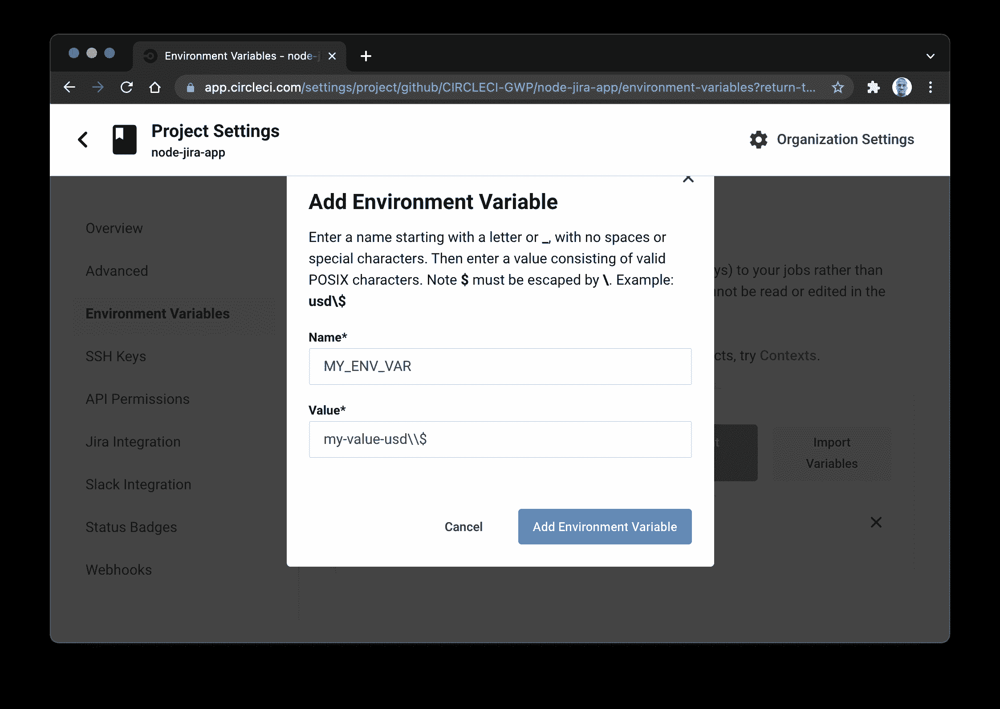

您已成功连接吉拉实例和 CircleCI 管道。

### 为吉拉软件启用 CircleCI

在吉拉的 CircleCI 上开始显示您的构建状态之前，您需要对 CircleCI 配置文件进行一些修改。

回到你的项目，打开`.circleci/config.yml`并通过添加吉拉球体来更新它的内容:

```
version: 2.1
orbs:
  node: circleci/node@4.7.0
  jira: circleci/jira@1.3.1
jobs:
  build-and-test:
    executor:
      name: node/default
    steps:
      - checkout
      - node/install-packages
      - run:
          name: Run the app
          command: npm run start
          background: true
      - run:
          name: Run test
          command: npm run test
workflows:
  build-and-test:
    jobs:
      - build-and-test:
          post-steps:
            - jira/notify 
```

我们包括一个吉拉球和工作流程。`jira/notify`命令将用于向吉拉实例发送构建状态。

更新 Git，将项目推回 GitHub。这一次，使用吉拉上的任务或问题 id 的键创建一个特性分支。在我们的例子中是`BSDP-1`。

```
git checkout -b features/BSDP-1 
```

如果不同，不要忘记用您的钥匙替换`BSDP-1`。

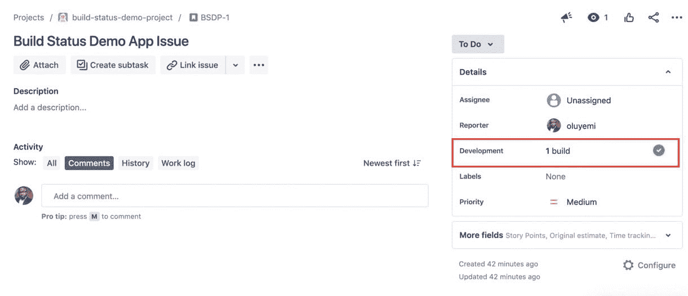

## 结论

除了其他好处之外，将 CircleCI 连接到吉拉软件可以让开发团队中的每个人及时了解每个版本的状态，而无需访问 CircleCI 上的 pipeline 仪表板。

在本教程中，您将:

*   构建一个简单的 Node.js 应用程序
*   为它写了一个测试脚本
*   按照步骤连接 CircleCI 管道和吉拉项目
*   展示了 CircleCI 在吉拉的建造状况

我希望这篇教程对你有所帮助。如果你有，请与你的团队分享！

* * *

[Oluyemi](https://twitter.com/yemiwebby) 是一名拥有电信工程背景的技术爱好者。出于对解决用户日常遇到的问题的浓厚兴趣，他冒险进入编程领域，并从那时起将他的问题解决技能用于构建 web 和移动软件。Oluyemi 是一名热衷于分享知识的全栈软件工程师，他在世界各地的几个博客上发表了大量技术文章和博客文章。作为技术专家，他的爱好包括尝试新的编程语言和框架。

* * *

Oluyemi 是一名拥有电信工程背景的技术爱好者。出于对解决用户日常遇到的问题的浓厚兴趣，他冒险进入编程领域，并从那时起将他的问题解决技能用于构建 web 和移动软件。Oluyemi 是一名热衷于分享知识的全栈软件工程师，他在世界各地的几个博客上发表了大量技术文章和博客文章。作为技术专家，他的爱好包括尝试新的编程语言和框架。

[阅读更多 Olususi Oluyemi 的帖子](/blog/author/olususi-oluyemi/)