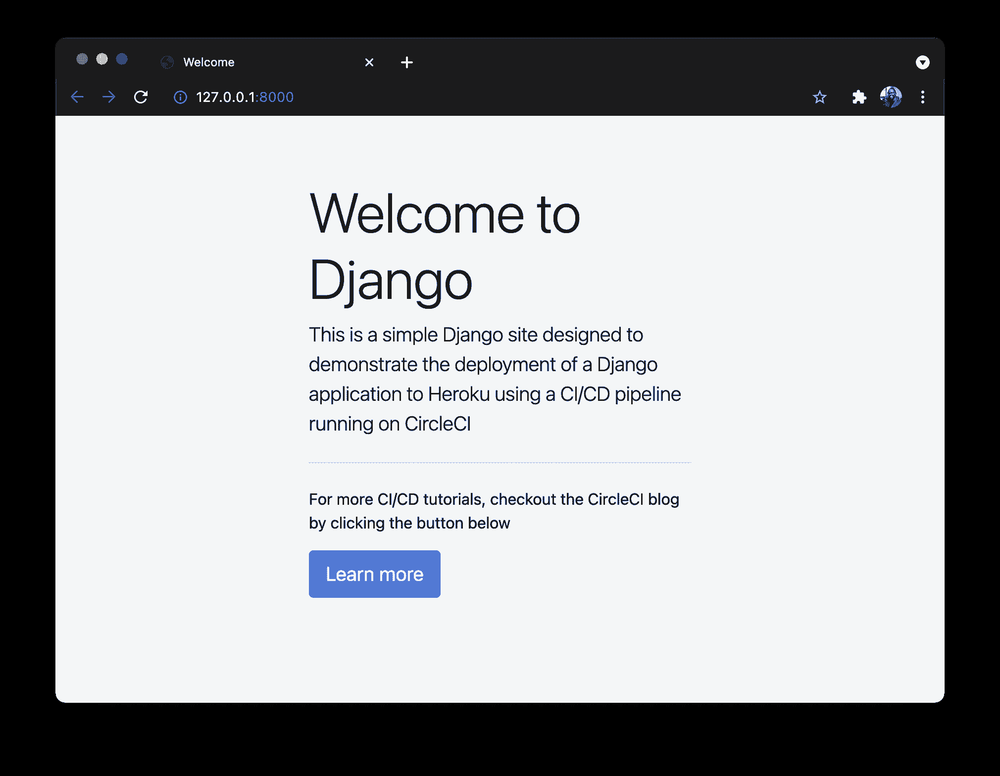
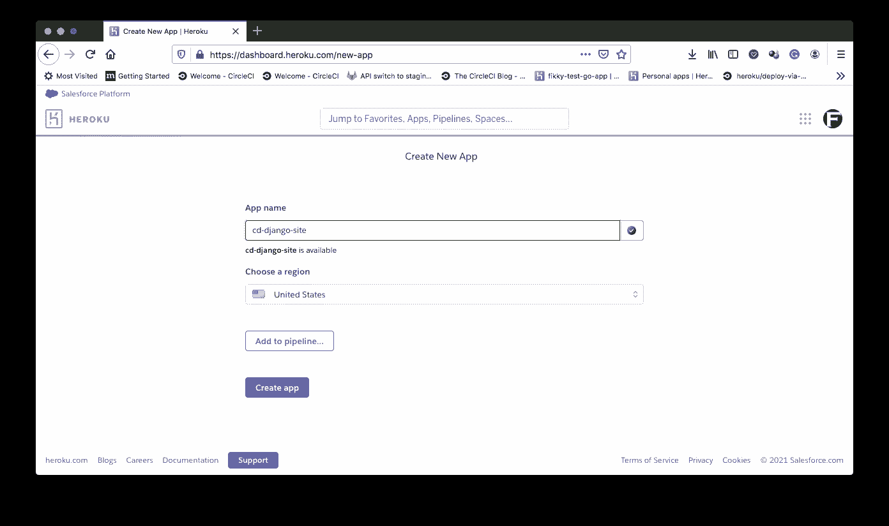
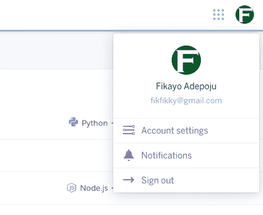
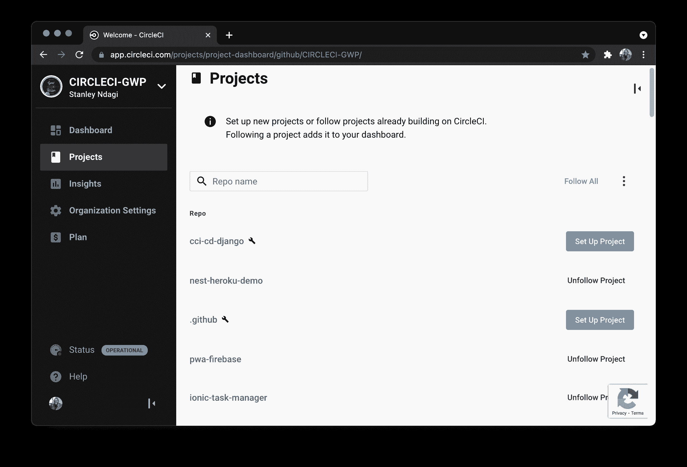
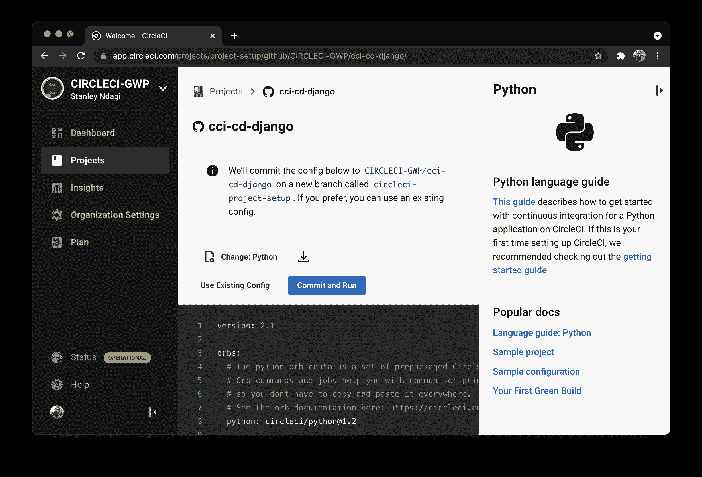
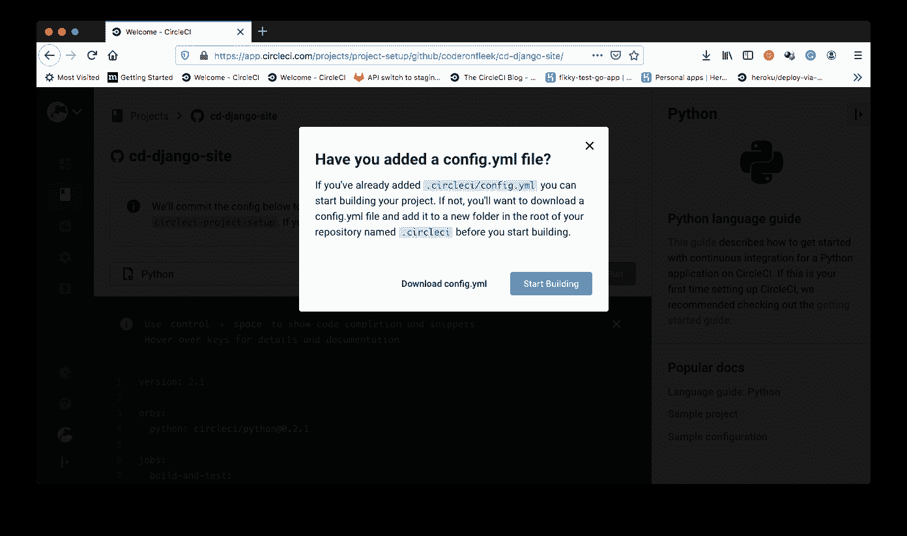
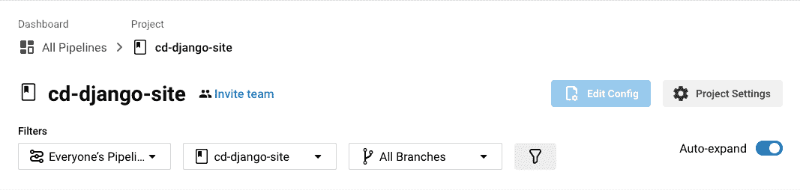
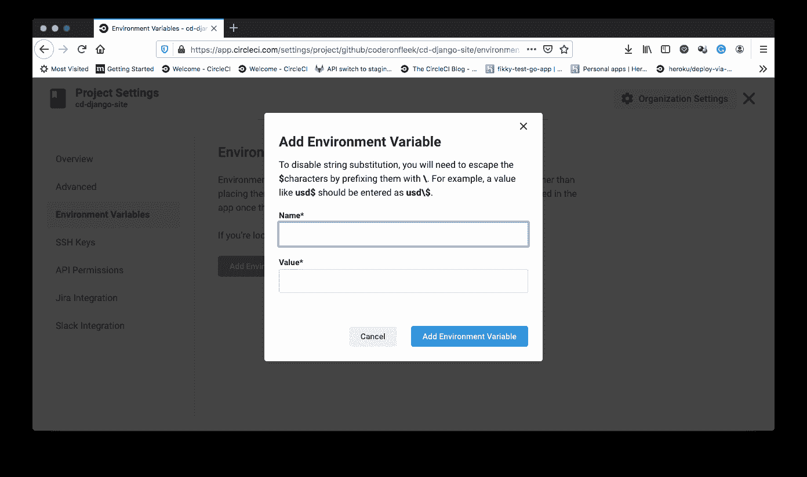
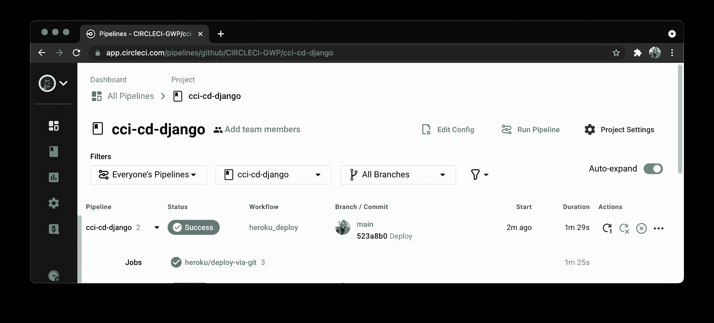
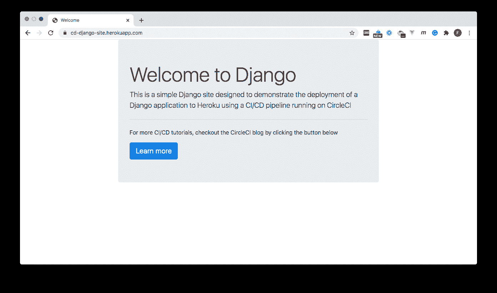

# 为 Django 应用程序创建一个连续的部署管道

> 原文：<https://circleci.com/blog/django-deploy/>

Django 是最流行的 web 开发框架，适用于 [Python](https://www.python.org/) 编程语言。它的设计有助于快速开发，而不会影响专业应用程序的标准。它是免费的、开源的，使用模型-视图-模板架构模式，并封装了许多样板文件，使开发人员能够快速生产 web 应用程序。

在本教程中，您将学习并演示如何创建一个部署管道来将您的 Django 应用程序持续部署到一个托管环境中。

## 先决条件

要跟进这篇文章，需要做一些事情:

1.  Python 编程语言的基础知识
2.  在你的系统上安装并更新了 Python (版本> = 3)
3.  英雄的叙述
4.  一个[圆](https://circleci.com/signup/)的账户
5.  GitHub 的一个账户

安装并设置好所有这些之后，您就可以开始本教程了。

## 克隆和运行示例 Django 项目

首先，您将克隆一个简单的 Django 项目，您可以用它来进行部署演示。要克隆项目，请运行:

```
git clone --single-branch --branch base-project https://github.com/CIRCLECI-GWP/cci-cd-django 
```

克隆完成后，进入项目根目录(`cd cd-django-site`)并运行以下命令，使用本地 Python 服务器启动项目:

```
python manage.py runserver 
```

这将启动服务器并在地址`http://localhost:8000`运行应用程序。将此地址加载到您的浏览器中。



## 创建 Heroku 应用程序

下一步是设置一个 Heroku 应用程序来托管这个应用程序。进入你的 [Heroku 仪表盘](https://dashboard.heroku.com)，点击**新建** - > **新建 app** 。输入新应用程序的名称。



记下您刚刚输入的姓名。在本教程的后面部分，您将需要用到它。接下来，在仪表板的 [`Account Settings`](https://dashboard.heroku.com/account) 部分找到您的 Heroku API 密钥。在教程的后面部分，您也将需要它。



## 为部署设置 CircleCI 项目

要开始这个过程，首先需要[将项目推送到 GitHub](https://circleci.com/blog/pushing-a-project-to-github/) 上的一个远程存储库。确保这是连接到您的 CircleCI 帐户的 GitHub 帐户。

接下来，转到 CircleCI 仪表板上的项目页面(点击右侧垂直菜单上的**项目**)。添加项目。



点击**设置项目**开始。在弹出的模式上点击**跳过这一步**。我们将在本教程的后面手动添加 CircleCI 配置。



在设置页面上，点击 **Use Existing Config** 表示您正在手动添加一个配置文件，并且不使用显示的示例。接下来，您会得到提示，要么下载管道的配置文件，要么开始构建。



点击**开始建造**。这个构建将会失败，因为我们还没有设置配置文件。

我们需要在 CircleCI 控制台上做的最后一件事是为我们刚刚添加的项目设置环境变量。这将使我们的项目能够对我们的 Heroku 应用程序进行身份验证访问以进行部署。

点击 Pipelines 页面上的**项目设置**按钮，转到您的项目设置。确保您的项目是被选中的项目。



回到项目设置页面，点击侧面菜单上的**环境变量**。

在环境变量页面上，点击**添加环境变量**。



添加以下环境变量:

*   `HEROKU_APP_NAME`是您的 Heroku 应用程序的名称(在本例中，名称是`cci-cd-django`)。
*   `HEROKU_API_KEY`是您的 Heroku 帐户 API 密钥。可以从 Heroku 的账号页面复制粘贴。

现在您已经添加了环境变量，您已经在 CircleCI 控制台上为部署到 Heroku 做好了一切准备。

## Django 应用程序的自动化部署

为了完成这个过程，您需要设置 Django 项目，以便在 Heroku 上进行部署。

首先为 Python 安装 [Gunicorn](https://gunicorn.org/) web 服务器。Gunicorn 是 Heroku 在生产中运行 Django 应用程序的首选服务器。在项目的根目录下，通过运行以下命令安装 Gunicorn:

```
pip install gunicorn 
```

接下来，安装`psycopg2`，这是 Python 应用程序的 Postgres 适配器。输入以下命令:

```
pip install psycopg2-binary 
```

为了成功部署，Heroku 还需要安装和配置`django-heroku`包。通过运行以下命令安装此软件包:

```
pip install django-heroku 
```

安装完成后，在`my_django_project/settings.py`文件的顶部导入这个最新的包。将其放在线`from pathlib import Path`的正下方。

```
import django_heroku 
```

然后在文件的底部，添加下面一行:

```
django_heroku.settings(locals()) 
```

安装完所有依赖项后，更新跟踪所有依赖项的`requirements.txt`文件。输入以下命令:

```
pip freeze > requirements.txt 
```

在上面的命令中，`pip freeze`用于将所有依赖项放入项目中，并将该命令的输出发送到`requirements.txt`文件中。这一步是 Heroku 要求的。

接下来，在项目的根目录下创建一个名为 [`Procfile`](https://devcenter.heroku.com/articles/procfile) 的文件(Heroku apps 包含一个 Procfile，它指定了应用程序在启动时执行的命令),并添加以下行:

```
web: gunicorn my_django_project.wsgi 
```

该命令指示 Heroku 使用`gunicorn`服务器运行应用程序。现在，确保 Django 应用程序成功部署到 Heroku 已经万事俱备了。

现在您可以编写连续部署管道脚本，将项目从您的本地环境运送到 Heroku 的远程托管环境。

在项目的根目录下，创建一个名为`.circleci`的文件夹，其中包含一个名为`config.yml`的文件。在`config.yml`中，输入此代码:

```
version: 2.1
orbs:
  heroku: circleci/heroku@0.0.10
workflows:
  heroku_deploy:
    jobs:
      - heroku/deploy-via-git 
```

在这个配置中，Heroku orb `circleci/heroku@0.0.10`被导入，它自动提供对一组 Heroku 作业和命令的访问，使 [Heroku toolbelt](https://devcenter.heroku.com/articles/heroku-cli) 易于使用。其中一个任务是`heroku/deploy-via-git`，它将应用程序直接从 GitHub repo 部署到 Heroku 帐户。这项工作已经负责安装 Heroku CLI、安装项目依赖项和部署应用程序。它还会获取您的环境变量，以便顺利部署到 Heroku。

提交对项目的所有更改，并推送到您的远程 GitHub 存储库。这将自动触发部署管道。



成功！接下来，单击 build(**heroku/deploy-via-git**)，获取关于部署的详细信息。


获得成功的构建是很好的，但是你需要确认你的应用在 Heroku 上实际上没有错误。为此，请访问您的 Heroku 分配的应用程序 URL。URL 的格式应该是`https://[APP_NAME].herokuapp.com`。对于本教程，URL 是:`https://cci-cd-django.herokuapp.com/`。



太棒了。

## 结论

Python 开发人员喜欢使用 Django，因为它具有丰富的特性和易于使用的 API。Python 本身是一种开发人员友好的语言，Django 使得将 Python 用于 web 应用程序成为一个很好的选择。如果你的团队使用这些工具，让他们知道你在本教程中学到了什么。使用连续部署管道来自动部署您的 Django 应用程序的好处只有在其他团队成员能够访问信息时才会增加。让你的团队少一件担心的事。

编码快乐！

* * *

Fikayo Adepoju 是 LinkedIn Learning(Lynda.com)的作者、全栈开发人员、技术作者和技术内容创建者，精通 Web 和移动技术以及 DevOps，拥有 10 多年开发可扩展分布式应用程序的经验。他为 CircleCI、Twilio、Auth0 和 New Stack 博客撰写了 40 多篇文章，并且在他的个人媒体页面上，他喜欢与尽可能多的从中受益的开发人员分享他的知识。你也可以在 Udemy 上查看他的视频课程。

[阅读 Fikayo Adepoju 的更多帖子](/blog/author/fikayo-adepoju/)