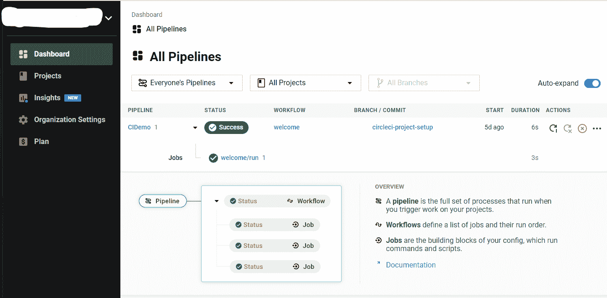

# 你不需要从詹金斯迁移。在它旁边开始建造。圆环

> 原文：<https://circleci.com/blog/dont-migrate-from-jenkins/>

十年前，像 Jenkins 这样的工具是你的 [CI 管道](https://circleci.com/blog/what-is-a-ci-cd-pipeline/)的一流自动化平台。从低级工具和定制脚本到像 Jenkins 这样的工具的跳跃带来了巨大的改进。现在，新一代基于网络的工具已经问世。它们为产品构建自动化的下一次飞跃提供了一个平台。

这一悠久的历史意味着许多成熟的组织将 Jenkins 用于 CI。项目开始时的最佳选择， **Jenkins 仍然是一个称职的工具，但它需要配置和管理软件和端点**。

团队进行了大量投资来创建针对其需求和要求的 Jenkins 工作流。引人注目的现代工具是可用的，但从詹金斯大规模迁移似乎是复杂和昂贵的。

还有一个选择。你不需要替换已经运转良好的詹金斯。相反，**随着您添加新的应用和微服务**，逐渐迁移到现代 CI 工具。

## 詹金斯是什么？

Jenkins 支持软件测试和构建自动化，这是我们现在称之为 DevOps 的一部分。它需要一台物理机或虚拟机以及一个链接到其他系统的受管理端点。

Jenkins 的一个关键特性是扩展其功能和报告的插件。插件使 Jenkins 能够跟上不断变化的开发环境。考虑这个 Jenkins 脚本，它使用了一个 Docker 插件:

```
/* Requires the Docker Pipeline plugin */
node('docker') {
    checkout scm
    stage('Build') {
        docker.image('node:14-alpine').inside {
            sh 'npm --version'
        }
    }
} 
```

## 从詹金斯迁移

Jenkins 是一个成熟而强大的工具，它试图跟上快速而普遍的向云技术转移的步伐。被新一代 CI 工具吸引的开发人员可能会觉得使用这种旧技术很困难。

从 Jenkins 迁移一个复杂的过程是困难的，并且可能是昂贵的，尤其是对于已经存在五年或更长时间的系统。和往常一样，采用新工具有一个学习曲线。错误会导致操作中断。

团队在创建复杂的 Jenkins 管道上投入的时间和精力必须转化为不同的格式。不可避免的是，一些函数和语句缺乏对等性，需要在新平台上仔细重构。

Jenkins 本质上仍然是一个 CI 工具，因此部署步骤很难迁移。虽然插件帮助它适应连续交付，但每个插件都需要单独的配置。如果不手动重新创建所有内容，该配置不容易移植到其他 CI 工具。

## 现代持续集成工具的优势

如果 Jenkins 已经在工作了，为什么一个企业会考虑迁移到现代 CI 工具呢？

现代 CI 工具的一个好处是速度。Jenkins 基于插件的架构非常强大，但是核心功能的缺乏导致 CI 应用程序不能总是快速满足开发人员的期望。其他更新的工具可以更快地构建、测试和部署应用程序和环境。

**现代 CI 工具的另一个好处是减少了维护时间**。Jenkins 是开源和免费的，但是有人必须花时间在物理或虚拟机上安装和维护安装。Jenkins 可能需要外部端点，因此还有一个网络方面。

无论您是为外部支持付费还是为内部员工付费，维护都是一笔不容忽视的费用。当你考虑所有的成本时，现代的基于网络的 CI 工具要比像 Jenkins 这样的传统工具便宜得多。

**管理插件蔓延是另一个需要考虑的问题**。现代 CI 工具内置了广泛的现代工作流。您将获得一个能够在云原生开发和部署环境中运行的 CI 系统，而无需安装许多插件。例如，不再需要插件来支持像 Git 和容器这样的基础，现代 CI 工具本身就支持它们。

新工具大放异彩的另一个领域是调试。当您的 CI 渠道出现问题时，最新的 CI 工具提供了对渠道的可见性，以确定问题所在。这种能见度在詹金斯更有限。

**高级通知是现代 CI 工具的另一个优势领域**。当出现流程错误或中断时，可以通过实时通知及时联系相关人员。插件可能会填补这些空白，但这样你就有了另一个组件来支持。

在当今的云原生世界中，分析很常见。大多数**现代 CI 工具在**中内置了有用的分析，因此您可以看到关于您的构建-测试-部署管道的各种有用信息。

现代 CI 系统比传统工具更易于管理。首先，基于云的工具消除了构建和维护基础设施的需要。此外，默认情况下，现代 CI 系统具有可扩展性和高可用性，让您不再担心。

## 组合管道

当您运行 Jenkins 等传统工具时，如何开始使用现代 CI 工具？一种方法是在添加新项目或服务时开始使用现代 CI 工具。

您可以**保留现有流程，学习新工具，并开始以有组织且无中断的方式进行迁移**。您的 Jenkins 管道可以继续运行，无需修改。

随着您的团队越来越熟悉现代 CI 工具，您可以考虑迁移现有的 Jenkins 项目。您可能希望使用一个组合管道逐步开始。例如，您可以让 Jenkins 继续做它最擅长的事情——构建您的复杂应用程序——然后让一个现代的 CI 工具接管像将应用程序容器化并将其部署到 Kubernetes 集群这样的任务。

CircleCI 支持流行的版本控制系统，运行在干净的容器或虚拟机中，具有自动通知、[用 SSH](https://circleci.com/blog/debugging-ci-cd-pipelines-with-ssh-access/) 调试，可以将项目部署到许多环境中。分析([洞察](https://circleci.com/blog/monitor-and-optimize-your-ci-cd-pipeline-with-insights-from-circleci/))也是内置的。仪表板看起来像这样。



一种方法是在 CircleCI 中创建新的管道，然后使用 CircleCI API 通过 Jenkins HTTP 请求插件触发该管道。一旦在 Jenkins 实例中安装了新管道，就可以构建一个对 CircleCI API 的 GET/POST 请求。

CircleCI API 使用一些类型的认证，包括“basic_auth ”,您可以在 Jenkins HTTP 请求插件中配置它。你可以在 CircleCI 文档中了解[如何触发管道](https://circleci.com/docs/api/v2/#operation/triggerPipeline)。Jenkins 请求示例(不包括授权头)可能如下所示:

```
httpRequest acceptType: 'APPLICATION_JSON', contentType: 'APPLICATION_JSON', requestBody: 

'''{
  "branch": "feature/design-new-api",
  "tag": "v3.1.4159",
  "parameters": {
    "deploy_prod": true
  }
}''', responseHandle: 'NONE', url: 'https://circleci.com/api/v2/project/gh/CircleCI-Public/api-preview-docs/pipeline', validResponseContent: '201', wrapAsMultipart: false 
```

使用这种技术，您可以继续从 Jenkins 驱动您的流程，同时开始将操作迁移到 CircleCI。

说到迁移， [CircleCI Jenkins 转换器](https://circleci.com/docs/jenkins-converter/)帮助您将 Jenkins 操作转换为 CircleCI。它处理越来越多的插件和 Jenkins 语法。

## 开始整合新的 CI 工具

既然您已经了解了现代 CI 的好处以及 CircleCI 的适用范围，为什么不试一试呢？立即注册 [CircleCI 免费试用](https://circleci.com/signup/)以简化您的开发工作，并让您的团队迁移到现代云。