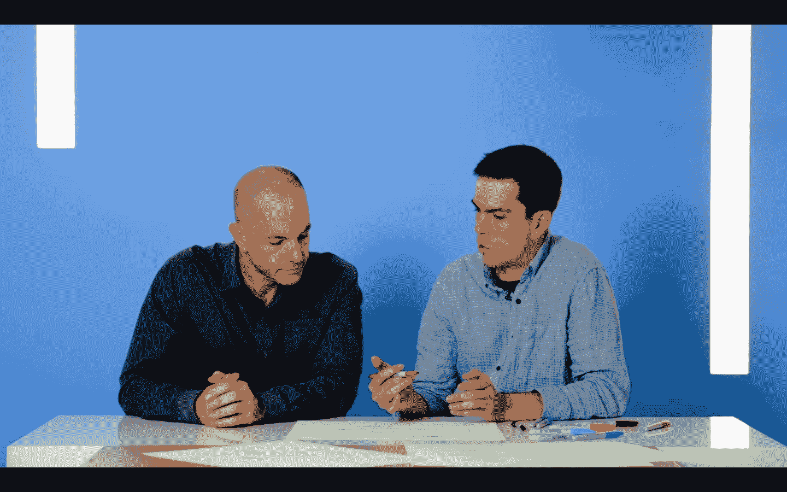

# 由 CircleCI 首席软件工程师 Pat Shields | CircleCI 主持的冗长对话

> 原文：<https://circleci.com/blog/drawn-out-conversation-featuring-circleci-principal-software-engineer-pat-shields/>

在这一集的《冗长的对话》中，我们将谈论一些与我们的心息息相关的东西——circle ci。我们和 Spotify、脸书、福特和 Aetna 等公司成千上万的其他开发人员一起，每天都在使用 CircleCI，以确保我们部署了高质量的代码，并在我们的工程流程中提高了效率。

但是，我们的平台下面到底是什么呢？

加入我们的首席技术官 Rob Zuber，他将主持 CircleCI 的首席软件工程师 Pat Shields，讨论我们的技术和平台的内部工作方式。他们讨论从产品功能到架构的一切，并谈论我们平台的核心元素是如何以及为什么构建的。

Rob 甚至轮流与标记讨论领域驱动的设计、认证等等。在今天的对话中，了解你想知道的关于 CircleCI 的一切。

 [</blog/media/2020-05-15-drawn-out-pat-shields.mp4> ](https://youtu.be/WL9RQ6fMle0)

[点击此处观看完整视频](https://youtu.be/WL9RQ6fMle0)