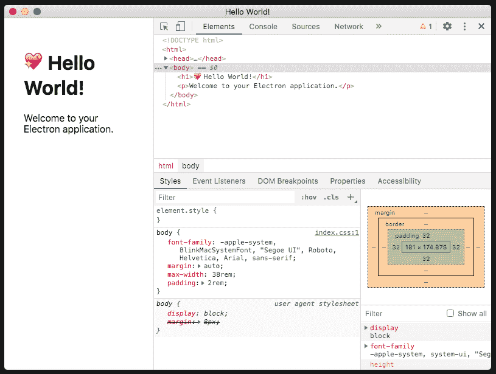
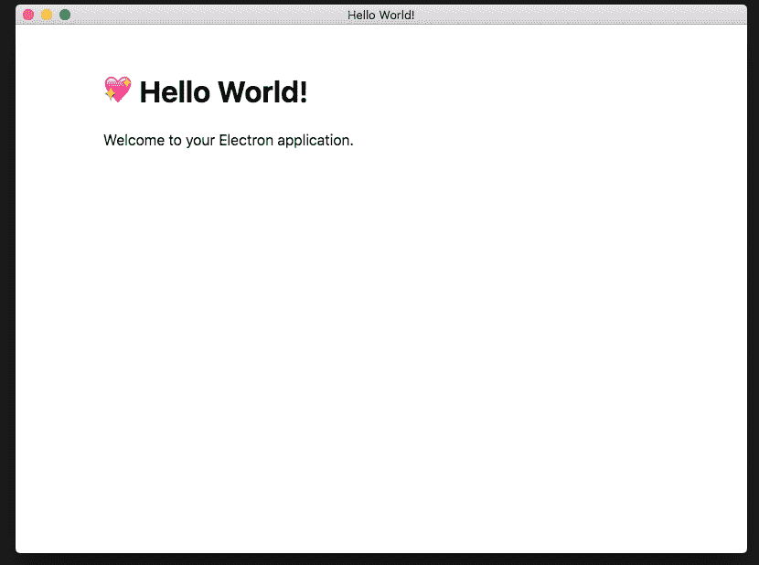
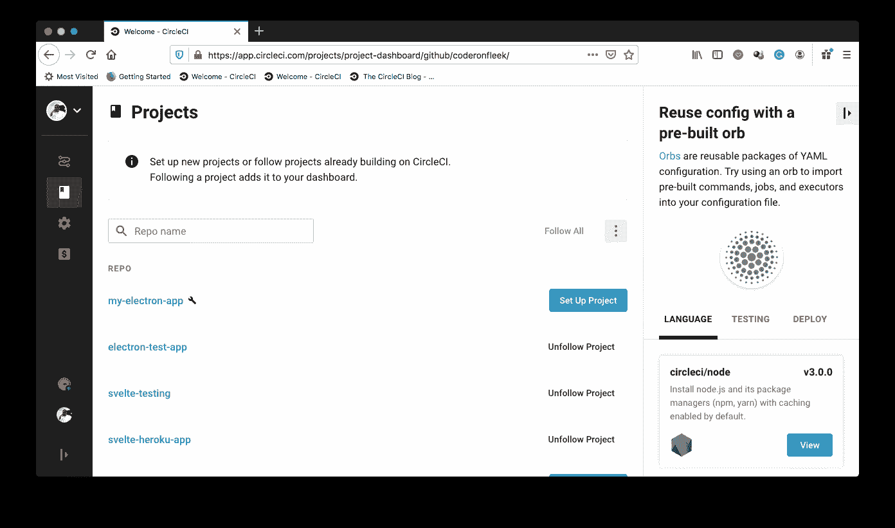
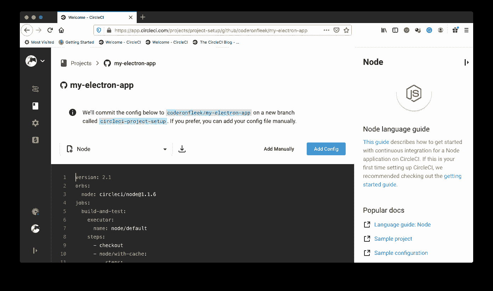
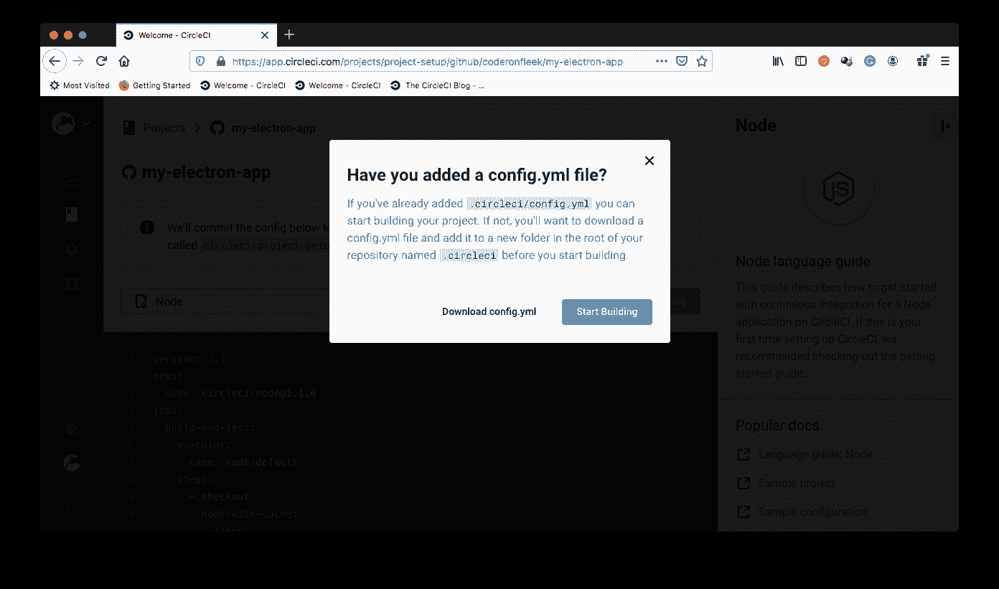
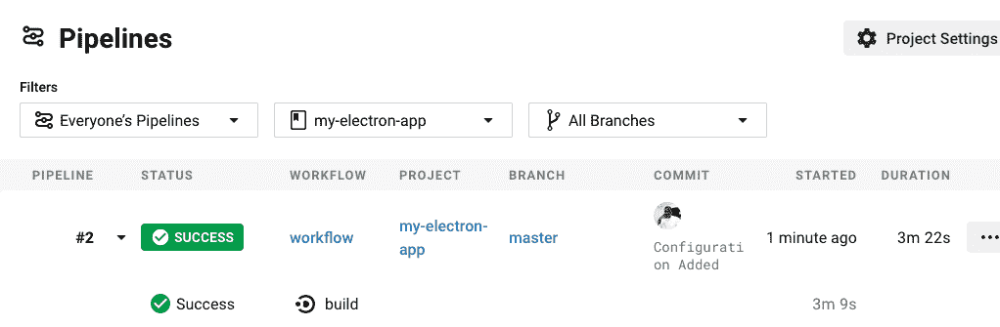
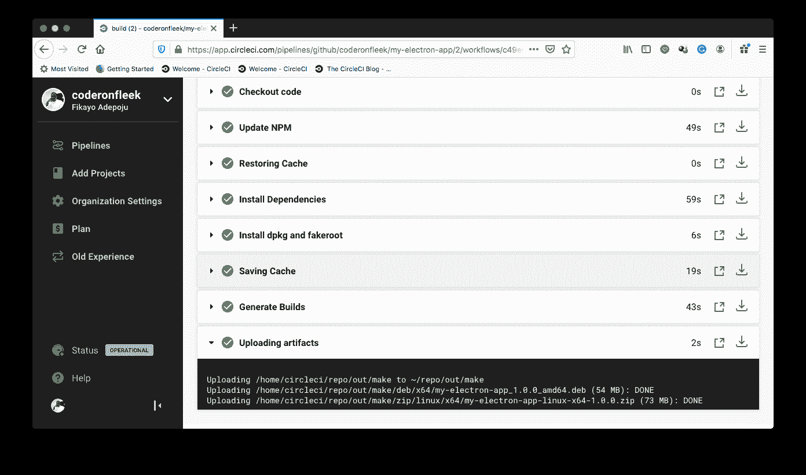
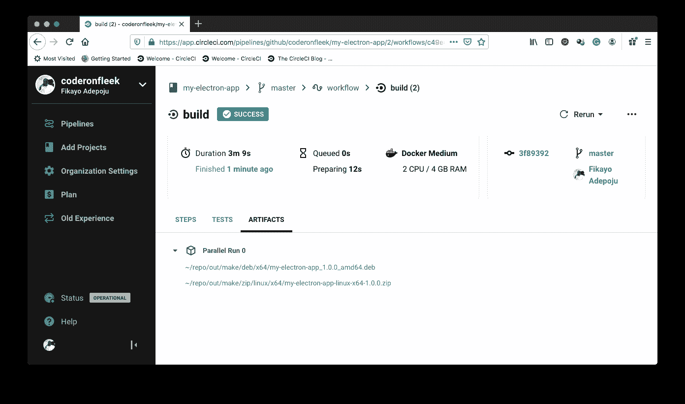

# 为电子应用程序配置自动化构建| CircleCI

> 原文：<https://circleci.com/blog/electron-builds/>

Web、移动和桌面是三个最流行的软件应用平台。 [Electron.js](https://www.electronjs.org/) 的出现使得为所有这三个平台开发跨平台应用成为可能。随着 HTML、CSS 和 JavaScript 成为网络的默认语言，开发人员现在可以通过使用相同的技术来构建移动应用程序(由 [Cordova](https://cordova.apache.org/) 项目实现)和桌面应用程序，从而扩展他们的应用程序开发范围。在本文中，我们将配置一个[持续集成(CI)](https://circleci.com/continuous-integration/) 管道来为不同的操作系统构建桌面应用程序的分发副本。

## 先决条件

要遵循本教程，需要做一些事情:

1.  JavaScript 的基础知识
2.  安装在您系统上的 [Node.js](https://nodejs.org) (版本> = 11)
3.  一个[圆](https://circleci.com/signup/)的账户
4.  GitHub 的一个账户
5.  熟悉 [Electron.js](https://www.electronjs.org/) (不是交易破坏者，但会很好)。

安装并设置好所有这些之后，让我们开始吧。

## 创建一个简单的电子项目

让我们通过运行以下命令快速构建一个简单的 Electron.js 应用程序:

```
npx create-electron-app my-electron-app 
```

在上面的命令中，我们使用`npx`调用`create-electron-app`实用程序在文件夹`my-electron-app`中构建一个新的 Electron.js 应用程序。我们使用`create-electron-app`是因为它有助于搭建一个预先打包了 [electron-forge](https://github.com/electron-userland/electron-forge) 的 Electron.js 应用程序，该工具用于打包和创建我们的 Electron.js 桌面应用程序的发行版本。

**注意** : *你不需要全球安装`create-electron-app`才能使用。这就是我们使用`npx`的原因。*

一旦搭建过程完成，进入项目的根目录(`cd my-electron-app`)并运行以下命令来启动桌面应用程序:

```
npm start 
```

这将为您当前的操作系统运行一个本地构建，并启动桌面应用程序。



上面的屏幕显示了打开的开发工具。这不是你在生产中想要的。注释掉文件`src/index.js`中的下面一行以阻止它打开。

```
mainWindow.webContents.openDevTools(); 
```

然后在运行应用程序的 CLI(命令行界面)上点击`Ctrl + C`终止应用程序运行。然后再次运行`npm start`重新启动应用程序。



现在，如上面的屏幕所示，只有我们的应用程序屏幕显示在应用程序窗口中。

## 配置构建平台

如前所述，搭建的项目已经与`electron-forge`打包在一起，这是一个可以帮助我们从我们的应用程序中产生发行版本的包。在我们的例子中，我们将为`Linux`平台创建一个可分发的`.zip`版本，为基于 Debian 的 Linux 发行版(如 Ubuntu)创建一个`.deb`包。

要对此进行配置，用以下配置替换`package.json`文件中的`config`部分:

```
 "config": {
  "forge": {
    "packagerConfig": {},
    "makers": [
      {
        "name": "@electron-forge/maker-zip",
        "platforms": [
          "linux"
        ]
      },
      {
        "name": "@electron-forge/maker-deb",
        "config": {}
      }
    ]
  }
}, 
```

`electron-forge`包使用许多称为`makers`的内部工具为不同的平台创建发行版本。`makers`为 MacOS、Windows 和 Linux 平台创建发行版本而存在。在上面的文件中，我们配置了两个`makers`、`maker-zip`和`maker-deb`，分别为 Linux 生成`.zip`文件，为基于 Debian 的平台生成`.deb`文件。

关于为不同平台配置`makers`的更多信息，请访问[制造商文档页面](https://www.electronforge.io/config/makers)。

现在我们有了完整的`electron-forge`配置来创建我们的发行版本。

## 将项目连接到 CircleCI

我们的下一个任务是在 CircleCI 上建立我们的 Electron.js 桌面应用程序项目。从[将你的项目推送到 GitHub](https://circleci.com/blog/pushing-a-project-to-github/) 开始。

接下来，转到 CircleCI 仪表板上的**添加项目**页面。



点击**设置项目**开始。



在设置页面上，单击**手动添加**以指示 CircleCI 我们将手动添加配置文件，而不使用显示的示例。接下来，您会得到提示，要么下载管道的配置文件，要么开始构建。



点击**开始建造**。这个构建将会失败，因为我们还没有设置配置文件。这一点我们将在下一节中介绍。

## 自动化发行版构建并存储构建输出

是时候写我们的 CI 管道了。我们的管道需要完成以下操作:

*   签出存储库
*   更新 npm
*   安装项目依赖项
*   为目标构建安装系统依赖项(`.deb`包需要两个系统包；`dpkg`和`fakeroot`，为生成`.deb`文件而安装)
*   生成构件
*   将可分发的构建文件存储为可以下载的工件

在项目的根目录下，创建一个名为`.circleci`的新文件夹。在这个文件夹中，创建一个名为`config.yml`的文件，并在其中输入以下代码:

```
version: 2.1
jobs:
  build:
    working_directory: ~/repo
    docker:
      - image: circleci/node:11
    steps:
      - checkout
      - run:
          name: Update NPM
          command: "sudo npm install -g npm"
      - restore_cache:
          key: dependency-cache-{{ checksum "package.json" }}
      - run:
          name: Install Dependencies
          command: npm install
      - run:
          name: Install dpkg and fakeroot
          command: |
            sudo apt-get update -y
            sudo apt-get install -y dpkg fakeroot

      - save_cache:
          key: dependency-cache-{{ checksum "package.json" }}
          paths:
            - ./node_modules
      - run:
          name: Generate Builds
          command: npm run make

      - store_artifacts:
          path: ~/repo/out/make 
```

在上面的配置文件中，我们执行了前面列出的所有任务。让我们看一下重要的部分。

首先，我们为想要执行的操作指定工作目录。然后，我们指定 Docker 映像和所需的最少 Node.js 安装。

接下来，我们从远程存储库中`checkout`项目并安装依赖项。然后我们使用管理员权限安装`dpkg`和`fakeroot`。

最后，我们通过运行`electron-forge`包的`make`命令来生成我们的配置构建。

最后，我们存储可分发的文件，它们位于一个生成的`/out/make`文件夹中。

将这些更改提交并推送到您的 GitHub 存储库中。这将触发管道开始运行。你可以在 CircleCI 控制台的`Pipelines`页面查看它的运行情况。



点击 **build** 可以查看流程详情。



如上面的屏幕所示，`Upload artifacts`部分显示我们现在已经生成并存储了两个构建。

## 下载存储的构建工件

下载我们的构建非常容易，点击构建屏幕上的`Artifacts`标签，你会看到下载你的可发布版本的链接。



您现在可以下载压缩包和`.deb`安装文件。

## 结论

随着 [Electron.js](https://www.electronjs.org/) 通过支持使用 HTML、CSS 和 Javascript 创建桌面应用程序，为 web 开发人员增加了更多的超能力，感觉 web 开发人员现在几乎可以构建任何东西。这太令人兴奋了！

向最终用户分发应用程序也是这个过程中非常重要的一部分，在本教程中，我们已经看到了创建可安装的桌面应用程序，甚至使用 CircleCI 自动化打包可分发版本的过程是多么容易。

如果你没有得到你想要的结果，请再次浏览这篇文章，看看你是否遗漏了什么。

编码快乐！

* * *

Fikayo Adepoju 是 LinkedIn Learning(Lynda.com)的作者、全栈开发人员、技术作者和技术内容创建者，精通 Web 和移动技术以及 DevOps，拥有 10 多年开发可扩展分布式应用程序的经验。他为 CircleCI、Twilio、Auth0 和 New Stack 博客撰写了 40 多篇文章，并且在他的个人媒体页面上，他喜欢与尽可能多的从中受益的开发人员分享他的知识。你也可以在 Udemy 上查看他的视频课程。

[阅读 Fikayo Adepoju 的更多帖子](/blog/author/fikayo-adepoju/)