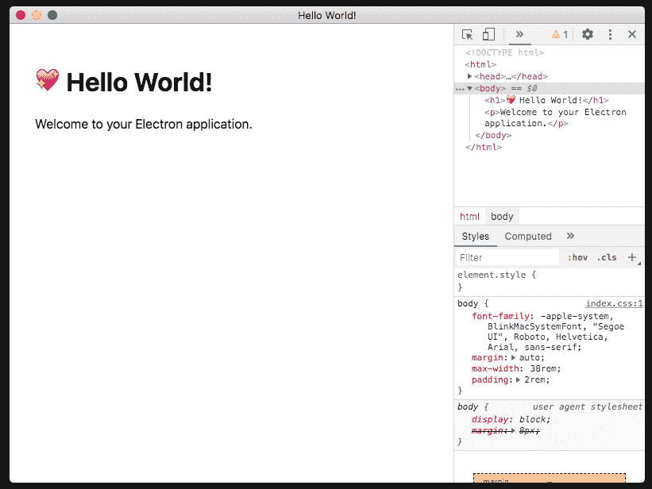
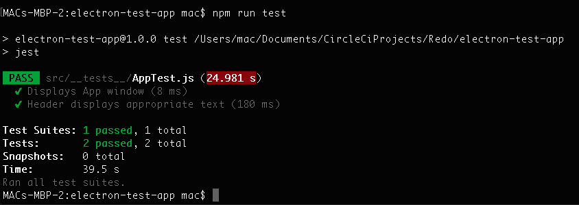
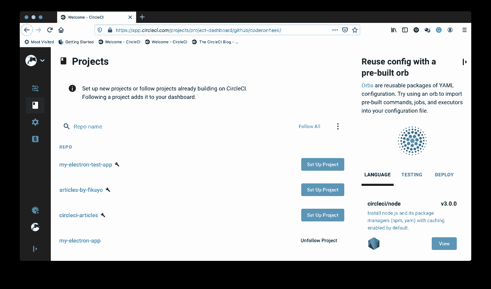
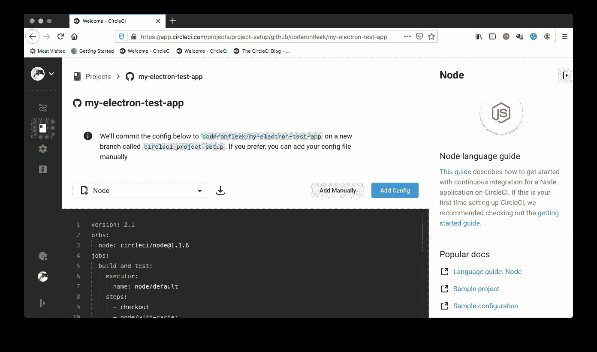
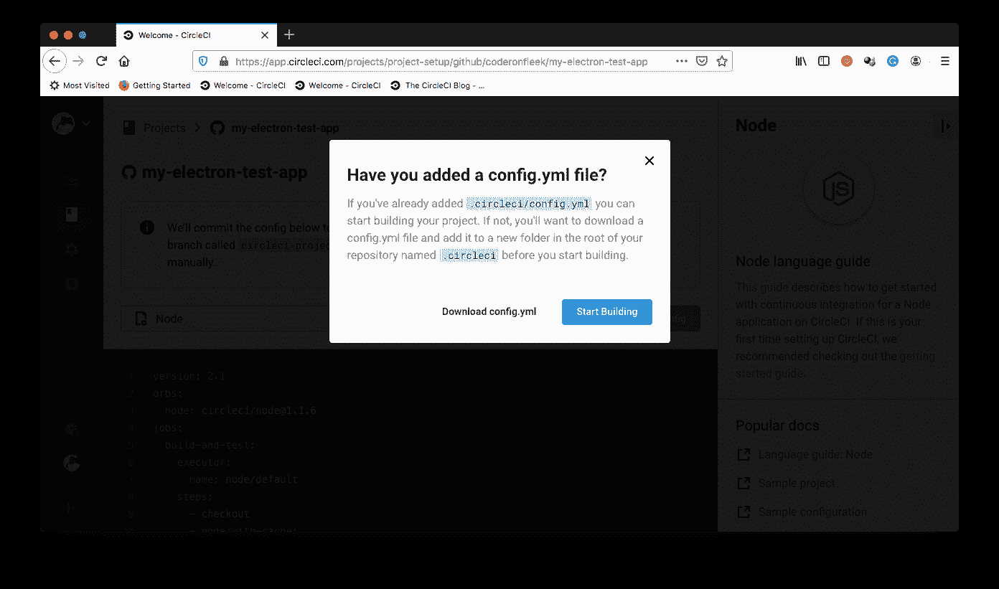
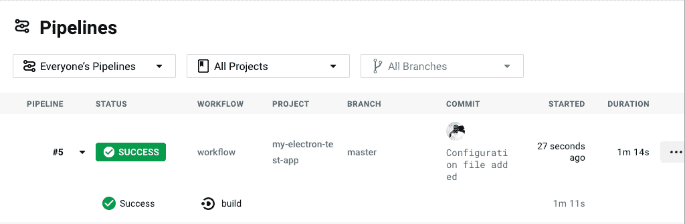
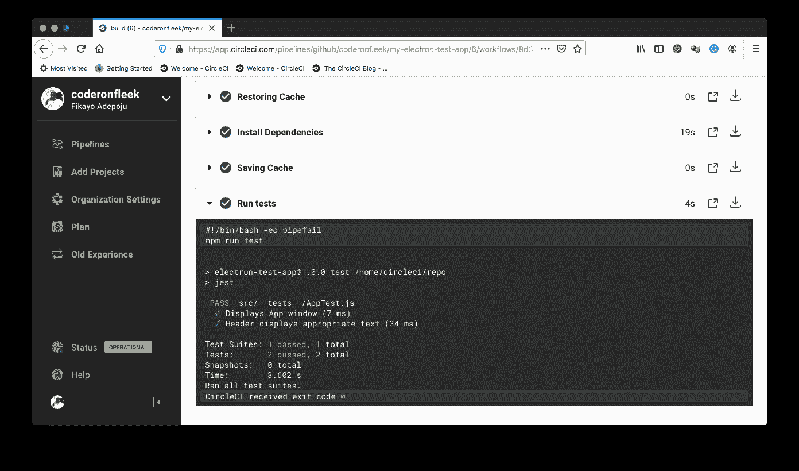

# 电子应用 CI 自动化测试| CircleCI

> 原文：<https://circleci.com/blog/electron-testing/>

[Visual Studio Code](https://code.visualstudio.com/) ，编写时市面上最流行的代码编辑器之一， [Slack](https://slack.com/) ，(差不多)defacto 团队协作软件，桌面版 [WhatsApp](https://www.whatsapp.com/) 都有共同点。都是用 [Electron.js](https://www.electronjs.org/) 打造的。随着这些强大的公司在本地桌面软件开发方法上采用 Electron.js，Electron.js 已经成为开发桌面应用程序的一个值得信赖的框架。在本教程中，我将演示如何测试 Electron.js 应用程序，并通过自动化测试过程更进一步。

## 先决条件

要遵循本教程，需要做一些事情:

1.  JavaScript 的基础知识
2.  安装在您系统上的[node . js](https://nodejs.org)(>= 11)
3.  一个[圆](https://circleci.com/signup/)的账户
4.  GitHub 的一个账户

安装并设置好所有这些之后，让我们开始吧。

## 搭建一个电子应用

首先，我们需要构建一个新的 Electron.js 应用程序。这样我们就不必从头开始制作一个新的 Electron.js 应用程序，我们将使用带有`create-electron-app`包的`npx`来设置它。运行以下命令创建新应用程序:

```
npx create-electron-app electron-test-app 
```

这将在`electron-test-app`文件夹中搭建一个新的应用程序。该文件夹可以是您想要的任何名称。

一旦该过程完成，进入项目的根目录(`cd electron-test-app`)并运行以下命令来运行应用程序:

```
npm start 
```

这将根据您的操作系统平台生成应用程序的临时版本，并启动应用程序。



如图所示，应用程序窗口和 Devtools 都打开了。我们不希望 Devtools 暴露出来，所以在运行应用程序的同一个 CLI 窗口中运行`Ctrl + C`来终止应用程序。然后转到`src/index.js`文件并注释掉下面的行。

```
mainWindow.webContents.openDevTools(); 
```

现在用`npm start`再次运行 app。这一次，只显示应用程序屏幕，其标题包含一个“💖“表情符号，文字`Hello World!"`，还有一段文字`Welcome to your Electron application.`。我花时间来描述页面的内容，因为我们将很快测试这些元素。

## 用 Jest 和 Spectron 设置测试

下一步是建立测试框架，对我们的应用程序进行端到端测试。为此，我们需要两个主要的测试库。它们是:

1.  Jest :运行我们测试的 JavaScript 测试框架
2.  Spectron :一个用于编写端到端测试的 Electron.js 测试框架

使用以下命令同时安装这两个库作为开发依赖项:

```
npm install --save-dev jest spectron 
```

一旦安装了这两个脚本，让我们继续向`package.json`文件添加一个`test`脚本:

```
{
    ...,
    "scripts" : {
        ...,
        "test" : "jest"
    }
} 
```

现在，我们已经拥有了在我们的 Electron.js 应用程序上运行测试所需的所有东西。

## 添加测试

现在是时候向我们的应用程序添加测试了。

在`src`文件夹中，创建一个名为`__tests__`的新文件夹。`jest`在这个文件夹中找到的任何文件都将作为测试套件运行。在`__tests__`文件夹中，创建一个名为`AppTest.js`的新文件，并粘贴以下代码:

```
const Application = require("spectron").Application;
const electronPath = require("electron");
const path = require("path");

let app;

beforeAll(() => {
  app = new Application({
    path: electronPath,

    args: [path.join(__dirname, "../../")]
  });

  return app.start();
}, 15000);

afterAll(function () {
  if (app && app.isRunning()) {
    return app.stop();
  }
});

test("Displays App window", async function () {
  let windowCount = await app.client.getWindowCount();

  expect(windowCount).toBe(1);
});

test("Header displays appropriate text", async function () {
  const headerElement = await app.client.$("h1");

  let headerText = await headerElement.getText();

  expect(headerText).toBe("💖 Hello World!");
}); 
```

在上面的测试文件中，我们首先需要来自`spectron`包的`Application`对象以及来自`node_modules`包含的二进制文件的`electron`。

然后，我们声明一个`app`变量，并在`beforeAll`函数中为其分配应用程序的一个新实例。在`beforeAll`中创建应用程序的新实例后，我们通过调用`app.start()`来启动它。这将在我们的任何测试运行之前启动我们的应用程序的一个新实例。我们还提供了一个`15000`毫秒到`beforeAll`毫秒的`timeout`,以便在应用启动时间超过`5000`毫秒的情况下，给我们的应用足够的启动时间(对于`jest`测试套件，默认为`timeout`)。

接下来，我们调用`afterAll`函数，并传递给它一个在所有测试完成后停止应用程序的函数。

然后我们添加两个测试。第一个测试通过计算应用程序启动时打开的窗口数量来检查我们的应用程序窗口是否打开。如果`Devtools`像我们第一次运行应用程序时看到的那样打开，我们应该有两个窗口。但是因为我们禁用了`Devtools`窗口，我们应该只打开一个窗口，这是我们的应用程序开始屏幕。

第二个测试检查我们是否有一个包含字符串`"💖 Hello World!"`的头(`h1`)。

保存测试文件，并通过运行项目根目录下的`test`脚本来运行创建的测试:

```
npm run test 
```

当测试运行时，您将看到应用程序启动并闪现启动屏幕，然后在几秒钟内关闭。一旦应用程序屏幕消失，测试就完成了。



我们所有的测试都运行良好并通过了。

## 将项目连接到 CircleCI

我们的下一个任务是在 CircleCI 上建立我们的 Electron.js 项目。从[将你的项目推送到 GitHub](https://circleci.com/blog/pushing-a-project-to-github/) 开始。

接下来，转到 CircleCI 仪表板上的`Add Projects`页面添加项目。



点击**设置项目**开始。



在设置页面上，单击**手动添加**以指示 CircleCI 我们将手动添加配置文件，而不使用显示的示例。接下来，您会得到提示，要么下载管道的配置文件，要么开始构建。



点击**开始建造**。这个构建将会失败，因为我们还没有设置配置文件。这一点我们以后再做。

## 自动化我们的测试

是时候编写我们的持续集成(CI)管道来自动化我们的测试过程了。在项目的根目录下，创建一个名为`.circleci`的新文件夹。在这个文件夹中，创建一个名为`config.yml`的文件，并在其中输入以下代码:

```
version: 2.1
jobs:
  build:
    working_directory: ~/repo
    docker:
      - image: circleci/node:11-browsers
    steps:
      - checkout
      - run:
          name: Update NPM
          command: "sudo npm install -g npm"
      - restore_cache:
          key: dependency-cache-{{ checksum "package-lock.json" }}
      - run:
          name: Install Dependencies
          command: npm install
      - save_cache:
          key: dependency-cache-{{ checksum "package-lock.json" }}
          paths:
            - ./node_modules
      - run:
          name: Run tests
          command: npm run test 
```

在上面的文件中，我们引入了一个`Node.js` Docker 图像。注意，我们使用一个带有`-browsers`后缀的图像来提供一个安装了浏览器的环境。这是因为`Spectron`是建立在 [WebdriverIO](https://webdriver.io/) 之上的，它利用了`Chrome/chromedriver`。指定的映像确保我们在环境中配置了一切，以使 Chrome 驱动程序工作。

然后我们更新`npm`以确保我们运行的是最新版本。

接下来，我们安装依赖项并缓存它们。有了所有的依赖项，我们就可以运行测试了。

将这些更改提交并推送到您的 GitHub 存储库中。这将触发管道开始运行。这可以在 CircleCI 仪表板的`Pipelines`页面上查看。



要查看流程详情，请点击**构建**。



我们的测试运行良好。厉害！

现在，我们可以添加更多的测试，因为我们向应用程序添加了更多的功能，并且随着每次向我们的存储库推送，我们都会触发我们的管道来自动运行所有的测试。当测试失败时，CircleCI 会通知我们，我们可以了解测试失败的原因。

## 结论

测试驱动开发(TDD)结合[持续集成](https://circleci.com/continuous-integration/)是一个晚上睡个好觉的可靠方法，知道你没有把任何错误推到你的生产环境中。在本教程中，我们演示了如何测试我们的 Electron.js 应用程序，并使用 CircleCI 自动完成测试过程。

编码快乐！

* * *

Fikayo Adepoju 是 LinkedIn Learning(Lynda.com)的作者、全栈开发人员、技术作者和技术内容创建者，精通 Web 和移动技术以及 DevOps，拥有 10 多年开发可扩展分布式应用程序的经验。他为 CircleCI、Twilio、Auth0 和 New Stack 博客撰写了 40 多篇文章，并且在他的个人媒体页面上，他喜欢与尽可能多的从中受益的开发人员分享他的知识。你也可以在 Udemy 上查看他的视频课程。

[阅读 Fikayo Adepoju 的更多帖子](/blog/author/fikayo-adepoju/)