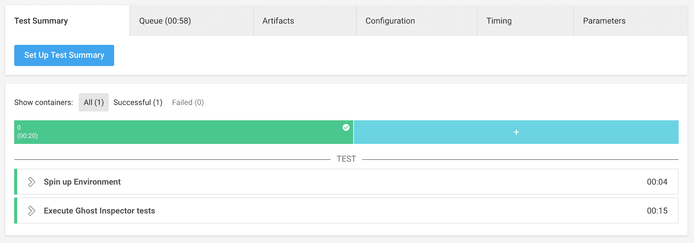
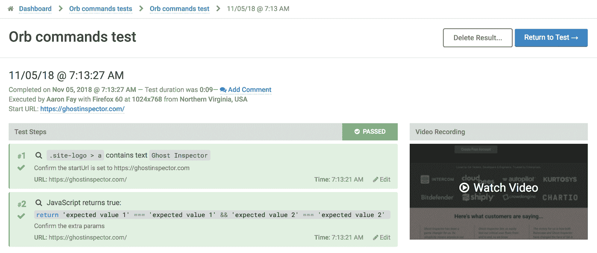

# 端到端浏览器测试| Ghost Inspector CircleCI orb

> 原文：<https://circleci.com/blog/end-to-end-browser-testing-with-the-ghost-inspector-circleci-orb/>

随着应用程序变得越来越复杂，有必要确保团队能够以一致且可重复的方式测试和交付他们的代码。测试一个基于 web 的应用程序最困难的方面之一就是应用程序本身；测试用户通过你的界面的路径是项目交付的一个关键但具有挑战性的方面。传统上，用户界面测试的设置和维护非常复杂，通常需要非常专业和有经验的技能。Ghost Inspector 通过提供简单易用的工具来解决这个问题，该工具允许团队中的任何人创建和维护基于浏览器的测试。QA 团队可以更快、更一致地交付产品，并在您的应用程序中进行更彻底的测试。

Ghost Inspector 是一个自动化的浏览器测试服务，允许您轻松地从云中创建、管理和执行测试。我们的工具允许您使用真实的浏览器记录和回放测试，以可测试和可重复的方式重现最终用户的行为。

## 轻松执行 Ghost Inspector 测试套件

我们开发的 [orbs](https://github.com/ghost-inspector/circleci-orbs) 允许您通过几行配置将 Ghost Inspector 集成到您的 CircleCI 工作流中，将我们基于浏览器的测试解决方案的强大功能带到您的部署工作流中。团队中的任何人都可以轻松地记录和管理测试，并直接存储在我们基于云的平台上，以便于执行。您可以利用我们的 orb 在您的部署管道中执行单个测试或一整套测试。测试可以在现有的测试环境或运行时动态指定的环境中执行。我们甚至让您能够参数化和模块化您的测试，以匹配当今 web 应用程序的复杂本质。一旦测试完成，我们的 orb 将使用测试套件的状态更新您的 CircleCI 工作流，使您可以轻松地隔离故障，并在故障影响您的生产系统之前通知您的团队。

## 从几行代码开始

CircleCI orbs 只需几行代码就能提供巨大的能力和灵活性。在 orbs 发布之前，一个典型的 CircleCI 配置将包括[几十行代码](https://ghostinspector.com/docs/integration/circle-ci/#manual-configuration)来完成相同的任务。现在有了 orbs，配置就非常简单了。

以下是在 Ghost Inspector 帐户中执行测试套件的示例:

```
version: 2.1
orbs:
  ghostinspector: ghostinspector/test-runner@1.0.0
jobs:
  build:
    executor: ghostinspector/default
    steps:
      - ghostinspector/execute-test:
          id: $GI_TEST
          extra-params: '{"foo": "bar", "other": "var"}'
          wait: true 
```

正如您所看到的，我们的配置已经大大减少了，包括为测试套件提供起始 URL 的选项，以及测试步骤所需的附加参数。上面的配置将执行指定的 Ghost Inspector 测试套件，并在继续之前等待结果，如果为 false，则构建失败。





我们还[提供了一些更复杂的例子](https://ghostinspector.com/docs/integration/circle-ci/#orbs)，用于在构建时在 Docker 集群中测试您的应用程序。

## 包扎

通过 orbs，CircleCI 提高了简化 DevOps 工作流配置的标准。自动化您的 QA 工作并更快地将它们集成到您的构建和部署周期中，这是前所未有的好时机。我们希望 Ghost Inspector 与 CircleCI orbs 的集成将有助于降低测试团队的准入门槛，并减轻端到端测试您的基于 web 的应用程序的负担。

在 2019 年 2 月 6 日上午 11:00 PST/19:00 UTC 举行的网络研讨会“Ghost Inspector 和 CircleCI Orbs:轻松执行您的测试套件”中，了解更多关于 CircleCI 和 Ghost Inspector 的信息。在这里报名[。](https://www2.circleci.com/CircleCI-Ghost-Inspector-Webinar.html)

* * *

贾斯汀·克莱姆是 Ghost Inspector 的创始人和技术负责人。他是一名经验丰富的工程师，热衷于创造良好的用户体验。