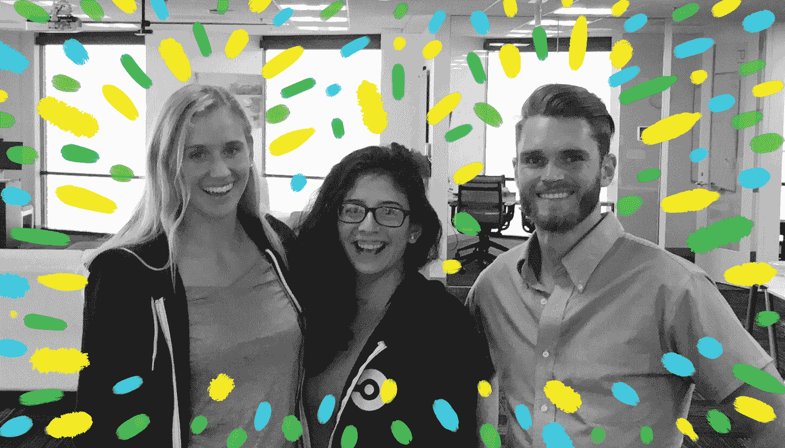

# 每个声音都很重要:我在 CircleCI 实习的时间

> 原文：<https://circleci.com/blog/every-voice-counts-my-time-as-a-circleci-intern/>

*这篇文章由[雅克·加西亚](https://twitter.com/jacqueuqcaj)撰写，她是 CircleCI 的 2017 年夏季工程实习生。*

## 你好 CS

作为一个从没听说过“编码”的来自加州康普顿的孩子，如果有人在 4 年前告诉我，我将主修计算机科学，我会给他们怀疑的目光。

我来自加利福尼亚的康普顿(是的，“直接离开”康普顿，不，我没有看过这部电影)，目前我正在加州大学伯克利分校攻读学士学位。在意识到我当时的专业化学工程并没有(也不会)让我开心之后，我在大一的时候没有申报。有东西不见了。我想加入 STEM，解决问题，并以积极的方式影响他人。我希望能够思考我所建造的东西的社会意义，并尽可能快地影响尽可能多的人。感觉很失落，我研究如何将我对社会公益和 STEM 的热情结合起来。我找到了各种关于创业公司的文章，并熟悉了这个概念。具体来说，我遇到了 [Code the Change](https://codethechange.org/) ，这是一个致力于利用他们的技能进行社会变革的非营利组织。我给首席执行官萨姆·金发了电子邮件，询问他在计算机科学方面的经验以及他能给我的任何建议。在与他交谈后，我决定我要开发有用的软件，并希望能影响我们生活、交流、思考、构建等的方式。以一种积极而有意义的方式。

## 我去切尔莱西的路

去年，我决定申请加入由劳拉·魏德曼·鲍尔斯和特里斯坦·沃克共同创办的非营利组织 [Code2040](http://www.code2040.org/) 。他们的使命是到 2040 年结束科技领域缺乏多样性的状况。我立即与他们的使命联系起来，并相信这将是一个特殊而安全的空间，让我成为一名色彩工程师。我是 1300 多名申请人之一，350 名入围者，并成为 2017 年 135 名 Code2040 研究员之一。两家大公司给了我两份实习机会，最终我决定接受 CircleCI 的邀请。CircleCI 的使命是帮助其他公司更有效地构建有意义和强大的软件，所以这似乎是我最适合的组织。

在接受我的邀请之前，CircleCI 的招聘经理 Jen Hugo 邀请我参观位于美丽的旧金山的总部。她帮我联系了之前的 Code2040 研究员安德烈斯·库沃(Andres Cuervo)，他将在实习结束后以全职员工的身份回来。当我坐下来与安德烈斯交谈时，他问我想从实习经历中得到什么。谈了一会儿工作后，我觉得很舒服，可以告诉他我第一次实习的恐惧。我告诉他我多么害怕自己不够聪明，不够“好”。他承认我的恐惧，并告诉我他也有同样的恐惧。他告诉我，他喜欢 CircleCI 的透明性，学习的空间，以及每个人都愿意合作并帮助彼此成功。与安德烈斯交谈真的让我觉得 CircleCI 的环境不仅仅是建筑；学习和合作同样重要。这对我极其重要。我不习惯在工程文化中感觉如此舒适，这不仅仅是因为在我的 CS 系里很少有人长得像我。我不习惯被提供空间只是问问题，探索和学习，我可以告诉 CircleCI 真的相信创造这样一个空间。了解 CircleCI 的文化最终让我接受了他们的提议，而不是我的其他提议。

## 定制的学习环境

在开始实习之前，Justin Cowperthwaite，开发人员、团队负责人，也是我在 CircleCI 未来的经理，找到我，告诉我我想从实习经历中获得什么，并欢迎我加入我的新团队:团队成长(也称为“团队资金”)。在加入之前，我几乎没有前端开发的经验。当我暗示对后端感兴趣时，他给了我探索前端和后端开发的机会。听到我将有多少自由，我很兴奋。贾斯汀与 Team Money 的产品经理 Rishi Kumar 密切合作，为我提供了一个实习机会，让我尽可能多地接触和体验。Rishi 帮助我成长为一名工程师，他用各种项目挑战我，为前端、后端、营销和其他团队解决问题。他们两个让我在 CircleCI 的经历成为我所希望的一切。

## 会见团队

第一天，我见到了团队的其他成员:汉娜·亨德森、大卫·戈克和菲尔·哈格伯格。汉娜是我实习期间的导师。我非常钦佩她的职业道德和毅力。她的效率和工作质量经常受到同事和项目经理的称赞。尽管在 CircleCI 工作不到一年，她已经赢得了团队的尊重和信任，被认为是一个只会做事，没有借口的人。换句话说，她踢屁股。除了是一名熟练的工程师，Hannah 总是给我诚实的反馈和支持。她让我觉得自己参与了讨论和会议，并对我在项目合作中所做的贡献给予了肯定。我觉得她理解我对成为科技公司一员的所有疑虑和问题。她没有牵手我，但她也没有让我一个人飘着。在 CircleCI 的这段时间里，我能够这么快地学到这么多东西，这要归功于她的指导和耐心。尽管我不得不学习一门新的编程语言 Clojure，而且以前从未接触过或见过前端开发的任何东西，但我能够在开始的同一周开始构建和编码。她的支持让我如释重负，尤其是因为我真的不知道在科技公司工作会是什么样子。尽管来自不同的背景，我还是和她有关系。作为一个在男性主导领域的女性，她理解我的观点、不安全感和恐惧。

我的经理贾斯汀·郭伯伟(Justin Cowperthwaite)不仅才华横溢，而且聪明风趣(我很快了解到，这是 CircleCI 非常常见的特质)。他的奉献精神、职业道德和领导力很快给我留下了深刻的印象并激励了我。尽管在 CircleCI 工作了不到两年，并以初级工程师的身份开始了他的职业生涯，但他已经迅速晋升到团队领导和管理职位。今年，他开始管理与 Code2040 的合作关系，致力于让科技行业更加欢迎来自各种背景、种族、性别和性取向的所有人。通过我们每周 1-1 的会议，我觉得他真的很关心我在 CircleCI 的利益和福祉，结果，我真的成长为一名工程师。在我们一对一的会面中，他开诚布公地谈论了各种话题，包括:时间管理、个人理财、如何在公司留下自己的印记，以及许多其他话题。他总是有非常好的建议，从要读的书(“The Lean Startup”作者 Eric Ries)，到如何从我的职位和我将来可能担任的任何职位中获得最大收益(即超越并在需要的地方提供支持，即使它“超出”我的工作描述)，到如何编写优秀而高效的代码(哦，亲爱的抽象，我们如何认为你是理所当然的……)。

## 每个团队成员都很重要

我有幸与 David Goeke 和 Phil Hagelberg 搭档工作，他们都是高级后端工程师。他们非常有耐心，通过征求我的反馈和意见，让我觉得自己也参与到了他们的建设中。在我和大卫的结对过程中，我欣赏他包容的语言:他总是用“我们”来表达事情。虽然很微妙，但它确实对我产生了影响。他会问我如何处理我们正在做的事情，如何测试我们的代码，他会给我提问的空间。我和菲尔的经历非常相似，我认为这是 CircleCI 独特文化的真实写照。

CircleCI 有一种工程师文化，他们真正关心他们在建造什么，他们如何建造，以及他们的影响。我这么说是因为他们非常重视用户体验以及他们对用户反馈的回应方式。该团队的结构支持通过结对(无论是通过面对面还是视频通话)、专门会议和 1 对 1 的方式进行学习和协作。尽管我只是一名实习生，但他们确实让每个工程师的声音都很重要，甚至包括我自己的声音。我不断被提醒要问问题，当我需要支持时，随时向任何人伸出援手。我非常自豪和感激成为 CircleCI 工程师团队的一员。CircleCI 的文化确实很特别，它帮助我了解了在我作为一名工程师的职业生涯中，我想和什么样的人一起工作。