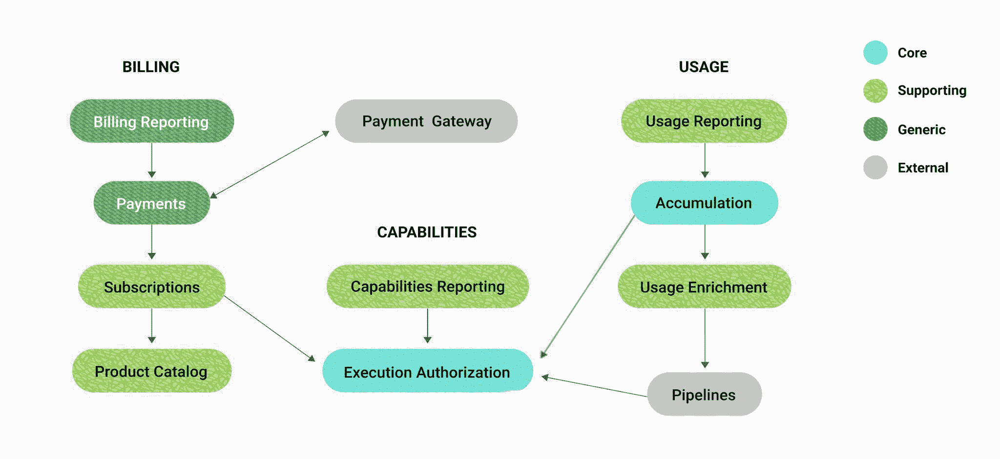

# 探索领域驱动的设计

> 原文：<https://circleci.com/blog/exploring-domain-driven-design-at-circleci/>

## DDD 如何促成更有成效的对话和更干净的代码

我在 CircleCI 的团队专注于计划和支付，随着我们的成长，他们在过去一年经历了许多组织变革。帮助我们在这些变化中保持一致性的一件事是采用不同的方法来编写软件:领域驱动设计，也称为 DDD。

简洁地定义领域驱动设计是困难的，但是简短的回答是，它是一种通过使用普遍接受的模型来连接软件架构和相关领域的方法。换句话说，软件匹配域。有许多可用的[资源](http://dddcommunity.org/book/evans_2003/)来定义 DDD 并深入细节，但对我的团队来说，有两个概念对我们非常有帮助:定义我们的有界上下文和我们无处不在的语言。

### 有界语境与无处不在的语言

如您所知，**有界上下文**是一个域的离散片段，具有清晰的边界。有界上下文可以包含一个或多个**域**，这些域可以有嵌套的域，称为**子域**。有界上下文的集合被称为**上下文映射**。最后，所有的上下文都有相应的**无处不在的语言**:上下文中明确定义的术语的集合。团队的所有成员都应该使用这些术语，并且在代码中也应该有适当的表示。例如，在计划和支付上下文中，“用户”是触发作业的任何人或任何事物，但是在 CircleCI 的其他几个上下文中，“用户”实际上是客户的同义词。希望您已经想到了，但是“用户”实际上并不是一个包含在无处不在的语言中的好术语。它是模糊的和不精确的。但是你可以想象，一旦使用了这样的术语，就很难摆脱了。这就是为什么如果可能的话，你应该从一开始就考虑无处不在的语言。

 *计划和支付团队的环境图示例*

这两个概念都很重要，因为它们确保团队的所有成员都在谈论同样的事情。通过消除歧义，无处不在的语言允许更有意义的讨论。有界上下文努力给我们一个清晰的画面，告诉我们代码驻留在哪里，我们的努力应该集中在哪里。在我们的团队中，这两种方法都达到了预期的效果。

### 对我们团队的好处

我的团队中有许多问题通过实施 DDD 得到了极大的改善。首先:随着时间的推移，我们已经对触发构建的人或事物有了许多定义:“参与者”、“活跃用户”、“用户”等等。而且不止一次，这给我们讨论这个特性的时候造成了困惑。我们是在谈论提交作者吗？我们说的是 Github 公关负责人吗？我们是在谈论触发构建的机器人吗？最糟糕的是，如果我们感到困惑，那么我们的客户还有什么机会呢？我们的代码有多少机会是正确的？

令人惊讶的是，我们发现用户实体的定义对我们来说并不重要，因为它与我们的上下文无关。事实上，我们需要了解的是，当一个客户开始构建时，我们只需要计算唯一的客户，这样我们就可以跟踪他们使用的座位数量。定义我们无处不在的语言简化了命名变量、创建吉拉门票、编写文档和入职的过程，因为所有术语都被团队简化和接受。

建立我们的有界上下文也有很多好处。将我们的代码尽可能地移近产品已经消除了与决定代码应该存在于何处相关的许多困难。此外，因为我们是作为一个团队来决定我们的上下文的，所以在技术决策上达成共识通常是微不足道的。最重要的是，我们现在有了一个关于我们的代码实际上是如何编写的概念模型，这使我们能够积极地参与和参与领域讨论和决策，从架构到定义我们的产品路线图。

### 给 DDD 一个机会

我不能代表其他人的经历，但是尽管我对 DDD 只有粗略的了解，我绝对能感受到我的团队在生产力上的不同。作为交换，我们所要做的就是花一周的时间在便利贴和白板的海洋中痛苦和磕磕绊绊。我们还有很长的路要走，但幸运的是，有了 DDD，没有什么是永恒不变的，我们的定义可以随着我们的领域而发展。说真的，如果你还没有，我强烈建议你花点时间，深入研究，整理你的领域。代码和产品之间的内聚性是值得的。

**更多资源**
【视频】CircleCI CTO Rob Zuber 谈[无处不在的语言和吞吐量](https://www.youtube.com/watch?v=g4LNezYjLLM)