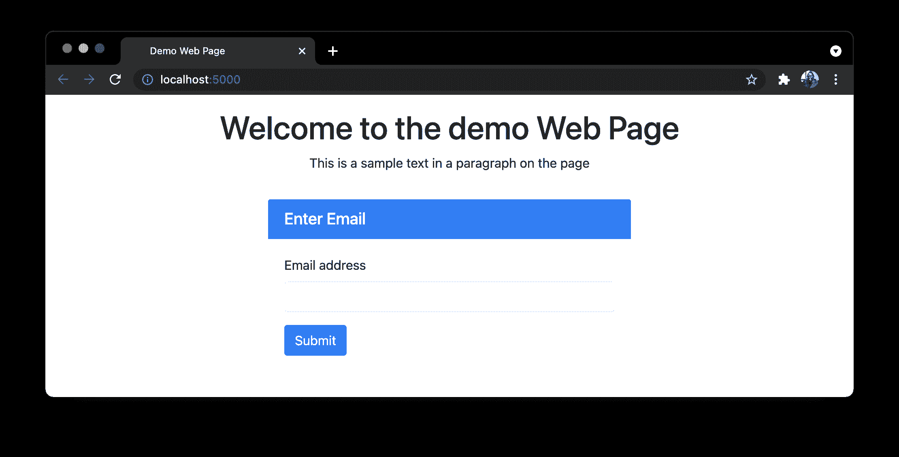
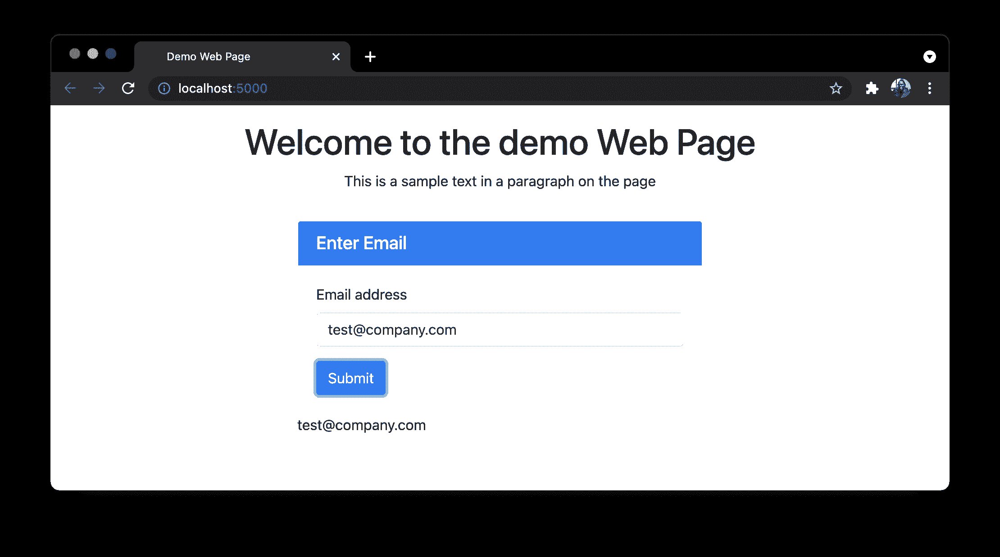
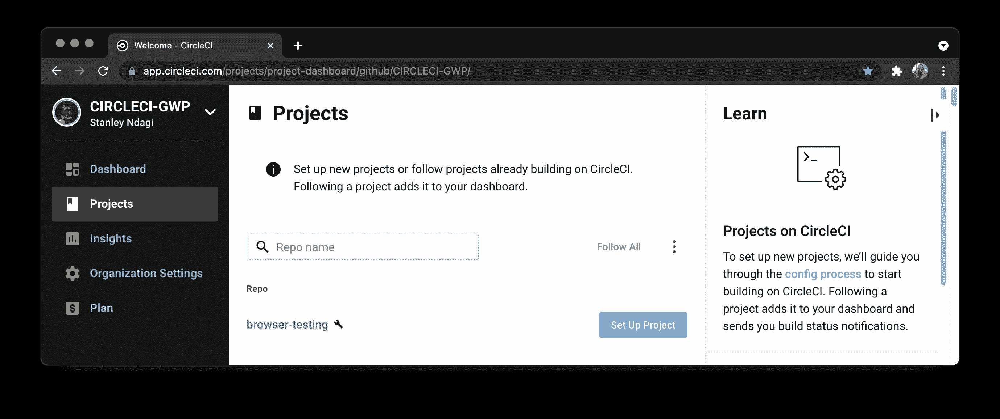
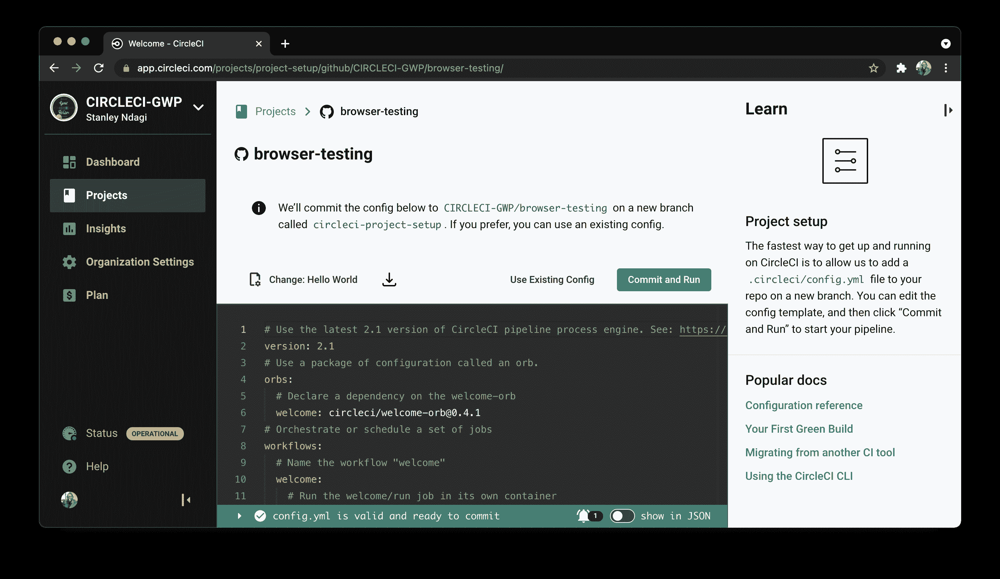
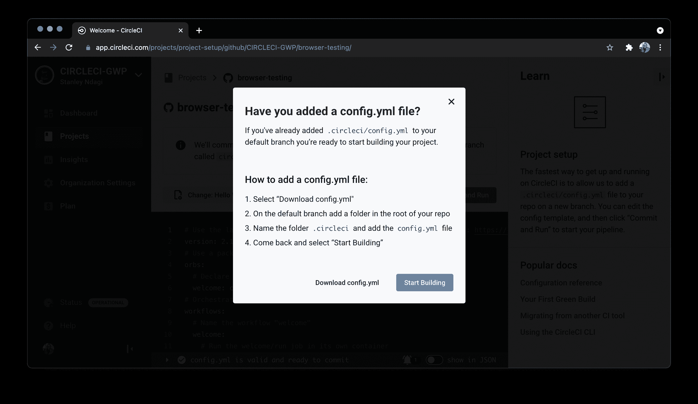
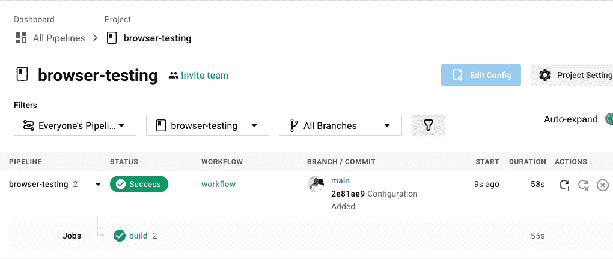
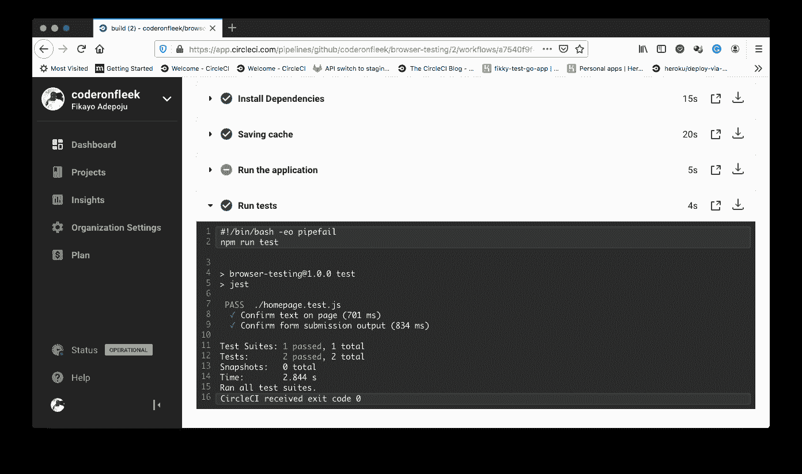

# 使用木偶师| CircleCI 进行功能浏览器测试

> 原文：<https://circleci.com/blog/functional-browser-testing/>

与 web 应用程序的大多数交互都发生在浏览器上。用户搜索商品、填写表单、创建购物车、登录他们的个人资料以及执行许多其他任务。单元测试很棒，但是没有什么比通过与面向用户的前端交互来测试应用程序更好的了。在本教程中，您将学习并演示如何使用[木偶师](https://pptr.dev/)为浏览器编写测试。然后，您将通过在持续集成流程中自动化测试过程来更进一步。

## 先决条件

要遵循本教程，需要做一些事情:

1.  JavaScript 的基础知识
2.  安装在您系统上的 [Node.js](https://nodejs.org) (版本> = 12)
3.  一个[圆](https://circleci.com/signup/)的账户
4.  GitHub 的一个账户

所有这些安装和设置，我们可以开始教程。

## 克隆和运行示例应用程序

第一步是设置要测试的 web 应用程序。您需要通过运行以下命令来克隆一个演示应用程序:

```
git clone --single-branch --branch base-project https://github.com/CIRCLECI-GWP/browser-testing 
```

然后，转到项目的根目录(`cd browser-testing`)，通过运行以下命令安装依赖项:

```
npm install 
```

完全安装完依赖项后，使用以下命令运行应用程序:

```
node server 
```

应用服务器将在`http://localhost:5000`启动。在浏览器上访问该 URL，查看演示应用主页。



演示页面包含一个标题`Welcome to the demo Web Page`，一个包含文本`This is a sample text in a paragraph on the page`的段落，以及一个带有电子邮件字段和提交按钮的表单。填写并提交后，表单会将提交的电子邮件打印到屏幕上。



## 安装 Jest 和木偶师

您将测试演示页面，以确认它包含页面上显示的元素，并验证表单的行为。你需要两个包:

*   [木偶师](https://pptr.dev/)是浏览器测试框架。
*   Jest 充当您将要编写的测试套件的测试运行程序。

使用以下命令将这些包作为开发依赖项安装:

```
npm install --save-dev puppeteer jest 
```

安装好这些之后，您现在可以开始向项目中添加浏览器测试了。

## 使用木偶师添加测试

您将测试的第一个元素是标题和段落。测试将确认这些元素在页面上，并且包含预期的文本。

在项目的根目录下添加一个名为`homepage.test.js`的新测试文件。添加此代码:

```
const puppeteer = require("puppeteer");

test("Confirm text on page", async () => {
  const browser = await puppeteer.launch();
  try {
    const page = await browser.newPage();

    await page.goto("http://localhost:5000");

    let pageHeader = await page.$("#pageTitle");
    let pageHeaderValue = await pageHeader.evaluate((el) => el.textContent);

    expect(pageHeaderValue).toContain("Welcome to the demo Web Page");

    let pageParagraph = await page.$("#pageParagraph");
    let pageParagraphValue = await pageParagraph.evaluate(
      (el) => el.textContent
    );

    expect(pageParagraphValue).toContain(
      "This is a sample text in a paragraph on the page"
    );
  } finally {
    await browser.close();
  }
}, 120000); 
```

这个测试用例在`http://localhost:5000`启动一个新的浏览器实例并加载 web 应用。然后，它使用 CSS 选择器来定位标题和段落，以读取它们的内容。然后将标题和段落的内容与预期结果进行比较。

要运行这些测试，使用以下代码修改`package.json`中的`test`脚本:

```
...
"scripts" : {
  "test" : "jest"
} 
```

确保 web 应用程序正在运行(使用`node server`)。然后运行以下命令:

```
npm run test 
```

运行之后，CLI 输出显示您已经通过了测试。

```
 PASS  ./homepage.test.js (32.732 s)
  ✓ Confirm text on page (25962 ms)

Test Suites: 1 passed, 1 total
Tests:       1 passed, 1 total
Snapshots:   0 total
Time:        41.205 s
Ran all test suites. 
```

接下来，添加另一个测试用例来测试表单行为。在第一个测试用例下添加以下代码:

```
...
test("Confirm form submission output", async () => {
  const browser = await puppeteer.launch();
  try {
    const page = await browser.newPage();

    await page.goto("http://localhost:5000");

    await page.type("#userEmail", "test@company.com");
    await page.click("#submitButton");

    let emailContainer = await page.$("#infoDisplay");
    let value = await emailContainer.evaluate((el) => el.textContent);

    expect(value).toContain("test@company.com");
  } finally {
    await browser.close();
  }
}, 120000); 
```

第二个测试用例引用 email 字段，使用它的`id`属性和在字段中输入的 email ( `test@company.com`)。测试引用提交按钮，并使用按钮的`id`属性“点击”它。最后，确定电子邮件的显示容器，获取文本内容并与预期值(即输入的电子邮件)进行比较。

保存这个文件，然后使用`npm run test`命令再次运行您的测试。CLI 输出显示测试已经通过。

```
 PASS  ./homepage.test.js (64.297 s)
  ✓ Confirm text on page (42118 ms)
  ✓ Confirm form submission output (9664 ms)

Test Suites: 1 passed, 1 total
Tests:       2 passed, 2 total
Snapshots:   0 total
Time:        84.997 s
Ran all test suites. 
```

## 设置 CI 管道以自动化测试

为了完成本教程的目标，我们将通过将测试过程插入到[持续集成(CI)管道](https://circleci.com/blog/what-is-a-ci-cd-pipeline/)中来实现测试过程的自动化。每次在您的远程存储库上更新代码时，管道都会运行测试。第一步是[将代码推送到 GitHub](https://circleci.com/blog/pushing-a-project-to-github/) 。确保这是连接到您的 CircleCI 帐户的 GitHub 帐户。

接下来，转到 CircleCI 仪表板上的项目页面来添加项目。



点击**设置项目**按钮，打开设置页面。然后在弹出的模式上点击**跳过这一步**，因为我们将在本教程的后面手动添加我们的 CircleCI 配置。



在 Setup 页面上，点击 **Use Existing Config** 表示您将手动添加一个配置文件，并且不使用示例。接下来，系统会提示您下载管道的配置文件或开始构建。



点击**开始建造**。这个构建将会失败，因为我们还没有设置配置文件。设置它是我们的下一步。

最后一步，在项目的根目录下创建一个名为`.circleci`的文件夹。在刚刚创建的文件夹中添加一个名为`config.yml`的配置文件。在该文件中，输入以下代码:

```
version: 2.1
jobs:
  build:
    working_directory: ~/repo
    docker:
      - image: circleci/node:12-browsers
    steps:
      - checkout
      - run:
          name: Update NPM
          command: "sudo npm install -g npm"
      - restore_cache:
          key: dependency-cache-{{ checksum "package-lock.json" }}
      - run:
          name: Install Dependencies
          command: npm install
      - save_cache:
          key: dependency-cache-{{ checksum "package-lock.json" }}
          paths:
            - ./node_modules
      - run:
          name: Run the application
          command: node server.js
          background: true
      - run:
          name: Run tests
          command: npm run test 
```

在这个配置中，所需的 Node.js 映像被拉入。这个图像包含浏览器，这对运行浏览器测试很重要。配置的下一部分更新`npm`。然后安装并缓存项目依赖项。

为了对应用程序运行浏览器测试，使用`node server`在后台进程中启动应用程序。然后使用`npm run test`命令运行测试。

提交对项目的所有更改，并推送到您的远程 GitHub 存储库。这将自动触发管道。



成功！点击 **build** 查看测试细节。



干得好！

## 结论

从应用程序用户的角度进行测试，可以获得如此多的洞察力。您可以了解应用程序的不同单元如何协同工作来帮助用户在您的应用程序中完成他们的任务。尽管如此，大多数界面/浏览器测试仍然是手工完成的。在本教程中，您已经演示了如何自动化这些类型的测试，以加速开发流程并提高生产率。功能浏览器测试通过让您的团队能够快速捕捉和响应错误，提高了您的应用程序的质量。确保与您的团队分享您成功测试的细节，以便他们也可以从这些信息中受益。

编码快乐！

* * *

Fikayo Adepoju 是 LinkedIn Learning(Lynda.com)的作者、全栈开发人员、技术作者和技术内容创建者，精通 Web 和移动技术以及 DevOps，拥有 10 多年开发可扩展分布式应用程序的经验。他为 CircleCI、Twilio、Auth0 和 New Stack 博客撰写了 40 多篇文章，并且在他的个人媒体页面上，他喜欢与尽可能多的从中受益的开发人员分享他的知识。你也可以在 Udemy 上查看他的视频课程。

[阅读 Fikayo Adepoju 的更多帖子](/blog/author/fikayo-adepoju/)