# 使用 CircleCI | CircleCI 将 Gatsby 站点部署到 Netlify

> 原文：<https://circleci.com/blog/gatsby-netlify-deploy/>

Gatsby 是一个静态网站和应用程序生成器，它使得构建强大的基于 React 的前端应用程序变得简单而有效。GitHub 上有超过五万颗星星(在撰写本文时为 51.5k)，Gatsby 是使用最广泛的 [React](https://reactjs.org/) 框架之一。Gatsby 如此受欢迎，以至于大多数托管平台都提供了对该框架的定制支持。 [Netlify](https://www.netlify.com/) 就是这些平台中的一个。虽然 Netlify 对 Gatsby 的自定义支持提供了流畅的部署，但有一个主要缺点。Netlify 控制了大部分部署过程，这意味着您的团队不能执行像运行自动化测试这样的定制任务。

在本教程中，您将学习如何通过使用 CircleCI 作为连续部署服务器来接管部署过程。通过使用本教程创建的设置，您将能够在最终部署到 Netlify 之前执行构建过程中所需的任何自定义步骤。

## 先决条件

要遵循本教程，需要做一些事情:

1.  系统上安装的 [Node.js](https://nodejs.org) (版本 12.13 或更新)
2.  净收益账户
3.  一个[圆](https://circleci.com/signup/)的账户
4.  GitHub 的一个账户

安装并设置好所有这些之后，您就可以开始本教程了。

## 创建一个新的盖茨比网站

您首先需要的是一个部署到 Netlify 的 Gatsby 站点。在系统中您选择的任何位置运行以下命令:

```
npm init gatsby 
```

该命令调用 Gatsby 安装程序并打开一个交互式 CLI 会话，在该会话中，系统会提示您回答几个问题来设置您的项目。根据下面的列表回答问题。请注意，粗体文本是为问题选择的文本回答或选项，而斜体文本是要执行的操作。

*   你想把你的网站叫做什么:Netlify Gatsby 网站
*   您希望将创建网站的文件夹命名为什么:按 Enter 键接受默认值
*   你会使用 CMS 吗:不会(或者我稍后会添加它)
*   要不要添加一个造型系统:不要(或者我以后再添加)
*   您想用其他插件安装附加功能吗:选择**添加 Markdown 和 MDX 支持**，点击**完成**，然后按回车键
*   我们可以这样做吗:按回车键确认**是**选项

以下是项目反应流程的 cli 输出:

```
What would you like to call your site?
✔ · Netlify Gatsby Site
What would you like to name the folder where your site will be created?
✔ 2021/ netlify-gatsby-site
✔ Will you be using a CMS?
· No (or I'll add it later)
✔ Would you like to install a styling system?
· No (or I'll add it later)
✔ Would you like to install additional features with other plugins?
· Add Markdown and MDX support

Thanks! Here's what we'll now do:

    🛠  Create a new Gatsby site in the folder netlify-gatsby-site
    🔌 Install gatsby-plugin-mdx

? Shall we do this? (Y/n) › Yes 
```

回答完问题后，项目创建开始。在这个过程结束时，您将在`netlify-gatsby-site`文件夹中创建一个 Gatsby 项目。使用以下命令运行项目:

```
cd netlify-gatsby-site
npm run develop 
```

这将在本地 URL `http://localhost:8000`启动 Gatsby 站点。在您的浏览器中输入此地址即可访问该网站。

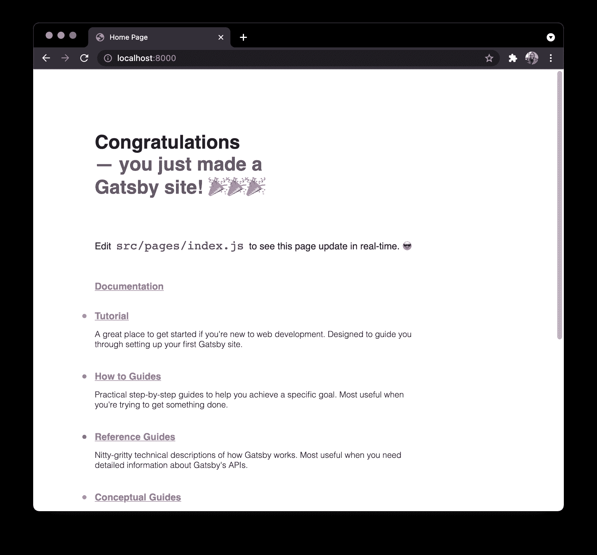

## 设置 GitHub 项目

下一步是在 GitHub 上建立您的 Gatsby 项目。GitHub 安装完成后，您就可以在 Netlify 和 CircleCI 上安装项目了。在将您的项目推送到 GitHub 之前，您需要安装 [Netlify CLI](https://www.npmjs.com/package/netlify-cli) 包，作为您的 Gatsby 项目中的开发依赖项。对于 CI 环境中的部署，建议这样做，以避免中断更改。在 Gatsby 项目的根目录下，运行以下命令来安装依赖项:

```
npm install --save-dev netlify-cli 
```

你现在可以将你的项目推送到 GitHub 了。一旦你的项目在 GitHub 上，创建一个新的分支。给这个分支取任何你想要的名字；对于本教程，我将把它命名为`netlify-deploy-ignore`。

您可能想知道为什么需要这个分支。Netlify 需要一个项目分支来自动触发应用程序的部署。当更改被推送到这个分支时，Netlify 将启动部署过程。您希望避免 Netlify 和 CircleCI 管道并行运行两个部署进程的情况。这个新的分支充当了 Netlify 监视的诱饵。不要将更改推送到此分支。其目的是“分散”Netlify 部署过程的注意力，以便您可以使用 CircleCI 进行部署。你可以在 GitHub 上设置一个受保护的分支，这样你的团队中就没有人会误把它推上来。

## 创建 Netlify 应用程序

要创建新的 Netlify 应用程序，请转到您的 Netlify 仪表板，然后单击 Git 按钮中的**新站点。接下来，选择 GitHub 作为您的提供商并搜索项目。**

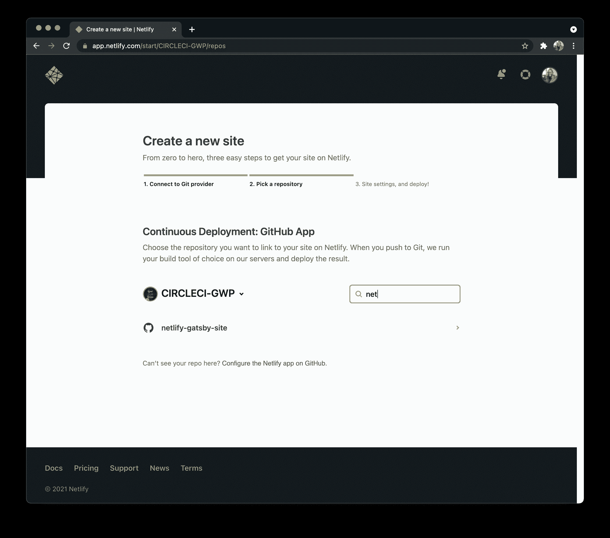

选择项目并转到下一步，为 Netlify 选择要部署的分支。选择你的诱饵分支。

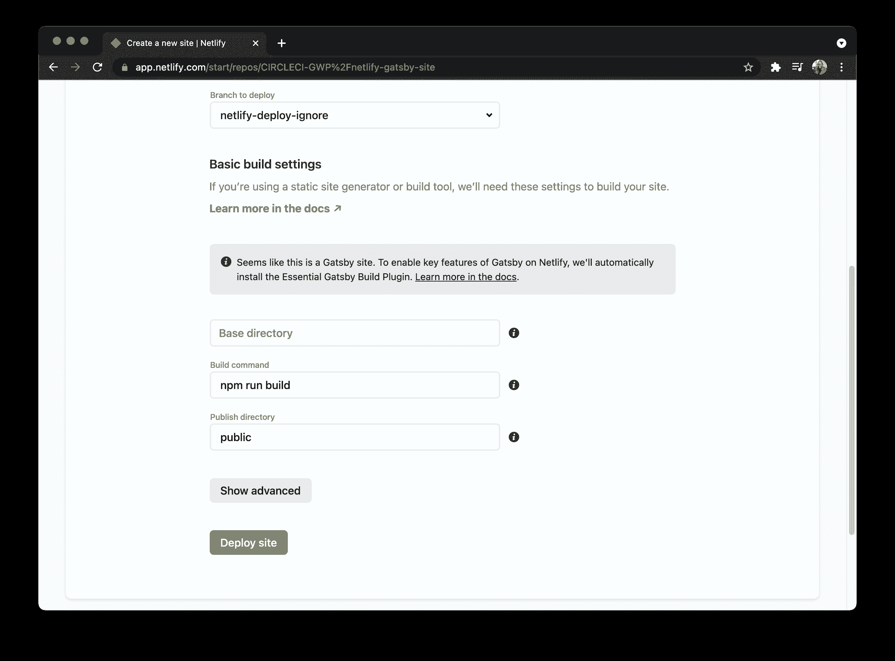

接下来，点击 **Deploy site** 按钮，这样 Netlify 将执行您站点的第一次部署。点击链接，看起来应该是:`sitename.netlify.app`。

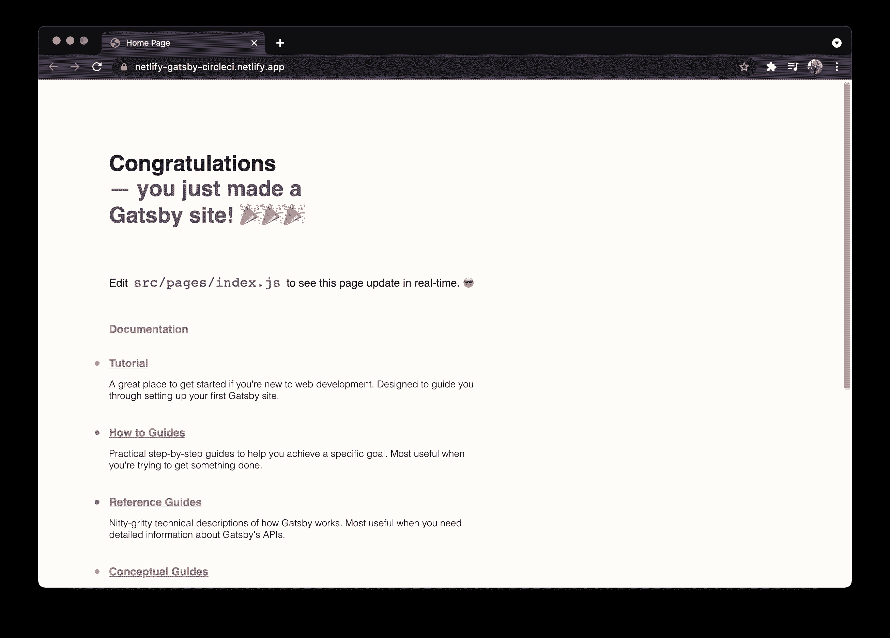

要在 CircleCI 管道中执行自动部署，您需要从 Netlify 应用程序和帐户中获取两个配置值。

*   您刚刚创建的应用程序的**应用程序 ID** 可以在您的 Netlify 应用程序的站点详细信息部分找到。
*   **个人访问令牌**允许从您的部署管道访问您的 Netlify 帐户。在`User Settings > Applications`生成访问令牌。

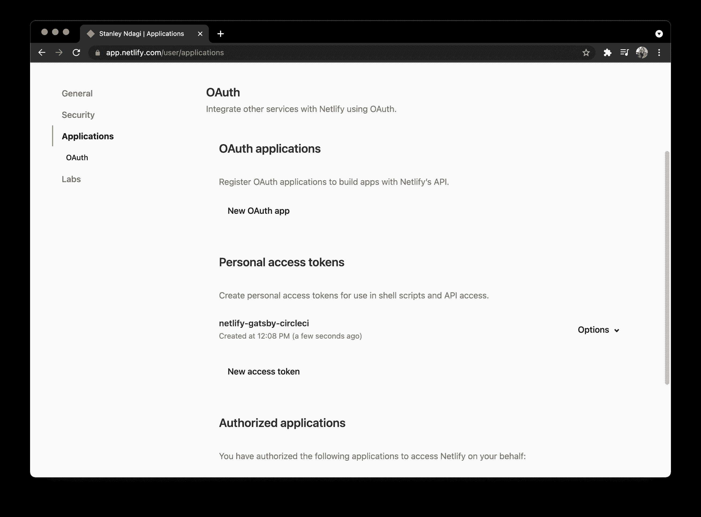

将您的访问令牌保存在一个安全的地方，因为 Netlify 不允许您在创建后查看该值。你只能改变它。

## 在 CircleCI 建立项目

是时候在 CircleCI 上建立你的项目了。将`.circleci`文件夹添加到项目的根目录。在其中，添加一个空的`config.yml`文件。在下一节中，您将向该文件添加配置。将您的更改推送到 GitHub 项目。

接下来，转到 CircleCI 仪表板上的 Add Projects 页面来添加项目。

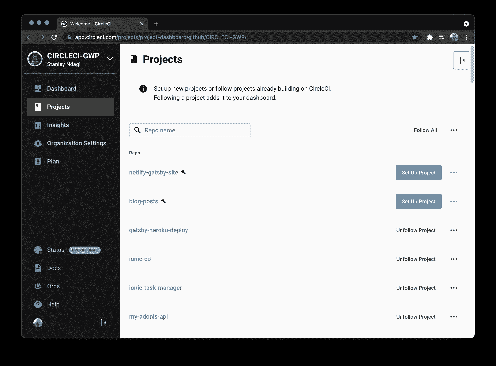

点击**设置项目**。这将加载一个对话框，CircleCI 自动检测您的配置文件。

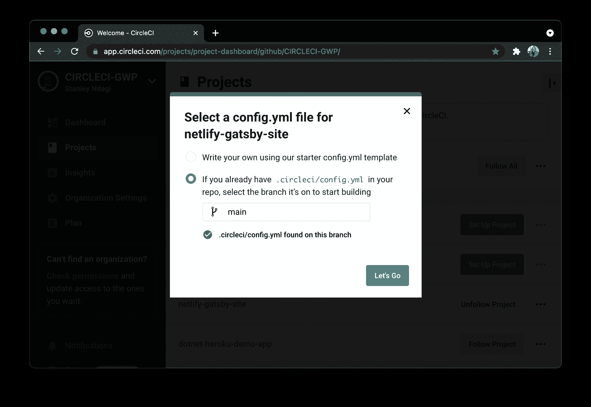

单击 **Let's Go** 首次触发您的构建管道。构建将失败，因为您尚未向配置中添加代码。稍后您将执行此步骤。

在编写配置之前，您需要在 CircleCI 项目中添加 Netlify 应用程序 ID 和访问令牌作为环境变量。

确保您的项目是“管道”页面上当前选定的项目。点击**项目设置**按钮。在设置页面上，从侧面菜单中选择**环境变量**。在这个新页面上，点击**添加环境变量**按钮，输入以下信息:

*   `NETLIFY_SITE_ID`是您的 Netlify 应用程序的应用程序 ID。
*   `NETLIFY_ACCESS_TOKEN`是您的网络个人访问令牌。

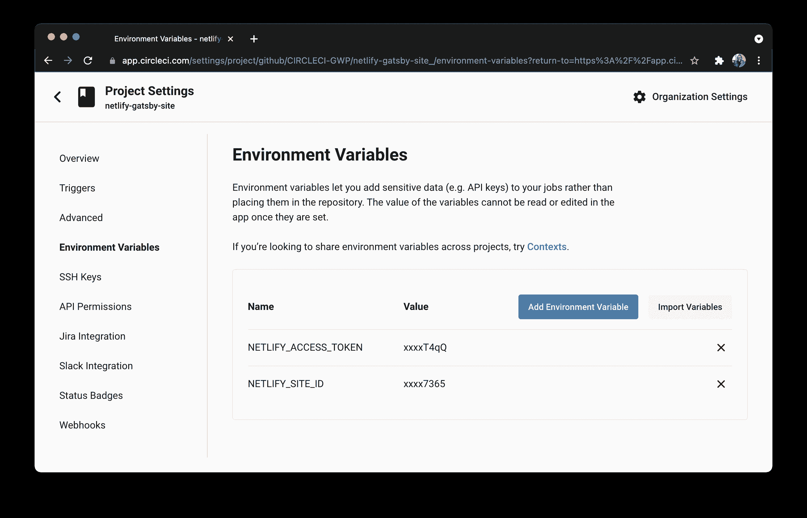

## 编写部署配置

该过程的最后一步是编写部署配置。打开`config.yml`文件并添加以下配置:

```
version: 2.1
jobs:
  build:
    working_directory: ~/repo
    docker:
      - image: cimg/node:12.16
    steps:
      - checkout
      - run:
          name: Update NPM
          command: "sudo npm install -g npm"
      - restore_cache:
          key: dependency-cache-{{ checksum "package-lock.json" }}
      - run:
          name: Install Dependencies
          command: npm install
      - save_cache:
          key: dependency-cache-{{ checksum "package-lock.json" }}
          paths:
            - ./node_modules
      - run:
          name: Gatsby Build
          command: GATSBY_CPU_COUNT=2 npm run build
      - save_cache:
          key: gatsby-public-cache-{{ .Branch }}
          paths:
            - ./public
      - run:
          name: Deploy to Netlify
          command: ./node_modules/.bin/netlify deploy --site $NETLIFY_SITE_ID --auth $NETLIFY_ACCESS_TOKEN --prod --dir=public
workflows:
  version: 2
  build-deploy:
    jobs:
      - build:
          filters:
            branches:
              only:
                - main 
```

在这个配置中，项目从存储库中签出，项目依赖项被安装和缓存。缓存完依赖项后，Gatsby build 命令`npm run build`运行，在项目根目录下的`public`目录中创建应用程序的生产版本。然后缓存该文件夹。

最后，Netlify CLI 使用`$NETLIFY_SITE_ID`和`$NETLIFY_ACCESS_TOKEN`变量部署站点。然后，工作流配置确保只有`main`分支触发网络部署。

在为 CircleCI 推送这个配置以部署站点之前，请转到项目的`src/pages`文件夹，并将`index.js`文件中的 Gatsby 消息从`you just made a Gatsby site`更改为`you just deployed a Gatsby site with CircleCI`。这个新消息将显示已部署的应用程序已经发生了变化。

提交你所有的修改并推送到 GitHub。

这将自动触发部署管道和成功的构建。

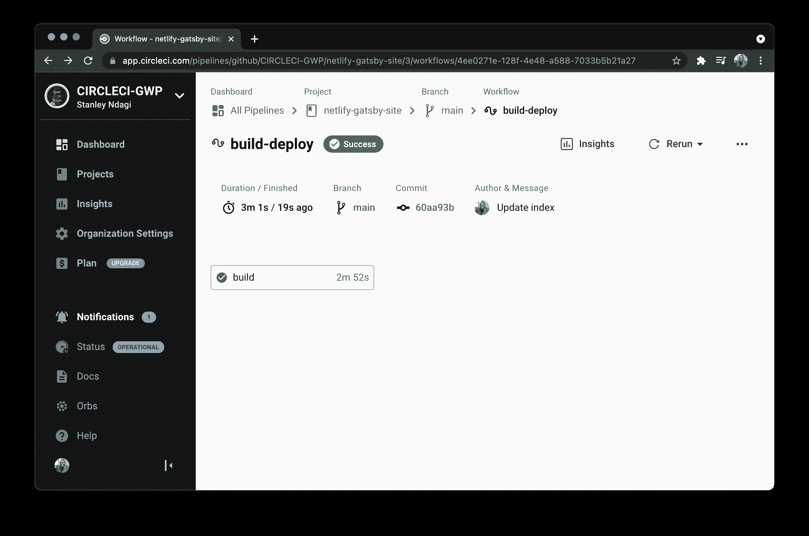

单击构建以查看部署详细信息。

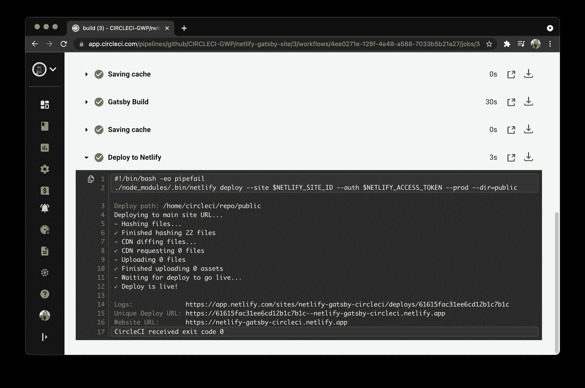

成功构建后，再次访问您的网站以验证您部署的更改。它应该显示新消息。

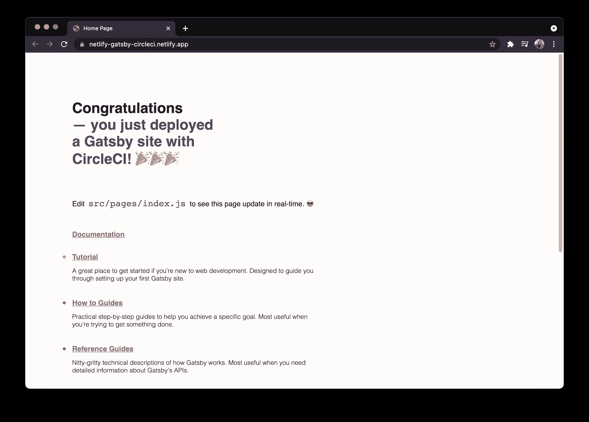

厉害！

要确认 Netlify 没有运行并行部署，请检查 Netlify 部署日志。生产部署中只有一个部署，第一个部署由分支`netlify-deploy-ignore`触发。其余的没有显示分支，因为它们是由 CircleCI 管道触发的。

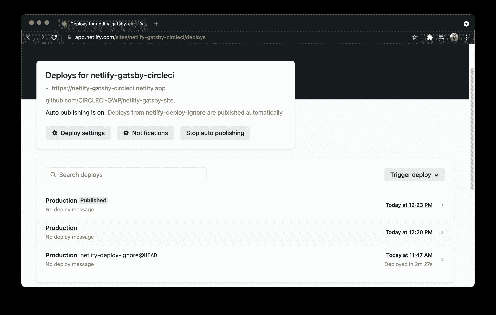

## 结论

这就是使用 CircleCI 将 Gatsby 站点定制部署到 Netlify 的情况。这种设置使您的团队能够更好地控制 Gatsby 到 Netlify 的部署，并为您提供在该过程中运行更多自定义步骤所需的灵活性。

如果你喜欢使用 Heroku 而不是 Netlify 作为你的托管平台，我们也有一个关于 T2 使用 CircleCI 管道定制部署 Heroku T3 的教程。

编码快乐！

* * *

Fikayo Adepoju 是 LinkedIn Learning(Lynda.com)的作者、全栈开发人员、技术作者和技术内容创建者，精通 Web 和移动技术以及 DevOps，拥有 10 多年开发可扩展分布式应用程序的经验。他为 CircleCI、Twilio、Auth0 和 New Stack 博客撰写了 40 多篇文章，并且在他的个人媒体页面上，他喜欢与尽可能多的从中受益的开发人员分享他的知识。你也可以在 Udemy 上查看他的视频课程。

[阅读 Fikayo Adepoju 的更多帖子](/blog/author/fikayo-adepoju/)