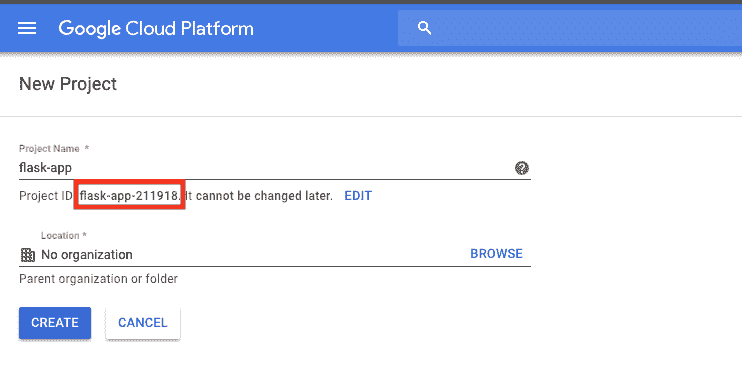

# 谷歌云运行 orb | CircleCI

> 原文：<https://circleci.com/blog/gcp-cloudrun-orb/>

这篇文章将展示如何在 [CI/CD](/continuous-integration/) 管道中使用 [Google Cloud Run](https://cloud.google.com/run/) 平台。管道将测试应用程序的代码，构建 Docker 映像，并将映像作为 Google Cloud Run 服务部署在 Google 云平台上。

## 使用的技术

这篇文章假设读者对以下内容有基本的了解；

## 将项目添加到 CircleCI

本演示中使用的项目可在[本报告](https://github.com/datapunkz/orb-gcp-cloud-run)中找到。如果你想继续下去，叉回购。然后，[注册一个免费的 CircleCI 账户](/signup/)，如果你还没有的话。按照[在 CircleCI](https://circleci.com/docs/getting-started/#setting-up-your-build-on-circleci) 上设置构建的说明，将项目连接到 CircleCI。

## Google 云设置

让我们创建与 Google Cloud Run 平台交互所需的必要凭证。这些凭证将为我们的 CI/CD 管道提供在谷歌云平台(GCP)上执行命令所需的访问权限。

### 创建一个 GCP 项目

在 [GCP 控制台](https://console.cloud.google.com/projectcreate)中创建一个新项目。为您的项目取一个容易记忆的名称。我们想让它易于识别，以便以后容易拆除。创建后，一定要复制`project id`，因为它不同于`project name`。



### 获取您项目的凭据

接下来，设置一个服务帐户密钥，您将使用它来创建和管理 GCP 项目中的资源。按照这里的步骤[创建服务账户密钥](https://cloud.google.com/iam/docs/creating-managing-service-account-keys)。选择`JSON`作为按键类型，点击**创建**。在本地保存这个`.json`文件。

**重要安全提示:** *保护你的 Google Cloud 凭证不被发布和暴露在公共的 GitHub 存储库中。您必须非常谨慎地使用此文件中的数据，因为一旦暴露，任何拥有此信息的人都可以登录您的帐户，创建资源，并收取费用。将凭证的`.json`文件名添加到项目的`.gitignore`文件中，作为防止意外发布这些敏感数据的保护层。*

## cicekci 管道设置

接下来，我们需要更新我们的管道[配置文件](https://circleci.com/docs/configuration-reference/)，以便在我们的 CI/CD 管道中使用 Google Cloud Run 平台。

### 编码 Google 服务帐户文件

服务帐户文件必须编码成一个`base64`值，以便将该数据作为一个[环境变量](https://circleci.com/docs/env-vars/)存储在 CircleCI 上。在终端中运行以下命令，对值进行编码并获得结果:

```
base64 cicd_demo_gcp_creds.json 
```

该命令的结果将类似于以下内容:

```
ewogICJ0eXBlIjogInNlcnZpY2VfYWNjb3VudCIsCiAgInByb2plY3RfaWQiOiAiY2ljZC13b3Jrc2hvcHMiLAogICJwcml2YXRlX2tleV9pZCI6ICJiYTFmZDAwOThkNTE1ZTE0NzE3ZjE4NTVlOTY1NmViMTUwNDM4YTQ4IiwKICAicHJpdmF0ZV9rZXkiOiAiLS0tLS1CRUdJTiBQUklWQVRFIEtFWS0tLS0tXG5NSUlFdlFJQkFEQU5CZ2txaGtpRzl3MEJBUUVGQUFTQ0JLY3dnZ1NqQWdFQUFvSUJBUURjT1JuRXFla3F4WUlTXG5UcHFlYkxUbWdWT3VzQkY5NTE1YkhmYWNCVlcyZ2lYWjNQeFFBMFlhK2RrYjdOTFRXV1ZoRDZzcFFwWDBxY2l6XG5GdjFZekRJbXkxMCtHYnlUNWFNV2RjTWw3ZlI2TmhZay9FeXEwNlc3U0FhV0ZnSlJkZjU4U0xWcC8yS1pBbjZ6XG5BTVdHZjM5RWxSNlhDaENmZUNNWXorQmlZd29ya3Nob3BzLmlhbS5nc2VydmljZWFjY291bnQuY29tIgp9Cg== 
```

将结果复制到剪贴板。您将在下一节中使用它。

### 创建项目变量

为了让这个 CI/CD 管道在 GCP 上执行命令，我们必须在 CircleCI 上创建项目级的[环境变量](https://circleci.com/docs/env-vars/#setting-an-environment-variable-in-a-project)。这些环境变量将在后面的`config.yml`文件中使用。

使用 CircleCI 仪表板创建以下项目级环境变量:

*   **GOOGLE_PROJECT_ID** :您的 Google Cloud 项目的**项目 ID** 。这个值可以从 Google Cloud Dashboard 中的项目卡中检索到。
*   **GCP _ 项目 _ 密钥**:上一节的 base64 编码结果。
*   **GOOGLE_COMPUTE_ZONE** :针对您的部署的区域的[值。](https://cloud.google.com/compute/docs/regions-zones/)

## Google Cloud Run(完全托管)与使用 Anthos 的 GKE Google Cloud Run

Google Cloud Run 允许你在一个完全托管的环境中运行服务，或者在一个带有 [Anthos](https://cloud.google.com/anthos/) 的 Google Kubernetes 引擎(GKE)集群上运行服务。在这篇文章中，我将阐述如何运行完全托管的 Google Cloud Run，以及如何使用 Anthos 在 GKE 集群上运行 Google Cloud Run。在这两种情况下，我将演示如何使用 [Google Cloud Run orb](https://circleci.com/developer/orbs/orb/circleci/gcp-cloud-run) 将 Google Cloud Run 部署集成到您的 CI/CD 管道中。

## 使用 Google Cloud Run(完全托管)服务创建 CI/CD 管道

现在您已经拥有了在 CircleCI 管道中使用 Google Cloud Run 平台所需的所有元素，请使用以下配置语法更新项目的`config.yml`文件。

```
version: 2.1
orbs:
  gcp-gcr: circleci/gcp-gcr@0.6.1
  cloudrun: circleci/gcp-cloud-run@1.0.0
jobs:
  build_test:
    docker:
      - image: circleci/python:3.7.4
    steps:
      - checkout
      - run:
          name: Install Python Dependencies
          command: |
            echo 'export PATH=~$PATH:~/.local/bin' >> $BASH_ENV && source $BASH_ENV
            pip install --user -r requirements.txt
      - run:
          name: Run Tests
          command: |
            pytest
  build_push_image_cloud_run_mangaged:
    docker:
      - image: circleci/python:3.7.4
    steps:
      - checkout
      - setup_remote_docker:
          docker_layer_caching: false
      - run:
          name: Build app binary and Docker image
          command: |
            echo 'export PATH=~$PATH:~/.local/bin' >> $BASH_ENV
            echo ${GCP_PROJECT_KEY} | base64 --decode --ignore-garbage > $HOME/gcloud-service-key.json
            echo 'export GOOGLE_CLOUD_KEYS=$(cat $HOME/gcloud-service-key.json)' >> $BASH_ENV
            echo 'export TAG=${CIRCLE_SHA1}' >> $BASH_ENV
            echo 'export IMAGE_NAME=$CIRCLE_PROJECT_REPONAME' >> $BASH_ENV && source $BASH_ENV
            pip install --user -r requirements.txt
            pyinstaller -F hello_world.py
            docker build -t us.gcr.io/$GOOGLE_PROJECT_ID/$IMAGE_NAME -t us.gcr.io/$GOOGLE_PROJECT_ID/$IMAGE_NAME:$TAG .
      - gcp-gcr/gcr-auth:
          gcloud-service-key: GOOGLE_CLOUD_KEYS
          google-project-id: GOOGLE_PROJECT_ID
          google-compute-zone: GOOGLE_COMPUTE_ZONE
      - gcp-gcr/push-image:
          google-project-id: GOOGLE_PROJECT_ID
          registry-url: "us.gcr.io"
          image: $IMAGE_NAME
      - cloudrun/deploy:
          platform: "managed"
          image: "us.gcr.io/$GOOGLE_PROJECT_ID/$IMAGE_NAME"
          service-name: "orb-gcp-cloud-run"
          region: $GOOGLE_COMPUTE_ZONE
          unauthenticated: true
workflows:
  build_test_deploy:
    jobs:
      - build_test
      - build_push_image_cloud_run_mangaged:
          requires:
            - build_test 
```

### 云运行(完全受管)配置细分

让我们分解实现 Google Cloud Run orb 的管道语法，并使用 Google Cloud Run(完全托管)服务部署应用程序。

```
version: 2.1
orbs:
  gcp-gcr: circleci/gcp-gcr@0.6.1
  cloudrun: circleci/gcp-cloud-run@1.0.0 
```

上面的代码片段将`2.1`声明为 CircleCI 平台的`version`以供使用。`orbs:`键指定了要包含在这个管道中的 orb。在这个例子中，我将使用`circleci/gcp-gcr@0.6.1`和`circleci/gcp-cloud-run@1.0.0`球体。我包含了`gcp-gcr` orb 来演示在您的管道中实现多个 orb。

```
jobs:
  build_test:
    docker:
      - image: circleci/python:3.7.4
    steps:
      - checkout
      - run:
          name: Install Python Dependencies
          command: |
            echo 'export PATH=~$PATH:~/.local/bin' >> $BASH_ENV && source $BASH_ENV
            pip install --user -r requirements.txt
      - run:
          name: Run Tests
          command: |
            pytest
  build_push_image_cloud_run_mangaged:
    docker:
      - image: circleci/python:3.7.4
    steps:
      - checkout
      - setup_remote_docker:
          docker_layer_caching: false
      - run:
          name: Build app binary and Docker image
          command: |
            echo 'export PATH=~$PATH:~/.local/bin' >> $BASH_ENV
            echo ${GCP_PROJECT_KEY} | base64 --decode --ignore-garbage > $HOME/gcloud-service-key.json
            echo 'export GOOGLE_CLOUD_KEYS=$(cat $HOME/gcloud-service-key.json)' >> $BASH_ENV
            echo 'export TAG=${CIRCLE_SHA1}' >> $BASH_ENV
            echo 'export IMAGE_NAME=$CIRCLE_PROJECT_REPONAME' >> $BASH_ENV && source $BASH_ENV
            pip install --user -r requirements.txt
            pyinstaller -F hello_world.py
            docker build -t us.gcr.io/$GOOGLE_PROJECT_ID/$IMAGE_NAME -t us.gcr.io/$GOOGLE_PROJECT_ID/$IMAGE_NAME:$TAG . 
```

上面的代码片段显示了`jobs:`键，它是一个作业列表，代表了要在管道中执行的一组操作。这个代码片段指定了两个任务:`build_test:`和`build_push_image_cloud_run_mangaged:`。`build_test`作业安装应用程序依赖项。然后，它执行项目的单元测试，以确保应用程序在移动到管道中的下一个作业之前通过。列出的下一个任务是`build_push_image_cloud_run_mangaged:`，创建环境变量，并构建 Docker 映像，该映像将被部署到 Google Cloud Run 服务。

```
 - gcp-gcr/gcr-auth:
          gcloud-service-key: GOOGLE_CLOUD_KEYS
          google-project-id: GOOGLE_PROJECT_ID
          google-compute-zone: GOOGLE_COMPUTE_ZONE 
```

上面的代码片段使用前一节中设置的环境变量，使用`gcp-gcr/gcr-auth:` orb 向 Google 容器注册中心(GCR)进行身份验证。

```
 - gcp-gcr/push-image:
          google-project-id: GOOGLE_PROJECT_ID
          registry-url: "us.gcr.io"
          image: $IMAGE_NAME 
```

在上面的代码片段中，`push-image`命令用于将新创建的图像推送到 GCR，以便在 GCP 使用。

```
 - cloudrun/deploy:
          platform: "managed"
          image: "us.gcr.io/$GOOGLE_PROJECT_ID/$IMAGE_NAME"
          service-name: "orb-gcp-cloud-run"
          region: $GOOGLE_COMPUTE_ZONE
          unauthenticated: true 
```

上面的代码片段使用来自`cloudrun` orb 的`deploy`函数来创建和部署 Google Cloud Run 服务，该服务将提供新打包的 Docker 映像。`platform`参数被设置为`managed`，这将服务部署到 GCP 上的完全受管环境中。

下一节将演示如何将 Docker 映像部署到 Google Cloud Run for Anthos。

## 为 Anthos 在 GKE 上使用 Google Cloud Run 服务创建 CI/CD 管道

上一节演示了如何将应用程序部署到完全托管的 Google Cloud Run 环境中。在这一节中，我将演示如何为 Anthos 在 GKE 上运行的 Google Cloud 部署一个应用程序。在下面的管道示例中，`build_test:`作业与之前完全托管的 Google Cloud Run 示例相同，但是请注意名为`build_push_image_cloud_run_gke:`的新作业，它通过 Google Cloud Run orb 将应用程序部署到在 GKE 集群上运行的 Google Cloud Run 服务。

```
version: 2.1
orbs:
  gcp-gcr: circleci/gcp-gcr@0.6.1
  cloudrun: circleci/gcp-cloud-run@1.0.0
jobs:
  build_test:
    docker:
      - image: circleci/python:3.7.4
    steps:
      - checkout
      - run:
          name: Install Python Dependencies
          command: |
            echo 'export PATH=~$PATH:~/.local/bin' >> $BASH_ENV && source $BASH_ENV
            pip install --user -r requirements.txt
      - run:
          name: Run Tests
          command: |
            pytest
  build_push_image_cloud_run_gke:
    docker:
      - image: circleci/python:3.7.4
    steps:
      - checkout
      - setup_remote_docker:
          docker_layer_caching: false
      - run:
          name: Build app binary and Docker image
          command: |
            echo 'export PATH=~$PATH:~/.local/bin' >> $BASH_ENV
            echo ${GCP_PROJECT_KEY} | base64 --decode --ignore-garbage > $HOME/gcloud-service-key.json
            echo 'export GOOGLE_CLOUD_KEYS=$(cat $HOME/gcloud-service-key.json)' >> $BASH_ENV
            echo 'export TAG=${CIRCLE_SHA1}' >> $BASH_ENV
            echo 'export IMAGE_NAME=$CIRCLE_PROJECT_REPONAME' >> $BASH_ENV && source $BASH_ENV
            pip install --user -r requirements.txt
            pyinstaller -F hello_world.py
            docker build -t us.gcr.io/$GOOGLE_PROJECT_ID/$IMAGE_NAME -t us.gcr.io/$GOOGLE_PROJECT_ID/$IMAGE_NAME:$TAG .
      - gcp-gcr/gcr-auth:
          gcloud-service-key: GOOGLE_CLOUD_KEYS
          google-project-id: GOOGLE_PROJECT_ID
          google-compute-zone: GOOGLE_COMPUTE_ZONE
      - gcp-gcr/push-image:
          google-project-id: GOOGLE_PROJECT_ID
          registry-url: "us.gcr.io"
          image: $IMAGE_NAME
      - cloudrun/create_gke_cluster:
          cluster-name: $CIRCLE_PROJECT_REPONAME
          machine-type: "g1-small"
          zone: $GOOGLE_COMPUTE_ZONE
          enable-stackdriver-kubernetes: true
          scopes: "cloud-platform"
      - cloudrun/deploy:
          platform: "gke"
          image: "us.gcr.io/$GOOGLE_PROJECT_ID/$IMAGE_NAME"
          cluster: $CIRCLE_PROJECT_REPONAME
          service-name: $CIRCLE_PROJECT_REPONAME
          cluster-location: $GOOGLE_COMPUTE_ZONE
workflows:
  build_test_deploy:
    jobs:
      - build_test
      - build_push_image_cloud_run_gke:
          requires:
            - build_test 
```

### 云运行 GKE 配置细分

上面显示的管道示例的第一个作业已经在完全托管部分中介绍过了，所以我将跳到新作业`build_push_image_cloud_run_gke:`。

```
 build_push_image_cloud_run_gke:
    docker:
      - image: circleci/python:3.7.4
    steps:
      - checkout
      - setup_remote_docker:
          docker_layer_caching: false
      - run:
          name: Build app binary and Docker image
          command: |
            echo 'export PATH=~$PATH:~/.local/bin' >> $BASH_ENV
            echo ${GCP_PROJECT_KEY} | base64 --decode --ignore-garbage > $HOME/gcloud-service-key.json
            echo 'export GOOGLE_CLOUD_KEYS=$(cat $HOME/gcloud-service-key.json)' >> $BASH_ENV
            echo 'export TAG=${CIRCLE_SHA1}' >> $BASH_ENV
            echo 'export IMAGE_NAME=$CIRCLE_PROJECT_REPONAME' >> $BASH_ENV && source $BASH_ENV
            pip install --user -r requirements.txt
            pyinstaller -F hello_world.py
            docker build -t us.gcr.io/$GOOGLE_PROJECT_ID/$IMAGE_NAME -t us.gcr.io/$GOOGLE_PROJECT_ID/$IMAGE_NAME:$TAG .
      - gcp-gcr/gcr-auth:
          gcloud-service-key: GOOGLE_CLOUD_KEYS
          google-project-id: GOOGLE_PROJECT_ID
          google-compute-zone: GOOGLE_COMPUTE_ZONE
      - gcp-gcr/push-image:
          google-project-id: GOOGLE_PROJECT_ID
          registry-url: "us.gcr.io"
          image: $IMAGE_NAME 
```

上面的代码片段基于应用程序构建 Docker 图像，并将图像上传到 GCR。这些操作也与本文完全管理部分演示的 Docker 操作相同。

```
 - cloudrun/create_gke_cluster:
          cluster-name: $CIRCLE_PROJECT_REPONAME
          machine-type: "g1-small"
          zone: "us-east1"
          enable-stackdriver-kubernetes: true
          scopes: "cloud-platform"
      - cloudrun/deploy:
          platform: "gke"
          image: "us.gcr.io/$GOOGLE_PROJECT_ID/$IMAGE_NAME"
          cluster: $CIRCLE_PROJECT_REPONAME
          service-name: $CIRCLE_PROJECT_REPONAME
          cluster-location: $GOOGLE_COMPUTE_ZONE
workflows:
  build_test_deploy:
    jobs:
      - build_test
      - build_push_image_cloud_run_gke:
          requires:
            - build_test 
```

在上面的代码片段中，管道使用`cloudrun` orb 将 Google Cloud Run 应用部署到 GKE 集群。`cloudrun/create_gke_cluster:`命令创建了一个新的 GKE 集群，Google Cloud Run 应用程序将部署在这里。接下来，`cloudrun/deploy:`命令将应用程序部署到新创建的 GKE 集群。该应用程序正在被部署到 Kubernetes 集群，这可能需要几分钟的时间，因此在此过程中请耐心等待。这将比其他操作花费更长的时间。

## 包扎

这篇文章展示了如何使用 Google Cloud Run orb 在 CI/CD 管道中自动构建、测试和部署应用程序到 Google Cloud Run 平台。在 CircleCI 管道中使用 orb 为将应用程序部署到 Google Cloud Run 平台提供了一个干净、简洁且经过充分测试的解决方案。

感谢阅读！