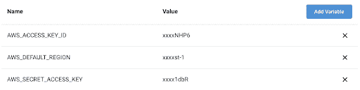

# Kubernetes 入门:如何设置您的第一个集群

> 原文：<https://circleci.com/blog/getting-started-with-kubernetes-how-to-set-up-your-first-cluster/>

Kubernetes 是部署和扩展复杂分布式系统的优秀工具，但众所周知，开始使用 Kubernetes 是一个挑战。大多数 Kubernetes 教程使用类似于 [Minikube](https://kubernetes.io/docs/setup/learning-environment/minikube/) 这样的工具来帮助您入门，但它并没有教您多少关于配置生产就绪集群的知识。

在本文中，我们将采用一种不同的方法，并向您展示如何使用亚马逊弹性 Kubernetes 服务(亚马逊 EKS)和 Terraform 建立一个真实的、生产就绪的 Kubernetes 集群。

## 介绍 Terraform

[Hashicorp 的 Terraform](https://www.terraform.io/) 是一个基础设施即代码(IaC)解决方案，允许您以声明方式定义您的云基础设施的所需配置。使用 Terraform CLI，您可以在本地或作为自动化 CI/CD 管道的一部分提供此配置。

Terraform 类似于云平台提供的配置工具，如 [AWS CloudFormation](https://aws.amazon.com/cloudformation/) 或 [Azure Resource Manager](https://docs.microsoft.com/en-us/azure/azure-resource-manager/management/overview) ，但它的优势是与提供商无关。如果你不熟悉 Terraform，我们建议你首先阅读他们的[AWS](https://learn.hashicorp.com/collections/terraform/aws-get-started)入门指南，了解最重要的概念。

## 定义基础设施

让我们构建一个 Terraform 配置，逐步配置亚马逊 EKS 集群和 AWS 虚拟私有云(VPC)。

创建包含以下内容的`main.tf`文件:

```
provider "aws" {
  region = "eu-west-1"
}

data "aws_availability_zones" "azs" {
  state = "available"
}

locals {
  cluster_name = "eks-circleci-cluster"
} 
```

在这个文件中，我们首先设置 AWS 提供者，将区域设置为`eu-west-1`。请随意将其更改为任何其他 AWS 区域。

AWS 提供者将检查各个地方是否有有效的[凭证](https://registry.terraform.io/providers/hashicorp/aws/latest/docs#authentication)可以使用，所以一定要设置这些凭证。

然后，我们获取可以在该区域使用的可用性区域。这使得更改区域变得更加容易，而不需要任何其他更改。我们还将集群名称设置为一个变量，因为我们将多次使用它。您也可以更改该值。

让我们来配置 VPC。将以下内容添加到文件中:

```
module "vpc" {
  source  = "terraform-aws-modules/vpc/aws"
  version = "~> 2.48"

  name = "eks-circleci-vpc"
  cidr = "10.0.0.0/16"

  azs                  = slice(data.aws_availability_zones.azs.names, 0, 2)
  private_subnets      = ["10.0.1.0/24", "10.0.2.0/24"]
  public_subnets       = ["10.0.3.0/24", "10.0.4.0/24"]
  enable_nat_gateway   = true
  single_nat_gateway   = true
  enable_dns_hostnames = true

  tags = {
    "kubernetes.io/cluster/${local.cluster_name}" = "shared"
  }

  public_subnet_tags = {
    "kubernetes.io/cluster/${local.cluster_name}" = "shared"
    "kubernetes.io/role/elb"                      = "1"
  }

  private_subnet_tags = {
    "kubernetes.io/cluster/${local.cluster_name}" = "shared"
    "kubernetes.io/role/internal-elb"             = "1"
  }
} 
```

通过使用 [AWS VPC 模块](https://registry.terraform.io/modules/terraform-aws-modules/vpc/aws)，我们极大地简化了 VPC 的创建。我们将 VPC 配置为使用部署 Terraform 模板的区域中的前两个 az。这是 EKS 要求的 az 的最小数量。

为了节约成本，我们只配置一个 NAT 网关。AWS VPC 模块将正确地设置路由表，以通过这个单一 NAT 网关路由所有内容。我们还为 VPC 启用了 [DNS 主机名](https://docs.aws.amazon.com/vpc/latest/userguide/vpc-dns.html)，因为这是 EKS 的[要求。](https://docs.aws.amazon.com/eks/latest/userguide/network_reqs.html)

最后，我们设置 EKS 所需的标记，以便它可以发现其子网，并知道在哪里放置公共和私有负载平衡器。

接下来，让我们使用 [AWS EKS 模块](https://registry.terraform.io/modules/terraform-aws-modules/eks/aws)来配置 EKS 集群。

```
module "eks" {
  source  = "terraform-aws-modules/eks/aws"
  version = "~> 12.2"

  cluster_name    = local.cluster_name
  cluster_version = "1.17"
  subnets         = module.vpc.private_subnets
  vpc_id          = module.vpc.vpc_id

  worker_groups = [
    {
      instance_type = "t3.large"
      asg_max_size  = 1
    }
  ]
} 
```

我们将集群配置为使用我们已经创建的 VPC，并使用一个`t3.large`实例定义一个单独的 worker 组。这将足以在集群中创建一个简单的测试资源，同时最小化成本。

最后，将以下配置添加到文件中:

```
data "aws_eks_cluster" "cluster" {
  name = module.eks.cluster_id
}

data "aws_eks_cluster_auth" "cluster" {
  name = module.eks.cluster_id
}

provider "kubernetes" {
  version = "~> 1.9"

  host                   = data.aws_eks_cluster.cluster.endpoint
  cluster_ca_certificate = base64decode(data.aws_eks_cluster.cluster.certificate_authority.0.data)
  token                  = data.aws_eks_cluster_auth.cluster.token
  load_config_file       = false
}

output "kubectl_config" {
  description = "kubectl config that can be used to authenticate with the cluster"
  value       = module.eks.kubeconfig
} 
```

我们从亚马逊 EKS 集群配置中获取一些数据，并将 [Terraform Kubernetes 提供者](https://registry.terraform.io/providers/hashicorp/kubernetes/latest/docs)配置为通过集群进行身份验证。当 AWS EKS 模块在集群中创建 configmap 时，该提供程序也在其中使用，这将授予当前通过身份验证的 AWS 用户对集群的管理权限。这是一个 [EKS 特有的](https://docs.aws.amazon.com/eks/latest/userguide/add-user-role.html)方法，用于授权 AWS 实体访问集群。

最后,`output`块将显示向群集进行身份验证所需的信息——在我们调配完群集后会有更多相关信息。

我们现在有了一个地形配置，完全可以启动 EKS 集群。让我们应用这个配置，并在集群中创建一个测试资源。

## 供应 Kubernetes 集群

配置您的 shell 以[认证](https://registry.terraform.io/providers/hashicorp/aws/latest/docs#authentication)terra form AWS 提供商。您的工作目录与我们刚刚创建 Terraform 文件的目录相同，初始化工作空间:

```
$ terraform init
Initializing modules...
Downloading terraform-aws-modules/eks/aws 12.2.0 for eks...
- eks in .terraform/modules/eks/terraform-aws-eks-12.2.0
- eks.node_groups in .terraform/modules/eks/terraform-aws-eks-12.2.0/modules/node_groups
Downloading terraform-aws-modules/vpc/aws 2.48.0 for vpc...
- vpc in .terraform/modules/vpc/terraform-aws-vpc-2.48.0

Initializing the backend...

Initializing provider plugins...
- Checking for available provider plugins...
- Downloading plugin for provider "random" (hashicorp/random) 2.3.0...
- Downloading plugin for provider "aws" (hashicorp/aws) 3.3.0...
- Downloading plugin for provider "kubernetes" (hashicorp/kubernetes) 1.12.0...
- Downloading plugin for provider "local" (hashicorp/local) 1.4.0...
- Downloading plugin for provider "null" (hashicorp/null) 2.1.2...
- Downloading plugin for provider "template" (hashicorp/template) 2.1.2...

Terraform has been successfully initialized!

[...] 
```

`terraform init`命令下载配置文件中包含的所有提供程序。我们现在可以应用和调配 VPC 和集群。

**注意** : *这将需要 10 到 15 分钟才能完成。*

```
$ terraform apply

[...]

Plan: 40 to add, 0 to change, 0 to destroy.

Do you want to perform these actions?
  Terraform will perform the actions described above.
  Only 'yes' will be accepted to approve.

  Enter a value: yes

[...]

Apply complete! Resources: 40 added, 0 changed, 0 destroyed.

Outputs:

[...] 
```

就这样:我们现在有了一个完全启动并运行的亚马逊 EKS 集群。

让我们部署一个 pod，并通过负载平衡器公开它，以确保我们的集群按预期工作。

要使用集群进行身份验证，您需要安装 [kubectl](https://kubernetes.io/docs/tasks/tools/install-kubectl/) 和 [aws-iam-authenticator](https://docs.aws.amazon.com/eks/latest/userguide/install-aws-iam-authenticator.html) 。在`terraform apply`末尾的`Outputs`部分包含了你可以添加到你的 [kubeconfig](https://kubernetes.io/docs/concepts/configuration/organize-cluster-access-kubeconfig/) 文件(或者一个临时的新文件)中的细节。完成后，让我们创建一个新的部署并公开它:

```
$ kubectl create deployment nginx --image=nginx
deployment.apps/nginx created

$ kubectl expose deployment/nginx --port=80 --type=LoadBalancer
service/nginx exposed

$ kubectl get service nginx 
```

从最终输出中获取`EXTERNAL-IP`值——这是 AWS 负载平衡器的 DNS 条目。DNS 传播可能需要几分钟时间。当它打开时，你会看到“欢迎使用 nginx！”页面。成功！

## 更简单的方法:CircleCI aws-eks orb

您已经学习了一种构建亚马逊 EKS 集群的方法。然而，组装配置并使其保持最新是——并将继续是——相当多的(手动)工作。

幸运的是，CircleCI [aws-eks orb](https://circleci.com/developer/orbs/orb/circleci/aws-eks) 可以帮上忙。CircleCI [orbs](https://circleci.com/orbs/) 包含预打包的配置代码，使其更容易与其他开发工具集成。这只是[宝珠注册表](https://circleci.com/developer/orbs)中众多可用宝珠中的一个。

aws-eks orb 可以自动启动、测试和拆除亚马逊 eks 集群。您可以使用它来创建强大的工作流，在干净、完全隔离的临时 EKS 集群中测试应用程序。让我们试一试。

CircleCI 帐户是开始使用 orb 的主要先决条件。注册 CircleCI 并在 CircleCI 项目中将 Git 存储库连接到您的帐户。

在这个项目中，转到**设置**下的**环境变量**选项卡，添加以下变量，以便项目可以通过 AWS 进行身份验证。确保 AWS IAM 用户拥有创建 EKS 集群及其依赖项所需的权限。将 region 变量的值设置为要预配集群的区域。



接下来，在 Git 存储库中创建`.circleci/config.yml`文件，并向其中添加以下内容:

```
version: 2.1

orbs:
  aws-eks: circleci/aws-eks@1.0.0
  kubernetes: circleci/kubernetes@0.11.1

jobs:
  test-cluster:
    executor: aws-eks/python3
    parameters:
      cluster-name:
        description: |
          Name of the EKS cluster
        type: string
    steps:
      - kubernetes/install
      - aws-eks/update-kubeconfig-with-authenticator:
          cluster-name: << parameters.cluster-name >>
      - run:
          command: |
            kubectl get services
          name: Test cluster

workflows:
  deployment:
    jobs:
      - aws-eks/create-cluster:
          cluster-name: my-first-cluster
      - test-cluster:
          cluster-name: my-first-cluster
          requires:
            - aws-eks/create-cluster
      - aws-eks/delete-cluster:
          cluster-name: my-first-cluster
          requires:
            - test-cluster 
```

该文件配置了一个包含三个作业的工作流:

1.  使用来自 aws-eks orb 的`create-cluster`命令，使用 [eksctl](https://eksctl.io/) 实用程序创建集群及其依赖项
2.  运行一个简单的测试来验证集群是否按预期工作
3.  破坏集群

将这个文件提交到您的存储库中，CircleCI 将自动启动工作流，这将需要 15 到 20 分钟。当然，您可以在集群创建之后添加所有需要的步骤，比如提供资源和运行测试。

与我们前面讨论的创建亚马逊 eks 集群的 Terraform 方法相比，aws-eks orb 大大简化并加快了管理 EKS 集群生命周期的过程。EKS 集群本身的复杂性，以及它的依赖项(比如 VPC)的配置，都被完全抽象掉了。这是一个低维护的解决方案，它允许您将精力集中在构建具有自动化测试的有价值的持续集成工作流上。

## 后续步骤

您已经了解到创建您的第一个 Kubernetes 集群并不困难或可怕。Terraform 提供了一种定义集群基础设施的简单方法。通过简单的 CLI 命令，您可以轻松调配已定义的基础架构。

CircleCI orb 进一步简化了这一过程。无需编写自己的 Terraform 代码或运行任何命令，您也可以达到相同的最终结果。

学习这个的最好方法就是自己动手。首先使用 Terraform 代码及其 CLI 手动创建集群。然后，尝试 CircleCI，看看使用 aws-eks orb 创建一个集群是多么容易和快速。

* * *

Sander 是一名对自动化充满热情的云工程师。他喜欢解决技术和组织方面的挑战，以帮助公司在云中用更少的资源做更多的事情。这包括支持开发人员自治、平台工程和云原生解决方案等主题。他主要通过整合概念和工具来实现这一点，如代码基础设施、监控和日志记录、安全性和 CI/CD。