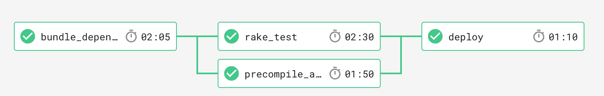

# 充分利用 Docker 和工作流，第 2 部分:关于工作流的一切

> 原文：<https://circleci.com/blog/getting-the-most-out-of-docker-and-workflows-part-2-all-about-workflows/>

**来自出版商的说明:**您已经找到了我们的一些旧内容，这些内容可能已经过时和/或不正确。尝试在[我们的文档](https://circleci.com/docs/)或[博客](https://circleci.com/blog/)中搜索最新信息。

* * *

在[的上一期](https://circleci.com/blog/using-docker-effectively-on-circleci/)中，我们看到了 Docker 映像如何为构建过程增加功能和定制。在这一期中，我们将向您展示如何通过使用 CircleCI 2.0 Workflows 特性来增强这种能力。

### 详细的工作流程

简单来说， [Workflows](https://circleci.com/docs/workflows/) 在作业之间增加了一个简单的协调层。让我们从想象一个简单的工作流程开始:

 *工作流 DAG*

工作流[配置](https://github.com/CircleCI-Public/circleci-demo-workflows/blob/blog-workflows-1/.circleci/config.yml)节和实时工作流[运行](https://app.circleci.com/pipelines/github/CircleCI-Public/circleci-demo-workflows/jobs)(需要登录 CircleCI):

```
workflows:
  version: 2
  blog-demo-1:
    jobs:
      - bundle_dependencies
      - rake_test:
          requires:
            - bundle_dependencies
      - precompile_assets:
          requires:
            - bundle_dependencies
      - deploy:
          requires:
            - rake_test
            - precompile_assets 
```

`blog-demo-1`工作流程由 4 个任务组成。`bundle_dependencies`作业更新和缓存依赖关系。然后我们“扇出”成两个并行的作业- `rake_test`和`precompile_assets.`，它们中的每一个都将恢复依赖关系并完成自己的工作。如果`rake_test`和`precompile_assets`都成功，我们就“扇入”到`deploy`工作中。

## 利益

我们可以轻松地完成一个内联所有运行步骤的单一作业。通过引入工作流，我们获得了什么？

### 显式并行=更快的构建

当它们并行发生时，事情发生得更快。

工作流提供的显式“扇出”并行性可以显著减少构建时间，特别是当项目随着时间的推移变得越来越复杂，并且引入了越来越多的独立可并行化任务，如[代码覆盖](https://en.wikipedia.org/wiki/Code_coverage)。

在上面的例子中，`rake_test`和`precompile_assets`受益于这种并行性。

### 每个作业可能在不同的环境中运行

在我们上面的例子中，`deploy`作业运行在“机器”中，而不是 Docker 容器中。您有机会为每个作业指定不同的 Docker 图像和 [resource_class](https://circleci.com/docs/configuration-reference/#resource_class) 。

为了降低成本和最大限度地减少构建时间，用户可能希望使用具有强大资源的功能丰富的容器来运行一些常见的前驱步骤，然后分散到许多轻量级作业中，以实现快速并行构建。

### 重复性-从失败重新运行

如果某项工作因暂时性问题(如不稳定的文本或外部服务的临时中断)而在工作流程中失败，您*不必*从头开始重新启动工作流程。“重新运行失败的作业”功能允许工作流以失败的作业为起点继续运行。

如果没有工作流，您将总是不得不重新运行整个构建。

### 向您的 VCS 提供商报告详细状态

通过工作流，您的 VCS 提供商(例如 Github)将获得一个状态列表——每个作业一个状态——这样可以更容易地一眼看出故障发生在哪里，并且您可以直接导航到失败的作业。

## 结尾部分

在这篇博文中，我们简要介绍了 Circle 2.0 的工作流特性。在下一期中，我们将逐步添加一些高级特性，包括:

*   工作区转发
*   手动审批作业
*   分支和标签过滤