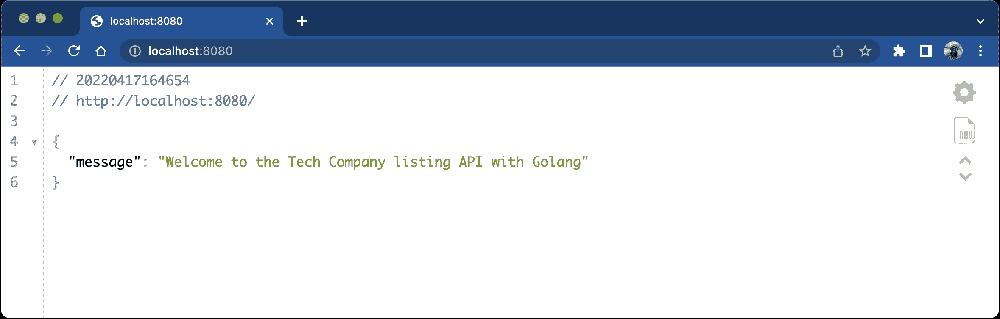
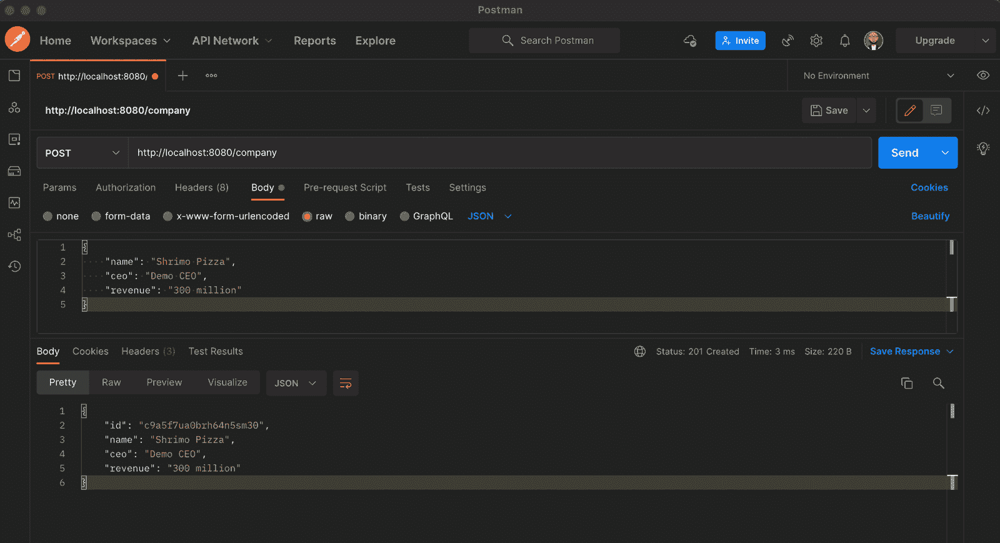
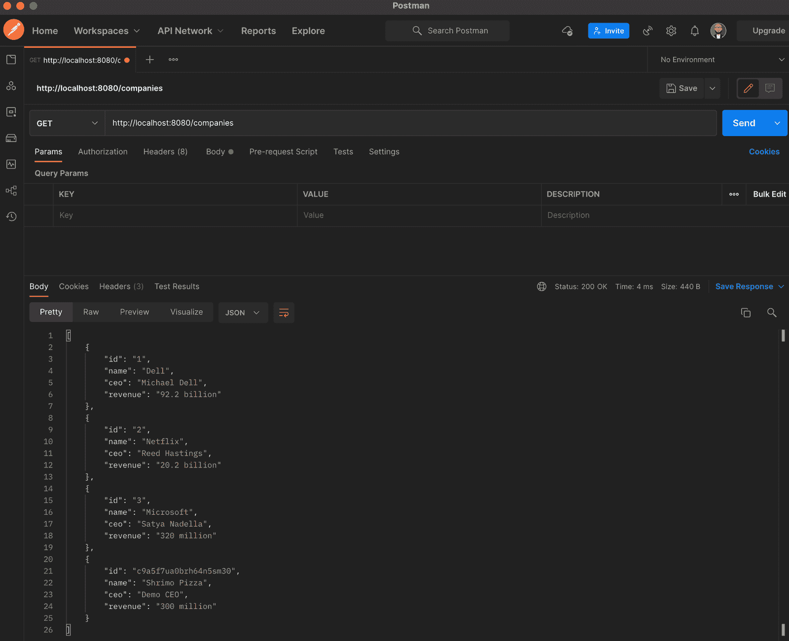
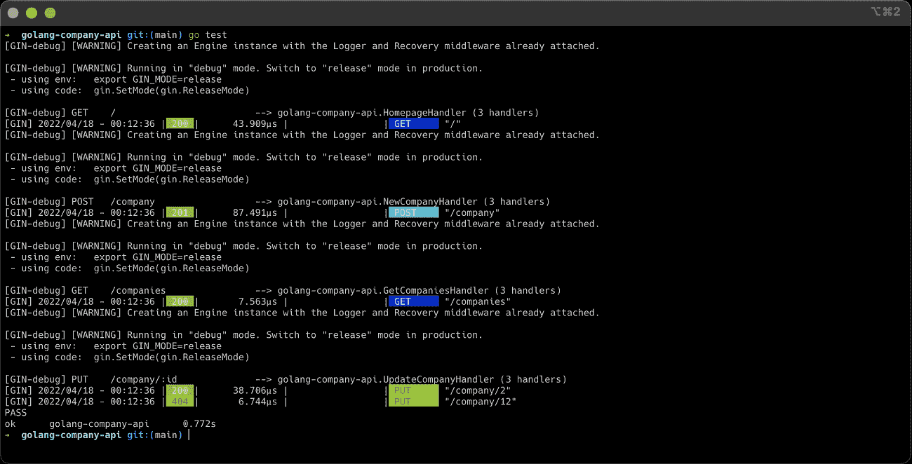
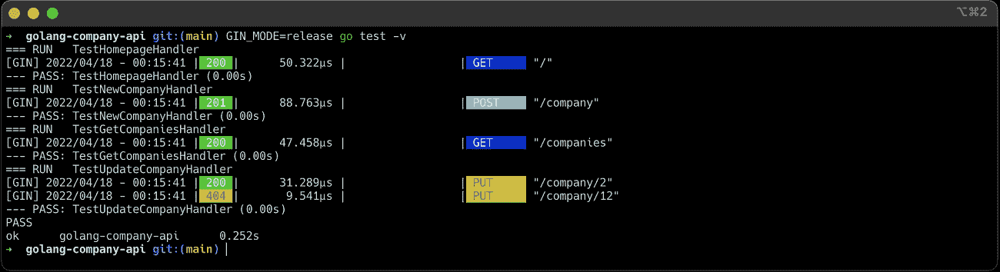
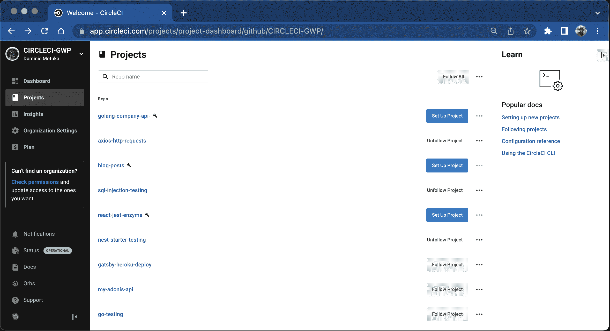
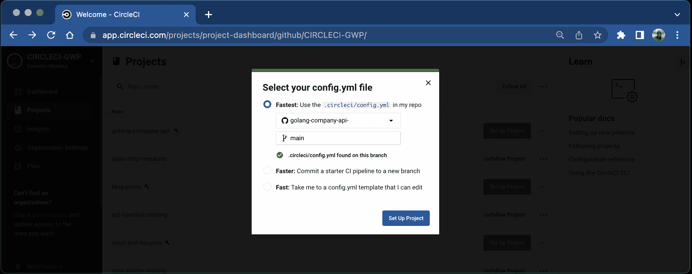
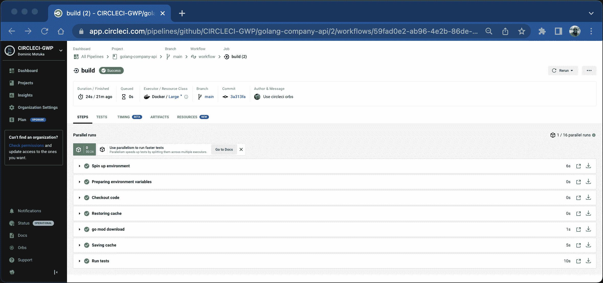
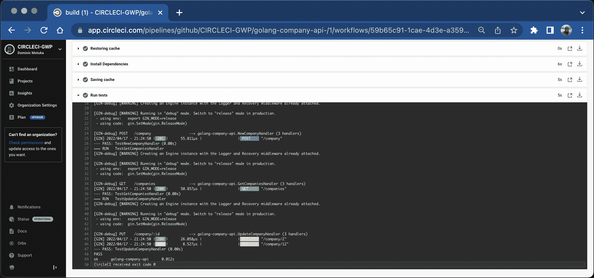

# Golang Gin-gonic RESTful API 的自动化测试

> 原文：<https://circleci.com/blog/gin-gonic-testing/>

> 本教程涵盖:
> 
> 1.  使用 Gin-gonic 框架用 Golang 构建 RESTful API
> 2.  为端点编写和运行测试
> 3.  自动化测试

[Gin](https://github.com/gin-gonic/gin) 是一个用 Golang 编写的高性能 HTTP web 框架。它包含路由和现成中间件等特性和功能。这有助于减少样板代码，提高生产率，并简化构建微服务的过程。

在本教程中，我将指导你使用 [Gin-gonic](https://github.com/gin-gonic/gin) 框架构建一个 RESTful API。我还将带领您构建一个 API 来管理公司的基本细节。这个 API 将允许您创建、编辑、删除和检索公司列表。

为了简单起见，我不会在本教程中讨论数据持久性。相反，我们将使用一个虚拟的公司列表，我们可以相应地更新或删除。这听起来可能很简单，但足以让您开始用 Golang 构建健壮的 API 和单元测试。

## 先决条件

您将需要以下内容来充分利用本教程:

> 我们的教程是平台无关的，但是使用 CircleCI 作为例子。如果你没有 CircleCI 账号，请在 注册一个免费的 [**。**](https://circleci.com/signup/)

## 入门指南

首先，通过终端导航到您的开发文件夹，并使用以下命令为项目创建一个新文件夹:

```
mkdir golang-company-api
cd golang-company-api 
```

前面的命令创建了一个名为`golang-company-api`的文件夹，并导航到其中。

接下来，通过发出以下命令初始化项目中的一个 [Go 模块](https://go.dev/doc/tutorial/create-module):

```
go mod init golang-company-api 
```

这将创建一个`go.mod`文件，其中将列出项目的依赖项以供跟踪。

## 安装项目的依赖项

如上所述，这个项目将使用 [Gin 框架](https://github.com/gin-gonic/gin)作为外部依赖。从项目的根目录发出以下命令，安装最新版本的 Gin 和其他依赖项:

```
go get -u github.com/gin-gonic/gin github.com/stretchr/testify github.com/rs/xid 
```

一旦安装过程成功，您就可以访问 Gin 和应用程序中的以下软件包:

*   [evidence](https://github.com/stretchr/testify)是 Golang 最受欢迎的测试包之一
*   XID 是一个全球唯一的 ID 生成器库。

## 创建主页

现在，在项目的根目录下创建一个名为`main.go`的文件。这将是应用程序的入口点，也将包含负责所有功能的大多数功能。打开新文件，并使用以下内容:

```
package main

import (
    "net/http"
    "github.com/gin-gonic/gin"
)

func HomepageHandler(c *gin.Context) {
    c.JSON(http.StatusOK, gin.H{"message":"Welcome to the Tech Company listing API with Golang"})
}

func main() {
    router := gin.Default()
    router.GET("/", HomepageHandler)
    router.Run()
} 
```

这段代码导入了 Gin 和一个提供 http 客户端和服务器实现的 net/http 包。它创建了一个`HomepageHandler()`方法来处理应用程序主页上的响应。

最后，`main()`函数初始化一个新的 Gin 路由器，为主页定义 HTTP 动词，并通过调用 Gin 实例的`Run()`在默认端口`8080`上运行一个 HTTP 服务器。

## 运行项目

运行项目:

```
go run main.go 
```

该命令在默认端口`8080`上运行应用程序。去`http://localhost:8080`复习一下。



既然应用程序按预期工作，您就可以开始实现 API 端点所需的逻辑了。现在，使用 CTRL+C 停止应用程序的运行，然后按下 **Enter** 。

## 创建 REST APIs

在继续之前，您需要定义一个保存公司信息的数据结构。这将包含公司的属性和字段。每个公司都有一个`ID`、`Name`、`CEO`的名字和`Revenue`——公司预计的年收入。

### 定义公司模式

使用 Go [结构](https://go.dev/tour/moretypes/2)来定义这个模型。在`main.go`文件中，声明以下结构:

```
type Company struct {
    ID     string  `json:"id"`
    Name  string  `json:"name"`
    CEO string  `json:"ceo"`
    Revenue  string `json:"revenue"`
} 
```

要轻松地将每个字段映射到特定的名称，请使用反勾号指定每个字段上的标签。这允许您发送符合 JSON 命名约定的适当响应。

### 定义全局变量

接下来，定义一个全局变量来表示公司，并用一些虚拟数据初始化该变量。在`main.go`文件中，在`Company`结构之后添加:

```
var companies = []Company{
    {ID: "1", Name: "Dell", CEO: "Michael Dell", Revenue: "92.2 billion"},
    {ID: "2", Name: "Netflix", CEO: "Reed Hastings", Revenue: "20.2 billion"},
    {ID: "3", Name: "Microsoft", CEO: "Satya Nadella", Revenue: "320 million"},
} 
```

### 创建新公司

接下来，定义创建新公司所需的逻辑。在`main.go`文件中创建一个新方法，将其命名为`*NewCompanyHandler*`,并使用以下代码:

```
func NewCompanyHandler(c *gin.Context) {
    var newCompany Company
    if err := c.ShouldBindJSON(&newCompany); err != nil {
        c.JSON(http.StatusBadRequest, gin.H{
            "error": err.Error(),
        })
        return
    }
    newCompany.ID = xid.New().String()
    companies = append(companies, newCompany)
    c.JSON(http.StatusCreated,  newCompany)
} 
```

这个代码片段将传入的请求体绑定到一个`Company` struct 实例中，然后指定一个惟一的`ID`。它将`newCompany`添加到公司列表中。如果有错误，则返回错误响应，否则返回成功响应。

### 获取公司列表

要检索公司列表，定义一个`*GetCompaniesHandler*`方法:

```
func GetCompaniesHandler(c *gin.Context) {
    c.JSON(http.StatusOK, companies)
} 
```

这使用了`c.JSON()`方法将`companies`数组映射到 JSON 并返回它。

### 更新公司

要更新现有公司的详细信息，请使用以下内容定义一个名为`*UpdateCompanyHandler*`的方法:

```
func UpdateCompanyHandler(c *gin.Context) {
    id := c.Param("id")
    var company Company
    if err := c.ShouldBindJSON(&company); err != nil {
        c.JSON(http.StatusBadRequest, gin.H{
            "error": err.Error(),
        })
        return
    }
    index := -1
    for i := 0; i < len(companies); i++ {
        if companies[i].ID == id {
            index = 1
        }
    }
    if index == -1 {
        c.JSON(http.StatusNotFound, gin.H{
            "error": "Company not found",
        })
        return
    }
    companies[index] = company
    c.JSON(http.StatusOK, company)
} 
```

这个代码片段使用`c.Param()`方法从请求 URL 中获取公司的惟一`id`。它检查该记录是否存在于公司列表中，然后相应地更新指定的公司。

### 删除公司

使用以下内容创建一个`*DeleteCompanyHandler*`方法:

```
func DeleteCompanyHandler(c *gin.Context) {
    id := c.Param("id")
    index := -1
    for i := 0; i < len(companies); i++ {
        if companies[i].ID == id {
            index = 1
        }
    }
    if index == -1 {
        c.JSON(http.StatusNotFound, gin.H{
            "error": "Company not found",
        })
        return
    }
    companies = append(companies[:index], companies[index+1:]...)
    c.JSON(http.StatusOK, gin.H{
        "message": "Company has been deleted",
    })
} 
```

与`*UpdateCompanyHandler*`类似，这个代码片段中的方法使用惟一标识符来定位需要从列表中删除的公司的详细信息。它删除公司详细信息，并返回一个成功的响应。

## 设置 API 路由处理程序

接下来，注册所有适当的端点，并将它们映射到前面定义的方法。如下所示更新`main()`:

```
func main() {
    router := gin.Default()
    router.GET("/", HomepageHandler)
    router.GET("/companies", GetCompaniesHandler)
    router.POST("/company", NewCompanyHandler)
    router.PUT("/company/:id", UpdateCompanyHandler)
    router.DELETE("/company/:id", DeleteCompanyHandler)
    router.Run()
} 
```

如果您使用的是支持包自动导入的代码编辑器或 IDE，那么这将会得到更新。如果您没有使用该类型的编辑器或 IDE，请确保`import`与下面的代码片段匹配:

```
import (
    "net/http"
    "github.com/gin-gonic/gin"
    "github.com/rs/xid"
) 
```

## 测试应用程序

在定义的所需方法和注册的单个端点中，返回到终端并使用`go run main.go`再次运行应用程序。这将在端口`8080`上启动应用程序

### 创建新公司

使用 Postman 或您喜欢的 API 测试工具对此进行测试。向`http://localhost:8080/`公司发送 HTTP POST 请求。使用以下数据作为请求有效负载:

```
{
  "name":"Shrima Pizza",
  "ceo": "Demo CEO",
  "revenue":"300 million"
} 
```



### 正在检索公司列表

要检索公司列表，将 HTTP `GET`请求设置为`http://localhost:8080/companies`。



## 为端点编写测试

既然您的应用程序正在按预期工作，那么就专注于为所有为处理 API 端点的逻辑而创建的方法编写单元测试。

Golang 开箱即用，安装了一个测试包，使得编写测试更加容易。首先，创建一个名为`main_test.go`的文件，并用以下内容填充它:

```
package main
import "github.com/gin-gonic/gin"

func SetUpRouter() *gin.Engine{
    router := gin.Default()
    return router
} 
```

这是一个返回 Gin 路由器实例的方法。在测试每个端点的其他功能时，它会很方便。

**注意:** *项目中的每个测试文件都必须以`_test.go`结尾，每个测试方法都必须以`Test`开头。这是有效测试的标准命名约定。*

### 测试主页响应

在`main_test.go`文件中，定义一个`*TestHomepageHandler*`方法并使用以下代码:

```
func TestHomepageHandler(t *testing.T) {
    mockResponse := `{"message":"Welcome to the Tech Company listing API with Golang"}`
    r := SetUpRouter()
    r.GET("/", HomepageHandler)
    req, _ := http.NewRequest("GET", "/", nil)
    w := httptest.NewRecorder()
    r.ServeHTTP(w, req)

    responseData, _ := ioutil.ReadAll(w.Body)
    assert.Equal(t, mockResponse, string(responseData))
    assert.Equal(t, http.StatusOK, w.Code)
} 
```

这个测试脚本使用 Gin 引擎设置一个服务器，并向主页`/`发出一个`GET`请求。然后，它使用 evident 包中的`assert`属性来检查状态代码和响应有效负载。

### 测试创建新的公司端点

要为您的 API 测试`/company`端点，创建一个`*TestNewCompanyHandler*`方法并使用以下代码:

```
func TestNewCompanyHandler(t *testing.T) {
    r := SetUpRouter()
    r.POST("/company", NewCompanyHandler)
    companyId := xid.New().String()
    company := Company{
        ID: companyId,
        Name: "Demo Company",
        CEO: "Demo CEO",
        Revenue: "35 million",
    }
    jsonValue, _ := json.Marshal(company)
    req, _ := http.NewRequest("POST", "/company", bytes.NewBuffer(jsonValue))

    w := httptest.NewRecorder()
    r.ServeHTTP(w, req)
    assert.Equal(t, http.StatusCreated, w.Code)
} 
```

这个代码片段发出一个带有示例负载的`POST`请求，并检查返回的响应代码是否是`201` `StatusCreated`。

### 测试获取公司端点

接下来是测试`GET /companies`资源的方法。用下面的代码定义`*TestGetCompaniesHandler*`方法:

```
func TestGetCompaniesHandler(t *testing.T) {
    r := SetUpRouter()
    r.GET("/companies", GetCompaniesHandler)
    req, _ := http.NewRequest("GET", "/companies", nil)
    w := httptest.NewRecorder()
    r.ServeHTTP(w, req)

    var companies []Company
    json.Unmarshal(w.Body.Bytes(), &companies)

    assert.Equal(t, http.StatusOK, w.Code)
    assert.NotEmpty(t, companies)
} 
```

这段代码向`/companies`端点发出一个`GET`请求，并确保返回的有效负载不为空。它还声明状态代码是`200`。

### 测试更新公司端点

最后一个测试是针对负责更新公司详细信息的 HTTP 处理程序。在`main_test.go`文件中使用以下代码片段:

```
func TestUpdateCompanyHandler(t *testing.T) {
    r := SetUpRouter()
    r.PUT("/company/:id", UpdateCompanyHandler)
    company := Company{
        ID: `2`,
        Name: "Demo Company",
        CEO: "Demo CEO",
        Revenue: "35 million",
    }
    jsonValue, _ := json.Marshal(company)
    reqFound, _ := http.NewRequest("PUT", "/company/"+company.ID, bytes.NewBuffer(jsonValue))
    w := httptest.NewRecorder()
    r.ServeHTTP(w, reqFound)
    assert.Equal(t, http.StatusOK, w.Code)

    reqNotFound, _ := http.NewRequest("PUT", "/company/12", bytes.NewBuffer(jsonValue))
    w = httptest.NewRecorder()
    r.ServeHTTP(w, reqNotFound)
    assert.Equal(t, http.StatusNotFound, w.Code)
} 
```

这向`company/:id`端点发送了两个 HTTP `PUT`请求。一个具有有效负载和有效公司 id，另一个具有不存在的 ID。有效调用将返回成功响应码，无效调用将返回`StatusNotFound`。

更新`main_test.go`文件中的导入部分:

```
import (
    "bytes"
    "encoding/json"
    "io/ioutil"
    "net/http"
    "net/http/httptest"
    "testing"
    "github.com/gin-gonic/gin"
    "github.com/rs/xid"
    "github.com/stretchr/testify/assert"
) 
```

## 在本地运行测试

现在，通过发出以下命令来运行测试:

```
go test 
```



要禁用 Gin 调试日志并启用详细模式，请运行带有`-V`标志的命令:

```
GIN_MODE=release go test -v 
```



## 自动化测试

通过在 CircleCI 上创建一个持续集成管道来自动化测试。要添加所需的配置，创建一个名为`.circleci`的文件夹，并在其中创建一个名为`config.yml`的新文件。打开新文件并将以下代码粘贴到其中:

```
version: 2.1
orbs:
  go: circleci/go@1.7.1
jobs:
  build:
    executor:
      name: go/default
      tag: "1.16"
    steps:
      - checkout
      - go/load-cache
      - go/mod-download
      - go/save-cache
      - run:
          name: Run tests
          command: go test -v 
```

这个脚本为 CircleCI 拉入 [Go orb。这个 orb 允许执行常见的 Go 相关任务，如安装 Go、下载模块和缓存。然后，它检查远程存储库，并发出运行我们的测试的命令。](https://circleci.com/developer/orbs/orb/circleci/go)

接下来，在 GitHub 上建立一个存储库，并将项目链接到 CircleCI。查看[将您的项目推送到 GitHub](https://circleci.com/blog/pushing-a-project-to-github/) 以获取指导。

## 连接到 CircleCI

登录您的 CircleCI 帐户。如果你注册了你的 GitHub 账户，你所有的库都可以在你项目的仪表盘上看到。



点击**设置项目**按钮。将提示您是否已经在项目中定义了 CircleCI 的配置文件。输入分支名称(对于本教程，我们使用`main`)。点击**设置项目**按钮完成该过程。



通过单击工作流程中的作业，您可以查看所有步骤。



您可以通过点击作业来获得作业的更多详细信息，例如`Run tests`作业。



你有它！

## 结论

GitHub 上有超过 50k 颗星，令人惊讶的是 Gin 越来越受欢迎，并逐渐成为 Golang 开发人员构建高效 API 的首选。

在本教程中，我向您展示了如何使用 Golang 和 Gin 构建 REST API。我带领您为每个端点编写了一个单元测试，并使用 GitHub 和 CircleCI 为它建立了一个持续集成管道。希望你能将所学应用到团队的项目中。

点击 GitHub 上的[查看示例项目的代码。](https://github.com/yemiwebby/golang-company-api)

* * *

[Oluyemi](https://twitter.com/yemiwebby) 是一名拥有电信工程背景的技术爱好者。出于对解决用户日常遇到的问题的浓厚兴趣，他冒险进入编程领域，并从那时起将他解决问题的技能用于构建 web 和移动软件。Oluyemi 是一名热衷于分享知识的全栈软件工程师，他在世界各地的几个博客上发表了大量技术文章和博客文章。由于精通技术，他的爱好包括尝试新的编程语言和框架。

* * *

Oluyemi 是一名拥有电信工程背景的技术爱好者。出于对解决用户日常遇到的问题的浓厚兴趣，他冒险进入编程领域，并从那时起将他的问题解决技能用于构建 web 和移动软件。Oluyemi 是一名热衷于分享知识的全栈软件工程师，他在世界各地的几个博客上发表了大量技术文章和博客文章。作为技术专家，他的爱好包括尝试新的编程语言和框架。

[阅读更多 Olususi Oluyemi 的帖子](/blog/author/olususi-oluyemi/)