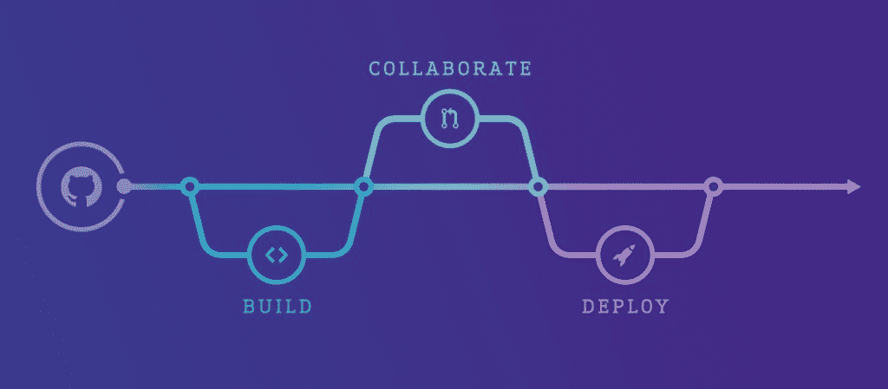

# Github 集成目录和 CircleCI 移动支持- CircleCI

> 原文：<https://circleci.com/blog/github-integrations-directory-and-circleci-mobile-support/>

**来自出版商的说明:**您已经找到了我们的一些旧内容，这些内容可能已经过时和/或不正确。尝试在[我们的文档](https://circleci.com/docs/)或[博客](https://circleci.com/blog/)中搜索最新信息。

* * *

在移动 CI 和 CD 领域，这是非常忙碌的一周。随着 [GH 集成目录](https://github.com/integrations)的发布，对移动支持(包括 iOS 和 Android)的需求越来越大。以下是我们为满足 iOS 构建需求所做的工作。

## 我们在腾出空间

我们总是乐于欢迎新客户，我们工作的一部分是规划额外的容量，这种容量时好时坏。对于我们的 AWS 部署来说，为 Linux 添加额外的容量是非常简单的——只需敲击几下键盘(再用信用卡支付几次)。然而，增加 iOS 的容量需要更多的时间。这是因为我们的 iOS 构建运行在物理 Apple 硬件上，我们需要在数据中心购买、供应和安装这些硬件。我们已经在安装更多的苹果硬件，以支持更多的 iOS 版本，我们预计下周初将有足够的在线容量来支持我们第一次见到的大多数用户。

## 如何获得访问权限

由于我们根据具体情况启用 OS X 支持，请通过[CircleCI.com](https://circleci.com/)上的聊天窗口联系我们，告知您希望运行构建的 GitHub 组织或帐户的名称，以及您每天将运行的构建的大致数量和您的 iOS 开发团队所在的时区。一旦我们有了这些信息，我们会尽最大努力尽快给你 iOS 版本。

## 等待是值得的

我们对待 iOS 构建的热情与对待 Linux 构建的热情是一样的——每个构建容器都是在构建开始之前创建的，并在所有命令完成后立即销毁，以确保构建的最大安全性和可靠性。在 iOS 容器中，我们预装了 Xcode 版本 6.3.1、6.4 和 7.0，我们还捆绑了 Homebrew 和`cocoapods`等工具，以确保您拥有项目的所有依赖项，并在构建中正确配置。一旦您的组织启用了 iOS 测试版，您的构建将在几分钟内启动并运行。您可能在 Linux 版本中见过的其他特性，如加密的环境变量、部署和工件存储，也可用于 iOS 版本。

我们 Circle 对您的到来感到非常兴奋，我们期待为您提供优质服务！

如果您对这个或任何其他主题有任何疑问，请随时联系 sayhi@circleci.com。

(已经清除了 iOS 或 Android？这里有一些帮助你开始的文件。从 Ship.io 移动？我们已经整理了一份[迁移文档](https://circleci.com/docs/1.0/shipio-to-circleci-migration/)来提供帮助)