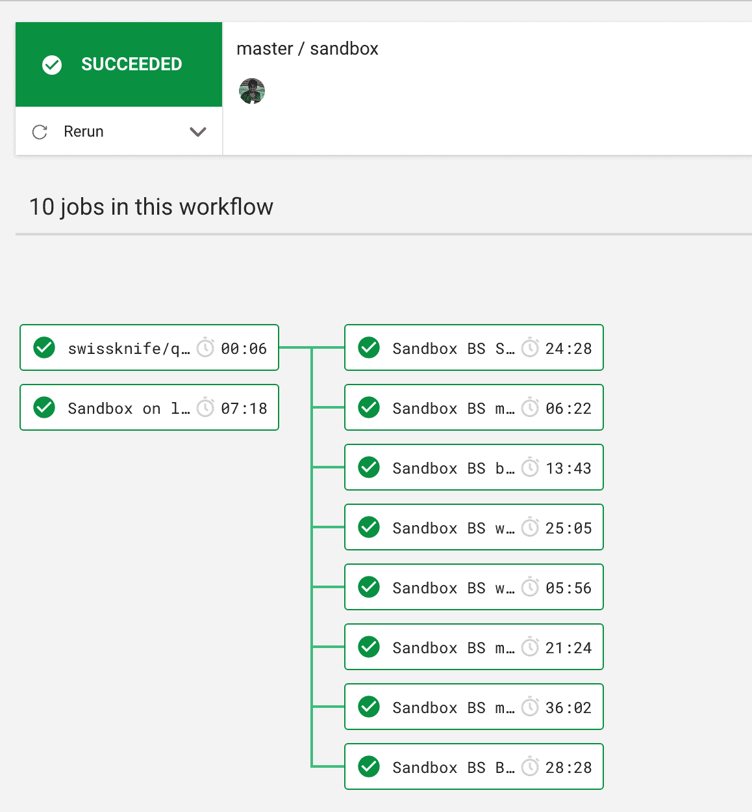

# 并行测试-测试分割-优化的 CI/CD | CircleCI

> 原文：<https://circleci.com/blog/how-bolt-optimized-their-ci-pipeline-to-reduce-their-test-run-time-by-over-3x/>

今天版本的 XKCD 的“[我的代码正在编译](https://xkcd.com/303/)”漫画是“我的测试正在运行”。工程师是一种昂贵的资源，如果他们不得不等待很长时间来运行他们的测试，就像他们不得不等待很长时间来编译他们的代码一样，这也是一种资源浪费。在 [Bolt](https://bolt.com) ，我们使用 CircleCI 作为我们的[持续集成](https://circleci.com/continuous-integration/) (CI)工具，我们一直在努力使我们的测试套件更快、更容易使用、更有用。这篇文章解释了我们如何减少 CI &集成测试管道所需的时间和配置复杂性，并强调了我们在这个过程中学到的东西。

## 我们如何在博尔特测试

我们在 Bolt 使用两种类型的测试工作流程。第一个是针对每个 PR 和每个 master 提交运行的单元测试。第二个是集成测试，在每次部署后针对我们的每个环境运行。前者很少是不可靠的:如果他们失败了，很可能需要调查。后者是浏览器自动化测试，本质上是不可靠的。让我们面对现实吧，在进行浏览器自动化测试时，我们总是在玩打地鼠游戏。即使您设法稳定了现有的测试，您的新测试也必定会引入更多的混乱。在 Bolt，我们对两种类型的测试都采用了不同的优化策略，以使两种测试都更有用。

## CI 测试改进:测试时间减少 3 倍

由于 CI 测试针对每个 PR 运行，我们希望能够让开发人员尽快知道哪个(如果有的话)测试失败了。我们评估了我们的 CI 工作流，发现我们的构建管道后端大约需要 15 分钟，前端大约需要 20 分钟。我们知道我们可以做得更好。

### 基于运行时的并行测试

我们注意到的第一件事是，我们已经基于服务对 Golang 包的测试进行了逻辑分片。这意味着一些较小的服务在 2 分钟内完成测试，而较大的服务需要将近 16 分钟。在 CircleCI 的[并行](https://circleci.com/docs/parallelism-faster-jobs/)和[基于时间的分割](https://circleci.com/docs/parallelism-faster-jobs/#splitting-by-timings-data)的帮助下，我们能够平衡碎片，使其花费大致相同的时间。[circle ci 命令的这个片段](https://gist.github.com/roopakv/cf217e3f4585cd82733ab0ef63bb01d3)展示了我们如何拆分我们所有的 Go 包:

```
commands:  
  make-check:
    description: Runs tests
    steps:
      - restore_cache:
          keys:
            - go-mod-1-13-v1-{{ checksum "go.mod" }}-{{ checksum "go.sum" }}
            - go-mod-1-13-v1-{{ checksum "go.mod" }}
            - go-mod-1-13-v1-
      - run:
          name: Go tests for hail
          shell: /bin/bash
          command: |
            set -e
            cd /home/circleci/project/
            # Improve sharding: https://github.com/golang/go/issues/33527
            PACKAGES="$(go list ./... | circleci tests split --split-by=timings --timings-type=classname)"
            export PACKAGE_NAMES=$(echo $PACKAGES | tr -d '\n')
            export BUILD_NUM=$CIRCLE_BUILD_NUM
            export SHA1=$CIRCLE_SHA1
            echo "Testing the following packages:"
            echo $PACKAGE_NAMES
            gotestsum --junitfile $ARTIFACTS_DIR/report.xml -- -covermode=count -coverprofile=$ARTIFACTS_DIR/coverage_tmp.out -p 1 $PACKAGE_NAMES
      - save_cache:
          key: go-mod-1-13-v1-{{ checksum "go.mod" }}-{{ checksum "go.sum" }}
          paths:
            - "/go/pkg/mod" 
```

让我们回顾一下我们所做的。

首先，我们恢复了 Go 模块缓存。如果没有缓存，则什么都不做。这使我们可以避免每次运行时都必须下载 Go 模块。缓存是由 go.mod 和 go.sum 文件哈希决定的。

run 步骤列出了所有的包，按时间分割它们，并使用 gotestsum 来运行测试。Gotestsum 可以生成 junit 报告，这使得查看哪些测试失败变得很容易。

最后，如果 go.mod 和 go.sum 文件发生了更改，我们将保存缓存。如果该缓存键已经保存，则该步骤不做任何事情。

仅此一项就将我们的工作流程时间从 15 分钟缩短到了 5 分钟。这里的主要好处是，随着测试数量的增加，我们可以简单地增加我们的并行计数。

我们本可以就此打住，但我们认为我们应该尝试看看我们还能做些什么。

原来，我们安装一些所需工具的一个设置步骤花了大约一分钟。我们构建了一个安装了所有工具的新映像，这将构建时间缩短了 30 到 45 秒。这里要注意的是，CircleCI 会更快地提取常用图像，因为它们使用得更频繁，因此会被缓存，所以在您决定制作自定义图像之前，请确保您测量了节省的时间。

## 集成测试改进:节省时间和降低代码复杂性

集成测试是另一种完全不同的东西。我们运行两种类型的浏览器自动化测试:使用 Chrome 等无头浏览器的本地浏览器测试，以及使用 Browserstack 或 Saucelabs 等服务的远程浏览器测试。虽然本地测试只受我们的 CircleCI 计划限制，但远程浏览器测试可能会变得昂贵，因为您需要为并行性付费。我们使用 CircleCI 来支持我们的远程浏览器自动化测试，Browserstack 托管远程浏览器。

### 优化重新运行时拆分测试

我们针对三种环境运行集成测试:试运行、沙盒和生产。我们在沙盒上运行的测试最多，在试运行上运行的较少，在生产上只运行一小部分。我们需要能够通过 API 触发我们的集成测试，由于 API 的 v1 不允许这样做，我们构建了一个非常复杂的系统来实现我们所需要的。然而，有了[新的 v2 API](https://circleci.com/blog/introducing-circleci-api-v2/) ，我们已经能够以更合理的方式重新组织我们的工作流，这种方式更容易理解、更快、更容易使用。

以前，我们有一项工作是在三种浏览器变体上运行数百次远程测试。这意味着即使一个测试失败，我们也必须重新运行整个套件，这需要一个多小时。我们将其分解为八个作业，现在我们只能重新运行失败的作业。我们的新工作流程非常简单，如下所示。



### 添加新测试时的工作流

一种类型的集成测试工作流是针对集成测试报告的每个拉请求运行的。这确保了我们添加或修改的任何测试都是有效的。这些只运行本地无头浏览器测试，并且这个工作流尽可能保持轻量级。

### 提升构建的工作流

这些集成测试在 master 上针对我们的一个环境运行:staging、sandbox 或 prod。这些需要更加严格，这就是我们在 Browserstack 上使用多个浏览器的地方。此外，由于并行化的级别受到 Browserstack 的限制，Browserstack 会使并行测试失败，而不是对它们进行排队，因此我们通过对使用 browser stack 的工作流进行排队，在 CircleCI 上形成了一个假队列。

这个[片段](https://gist.github.com/roopakv/0a1f73eedd5cd59a628ea545842c7920)展示了我们如何对远程浏览器堆栈测试进行排队，但不阻止在 circleCI 中运行的无头 Chrome 测试:

```
version: 2.1

orbs:
  swissknife: roopakv/swissknife@0.8.0

# These parameters are used to run various workflows via the API and
# are not used directly for every PR. by setting the below params
# we can for example run only staging integration tests.
parameters:
  run_base_tests:
    type: boolean
    default: true
  run_cdstaging_integration_tests:
    type: boolean
    default: false
  run_staging_integration_tests:
    type: boolean
    default: false
  run_sandbox_integration_tests:
    type: boolean
    default: false
  run_production_integration_tests:
    type: boolean
    default: false

workflows:
  # This workflow is run on master changes merged to this repo
  build:
    when: << pipeline.parameters.run_base_tests >>
    jobs:
      - test-on-chrome:
          name: Staging on local chrome
          context: integration-tests-staging-context
      - test-on-chrome:
          name: Sandbox on local chrome
          context: integration-tests-sandbox-context
      - test-api:
          name: Staging API
          context: integration-tests-staging-context

  staging-local-chrome:
    when: << pipeline.parameters.run_cdstaging_integration_tests >>
    jobs:
      - test-on-chrome:
          name: Staging on local chrome
          context: integration-tests-staging-context

  # This workflow is triggered via the API to run tests against the
  # staging environment on browserstack and local chrome.
  staging:
    when: << pipeline.parameters.run_staging_integration_tests >>
    jobs:
      - swissknife/queue_up_workflow:
          max-wait-time: "1800"
          workflow-name: "^(staging|production|sandbox)$"
      - test-on-chrome:
          name: Staging on local chrome
          context: integration-tests-staging-context
      - bs-base:
          name: Staging BS base tests
          context: integration-tests-staging-context
          requires:
            - swissknife/queue_up_workflow
      - bs-shopify:
          name: Staging BS shopify tests
          context: integration-tests-staging-context
          requires:
            - swissknife/queue_up_workflow
      - bs-bigcommerce:
          name: Staging BS bigcommerce tests
          context: integration-tests-staging-context
          requires:
            - swissknife/queue_up_workflow
      - test-api:
          name: Staging API
          context: integration-tests-staging-context

  # This workflow is triggered via the API to run tests against the
  # sandbox environment on browserstack and local chrome.
  sandbox:
    when: << pipeline.parameters.run_sandbox_integration_tests >>
    jobs:
      - swissknife/queue_up_workflow:
          max-wait-time: "1800"
          workflow-name: "^(staging|production|sandbox)$"
      - test-on-chrome:
          name: Sandbox on local chrome
          context: integration-tests-sandbox-context
      - bs-base:
          name: Sandbox BS Base tests
          context: integration-tests-sandbox-context
          requires:
            - swissknife/queue_up_workflow
      - bs-shopify:
          name: Sandbox BS Shopify tests
          context: integration-tests-sandbox-context
          requires:
            - swissknife/queue_up_workflow
      - bs-bigcommerce:
          name: Sandbox BS bigcommerce tests
          context: integration-tests-sandbox-context
          requires:
            - swissknife/queue_up_workflow
      - bs-woocommerce:
          name: Sandbox BS woocommerce tests
          context: integration-tests-sandbox-context
          requires:
            - swissknife/queue_up_workflow
      - bs-miva:
          name: Sandbox BS miva tests
          context: integration-tests-sandbox-context
          requires:
            - swissknife/queue_up_workflow
      - bs-magento1:
          name: Sandbox BS magento1 tests
          context: integration-tests-sandbox-context
          requires:
            - swissknife/queue_up_workflow
      - bs-magento2:
          name: Sandbox BS magento2 tests
          context: integration-tests-sandbox-context
          requires:
            - swissknife/queue_up_workflow

  # This workflow is triggered via the API to run tests against the
  # production environment on browserstack and local chrome.
  production:
    when: << pipeline.parameters.run_production_integration_tests >>
    jobs:
      - swissknife/queue_up_workflow:
          max-wait-time: "1800"
          workflow-name: "^(staging|production|sandbox)$"
      - test-on-chrome:
          name: Prod on local chrome
          context: integration-tests-production-context
      - bs-base:
          name: Prod BS Base tests
          context: integration-tests-production-context
          requires:
            - swissknife/queue_up_workflow 
```

请注意，我们在暂存和沙盒环境中有相同的作业。测试是相同的，所改变的只是我们测试的环境，所以我们将测试配置移动到上下文中，并根据被测试的环境附加一个上下文。

我们使用 Jenkins(出于合规性原因)来管理我们的部署和触发集成测试。现在，我们很容易在 Jenkins 上触发集成测试并等待它们。[这个](https://gist.github.com/roopakv/25a8a3ba98a155321b008eb68317ae8a)是我们如何使用新的 v2 API 实现这一点的示例:

```
#!/bin/bash -x

# Exit immediately if a command exits with a non-zero status.
set -e

if [ "$1" == "" ]; then
  echo "Usage: $0 env"
  exit 1
fi

ENV=$1
SLUG=$2

PIPELINE_ID=""
WORKFLOW_ID=""
WORKFLOW_STATUS="running"

start_integration_test () {
  CREATE_PIPELINE_OUTPUT=$(curl --silent -X POST \
  "https://circleci.com/api/v2/project/${SLUG}/pipeline?circle-token=${CIRCLE_TOKEN}" \
  -H 'Accept: */*' \
  -H 'Content-Type: application/json' \
  -d '{
    "branch": "master",
    "parameters": {
      "run_'${ENV}'_integration_tests": true,
      "run_base_tests": false
    }
  }')
  PIPELINE_ID=$(echo $CREATE_PIPELINE_OUTPUT | jq -r .id)
  echo "The created pipeline is ${PIPELINE_ID}"
  # Sleep till circle starts a workflow from this pipeline
  # TODO(roopakv): Change this to a curl loop instead of a sleep
  sleep 20
}

get_workflow_from_pipeline () {
  GET_PIPELINE_OUTPUT=$(curl --silent -X GET \
  "https://circleci.com/api/v2/pipeline/${PIPELINE_ID}?circle-token=${CIRCLE_TOKEN}" \
  -H 'Accept: */*' \
  -H 'Content-Type: application/json')
  WORKFLOW_ID=$(echo $GET_PIPELINE_OUTPUT | jq -r .items[0].id)
  echo "The created worlkflow is ${WORKFLOW_ID}"
  echo "Link to workflow is"
  echo "https://circleci.com/workflow-run/${WORKFLOW_ID}"
}

running_statuses=("running" "failing")
wait_for_workflow () {
  while [[ " ${running_statuses[@]} " =~ " ${WORKFLOW_STATUS} " ]]
  do
    echo "Sleeping, will check status in 30s"
    sleep 30
    WORFLOW_GET_OUTPUT=$(curl --silent -X GET \
    "https://circleci.com/api/v2/workflow/${WORKFLOW_ID}?circle-token=${CIRCLE_TOKEN}" \
    -H 'Accept: */*' \
    -H 'Content-Type: application/json')
    WORKFLOW_STATUS=$(echo $WORFLOW_GET_OUTPUT | jq -r .status)
    echo "The workflow currently has status - ${WORKFLOW_STATUS}."
  done

  if [ "$WORKFLOW_STATUS" == "success" ]; then
    echo "Workflow was successful!"
    exit 0
  else
    echo "Workflow did not succeed. Status was ${WORKFLOW_STATUS}"
    exit 1
  fi
}

# remove noise so set +x
set +x

start_integration_test
get_workflow_from_pipeline
wait_for_workflow 
```

从单一工作转移到这种工作流控制的方法给我们带来了以下好处:

*   能够只重新运行部分测试，而不是全部测试
*   缩短时间
*   我们现在在 CircleCI 上下文中使用 config，而不是使用复杂的代码来处理多种环境。

## 结论

总之，当我们着手减少测试运行时间并使测试更容易工作时，我们意识到我们必须对不同类型的测试使用不同的方法。我们按照运行时间分割单元测试，并且将任何可能的重复工作转移到一个预构建的容器中。至于集成测试，我们优化了有限并行的远程浏览器。我们构建了一种机制，通过简单的配置更改跨环境运行相同的测试。因此，我们还降低了管道的复杂性，这使得新工程师更容易理解我们的测试基础设施。

* * *

Roopak Venkatakrishnan 目前正在为 Bolt、Google 和 Twitter 构建系统。除了解决复杂的问题，他对开发基础设施&工具有着强烈的爱好。当他不工作的时候，他喜欢喝一杯咖啡，徒步旅行，发一些随意的微博。

[阅读 Roopak Venkatakrishnan 的更多帖子](/blog/author/roopak-venkatakrishnan/)