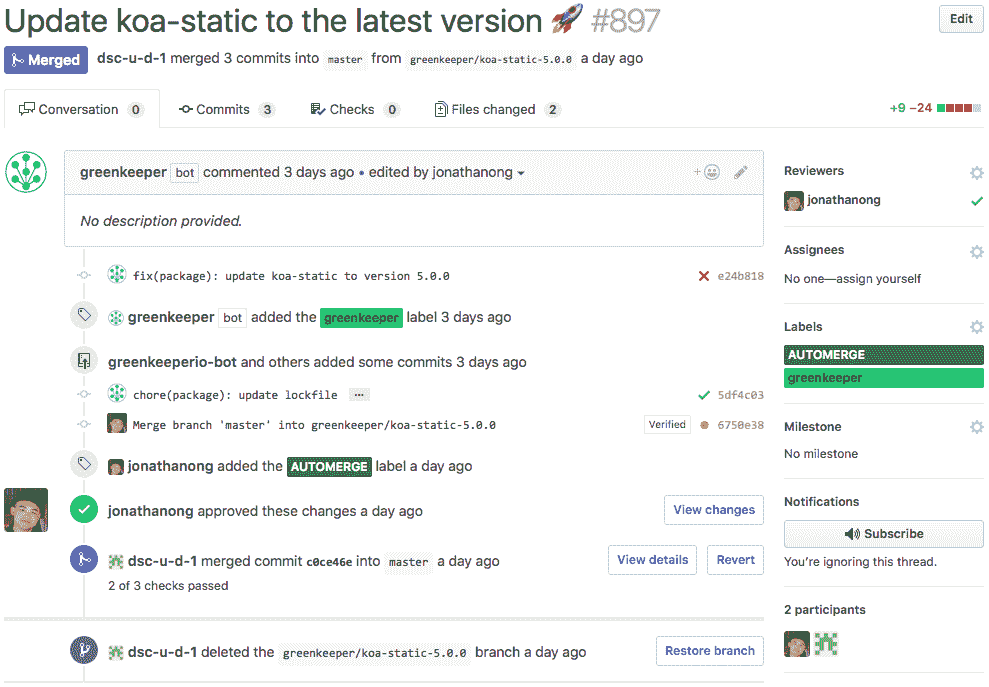
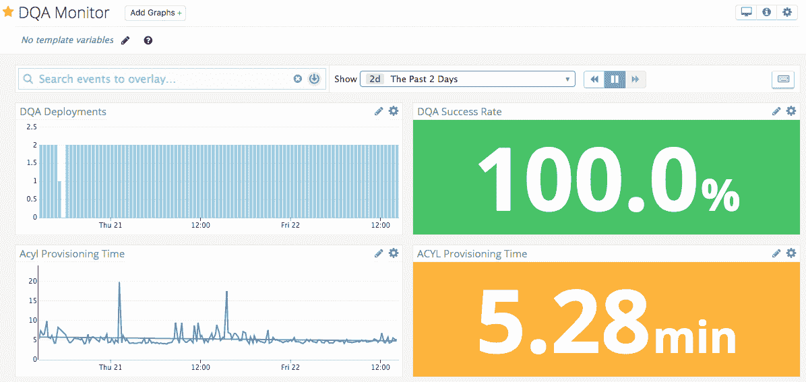

# 美元剃须刀俱乐部持续集成(CI)| CircleCI

> 原文：<https://circleci.com/blog/how-dollar-shave-club-3x-d-velocity-and-learned-love-tests/>

当 [Dollar Shave Club](https://www.dollarshaveclub.com/) 开始使用 CircleCI 时，他们发现它不仅改善了他们的 [CI/CD 渠道](https://circleci.com/blog/what-is-a-ci-cd-pipeline/)，还改善了他们的生产监控和发布管理操作，同时使他们的开发人员的生活更加轻松。他们来找我们，希望分享他们向 CI 过渡的故事，以及使用 CircleCI 如何帮助他们改善开发人员体验，同时提高他们的软件质量和交付速度。请继续阅读他们的故事。

## 过渡到 CI/CD

*由 Dollar Shave Club 工程经理 Jon Ong 和后端工程师 Yuki Falcon*

2017 年，我们从手动测试每个代码变更切换到测试自动化的 CI/CD。这一变化为我们打开了一些新的可能性，极大地改善了我们的工作流程。以下是我们因这一转变而开辟的一些最大的途径:

我们可以使用功能标志和/或 A/B 测试来暗启动新功能。分离部署和特性发布带来了一些巨大的好处。我们能够在生产中进行用户验收测试。由于在开发过程的早期获得了利益相关者的输入，反馈循环得到了加速和改进。此外，我们能够更快、更频繁地投入生产，这有其自身的好处，如更高的工程速度、更好的代码审查和更容易的回归原因跟踪。

每个部署不再需要 QA 签准。工程师现在主要负责他们之间的代码质量。这增加了我们 QA 部门的整体带宽，允许他们将注意力从手工回归测试转移到整体测试。他们还能够在我们产品设计周期的早期提供用户/功能反馈。

我们的前端团队现在可以直接投入生产。绕过我们的共享试运行环境迫使我们增加对 CI 测试和我们的[动态试运行环境(DQAs)](https://engineering.dollarshaveclub.com/qa-environments-on-demand-with-kubernetes-5a571b4e273c) 的依赖。dqa 是由我们自己的基础设施&平台服务工程经理 Benjamin Keroack 创建的，是生产环境的复制品，整合了拉式请求变更。

我们使用[珀西](https://percy.io/)进行可视化回归测试，使用 [Codecov](https://codecov.io/) 进行代码覆盖分析，使用[滚动条](https://rollbar.com/)进行错误监控。

## 改进我们的 CI 测试

对 CI 测试越来越多的依赖迫使我们修改我们的测试策略。到目前为止，我们的测试前景是暗淡的。我们的单元测试在 CircleCI 1.0 上运行，端到端(e2e)测试在 Jenkins 上运行。然而，CircleCI 1.0 上的单元测试并不理想，因为它的并行性策略和我们测试的片面性。詹金斯逐渐无法应付这种规模。事实上，我们使用的许多测试套件并不好，主要是由于我们编写测试的方式。Ruby Selenium 中糟糕的测试模式导致了不一致的结果。Ember 验收测试是粗制滥造的，因为腐烂的代码，没有按照测试套件的意图编写的测试，以及不可靠的测试框架。

为了解决这些令人头疼的问题，我们实施了一些解决方案。首先，我们重写了我们的 e2e 测试运行器，以支持[并行性](https://circleci.com/blog/config-best-practices-concurrency-parallelism/)和测试的自动重试。在 Sauce Labs 上进行的重试为我们提供了网络请求的记录。其次，我们迁移到 CircleCI 2.0 工作流，这允许我们将测试分成几个不同的任务，从而简化重试并增加并行性。

结果比我们希望的要好。CircleCI 2.0 的工作速度是 CircleCI 1.0 的两倍。我们的 e2e 测试从 30-40 分钟缩短到大约 15 分钟。工程师们注意到了 UX 的改进，对测试失败的抱怨也少了。前端工程师编写了他们自己的自动化测试，提高了测试的可靠性、速度和可调试性。

CircleCI 2.0 允许我们只重新运行失败的测试，而不是重新运行整个测试套件。

## 提高开发者 UX

我们通过自动触发 CI/CD 进一步改进了开发者 UX。

### 自动更新依赖关系

我们使用 Greenkeeper 在依赖关系发布新版本时自动生成 PRs，并在更新时更新我们的锁定文件。通过自动合并，当所有要求的检查(林挺、测试、监控)通过时，请购单会自动合并。工程师现在可以通过批准这些 Greenkeeper PRs 并将其标记为“自动合并”来固定依赖关系并使其保持最新。我们还可以很容易地找出哪些依赖关系破坏了我们的应用程序。

### 监控我们的拉动式请求 CI/CD 渠道

每 15 分钟创建一次无代码变更 PRs，以跟踪我们的 CI/CD 管道的运行情况。这些信息会发送到 DataDog，在我们的 CI/CD 渠道出现问题时提醒我们。

## 结论

切换到 CircleCI 2.0 并让工程师编写他们自己的测试是一个有利的决定。我们现在有了更快、更可靠的 CI/CD 渠道。我们的工程师只担心 Git 工作流(创建 PRs，获得批准，通过 GitHub 检查，按下 merge)和特性实现。工程师们现在需要掌握几十个小提交，而不是每天几个，从而提高了速度和查明回归的能力。编码快乐！