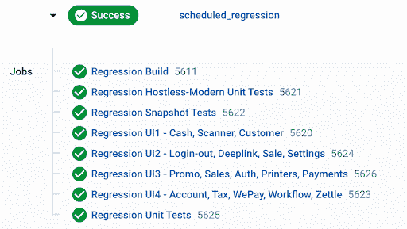

# Lightspeed 优化的 iOS 测试如何与并行和缓存一起运行| CircleCI

> 原文：<https://circleci.com/blog/how-lightspeed-optimized-ios-testing/>

在 Lightspeed，我们维护多个大型 iOS 项目及其模块化的依赖关系。去年的[收购](https://en.wikipedia.org/wiki/Lightspeed_(company))汇集了我们公司许多不同的 CI/CD 方法。我最近领导了将这些项目和实践结合起来的计划。

在这篇文章中，我将解释我们持续集成管道的目标以及我们用来实现这些目标的实现。

## 我们需要 CI 提供什么

### 速度

该团队从一开始就明确表示，总运行时间对他们来说是一笔巨大的交易。快速反馈使他们能够专注于同一项任务。

### 可靠性

现有的解决方案主要是运行 Jenkins 的内部机器。这有快速构建的好处，但是对它们的维护是开发人员的负担。他们经常需要重新启动，而在疫情的全球分布的团队中，这对生产效率来说并不好。也很难保持干净的环境和统一的设置。

### 灵活性

在我们研究其他解决方案时，使用的灵活性成了一个问题。我们的每个项目都有许多依赖项，例如跨平台 Appium 测试或需要自制的工具。

### 标准化

这符合灵活性，但是在每个项目中有一个 CI 标准是有益的，因为知识可以在团队和开发人员之间共享。CircleCI 已经被其他团队和项目独立采用，这帮助我们更有信心选择它作为我们需要的解决方案。

使用 CircleCI 可以满足大部分要求。Circle 的正常运行时间超过 99%,由于其他团队已经在使用它，标准化速度更快。我们的管道中唯一需要工作的方面是执行速度。当我们第一次完成 CircleCI 配置文件的最基本迭代时，我们的运行时间超过了一个小时(1.5 小时)。相对于我们的自托管机器，这是一个巨大的增长，自托管机器的运行时间不到一半(30 分钟)。

## 我们为提高运行时间所做的三大改变

### 平行

并行性是改善任何 CI 工作流程的重要组成部分。[将测试分割成并发流](https://circleci.com/blog/a-guide-to-test-splitting/)意味着运行时间减少到运行时间最长的任务的长度。此外，使用 CircleCI 作业进行拆分使我们能够重新运行单个作业，大大减少了重新运行时间。

测试 iOS 应用程序比测试 web 应用程序更复杂，因为我们需要传递构建好的二进制文件，以便测试有所依据。为此，我们在`config.yml`中创建了两个工作。

**建造**

*   检查代码
*   恢复缓存
*   捆绑安装
*   安装 Cocoapods
*   从 Brewfile 安装
*   安装基于 SPM 的工具
*   解决 Swift 包裹依赖性
*   构建派生数据
*   保存新缓存
*   保留到工作区

**运行**

*   附加到工作区
*   捆绑安装
*   跑浪子巷
*   准备存储测试结果
*   存储测试结果
*   存储工件

CircleCI 中 iOS 并行的关键是`persist_to_workspace`，它将保存您定义的路径，以便其他作业可以访问它们。由于每个作业都是一个干净的实例，这就是我们在它们之间维护状态的方式。

持久化整个项目，包括来自构建的派生数据，对于我们的主项目来说将近 8Gb。这本身就需要 10 分钟来上传和再次下载。通过只保存所需的文件和文件夹，我们看到了更好的性能:

```
- persist_to_workspace:
    root: /Users/distiller # Default path for a Circle job
    paths:
      - project/DerivedData/Build/Products # This is the built app that can then be ran against for testing
      - project/fastlane # So we can run Fastlane on the parallel jobs
      - project/Gemfile # So we can run Fastlane on the parallel jobs
      - project/Gemfile.lock # So we can run Fastlane on the parallel jobs
      - project/SnapshotTests # Contains the source snapshot images
      - 'project/UnitTests/ViewControllerTests/__Snapshots__' # Contains the source snapshot images
      - project/commit_author # Used for the Slack message integration in Fastlane
      - .gem # So we can run Fastlane on the parallel jobs 
```

我们维护一个共享的浪子车道库，在每个项目中使用。在 CI 服务和我们的底层业务逻辑之间有一个[中介者](https://en.wikipedia.org/wiki/Mediator_pattern),使得未来的改变更加容易。xcodebuild 和浪子都有能力构建测试，并在不构建的情况下再次运行它们。

运行作业可以简单地检索所有这些存储的状态，方法是:

```
- attach_workspace: # Gives this job access to the results stored by the build job, so that many parallel jobs can be used from the result
    at: /Users/distiller 
```

我们将测试分成[个测试计划](https://www.raywenderlich.com/10212963-xcode-test-plans-for-ios-getting-started)。我们进行了快照、单元和 UI 测试。UI 测试是迄今为止最慢的，我们有多项工作来分解它们。

目标是让每个测试有大致相同的执行时间。将它们收集在一个相似的用例下，并提供一个描述性的名称，可以帮助开发人员快速理解失败的原因。

### 回归测试

在合并之前测试拉请求(PR)的目的是确保现有代码不会受到某种程度的影响。这不需要运行每一个测试；通常，只要定期运行完整集，就可以使用子集来验证更改。

通过使用更多的测试计划，我们分离出回归和 PR 测试。回归测试在 PRs 上有一个可选的保持步骤，以便在需要时可以运行。然后，基于每个团队的时区，在整个工作周安排回归。

```
scheduled_regression:
  triggers:
    - schedule:
        cron: "0 05,18,23 * * 1-5" # 18:00 NZDT, 18:00 GMT, 18:00 EST, Monday - Friday (Circle uses UTC)
        filters:
          branches:
            only:
              - develop 
```

调整回归和 PR 测试的内容可以给你更快的 PR 运行时间，同时仍然保持良好的覆盖率。如果开发人员觉得他们的特性需要的话，他们也可以轻松地运行所有的测试。



### 贮藏

在该项目中，通过 Swift Package Manager (SPM)为每个版本下载 8GB 数据。这大大增加了构建的时间，所以我们利用[缓存](https://circleci.com/blog/config-best-practices-dependency-caching/)来加速它。

在构建步骤中，我们恢复一个现有的缓存，解析包，并为下一个作业保存缓存。解析是必需的步骤，因为它告诉 Xcode 基于新的本地包刷新 SPM。

**恢复:**

```
- restore_cache: # To speed up builds we cache the SPM packages and use the resolved file as a hash
    key: spm-cache-v4-{{ checksum "Project.xcworkspace/xcshareddata/swiftpm/Package.resolved" }} 
```

**解决:**

```
lane :resolve_cached_spm_dependencies do |options|
  if options[:xcode_scheme].nil? || options[:derived_data_path].nil?
    UI.user_error!("Resolving dependencies was invoked, but an `xcode_scheme` or `derived_data_path` were not provided.")
  end

  if options[:workspace_name].nil? == false
    # Resolve dependencies and point to cache directory
    sh("xcodebuild -resolvePackageDependencies -workspace ../#{options[:workspace_name]}.xcworkspace -scheme #{options[:xcode_scheme]} -clonedSourcePackagesDirPath #{options[:derived_data_path]}/SourcePackages")
  elsif options[:project_name].nil? == false
    sh("xcodebuild -resolvePackageDependencies -project ../#{options[:project_name]}.xcodeproj -scheme #{options[:xcode_scheme]} -clonedSourcePackagesDirPath #{options[:derived_data_path]}/SourcePackages")
  else
    UI.user_error!("Resolving dependencies was invoked, but a `workspace_name` or `project_name` were not provided.")
  end
end 
```

**保存:**

```
- save_cache:
    paths:
      - ./DerivedData/SourcePackages
    key: spm-cache-v4-{{ checksum "Project.xcworkspace/xcshareddata/swiftpm/Package.resolved" }} 
```

我们注意到使用缓存在构建时间上有显著的改进。只有当解析文件的内容改变时，例如当更新或添加包时，才需要更新。

## 结论

通过对 CircleCI 配置的这些更改，我们看到了测试运行时间的显著减少。总的来说，PR 测试的运行时间从 1.5 小时减少到 30 分钟。

我们的管道还可以更快。但是当我们结合以下优势时:

*   减少片状剥落
*   零硬件维护和停机时间
*   对安全性没有要求，如 VPN 等。
*   无需现场重启硬件

我们发现这是一个可以接受的解决方案，并将继续努力实现未来更快、更智能的 CI。

* * *

Jonathan 是 Lightspeed 的一名 iOS 开发人员，从事移动开发已经九年了。他对干净、直观的过程感兴趣，并通过代码使生活变得更容易。他总是忙于一个兼职项目，并和家人住在世界科技之都北爱尔兰的海边。