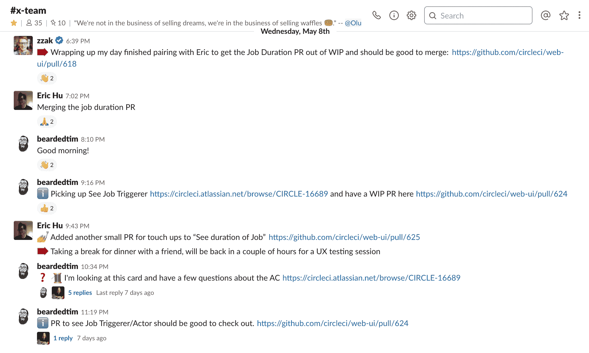

# 我的分布式团队如何交流，这样就不会留下任何上下文

> 原文：<https://circleci.com/blog/how-my-distributed-team-communicates-so-no-context-is-left-behind/>

我在 CircleCI 的团队由七名工程师、一名产品经理、一名设计师和一名工程经理组成，我们分布在世界各地:从美国西海岸到东海岸，然后到塞尔维亚、泰国，最后到日本。通常，我们的总部设在旧金山、钱德勒、坦佩、博尔德、诺克斯维尔、诺维萨德、曼谷、藤泽和秋田。两周前，我们在圣地亚哥的一次面对面团队活动中相遇，我们问自己一个问题:如果我们可以选择，我们会选择成为一个分布在遥远时区的远程团队，还是宁愿至少在一起更近？

答案是:我们不想改变任何事情。必须默认适合跨时区协作的异步通信，这意味着团队中的每个人都有同等的自由和灵活性，可以随时随地工作。我们重视这种自由和灵活性，它们对我们福祉的影响正在使我们成为一个更强大、更有弹性的团队。

我们今年 1 月才开始组建团队。考虑到我们的分布情况，我们从一开始就非常有意识地考虑如何作为一个团队取得成功，在这个过程中我们学到了很多东西。

## 远程/异步-提示和技巧

这里有一个经过整理的实践列表，这些实践是我们长期以来发展起来的，可以帮助我们作为一个团队跨越时区一起工作。他们中的许多人深受我们从以前的团队中学到的战术的启发，有些是我们根据团队成员的偏好共同开发的。

### 过度沟通

当我们的团队最初形成时，我们明确同意的意图之一是**过度沟通**，并且它被证明是极其有用的。一开始，我们是一个分布广泛的团队，大部分成员从未见过面，我们希望过度沟通至少能帮助我们避免沟通不足，并且最多能找出我们需要的沟通水平。

实际上，在日常情况下犹豫不决时，过度沟通会有所帮助，比如:

*   我将要通过直接信息发送给我的团队成员的内容与他们相关吗？我应该写一条消息吗？是的，**过度沟通**！
*   我发信息的时机对吗？现在是我同事时区的周日晚上！别担心，**过度沟通**！他们将决定如何以及何时做出反应(“请勿打扰”和“静音”模式是我们的朋友)。
*   我的同事可能已经知道我要给他们写什么，我应该停下来吗？不，**过度沟通**！安全总比后悔好。
*   我需要离开键盘去给宝宝换尿布，我的团队关心吗？是的，如果可以的话，**过度沟通**(省略细节也没关系)！
*   我在尿布里找到的东西看起来像 Pantone 3995 我应该让我的团队知道吗？嗯，也许不是那样。

### 配对/合作

从一开始，我们就担心会意外地开发出沿时区划分的“子团队”，并在寻找防止这种情况发生的方法。我们发现一种有用的方法是鼓励跨时区工作，即所谓的“乒乓”配对。

“乒乓”配对在原理上类似于传统的配对编程，但却是异步的。我们让各自的日程安排来决定节奏，而不是导航/评论其他人实时编写的代码，并经常切换驾驶员/导航员的角色。这仍然保留了通常的结对编程知识共享的好处，同时实际上允许两个以上的人参与这个过程。

为了便于“乒乓”操作，我们发现:

*   **将我们正在进行的工作限制为 3 张卡片**(团队中的工程师人数，减半，四舍五入)。这鼓励我们在开始任何新的事情之前寻找已经在进行中的票。
*   **尽快发布进行中的拉取请求(PRs)。**很自然地，除非有人正在积极地处理某项任务，否则任何人都应该能够通读 PR(和其他相关的沟通)并继续处理它。
*   **移交正在进行的工作**，要么在空闲时间异步移交，要么在人们的工作时间碰巧重叠时通过视频通话移交，尤其是在一天的边缘，一个人的一天即将结束，而另一个人的一天刚刚开始。

### 闲置使用

Slack 是我们日常团队沟通的重要工具，CircleCI 的许多其他团队也是如此。我们使用它来传达我们的可用性，在需要时请求帮助，协调临时视频通话等。我们有一个团队频道，它对整个公司开放——当其他团队的成员需要我们的帮助时，欢迎他们加入并参与进来。

为了帮助我们驾驭 Slack 中发生的所有不同对话，我们开发了一些有用的实践。我们:

*   使用表情符号来表示重要的信息。特别是当整个团队在 Slack 上过度沟通时，可能很难在一天开始时滚动 Slack 上的所有消息，更不用说度假回来了。为了缓解这种情况并使扫描我们的频道更容易，我们开始在某些消息前添加表情符号，如:
    *   :mega: or :speaker:用于公益广告
    *   :感叹号:对于重要警告
    *   :information_source:对于不太重要的信息
    *   :问题:对于…问题
    *   一个自定义的“指向右边的红色大箭头”:状态:休息或结束的表情符号

*   **表面在线程中做出的重要决策。**一些重要的决定是在松弛线程内部深处做出的(从:thread: emoji 开始)；这很容易被忽略，所以我们决定总是试着把重要的信息也发送到主频道。
*   **总结视频通话。**我们倾向于“挤在一起”,这意味着在进行“乒乓”配对时，我们会加入特别的视频通话，讨论手头的问题或放弃工作。这有时会让人们很难在 Slack 上跟踪这个问题，所以我们试图在电话结束后对电话中讨论和决定的内容写一个快速的总结(从一个可爱的习惯开始:拥抱:表情符号)。这有助于确保人们理解正在发生的事情，即使他们不能同步参与。

### 会议

由于我们跨越不同的时区，在正常的一周中，我们无法参加会议。但是我们一起享受同步时间，并把它用于更小的群体。以下是我们实现这一目标的几种方式:

*   **拥抱异步单口相声。**没有时间让我们所有人都打电话，但每日更新很重要。我们为此使用了 Slack messages(表情符号:站立:)，现在我们正在试验一个叫做 [Range](https://www.range.co/) 的工具。
*   **定义工作日。**可能很难知道“星期三”到底是什么意思，这取决于说话的人(来自哪个时区)。我们默认为“星期三”，意思是“北美星期三”，不管上下文。所以我会说“让我们在周四的回顾会上讨论这个问题”，尽管我在日本工作，对我来说已经是周五了。
*   回顾会的交替时间段。我们的回顾会每隔一周举行一次，既有对美国友好的时间，也有对 APAC 友好的时间，并确保每个人都有发言权，被听到，并能为改善我们的团队协作做出贡献。
*   **默认记录会议并做笔记。**对于计划和回顾，我们为无法参加的人提供录音(和回顾笔记)。
*   **如果有任何“缺失的链接”，安排同步会议**我们的工程师在北美和亚洲工作，而我们的设计师却在欧洲工作。每周，我们至少与他和任何其他可以参加的人进行一次同步通话，并为其他人创建录音和笔记。过度沟通。

这些是我们发现的对我们团队很有用的一些东西；你的可能完全不同！你如何让你的团队保持联系？我们很想听听这个问题:发推特给我们@circleci，告诉我们你的建议。