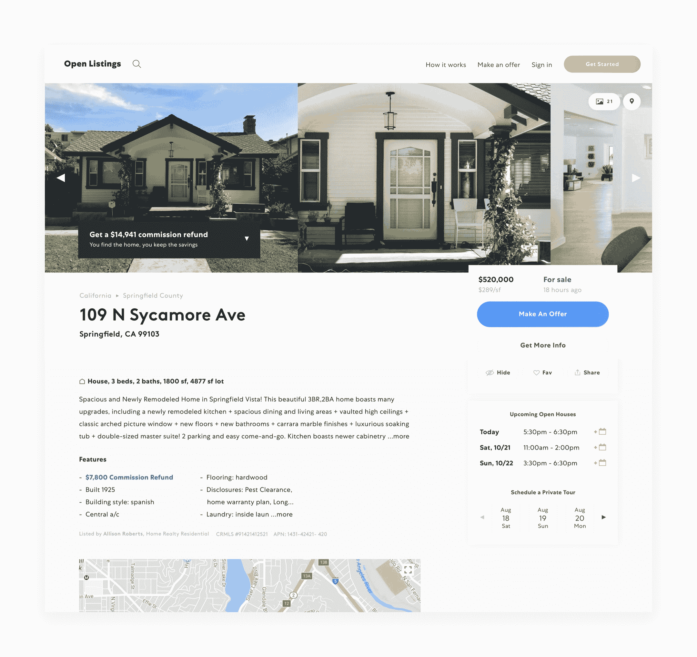

# Open Listings 如何使用 CircleCI 快速扩展并安全发货

> 原文：<https://circleci.com/blog/how-open-listings-uses-circleci-to-scale-rapidly-and-ship-safely/>

以下是开放上市团队的客座博文:增长总监凯文米勒(Kevin Miller)和首席技术官亚历克斯法里尔(Alex Farrill)。

### 一.切尔莱奇会议之前的挑战

在[开放上市](https://www.openlistings.com/feed)，我们是一个斗志昂扬、充满激情的团队，专注于一个雄心勃勃的使命:让买房变得简单而实惠。我们的产品相当复杂，因为它必须通过购房过程的每个不同步骤来满足购房者的不同需求。没有彻底的自动化测试，就没有实际的方法来支持所有这些用例。

幸运的是，我们从 commit one 就开始认真对待自动化测试。我们在 Ruby 中运行单元测试，测试我们的算法，比如向属性分派代理，以及应用程序如何与我们的 MongoDB 数据库交互；测试我们的 API 响应的 Ruby 功能测试；水豚、幻肢和硒的端到端集成测试；前端 javascript 测试用 Jest 测试我们的 React.js 代码。我们的测试在 Docker 容器中运行，该容器尽可能接近我们在 Amazon AWS 上的生产环境。虽然我们已经有了一个 [CI](https://circleci.com/continuous-integration/) 解决方案，但是随着我们增加更多的开发人员，我们遇到了快速扩展的问题。随着我们的工程团队在短短几个月内从 3 人增加到 8 人，拥有一个更加稳定并且可以随着我们的增长而扩展的 CI 解决方案成为一种迫切的需求。因此，我们的工程团队找到了新的解决方案，幸运的是找到了 CircleCI。

### 二。解决方案

我们最近的产品挑战是一个完整的网站改造、重新设计和品牌重塑，目的是帮助购房者清楚地了解开放上市的全方位购房服务。

CircleCI 让我们有信心在发布新代码时不会破坏现有的功能。每个月都有超过一百万的独立访问者访问我们的网站，我们不能让我们的重新设计破坏我们为用户提供服务的连续性。

我们网站的大部分流量来自个人属性页，如下所示:

这些页面包括功能丰富的模块，帮助购房者考虑拥有成本，预订即将到来的房屋参观，并下载物业报告。我们的业务非常依赖这些页面上代码的稳定性。这些特性中的每一个都经过了广泛的端到端浏览器测试，确保它在整个堆栈中都能正常工作。

就其本质而言，这些测试可能既耗时又容易出错。CircleCI 让我们并行运行测试，减少了总的构建时间。此外，CircleCI 系统的成熟性和稳定性意味着我们不必花费时间来诊断不是由我们的应用程序引起的故障。

### 三。CircleCI 如何帮助我们的工程团队发展壮大

在这种规模的重新设计工作中，我们有来自不同作者的多个利益相关者和许多提交。在我们的网站重新设计期间，使用 CircleCI 这样的协作工具，每天至少可以节省一个小时的会议时间，以协调我们工程团队不同领域的工作。

对于我们以前的堆栈，每次我们雇用一名工程师，我们都必须安排一次电话会议，并签署一份额外的年度合同来增加容量。但有了 CircleCI，我们就可以转动一个拨号盘，而不是拿起电话。现在有了他们的性能计划，平台可以自动扩展到我们正在使用的任何容量—转盘会自动转动！

现在我们已经发布了我们的新网站，我们已经开始了在 React Native 中构建应用程序的过程。我们首先构建了一个带有本机控件的简单 webview 版本，现在正在构建新的本机功能。CircleCI 非常棒，因为它允许我们使用 Mac 硬件编写测试。这让我们可以使用团队中每个人都已经熟悉的工具来测试我们的移动应用程序。

CircleCI 帮助我们专注于真正重要的事情:为客户提供特性，而不是编写 CI 工具和争论内部测试基础设施。当您每天运行 100，000 个测试，并且在这种规模下运行时，消除不必要的工作是一个很大的解脱。

因为 CircleCI 与 Docker 集成在一起，我们可以选择在开发中运行 Docker 容器，这是防止错误的一个很好的防线。如果我们可以在两种环境中运行 Docker，那么我们可以确信在部署到生产环境中时不会遇到新的错误。

从情感和团队士气的角度来看，我们已经注意到我们的工程团队成员在合作上的差异。此外，由于作为一个有凝聚力的单位进行协作，我们发布新功能的速度随着时间的推移而加快。

作为一个 3 岁的产品，拥有大量的代码库和团队中的许多新开发人员，CircleCI 具有不可估量的价值。业务需求记录在测试套件中，因此我们可以确信，即使我们很快就有了新的工程师，我们也可以保持我们出色的产品体验。

### 四。核心优势

最后，我们的重新设计进展顺利，CircleCI 帮助我们顺利部署。如果我向另一个工程团队推荐 CircleCI，我会这样总结它的价值:

*   平台稳定性和正常运行时间

*   并行化工作流的能力可以显著减少测试构建时间

*   不必运行自己的 CI 堆栈意味着不会浪费工程时间来解决非核心业务问题

*   Docker 让即插即用变得超级容易，尤其是如果你已经在生产中运行 Docker

*   能够在本地环境中运行移动应用测试

*   如果您正在快速发展(希望如此),绩效计划可让您轻松扩展！)