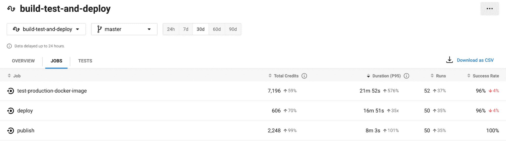
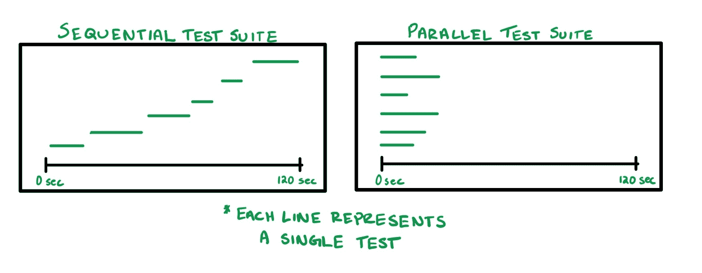
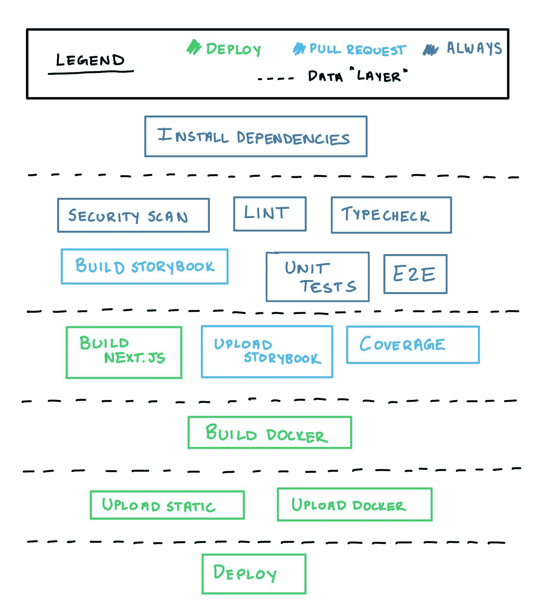
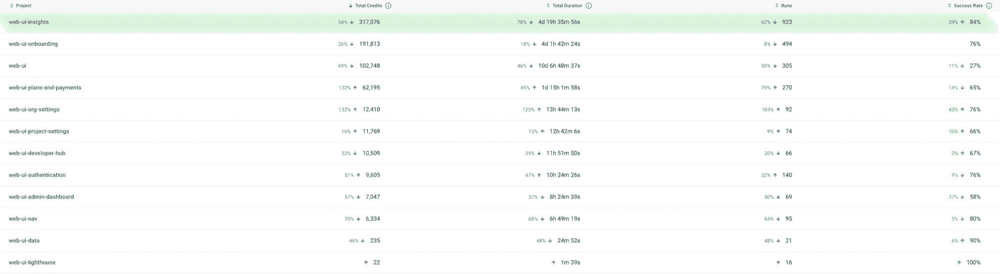

# Insights 团队如何利用 Insights 优化我们自己的渠道| CircleCI

> 原文：<https://circleci.com/blog/how-the-insights-team-uses-insights-to-optimize-pipelines/>

在 CircleCI Insights 团队，我们不只是为 CircleCI 用户开发东西，我们*也是* CircleCI 用户。真的，没有比使用产品更好的方式来了解你的产品了，Insights 团队也不例外。

几个月前，我们意识到我们的 [Insights UI](https://circleci.com/docs/insights/) 的管道配置还有很多不足之处。[端到端测试](https://circleci.com/blog/what-is-end-to-end-testing/)减缓了我们的拉动请求，我们花了太多时间等待部署——我们的 P95 运行时间徘徊在 25 分钟左右。对于一个一天部署多次的团队来说，这些数字真的越来越多。

我们花了几天时间重写我们的管道，我们非常高效。投资回报令人震惊——两天的工程工作使构建时间减少了大约 50%。我们的 P95 运行时间已经削减到 12 分钟。更好的消息？每个 CircleCI 用户都可以使用我们使用的工具，我将向您介绍这个过程，希望您可以重复我们的成功。

## 了解您的工作流程

在你写一行 YAML 之前，知道你在写什么是很重要的。在我们的案例中，Insights UI 是在单个工作流中构建、测试和部署的，因此这是我们调查的起点。要创建工作流程的心智模型，请回答以下问题:

*   **每个工作负责什么？**寻找试图进行多任务处理的工作，并优先精简这些工作，例如，构建 Docker 映像，对映像进行安全扫描，并将其上传到 Docker Hub。
*   **每份工作需要什么？**如果你在某个地方上传静态资产，你需要确保这些资产已经构建好了。
*   作业什么时候运行？他们应该什么时候跑？部署了[金丝雀](https://circleci.com/blog/canary-vs-blue-green-downtime/)的分支可能需要不同于特性分支的一组工作。

能够为这些问题提供清晰的答案将有助于您将一些最佳实践应用到您的工作流架构中，包括编写原子作业以及使用缓存和工作区优化数据流。

## 编写原子作业

一个写得好的工作很像一个写得好的单元测试:它是原子性的。它只做一件事。其中一个重要原因是原子作业提供了更短的反馈循环。如果您希望能够快速修复故障，您需要能够尽快找到故障源。当一个任务是多任务的时候，这变得更加困难，因为你必须解析可能分布在不同步骤上的输出。

原子作业在未来也更容易重构。有可能在某个时候，您需要在工作流程中间添加更多的步骤，当您现有的所有工作相互分离时，这将变得容易得多。

## 使用工作区和缓存控制数据流

通常，一项工作取决于另一项工作的产出。例如，您可能想要构建一本故事书并将其发布到某个地方，或者构建一个 Docker 容器并上传到容器注册中心。数据应该总是向下游流动。您的工作流应该从左到右逐步构建；如果有多项工作所依赖的资产，那就需要尽早构建。我们工作流程的第一步是安装 node_modules，因为我们需要 Jest 和 Storybook 包来运行我们的其他作业。

为了正常工作，您需要使用缓存或工作区。这些工具允许你跳过昂贵的过程，除非它们是绝对必要的。

### 贮藏

您应该缓存任何生成成本高且可能在工作流运行之间重用的数据。如果你使用的是 yarn 这样的包管理器，确保你[缓存了那些依赖关系](https://circleci.com/blog/config-best-practices-dependency-caching/)！我们从缓存中提取依赖项大约需要 15 秒，而全新安装大约需要一分钟。我们只需要在添加全新的依赖项时重新安装，这种情况并不常见。

### 工作区

如果您的数据在每次工作流运行之间都会发生变化，但仍需要在作业之间进行访问，则应该使用工作空间。例如，如果您的测试作业生成了一个覆盖率报告，那么另一个作业将会上传到一个代码分析工具中。

有关持久化数据的更多信息，请查看我们的[文档](https://circleci.com/docs/concepts/#data-persistence)。

## 利用洞察力确定优化目标

我可能有点偏见，但洞察力是一个非常有价值的工具。任何优化工作都应该从这里开始:您可以识别趋势、长时间运行的作业和不可靠的测试。带上你的侦探帽，看看你的目标工作流程和工作。虽然这篇文章不打算详细介绍测试，但是也值得您花时间查看一下 tests 选项卡。



以下是一些需要注意的事项:

*   缓慢的工作:我认为这几乎是不言而喻的，但是如果一项工作占据了你工作流程的很大一部分时间，那就值得仔细研究了。
*   **趋势不成比例变化的工作**:使用运行趋势作为基线，看看持续时间和信贷支出的趋势。理想情况下，他们应该以大致相同的速度移动——但在这张截图中，你可以看到我们的跑步增加了 35%,而我们的 P95 持续时间飙升了 500%以上。这是一个巨大的危险信号，它表明您的管道可能无法扩展。
*   片状测试:T2 片状测试不仅会削弱你的团队对你产品弹性的信心，还会极大地浪费时间。我们已经看到测试套件在最终通过之前必须重新运行 3-4 次。
*   **慢速单元测试**:如果你还没有使用并行化和测试分割，我鼓励你去试试。连续运行一个测试套件所花费的时间等于运行每个测试所花费时间的总和；然而，[并行运行测试套件的时间](https://circleci.com/blog/config-best-practices-concurrency-parallelism/)等于运行最慢测试的时间。在并行环境中，专注于加速最慢的测试——运行 30%的速度意味着整个测试套件将运行 30%的速度。



## 描绘出理想的管道最终状态

在这一点上，我们有足够的信息来进行第一次有意义的改变。我们在这里做的第一件事是绘制出我们想要的最终状态——本质上是我们理想管道运行的可视化。

我建议用笔和纸画一个图表。列出你的工作流程需要做的所有事情，并把它变成原子工作的列表。这些作业中哪些会输出数据，哪些需要输入数据？您可以使用数据流将作业分组到“层”中，任何给定的层都应该只包含依赖于上一层或下一层(或两者都需要)的作业。

在我们的案例中，我们有很多工作试图做太多的事情，它们需要被分解。我们还意识到，我们并没有在所有可以从中受益的地方使用缓存。我们不得不重新安排一些工作，这样数据流才有意义。

这是洞察过程的最终结果:



看着这个图，您可能想知道为什么我们没有选择在测试之前运行 lint 和 typecheck 作业。如果类型检查失败，运行测试就没有意义了。虽然这是真的，但在这种情况下运行测试也没有坏处。这也是一个效率问题，它与数据层的概念密切相关。测试不需要 typecheck 可能输出的任何东西，这就是为什么它们被分组在同一层的原因。

假设 X 是运行 lint 和 typecheck 作业所需的秒数。如果我们将测试进行得更深入，并使它们依赖于那些作业，我们将在失败时节省 X - Y 秒(其中 Y 是失败所需的秒数)。这种方法的缺点是，在每一次成功的运行中，我们可以节省 X 秒，但是没有。这里的要点是，如果你重视效率，重要的是要相信数据流，而不是试图武断地将你的工作分层。

## “大改写”

首先，请不要真的一口气重写你的整个配置；这是一个灾难的配方。只是“大的重写”比“许多小的、有效的修改的重写”更容易脱口而出。

## “许多小的、有效的变更的重写”

在这次重写过程中，我们做了一些改动，我不会用所有的细节来烦你。然而，我想分享一些最有影响力的，希望它们能启发你找到优化你自己构建的方法。

### 跳过不必要的半音构件

> 时间节省:默认分支大约 2 分钟

我们使用一个名为 Chromatic 的工具来确保所有的可视化 UI 更改在部署之前都经过审查。这是我们管道中非常重要的一步，但它需要大约 2-3 分钟来运行，而且并不总是必要的。我们只想在这两个条件都满足时运行这一步:

*   **对源代码进行了有意义的修改。**如果你的公关只是更新一个 docker 文件，就没有必要在 UI 上运行回归测试。为了跳过这个场景中的色度，我们 grep git diff 来检查在`src/**/*`下是否有任何改变的文件
*   **该版本不在默认分支上。**我们已经以这样的方式配置了 GitHub，如果一个 UI 更改进入了默认分支，这意味着它已经被审查和批准。在默认分支上，我们仍然上传文件以保存干净的彩色历史，但是批准是自动的。

```
chromatic:
    executor: ci-node
    steps:
      - checkout 
      - restore-yarn-cache 
      - run:
          name: "Generate snapshots and upload to chromatic"
          command: |
            # Get the diff between this branch and the default branch, filtered down to src/
            export CHANGED=$(git diff --name-only origin/main... | grep -E "src\/.*\.(ts|tsx)$")

            main() {
              # Skip completely if not default branch AND no changes
              if [ -z "$CHANGED" ] && [ "$CIRCLE_BRANCH" != "main" ]; then
                echo "No components changed; skipping chromatic"
                yarn chromatic --skip
                exit 0
              fi

              # Auto accept on default branch, they have already been approved
              if [ "$CIRCLE_BRANCH" == "main" ]; then
                yarn chromatic --auto-accept-changes
                exit $?
              fi

              # Otherwise, run chromatic
              yarn chromatic --exit-once-uploaded
            }
            main "$@" 
```

### 重构构建-部署-静态和缓存 Next.js

> 节省时间:每次构建大约 5 分钟

我们使用 Next.js，这意味着我们必须构建静态文件并将它们上传到 CDN 以使用服务器端渲染。然后使用 Next.js 构建来构建 Docker 映像，对其进行 CVE 扫描。如果我们正在部署，这个映像也会上传到容器注册中心。

如果我们正在部署，我们只需要上传这些资产，但我们希望对每个 PR 执行安全扫描，以便我们可以尽快捕捉漏洞。在重构之前，所有这些东西都是耦合在一起的，我们做了很多不必要的工作。

*   **`build-and-scan`** (每次构建):这从零开始构建我们的资产，并执行安全扫描。
*   **`build-and-deploy-static`** (仅部署):这项工作将从头开始(再次)构建我们的资产，并上传它们。

我们进行了两次构建，并上传了不需要上传的资产。更糟糕的是，我们意识到我们没有缓存下一个. js 版本。

你可能想知道我们怎么会忽略这样的事情这么久。答案是“协作”和“代理”的混合体。在 CircleCI，我们的工程团队有很大的自由，包括以他们认为合适的方式配置他们自己的管道的自由。

在这次重构之前，我们使用的是内部维护的 orb，但是缺乏明确的所有权。随着时间的推移，贡献 orb 资源的工程师数量增加了，但是所有权的缺乏意味着 orb 的责任不明确。它最终有机地成长为试图迎合太多团队的东西，其中大多数团队都有非常不同的需求。

我前面提到的同样的自由也意味着我们有能力用我们自己的定制配置替换 orb。我们接受了 orb 提供的那两个作业，并用更小的原子作业替换它们:

*   **`build-next-app`** (每次构建):我们确保在这里实现 Next 的构建缓存功能。
*   **`build-and-scan-docker`** (每次构建):该作业使用下一次构建来创建我们的 docker 映像并执行安全扫描。
*   **`deploy-static`** (仅部署):上传前两个作业的输出

如果你想了解更多关于缓存的知识，请查看我们的[文档](https://circleci.com/docs/caching/)。

### Cypress 测试的并行化

> 节省时间:每次构建大约 10 分钟

我们使用 Cypress 来运行我们的前端端到端测试。在重构过程中，我们意识到两件事:首先，我们没有缓存 Cypress 二进制文件，这意味着我们每次都必须重新安装它。其次，我们没有并行运行这些测试！

我们开始使用[柏树球](https://circleci.com/developer/orbs/orb/cypress-io/cypress)来运行我们的测试。以前，它们在 Docker 容器中运行。现在，我们缓存 Cypress 构建，并使用与 Cypress 测试文件数量相等的并行度值。

```
- cypress/run:
    name: cypress
    executor: cypress
    parallel: true
    parallelism: <<pipeline.parameters.cypress_parallelism>>
    requires:
      - dependencies
    pre-steps:
      - checkout
      - restore-yarn-cache
      - restore-cypress-cache
      - run:
          name: Split tests
          command: 'circleci tests glob "cypress/e2e/*" | circleci tests split >
          /tmp/tests.txt'
      - run:
          name: Install cypress binary 
          command: yarn cypress install
    post-steps:
      - save_cache:
          paths:
            - ~/.cache/Cypress/
          key: cypress-{{arch}}-{{checksum "yarn.lock"}}
      - store_test_results:
          path: 'test-results/cypress.xml' # cypress.json
      - store_artifacts:
          path: cypress/artifacts # this is in cypress.json
    no-workspace: true
    yarn: true
    start: yarn start
    wait-on:
      '-c .circleci/wait-on-config.json
      http://localhost:3000/insights/healthcheck'
    command: yarn cypress run --spec $(cat /tmp/tests.txt) --config-file cypress.json 
```

在我们的文档中找到更多关于[并行化](https://circleci.com/docs/parallelism-faster-jobs/)的信息。

## 验证您的新管道

一旦你完成了重写管道的过程，你可以使用洞察力来验证你所做的改变已经产生了积极的影响。如果你访问重写的工作流程的洞察，你会看到我们的 P95 持续时间有明显下降的趋势，我们的成功率也有所提高。

还可以将您的项目与您组织内的其他类似项目进行比较。从主[洞察页面](https://app.circleci.com/insights)，您可以使用**项目**下拉菜单选择要比较的项目。这项工作最大的验证是当我们意识到 Insights 的运行次数是类似项目的两倍多，而我们的总持续时间不到一半。



## 结论

希望我已经成功地让您相信，在团队的管道配置上投资是非常值得的。这可能看起来令人生畏，但是如果你使用“许多小的、有效的改变”来小块地接近它，这是非常可行的。

记住:使用[洞察力](https://app.circleci.com/insights)来帮助你确定需要改进的地方。从那里，了解您的工作流程，保持您的工作原子化，并控制数据流。如果你记住这些事情，你会发现做出微小而有意义的改变是非常容易的。归根结底，这就是构建软件的意义所在。

Insights 团队的目标是让您的团队能够做出更好的工程决策。如果你想在 Insights 上看到什么，我们希望你能把它贴在我们的 [Canny board](https://circleci.canny.io/insights) 上。