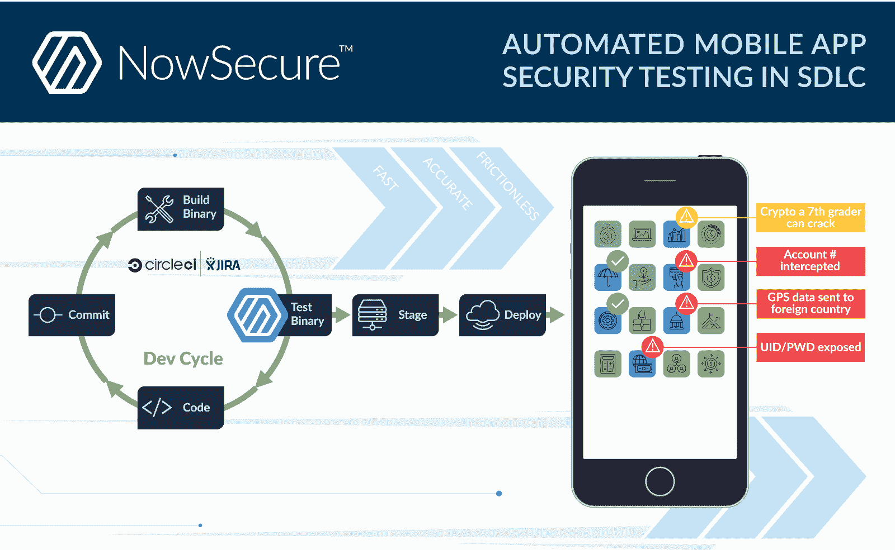
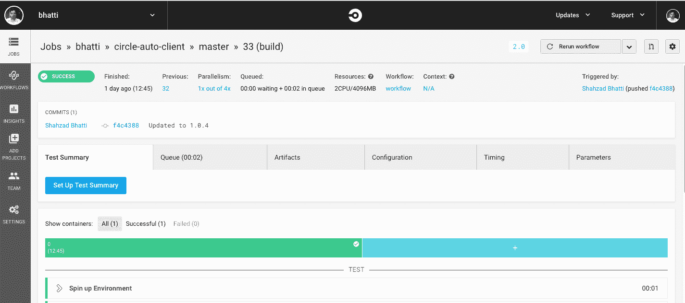
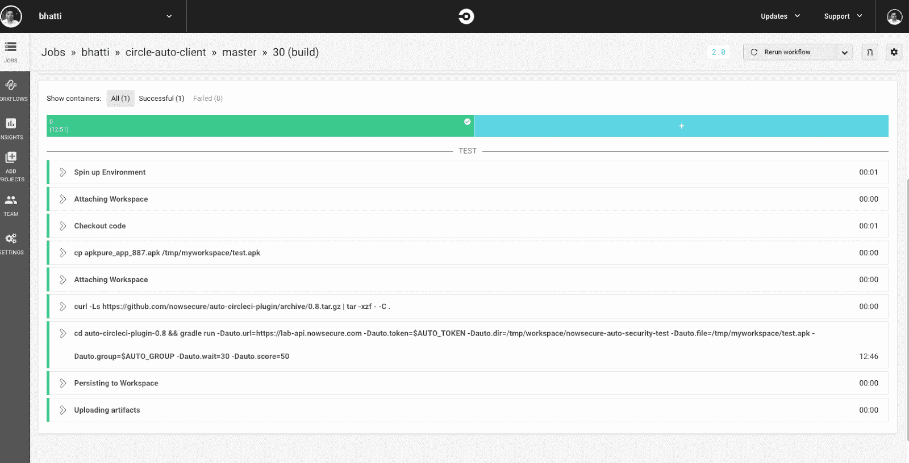
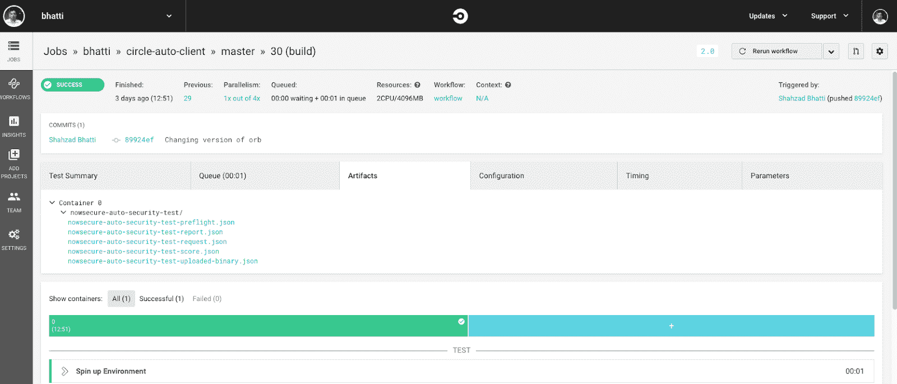
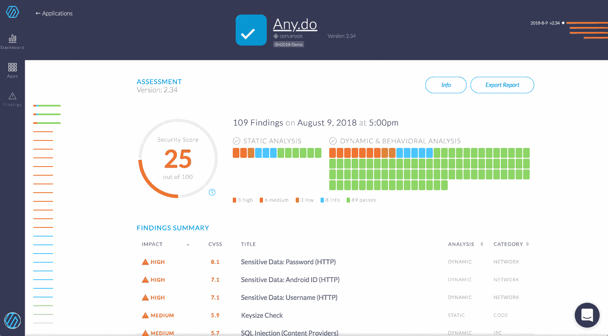
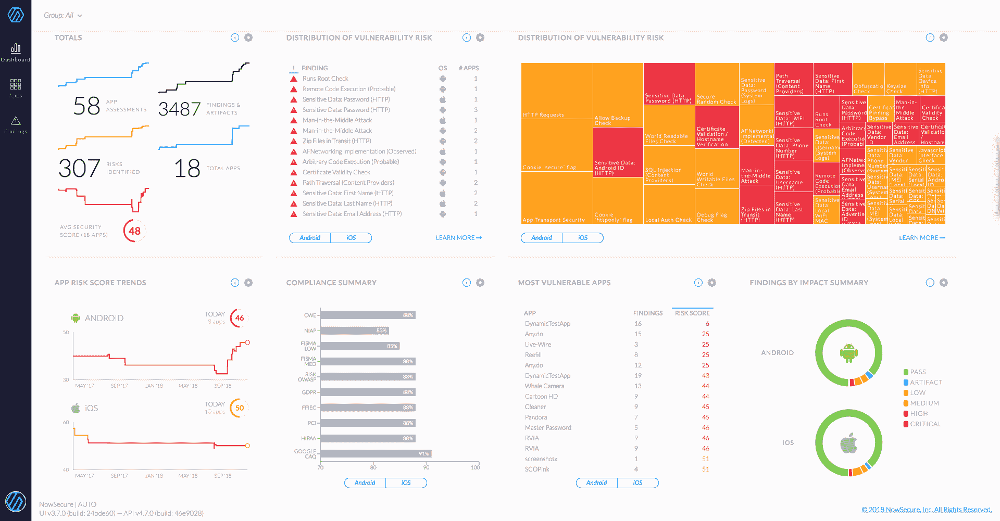

# 自动化并保护您的移动开发渠道| CircleCI

> 原文：<https://circleci.com/blog/how-to-automate-and-secure-your-mobile-dev-pipeline-with-circleci-and-nowsecure/>

移动应用不同于 web 应用，需要专门设计的工具来满足开发、安全和 DevOps 团队的需求。组织可以通过优化流程和安全烘焙来加速移动应用程序开发，这可以通过使用 CircleCI 和 NowSecure 来实现。作为 CircleCI 的长期合作伙伴，NowSecure 很高兴成为 CircleCI 的技术合作伙伴，与我们自己的 [orb 合作注册](https://circleci.com/developer/orbs/orb/nowsecure/ci-auto-orb)。

CircleCI 为移动应用 DevOps 团队提供了许多关键的移动特定功能，首先是跨平台执行环境支持，以在相同的配置和提交下运行多个平台(用于构建桌面、Android 和/或 iOS 应用)。对于 iOS 移动应用程序开发人员来说，CircleCI 包括通过浪子匹配进行代码签名、iOS 证书和预置描述文件管理、通过家酿和 iTunes Connect 部署和管理进行 iOS 依赖管理，以及与 Hockey App、Crashlytics 和 TestFairy 的测试版进行服务集成。

[NowSecure AUTO](https://www.nowsecure.com/solutions/accelerate-secure-mobile-devops/) 专为移动应用程序安全测试而打造，首先对以任何语言或开发环境编写的 iOS 和 Android 应用程序二进制文件进行跨平台安全测试。NowSecure 测试已编译的移动应用程序二进制文件中的静态数据、动态数据和代码功能，以确保完全覆盖应用程序并获得高度准确的结果。为了在您的管道中快速流动，NowSecure 提供了快速的自动化后构建测试运行，可在 7-15 分钟内完成，并自动将问题反馈到票务系统，如吉拉。全面的安全测试结果，包括 CVSS 评分结果、开发人员补救说明、详细的工件等，包括中断构建阈值。NowSecure 现在通过我们的 NowSecure AUTO CircleCI Orb 提供与 CircleCI 的直接集成。

让我们看看新的 NowSecure AUTO Orb for CircleCI 如何直接集成到 CircleCI 软件和票务系统(如吉拉)中，为构建和部署安全的移动应用程序提供快速的闭环开发周期。

## CircleCI 内部和 NowSecure 集成

因为移动应用程序与 web 应用程序有着本质的不同，所以它们需要有针对性的工具来准确、彻底地测试受到攻击的移动应用程序的行为。NowSecure 自动化移动应用程序安全测试引擎可以在构建过程中全面测试应用程序，并在下游自动生成结果。



如上图所示，NowSecure AUTO CircleCI Orb 插入 CircleCI 平台后构建，并与单元测试、功能测试和 UX 测试解决方案并行或串行运行快速安全测试。

NowSecure AUTO 可以自动测试每一个 CircleCI 构建，并将标签输入到开发人员要解决的循环中。与其他安全测试方法不同，这种 NowSecure + CircleCI 集成对开发工作流没有任何影响，因为不需要学习新的 IDE 插件，不需要追踪静态源代码测试误报，也不需要在测试周期中因发现安全漏洞太晚而导致发布延迟。

将 NowSecure AUTO CircleCI Orb 连接到您的项目非常简单，Github repo [README.md](https://github.com/nowsecure/auto-circleci-plugin/blob/master/README.md) 中概述了一步一步的详细信息。请注意，您还需要 NowSecure 汽车移动应用程序安全测试引擎软件的许可证。总结一下这个过程:

1.  通过您的 NowSecure 管理屏幕[在此](https://lab.nowsecure.com/account/settings)生成一个 NowSecure 自动令牌。
2.  通过访问[https://circleci.com](https://circleci.com)并从左侧选项卡中选择“添加项目”来创建 CircleCI 项目。
3.  在 CircleCI 中创建一个上下文，方法是从左侧选项卡中选择“设置”，然后从左侧导航栏中选择“上下文”。
4.  配置环境变量。以下是最常见的配置项目:
    *   `auto_token`:API 令牌的强制参数。我们建议使用环境变量`AUTO_TOKEN`来定义该参数，而不是使用作业参数。这个令牌的值等于步骤 1 的输出。
    *   `auto_url`:NowSecure AUTO API URL 的可选参数，默认值为[https://lab-api.nowsecure.com](https://lab-api.nowsecure.com)。
    *   `auto_group`:如果使用 NowSecure 组访问控制，则配置 group-id 的可选参数。您也可以使用环境变量`AUTO_GROUP`来指定这一点。
5.  将球体添加到`.circleci/config.yml`中。

示例用法:

```
version: 2.1
orbs:
  auto_ci: nowsecure/ci-auto-orb@1.0.5
jobs:
  build:
    docker:
    - image: circleci/openjdk:8-jdk
    steps:
    - attach_workspace:
        at: /tmp/myworkspace
    - checkout
    - run: cp apkpure_app_887.apk /tmp/myworkspace/test.apk
    - auto_ci/mobile_security_test:
        auto_file: /tmp/myworkspace/test.apk
        auto_wait: "30"
        auto_score: "50"
        auto_show_status_messages: "true" 
```

在签入更改后，CircleCI 构建应该启动，您可以看到它运行时的输出，如下面的截图所示。



构建完成后，如下面的第二个截图所示，CircleCI 会自动启动应用程序二进制文件的 NowSecure AUTO mobile 应用程序安全性测试。在这个例子中，完整的测试运行只用了不到 13 分钟就完成了。



在下面的第三个截图中，我们可以看到 JSON 测试结果和生成的工件。每个安全发现的单个标签被自动输入到像吉拉这样的问题跟踪系统。



在整个过程中，不需要人工干预。事实上，许多客户始终以全自动集成模式运行 NowSecure“headless ”,并且从不需要登录 now secure 平台本身。

## NowSecure 提供全面的安全测试覆盖

在引擎盖下，NowSecure AUTO 通过集成的行为攻击工具提供自动化的动态 appsec 测试。这有助于确保全面的安全测试覆盖，并具有接近零误报的高度准确性。NowSecure 自动查明开发人员和安全分析师想要防止的安全问题，例如:

*   日志文件或系统文件中的敏感数据无线泄漏
*   不正确/不一致的输入验证
*   弱/不正确的加密
*   中间人攻击或远程代码执行的漏洞
*   证书验证问题

NowSecure 自动提供准确、经验证的测试结果，包括简单明了的问题描述、详细的补救说明和所有相关构件，以加快解决问题(针对开发人员)和行业标准的 CVSS 分数、风险和合规性信息(针对安全分析师)。

通常，开发人员甚至不需要查看安全报告，因为他们消耗自动馈送的吉拉票。下面的屏幕截图显示了报告界面，为开发和安全团队提供了更深入的理解。



NowSecure AUTO 提供了一个丰富的仪表板，可全面查看所有指标、趋势线和关键关注领域。如下面截图中的橙色/红色热图所示，需要重点关注的最大影响安全问题包括 HTTP 上的未加密数据、密钥大小、一系列敏感数据问题、“允许数据备份”问题，以及一个以 root 用户身份运行的应用程序。



## 使用 CircleCI 和 NowSecure 为安全 DevOps 供电

像 CircleCI 一样，NowSecure AUTO 也可以在云中或内部部署。基于您团队的使用案例，NowSecure AUTO 可以随开发人员和安全团队上传二进制文件或完全自动插入 CircleCI 和其他工具而按需运行。

CircleCI 提供了一个全面的 CI/CD 环境，专门针对移动应用程序开发生命周期进行了调整。将 NowSecure 与您的开发工具链直接集成，腾出时间专注于构建和交付您的用户所需的安全、创新的移动应用体验。

观看我们的网络研讨会 [CircleCI 和 NowSecure:自动化和保护您的移动开发渠道](https://www.youtube.com/watch?v=6aa7AbkXWUo)，了解更多关于 CircleCI 和 NowSecure 的信息。

阅读更多关于[移动应用开发持续集成](https://circleci.com/blog/ci-for-mobile-app-development/)的信息。

* * *

*NowSecure 首席移动官 Brian Reed 在移动应用、安全和运营方面拥有超过 15 年的经验，包括 now secure、Good Technology、BlackBerry、ZeroFOX、BoxTone 和 MicroFocus/INTERSOLV 安全地动员财富 2000 强全球客户和政府机构。*